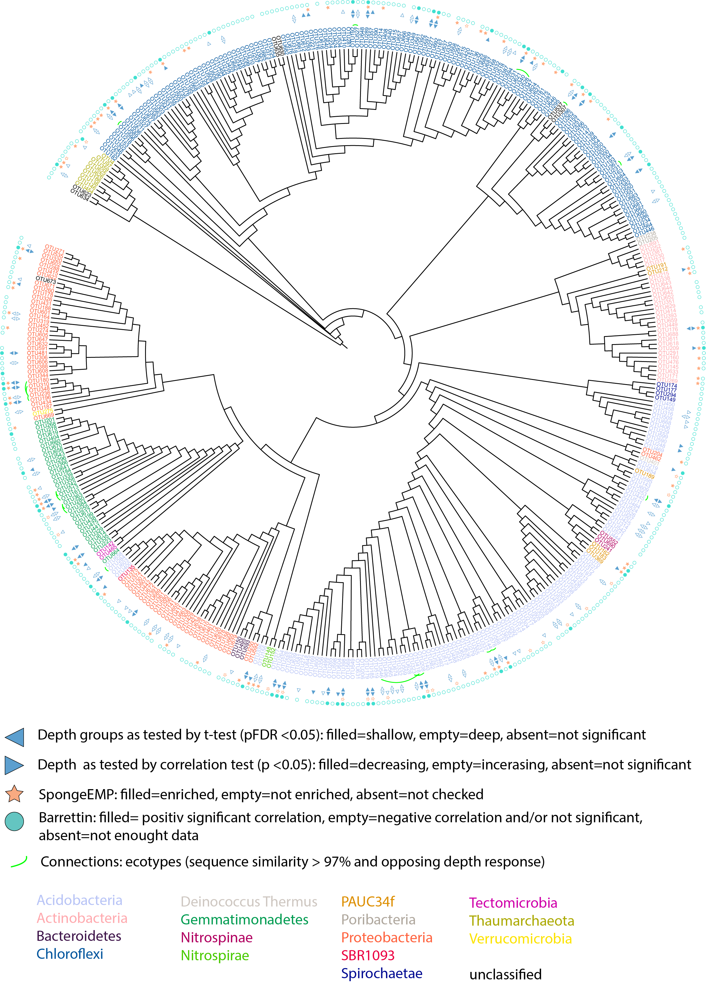

```{r setup03, include=FALSE}
knitr::opts_chunk$set(echo = TRUE, tidy=TRUE, message = FALSE, warning = FALSE)
library(knitr)
library(tidyverse)
library(reshape2)
library(stringr)
library(ggplot2)
library(RColorBrewer)
library(forcats)

library(kableExtra)
options(kableExtra.html.bsTable = T)
library(gridExtra)
library(DT)

library(vegan)
library(phyloseq)
library(picante)
library(seqinr)

library(gtools)
```

```{r functions, echo=F}

# FUN SET UP: preparing meta data set
meta_data_prep <- function(meta_data){
  meta_data <- meta_data[, c("unified_ID", "Depth", "Latitude", "Longitude", "MeanBottomTemp_Cdeg", "MeanBotSalinity_PSU", "YEAR")]
  colnames(meta_data) <- c("unified_ID", "Depth", "Latitude", "Longitude", "Temperature", "Salinity", "Year")
  meta_data <- meta_data[!(str_sub(meta_data$unified_ID, 1,2)=="QC"),]
  meta_data[] <- lapply(meta_data, function(x) if(is.factor(x)) factor(x) else x)
  # Gb12, Gb20 and Gb21 are missing temperature and salinity. Imputing data from closeby samples:
  meta_data$Salinity[meta_data$unified_ID=="Gb12"] <- 34.92
  meta_data$Salinity[meta_data$unified_ID=="Gb20"] <- 34.92
  meta_data$Salinity[meta_data$unified_ID=="Gb21"] <- 34.56
  meta_data$Temperature[meta_data$unified_ID=="Gb12"] <- 3.71
  meta_data$Temperature[meta_data$unified_ID=="Gb20"] <- 3.65
  meta_data$Temperature[meta_data$unified_ID=="Gb21"] <- 2.32
  meta_data["spec"] <- str_sub(meta_data$unified_ID,1,2)
  meta_data <- meta_data[order(meta_data$unified_ID),]
  return(meta_data)  
}

# FUN SET UP: preparing OTU tables
OTU_prep_sqrt <- function(micro){
  rownames(micro) <- micro$Sample_ID
  micro$Sample_ID <- NULL
  micro <- sqrt(micro)
  
  micro_gb <- micro[(str_sub(rownames(micro), 1,2)=="Gb"),]
  micro_sf <- micro[(str_sub(rownames(micro), 1,2)=="Sf"),]
  micro_wb <- micro[(str_sub(rownames(micro), 1,2)=="Wb"),]
  
  micro_gb <- micro_gb[,colSums(micro_gb!=0)>0]
  micro_sf <- micro_sf[,colSums(micro_sf!=0)>0]
  micro_wb <- micro_wb[,colSums(micro_wb!=0)>0]
  micros <- list(gb=micro_gb, sf=micro_sf, wb=micro_wb)
  return(micros)  
}

# FUN RELATIVE ABUNDANCE: calculate relative abundance of OTU across sponge samples. For figures (OTU relative abdc heatmaps), and inc-dec correlations. Requires OTU_prep_sqrt.
rel_abdc <- function(micro){
  mic <- micro
  mic <- data.frame(t(mic))
  mic["max"] <- apply(mic, 1, max)
  
  n <- 0
  k <- dim(mic)[1] 
  while (n<k) {
    n <- n+1
    mic[n,] <- mic[n,]/(mic$max[n])
  }
  mic$max <- NULL
  return(mic)
}

# FUN correlation: increasing-decreasing and p-value, method default: Pearson's product-moment correlation
inc_dec <- function(rabdc_df, meta_data){
  
  md <- meta_data[meta_data$unified_ID %in% colnames(rabdc_df),]
  inc_dec <- data.frame(rownames(rabdc_df))
  colnames(inc_dec) <- "XOTU"
  inc_dec["inc_dec_estimate"] <- NA
  inc_dec["inc_dec_p_val"] <- NA
  
  n <- 0
  k <- dim(inc_dec)[1]
  while (n<k) {
    n <- n+1
    inc_dec$inc_dec_estimate[n] <- cor.test(as.numeric(rabdc_df[n,]), md$Depth)$estimate
    inc_dec$inc_dec_p_val[n] <- cor.test(as.numeric(rabdc_df[n,]), md$Depth)$p.value
  }
  
  inc_dec["classification"] <- NA
  inc_dec$classification[inc_dec$inc_dec_estimate<0] <- "dec.trend"
  inc_dec$classification[inc_dec$inc_dec_estimate>0] <- "inc.trend"
  inc_dec$classification[inc_dec$inc_dec_estimate<0 & inc_dec$inc_dec_p<=0.05] <- "decreasing"
  inc_dec$classification[inc_dec$inc_dec_estimate>0 & inc_dec$inc_dec_p<=0.05] <- "increasing"
  return(inc_dec)
}

# FUN occurrence
overall_rabdc <- function(micros){
  mic <- micros
  n <- 0
  k <- dim(mic)[1]
  mic["rowsum"] <- apply(mic, 1, sum)
  
  while (n<k) {
    n <- n+1
    mic[n,] <- mic[n,]/(mic$rowsum[n])
  }
  
  mic$rowsum <- NULL
  mic <- data.frame(t(mic))
  mic["avg_rel_abdc"] <- apply(mic, 1, mean)
  mic["occurrence"] <- ifelse(mic$avg>0.0025, "common", "rare")
  return(mic)
}

# FUN prepared list of data sets for taxonomy aggregation
aggregations <- function(taxonomy, occurrence){
  occurrence$gb["XOTU"] <-rownames(occurrence$gb) 
  occurrence$sf["XOTU"] <-rownames(occurrence$sf) 
  occurrence$wb["XOTU"] <-rownames(occurrence$wb)
  
  tax <- taxonomy[, c("OTU_ID", "Phylum", "Class")]
  n <- 0
  k <- dim(tax)[1]
  tax["XOTU"] <- NA
  while (n<k) {
    n <- n+1
    tax$XOTU[n] <- paste0("X",tax$OTU_ID[n])
  }
  
  tax_gb <- inner_join(tax, occurrence$gb[,c("XOTU", "avg_rel_abdc")])
  tax_sf <- inner_join(tax, occurrence$sf[,c("XOTU", "avg_rel_abdc")])
  tax_wb <- inner_join(tax, occurrence$wb[,c("XOTU", "avg_rel_abdc")])
  
  taxes <- list(gb=tax_gb, sf=tax_sf, wb=tax_wb)
  
  gb1 <- aggregate(tax_gb$Phylum, by=list(tax_gb$Phylum), FUN="length")
  gb2 <- aggregate(tax_gb$avg_rel_abdc, by=list(tax_gb$Phylum), FUN="sum")
  gb_p <- full_join(gb1, gb2, by=("Group.1"="Group.1"))
  colnames(gb_p) <- c("Phylum", "OTU_number", "avg_rel_abdc")
  
  gb1 <- aggregate(tax_gb$Class, by=list(tax_gb$Class), FUN="length")
  gb2 <- aggregate(tax_gb$avg_rel_abdc, by=list(tax_gb$Class), FUN="sum")
  gb_c <- full_join(gb1, gb2, by=("Group.1"="Group.1"))
  colnames(gb_c) <- c("Class", "OTU_number", "avg_rel_abdc")
  
  test1  <- lapply(taxes, function(x) aggregate(avg_rel_abdc ~ Phylum, data = x, FUN = "length"))
  lapply(taxes, function(x) aggregate(avg_rel_abdc ~ Phylum, data = x, FUN = "sum"))
  
  return(taxes)
}

# FUN prepared list of data sets for adonis
adonis_prep <- function(taxonomy, occurrence){
  occurrence$gb["XOTU"] <-rownames(occurrence$gb) 
  occurrence$sf["XOTU"] <-rownames(occurrence$sf) 
  occurrence$wb["XOTU"] <-rownames(occurrence$wb)
  
  tax <- taxonomy[, c("OTU_ID", "Phylum", "Class")]
  n <- 0
  k <- dim(tax)[1]
  tax["XOTU"] <- NA
  while (n<k) {
    n <- n+1
    tax$XOTU[n] <- paste0("X",tax$OTU_ID[n])
  }
  
  tax_gb <- inner_join(tax, occurrence$gb)
  tax_sf <- inner_join(tax, occurrence$sf)
  tax_wb <- inner_join(tax, occurrence$wb)
  
  taxes <- list(gb=tax_gb, sf=tax_sf, wb=tax_wb)
  return(taxes)
}
# FUN cleaning class and phylum namines
cleaning <- function(taxes) {
  gb <- taxes$gb
  sf <- taxes$sf
  wb <- taxes$wb
  #Renaming & removing whitespaces
  gb$Phylum <- as.character(str_trim(as.character(gb$Phylum)))
  sf$Phylum <- as.character(str_trim(as.character(sf$Phylum)))
  wb$Phylum <- as.character(str_trim(as.character(wb$Phylum)))
  gb$Class <- as.character(str_trim(as.character(gb$Class)))
  sf$Class <- as.character(str_trim(as.character(sf$Class)))
  wb$Class <- as.character(str_trim(as.character(wb$Class)))
  ## GB
  gb$Class[(gb$Phylum=="PAUC34f")] <- "PAUC34f_unclassified"
  gb$Class[(gb$Phylum=="")] <- "unclassified"
  gb$Phylum[(gb$Phylum=="")] <- "unclassified"
  gb$Class[(gb$Phylum=="Tectomicrobia")] <- "Tectomicrobia_unclassified"
  gb$Class[(gb$Phylum=="SBR1093")] <- "SBR1093_unclassified"
  gb$Class[(gb$Phylum=="Poribacteria")] <- "Poribacteria_unclassified"
  gb$Class[gb$Phylum=="Chloroflexi" & gb$Class==""] <- "Chloroflexi_unclassified"
  ## SF
  sf$Class[(sf$Phylum=="")] <- "unclassified"
  sf$Phylum[(sf$Phylum=="")] <- "unclassified"
  sf$Class[(sf$Phylum=="PAUC34f")] <- "PAUC34f_unclassified"
  sf$Class[(sf$Phylum=="Proteobacteria" & sf$Class=="")] <- "Proteobacteria_unclassified"
  sf$Class[(sf$Phylum=="Tectomicrobia")] <- "Tectomicrobia_unclassified"
  sf$Class[(sf$Phylum=="SBR1093")] <- "SBR1093_unclassified"
  sf$Class[(sf$Phylum=="Poribacteria")] <- "Poribacteria_unclassified"
  ## WB
  wb$Class[(wb$Phylum=="")] <- "unclassified"
  wb$Phylum[(wb$Phylum=="")] <- "unclassified"
  # merge back
  taxes <- list(gb=gb, sf=sf, wb=wb)
  return(taxes)
}

md_prep <- function(microbiomes, meta_data){
  meta_data <- meta_data[, c("unified_ID", "Depth", "Latitude",  "Longitude", "MeanBottomTemp_Cdeg", "MeanBotSalinity_PSU", "YEAR")]
  
  gb <- microbiomes$gb
  sf <- microbiomes$sf
  wb <- microbiomes$wb
  
  gb_md <- meta_data[meta_data$unified_ID %in% rownames(gb),]
  rownames(gb_md) <- gb_md$unified_ID
  gb_md <- gb_md[order(gb_md$unified_ID),]
  all(rownames(microbiomes$gb)==rownames(gb_md))
  gb_md <- gb_md[,c("Depth","Latitude","Longitude", "MeanBottomTemp_Cdeg", "MeanBotSalinity_PSU", "YEAR")]
  
  sf_md <- meta_data[meta_data$unified_ID %in% rownames(sf),]
  rownames(sf_md) <- sf_md$unified_ID
  sf_md$unified_ID <- NULL
  wb_md <- meta_data[meta_data$unified_ID %in% rownames(wb),]
  rownames(wb_md) <- wb_md$unified_ID
  wb_md$unified_ID <- NULL
  mds <- list(gb_md=gb_md, sf_md=sf_md, wb_md=wb_md)
  return(mds)
}

```

# Microbiota

## OTU table overview

Let's start by taking a look at the OTU table and get an overall impression of our data.

```{r libraries}
library(tidyverse)
library(reshape2)
library(stringr)
library(ggplot2)
library(RColorBrewer)
library(forcats)

library(kableExtra)
options(kableExtra.html.bsTable = T)
library(gridExtra)
library(DT)

library(vegan)
library(phyloseq)
library(picante)
library(seqinr)

library(gtools)
#install.packages("webshot")
#webshot::install_phantomjs()
set.seed(1984)
```

```{r filtering-pca, fig.cap="Read count overview of the OTU table before and after the normalisation applied in the data analysis for this study."}
microbiome<-read.csv("data/OTU_all_R.csv", header=T, sep=";") 
meta_data <- read.csv("data/Steffen_et_al_metadata_PANGAEA.csv", header=T, sep=";")

#meta_data <- meta_data[!str_sub(meta_data$unified_ID,1,2)=="QC",] # remove QC samples
meta_data <- meta_data[meta_data$unified_ID %in% microbiome$Sample_ID,]

microbiome <- microbiome[order(microbiome$Sample_ID),] 
meta_data <- meta_data[order(meta_data$unified_ID),] 

# dropping factors from full data:
meta_data[] <- lapply(meta_data, function(x) if(is.factor(x)) factor(x) else x) 
microbiome[] <- lapply(microbiome, function(x) if(is.factor(x)) factor(x) else x) 

#all(meta_data$unified_ID==microbiome$Sample_ID)
rownames(microbiome) <- microbiome[,1]
microbiome[,1] <- NULL

microbiome["total_OTUs"] <- apply(microbiome, 1, sum) #total_OTUs = Cummulative read count
micro_fig1 <- data.frame(microbiome[,"total_OTUs"])
micro_fig1["unified_ID"] <- rownames(microbiome)
micro_fig1["normalisation"] <- "none"

microbiome$total_OTUs <- NULL
microbiome <- sqrt(microbiome)
microbiome["total_OTUs"] <- apply(microbiome, 1, sum)

micro_fig2 <- data.frame(microbiome[,"total_OTUs"])
micro_fig2["unified_ID"] <- rownames(microbiome)
micro_fig2["normalisation"] <- "sqrt"

microbiome$total_OTUs <- NULL
microbiome <- wisconsin(microbiome)
microbiome["total_OTUs"] <- apply(microbiome, 1, sum)

micro_fig3 <- data.frame(microbiome[,"total_OTUs"])
micro_fig3["unified_ID"] <- rownames(microbiome)
micro_fig3["normalisation"] <- "sqrt wisconsin"

micro_fig <- rbind(micro_fig1, micro_fig2, micro_fig3)
colnames(micro_fig) <- c("total_OTUs","unified_ID", "normalisation")
micro_fig["Species"] <- str_sub(micro_fig$unified_ID, 1,2)

ggplot(micro_fig, aes(x=unified_ID, y=total_OTUs))+geom_bar(stat = "identity")+facet_grid(vars(normalisation), vars(Species),  scales="free")+xlab("Samples")+ylab("Number of OTUs")+ggtitle("Cummulative read count after normalisation")+theme_bw()+theme(axis.text.x = element_text(angle = 90, hjust = 1))

# see https://chrischizinski.github.io/SNR_R_Group/2016-08-10-Data-Transformations
```
Do the normalisations have affect how well we can discriminate between the microbiota?

```{r microbiome-pca, fig.cap="PCA of the data sets with and without transformation/normalisation. Circles are Gb, triangles are Sf, squares are Wb", fig.asp=0.4}

microbiome<-read.csv("data/OTU_all_R.csv", header=T, sep=";") 
meta_data <- read.csv("data/Steffen_et_al_metadata_PANGAEA.csv", header=T, sep=";")
meta_data <- meta_data[meta_data$unified_ID %in% microbiome$Sample_ID,]

rownames(microbiome) <- microbiome[,1]
microbiome[,1] <- NULL

pca_plot <- function(microbiome, meta_data, my_title){
  micro.pca <- prcomp(microbiome, scale=T)
  k <- summary(micro.pca)[["importance"]]
  micro_pca_df <- data.frame(micro.pca$x) #scores, i.e. principal components of the sponge sample 
  micro_pca_df["unified_ID"] <- as.factor(rownames(micro_pca_df))
  x1 <- paste("PC1", round(k[2,1], digits=3)*100, "%")
  y1 <- paste("PC2", round(k[2,2], digits=3)*100, "%")
  micro_pca_df <- left_join(micro_pca_df[,c("PC1", "PC2", "PC3", "unified_ID")], meta_data[,c("Species", "Depth", "Latitude", "Longitude", "MeanBottomTemp_Cdeg", "MeanBotSalinity_PSU", "unified_ID")])
  p <- ggplot(micro_pca_df, aes(x=PC1, y=PC2))+geom_point(size=3, mapping=aes(shape=factor(Species)))+ggtitle(my_title)+xlab(x1)+ylab(y1)+labs(shape="Species")+theme_bw()+theme(legend.position = "none")
  return(p)
}

untransformed <- pca_plot(microbiome, meta_data, "untransformed")
sqrt_transformed <- pca_plot(sqrt(microbiome), meta_data, "sqrt")
sqrt_wisc_transformed <- pca_plot(wisconsin(sqrt(microbiome)), meta_data, "sqrt and wisconsin")

grid.arrange(untransformed, sqrt_transformed, sqrt_wisc_transformed, nrow=1, top="PCA: Impact of normalisation on discrimination of the microbiota")
```

```{r nmds, fig.cap="NMDS of the data sets with and without transformation/normalisation. Circles are Gb, triangles are Sf, squares are Wb", fig.asp=0.5}

microbiome <-read.csv("data/OTU_all_R.csv", header=T, sep=";") 
meta_data <- read.csv("data/Steffen_et_al_metadata_PANGAEA.csv", header=T, sep=";")
meta_data <- meta_data[meta_data$unified_ID %in% microbiome$Sample_ID,]

rownames(microbiome) <- microbiome[,1]
microbiome[,1] <- NULL

nmds_plot <- function(microbiome, meta_data, my_title){
  micro.mds <- metaMDS(microbiome, k=2, trymax = 100, distance = "bray",trace=FALSE)
  nmds_points <- as.data.frame(micro.mds$points)
  samples<-data.frame(nmds_points$MDS1, nmds_points$MDS2)
  samples["unified_ID"] <- rownames(microbiome)
  meta_data <- meta_data[,c("unified_ID", "Depth", "Species")]
  samples <- left_join(samples, meta_data)
  stress <- paste("Stress=", round(micro.mds$stress, digits=3))
  p <- ggplot(samples, aes(x=nmds_points.MDS1, y=nmds_points.MDS2))+geom_point(aes(shape = Species, alpha=0.5), size=4)+ggtitle(my_title)+ labs(shape='Sponge species')+theme_bw()+theme(legend.position="none")+xlab("NMDS 1")+ylab("NMDS 2")+ annotate("text", x = 0, y = 1, label = stress)
  return(p)
}

untransformed <- nmds_plot(microbiome, meta_data, "untransformed")
sqrt_transformed <- nmds_plot(sqrt(microbiome), meta_data, "sqrt")
sqrt_wisc_transformed <- nmds_plot(wisconsin(sqrt(microbiome)), meta_data, "sqrt and wisconsin")

grid.arrange(untransformed, sqrt_transformed, sqrt_wisc_transformed, nrow=1, top="NMDS: Impact of normalisation on discrimination of the microbiota")
```

It seems that we don't lose any relevant information and the normalisations in fact increase the discriminatory power.

## Alpha diversity

The microbiota are composed of  420 OTUs in _G. barretti_, 461 OTUs in _S. fortis_ and 135 OTUs in _W. bursa_. While _G. barretti_ and _S. fortis_ share 316, respectively they each only share 2 and 8 OTUs with _W. bursa_. Only a single OTU (OTU4 or X1969004, an Archaeon) is shared among the three sponge hosts.

How does that reflect in their diversities? Below we show Shannon diversity, species richness (SR) and Faith's phylogenetic distance (PD). 

```{r a-diversities, fig.cap="Microbiota diversity indices grouped by sponge species and ordered by sample depth."}
library(vegan)
library(reshape2)
library(phyloseq)
library(picante)

microbiome<-read.csv("data/OTU_all_R.csv", header=T, sep=";") 
meta_data <- read.csv("data/Steffen_et_al_metadata_PANGAEA.csv", header=T, sep=";")
taxonomy <- read.csv("data/microbiome_taxonomy.csv", header = T, sep = ";")
tree <- read.nexus("data/infile.nex.con.X.tre")

rownames(microbiome) <- microbiome$Sample_ID
microbiome$Sample_ID <- NULL
otumat <- t(microbiome)
otumat <- wisconsin(sqrt(otumat))
colnames(otumat) <- rownames(microbiome)
rownames(taxonomy) <- paste0("X",taxonomy$OTU_ID)
taxonomy$OTU_ID <- NULL
#all(rownames(taxonomy)==rownames(otumat))

# relative abundance
otumat<-apply(otumat, 2, function(i) i/sum(i))
OTU <- otu_table(otumat, taxa_are_rows = TRUE)
# remove low abundance taxa
#OTU <- filter_taxa(OTU, function(x) mean(x) > 0.0025, TRUE)
taxmat<-as.matrix(taxonomy)
TAX <- tax_table(taxmat)
biom_data <- phyloseq(OTU, TAX)
#Merge into phyloseq object
pso <- merge_phyloseq(biom_data,tree)#merging a phyloseq and a tree file
pso <- prune_taxa(taxa_sums(pso) > 0, pso)

#Calculate Phylogenetic Distance (PD) of the dataset, ALPHA DIVERSITY
otu_table_pso <- as.data.frame(pso@otu_table)
df.pd <- pd(t(otu_table_pso), tree, include.root=F) 
df.pd["unified_ID"] <- rownames(df.pd)
#df.pd: PD = Faith's Phylogenetic diversity, SR= species richness 
div <- as.data.frame(vegan::diversity(t(otumat), index = "shannon"))
div["spec"] <- str_sub(rownames(div),1,2)
colnames(div) <- c( "Shannon_diversity","spec")
div["unified_ID"] <- rownames(div)
div_indices <- full_join(div, df.pd)
md <- meta_data[,c("unified_ID", "Depth")]
div_indices <- left_join(div_indices, md)

div_indices <- reshape2::melt(div_indices, id.vars=c("spec", "unified_ID", "Depth"))
ggplot(div_indices, aes(x=Depth, y=value))+geom_point()+facet_grid(vars(variable), vars(spec), scales="free")+ theme(axis.text.x = element_text(angle = -90, vjust = 0.5, hjust = 1), legend.position = "none")+ylab("Diversity metrics")+xlab("Sample depth")+theme_bw()
```

We see that the HMA sponges _G. barretti_ and _S. fortis_ not only have more OTUs but also a higher diversity in their prokaryotic communities then the LMA sponge _W. bursa_.

## Beta diversity

In a way, the Fig. \@ref(fig:microbiome-pca) and \@ref(fig:nmds) have already shown us the beta diversity in our samples. Looking more into the data, we found that the two dimensional representation can be misleading at times and so we provide the first three axes components for exploration below.

```{r b-divPCA, fig.cap="PCA of the met"}
library(plot3D)
library(rgl)
library(plotly)

### PCA
microbiome<-read.csv("data/OTU_all_R.csv", header=T, sep=";") 
meta_data <- read.csv("data/Steffen_et_al_metadata_PANGAEA.csv", header=T, sep=";")
meta_data <- meta_data[meta_data$unified_ID %in% microbiome$Sample_ID,]

rownames(microbiome) <- microbiome[,1]
microbiome[,1] <- NULL
microbiome <- sqrt(microbiome)
micro.pca <- prcomp(microbiome, scale=T)
k <- summary(micro.pca)[["importance"]]
micro_pca_df <- data.frame(micro.pca$x) #scores, i.e. principal components of the sponge sample 
micro_pca_df["unified_ID"] <- as.factor(rownames(micro_pca_df))
x1 <- paste("PC1", round(k[2,1], digits=3)*100, "%")
y1 <- paste("PC2", round(k[2,2], digits=3)*100, "%")
z1 <- paste("PC3", round(k[2,3], digits=3)*100, "%")
micro_pca_df <- left_join(micro_pca_df[,c("PC1", "PC2", "PC3", "unified_ID")], meta_data[,c("Species", "Depth", "Latitude", "Longitude", "MeanBottomTemp_Cdeg", "MeanBotSalinity_PSU", "unified_ID")])

## rgl/plot3D: static 3D plot
#with(micro_pca_df, text3D(PC1, PC2, PC3,
#                       colvar = micro_pca_df$Depth, theta = 60, phi = 20,
#                       xlab = x1, ylab = y1, zlab =z1,
#                       main = "3D microbiome PCA",
#                       labels = micro_pca_df$unified_ID, cex = 0.9,
#                       bty = "g", ticktype = "detailed", d = 2,
#                       clab = c("Depth [m]"), adj = 0.5, font = 2))

## plotly
axx <- list(
  backgroundcolor="rgb(211,211,211)",
  gridcolor="rgb(255,255,255)",
  title = x1,
  showbackground=TRUE
)

axy <- list(
  backgroundcolor="rgb(211,211,211)",
  gridcolor="rgb(255,255,255)",
  title = y1,
  showbackground=TRUE
)

axz <- list(
  backgroundcolor="rgb(211,211,211)",
  gridcolor="rgb(255,255,255)",
  title = z1,
  showbackground=TRUE
)

mic_i <- plot_ly(micro_pca_df, x = ~micro_pca_df$PC1, y = ~micro_pca_df$PC2, z = ~micro_pca_df$PC3, symbol = ~Species, symbols = c('diamond','x','circle'), color = ~micro_pca_df$Depth) %>%
  add_markers() %>%
  layout(scene = list(xaxis=axx,yaxis=axy,zaxis=axz))
mic_i

#for saving locally
#f<- basename(tempfile('PCA_microbiome_plotly', '.', '.html'))
#on.exit(unlink(f), add = TRUE)
#html <- htmlwidgets::saveWidget(mic_i, f)

rm(mic_i, f, html, k, x1, y1, z1, micro.pca, axx, axy, axz, micro_pca_df)
```


```{r b-divNMDS, fig.cap="NMDS based on Bray-Curtis dissimilarity."}
library(plot3D)
library(rgl)
library(plotly)

### NMDS
microbiome<-read.csv("data/OTU_all_R.csv", header=T, sep=";") 
meta_data <- read.csv("data/Steffen_et_al_metadata_PANGAEA.csv", header=T, sep=";")
meta_data <- meta_data[meta_data$unified_ID %in% microbiome$Sample_ID,]

rownames(microbiome) <- microbiome[,1]
microbiome[,1] <- NULL
#microbiome <- sqrt(microbiome)

micro.mds <- metaMDS(microbiome, k=3, trymax = 100, distance = "bray",trace=FALSE)
nmds_points <- as.data.frame(micro.mds$points)
samples<-data.frame(nmds_points$MDS1, nmds_points$MDS2, nmds_points$MDS3)
samples["unified_ID"] <- rownames(microbiome)
meta_data <- meta_data[,c("unified_ID", "Depth", "Species")]
samples <- left_join(samples, meta_data)
colnames(samples) <- c("PC1", "PC2", "PC3", "unified_ID","Depth","Species")
stress <- paste("Stress=", round(micro.mds$stress, digits=6))
x1 <- c("MDS1")
y1 <- c("MDS2")
z1 <- c("MDS3")

# rgl/plot3D
#with(samples, text3D(PC1, PC2, PC3,
#                       colvar = samples$Depth, theta = 60, phi = 20,
#                       xlab = x1, ylab = y1, zlab =z1,
#                       main = "3D microbiome NMDS",
#                       labels = samples$unified_ID, cex = 0.9,
#                       bty = "g", ticktype = "detailed", d = 2,
#                       clab = c("Depth [m]"), adj = 0.5, font = 2))

## plotly
axx <- list(
  backgroundcolor="rgb(211,211,211)",
  gridcolor="rgb(255,255,255)",
  title = x1,
  showbackground=TRUE
)

axy <- list(
  backgroundcolor="rgb(211,211,211)",
  gridcolor="rgb(255,255,255)",
  title = y1,
  showbackground=TRUE
)

axz <- list(
  backgroundcolor="rgb(211,211,211)",
  gridcolor="rgb(255,255,255)",
  title = z1,
  showbackground=TRUE
)

mic_i <- plot_ly(samples, x = ~samples$PC1, y = ~samples$PC2, z = ~samples$PC3, symbol = ~Species, symbols = c('diamond','x','circle'), color = samples$Depth) %>%
  add_markers() %>%
  layout(scene = list(xaxis=axx,yaxis=axy,zaxis=axz))
mic_i

#for saving locally
#f<- basename(tempfile('NMDS_microbiome_plotly', '.', '.html'))
#on.exit(unlink(f), add = TRUE)
#html <- htmlwidgets::saveWidget(mic_i, f)

rm(mic_i, f, html, k, x1, y1, z1, micro.mds, axx, axy, axz, samples, nmds_points)
```
NMDS `r stress`.

```{r b-divOPLS, fig.cap="OPLS based on Bray-Curtis dissimilarity.", echo=F, eval=F}
library(plot3D)
library(rgl)
library(plotly)
library(ropls)

### OPLS
microbiome<-read.csv("data/OTU_all_R.csv", header=T, sep=";") 
meta_data <- read.csv("data/Steffen_et_al_metadata_PANGAEA.csv", header=T, sep=";")
meta_data <- meta_data[meta_data$unified_ID %in% microbiome$Sample_ID,]

rownames(microbiome) <- microbiome[,1]
microbiome[,1] <- NULL
microbiome <- sqrt(microbiome)

micro.ropls.pca <- opls(microbiome)
micro.opls<-opls(microbiome, meta_data[, "Depth"], permI=1000, orthoI=2, scaleC="pareto") #orthoI=NA THIS IS NOT A GOOD MODEL
m.ortho.score<-getScoreMN(micro.opls, orthoL=T)
m.pred.score<-getScoreMN(micro.opls, orthoL=F)
m.df.3d<-data.frame(m.pred.score, m.ortho.score, meta_data$Depth, meta_data$unified_ID, meta_data$Species)
x1 <- c("predicted")
y1 <- c("orthogonal 1")
z1 <- c("orthogonal 2")

# rgl/plot3D
with(m.df.3d, text3D(p1, o1, o2,
                       colvar = m.df.3d$meta_data.Depth, theta = 60, phi = 20,
                       xlab = x1, ylab = y1, zlab =z1,
                       main = "3D microbiome OPLS",
                       labels = m.df.3d$meta_data.unified_ID, cex = 0.9,
                       bty = "g", ticktype = "detailed", d = 2,
                       clab = c("Depth [m]"), adj = 0.5, font = 2))


## plotly
axx <- list(
  backgroundcolor="rgb(211,211,211)",
  gridcolor="rgb(255,255,255)",
  title = x1,
  showbackground=TRUE
)

axy <- list(
  backgroundcolor="rgb(211,211,211)",
  gridcolor="rgb(255,255,255)",
  title = y1,
  showbackground=TRUE
)

axz <- list(
  backgroundcolor="rgb(211,211,211)",
  gridcolor="rgb(255,255,255)",
  title = z1,
  showbackground=TRUE
)

mic_i <- plot_ly(m.df.3d, x = ~m.df.3d$p1, y = ~m.df.3d$o1, z = ~m.df.3d$o2, symbol = ~m.df.3d$meta_data.Species, symbols = c('diamond','x','circle'), color = ~m.df.3d$meta_data.Depth) %>%
  add_markers() %>%
  layout(scene = list(xaxis=axx,yaxis=axy,zaxis=axz))
mic_i

# for saving locally
#f<- basename(tempfile('OPLS_microbiome_plotly', '.', '.html'))
#on.exit(unlink(f), add = TRUE)
#html <- htmlwidgets::saveWidget(mic_i, f)

rm(mic_i, f, html, k, x1, y1, z1 , axx, axy, axz, micro.ropls.pca, micro.opls, m.ortho.score, m.pred.score, m.df.3d)
```


In some of the downstream analyses, we distinguish between common/abundant OTUs and rare OTUs. We use a cutoff of 0.25% average relative abundance per OTU for the classification. That implies drastically modifying the original numbers of OTUs per sponge as outlined below.

```{r filtering-low-abdc-1}
micro <- read.csv("data/OTU_all_R.csv", header = T, sep = ";")
emp <- read.csv("data/SpongeEMP.csv", header=T, sep=";")

emp["XOTU_id"] <- str_replace(emp$OTU_ID,"OTU","X196900")
# The full data set had the entries listed by sponge host, so there are 62 duplicates in the OTU list
#length(emp$XOTU_id) # 207
#length(unique(emp$XOTU_id)) # 145
emp["num"] <- as.numeric(str_replace(emp$OTU_ID,"OTU",""))
emp <- emp[order(emp$num),]
emp["dup"] <- duplicated(emp$num)
#dim(emp[emp$dup=="TRUE",]) #62
emp <- emp[emp$dup=="FALSE",]
emp[, c("sponge", "num", "dup")] <- list(NULL)

OTU_prep_sqrt <- function(micro){
  rownames(micro) <- micro$Sample_ID
  micro$Sample_ID <- NULL
  #micro <- sqrt(micro)
  
  micro_gb <- micro[(str_sub(rownames(micro), 1,2)=="Gb"),]
  micro_sf <- micro[(str_sub(rownames(micro), 1,2)=="Sf"),]
  micro_wb <- micro[(str_sub(rownames(micro), 1,2)=="Wb"),]
  
  micro_gb <- micro_gb[,colSums(micro_gb!=0)>0] #removes columns that only contain 0
  micro_sf <- micro_sf[,colSums(micro_sf!=0)>0]
  micro_wb <- micro_wb[,colSums(micro_wb!=0)>0]
  micros <- list(gb=micro_gb, sf=micro_sf, wb=micro_wb)
  return(micros)  
}

micro_ds <- OTU_prep_sqrt(micro)

overall_rabdc <- function(micro){
  mic <- micro
  n <- 0
  k <- dim(mic)[1]
  mic["rowsum"] <- apply(mic, 1, sum)
  
  while (n<k) {
    n <- n+1
    mic[n,] <- mic[n,]/(mic$rowsum[n])
  }
  
  mic$rowsum <- NULL
  mic <- data.frame(t(mic))
  mic["avg_rel_abdc"] <- apply(mic, 1, mean)
  mic["occurrence"] <- ifelse(mic$avg>0.0025, "common", "rare")
  return(mic)
}

gb_occurrence <- overall_rabdc(micro_ds$gb)
sf_occurrence <- overall_rabdc(micro_ds$sf)
wb_occurrence <- overall_rabdc(micro_ds$wb)

gb_occurrence <- gb_occurrence[,c("avg_rel_abdc", "occurrence")]
gb_occurrence["XOTU_id"] <- rownames(gb_occurrence)
gb_occ_emp <- left_join(gb_occurrence, emp)

sf_occurrence <- sf_occurrence[,c("avg_rel_abdc", "occurrence")]
sf_occurrence["XOTU_id"] <- rownames(sf_occurrence)
sf_occ_emp <- left_join(sf_occurrence, emp)

wb_occurrence <- wb_occurrence[,c("avg_rel_abdc", "occurrence")]
wb_occurrence["XOTU_id"] <- rownames(wb_occurrence)
wb_occ_emp <- left_join(wb_occurrence, emp)

gb_aggr <- aggregate(gb_occ_emp$avg_rel_abdc, by=list(gb_occ_emp$occurrence), FUN="length") 
sf_aggr <- aggregate(sf_occ_emp$avg_rel_abdc, by=list(sf_occ_emp$occurrence), FUN="length")
wb_aggr <- aggregate(wb_occ_emp$avg_rel_abdc, by=list(wb_occ_emp$occurrence), FUN="length")

aggr <- cbind(gb_aggr, sf_aggr$x, wb_aggr$x)
colnames(aggr) <- c("OTU classification", "count Gb", "count Sf", "count Wb")

options(kableExtra.html.bsTable = T)
kable(aggr, col.names = c("OTU classification", "count (Gb)", "count (Sf)", "count (Wb)" ), booktabs = T, 
    caption = "Number of OTUs being excluded and retained in the three sponges' microbiota when filtering for average relative abundance > 0.25%.", 
    row.names = FALSE) %>%
    kable_styling(bootstrap_options = c("hover", "bordered", "condensed", 
        "responsive"), full_width = F, latex_options = c("scale_down"))
```

That means, for _G. barretti_ we exclude `r round(aggr[2,2]/420, digits=3)*100` % of OTUs, for _S. fortis_ `r round(aggr[2,3]/461, digits=3)*100` % and for _W. bursa_ `r round(aggr[2,4]/135, digits=3)*100`%.

```{r filtering-low-abdc-2}
gb_common <- gb_occ_emp[gb_occ_emp$occurrence=="common",]
sf_common <- sf_occ_emp[sf_occ_emp$occurrence=="common",]
wb_common <- wb_occ_emp[wb_occ_emp$occurrence=="common",]

gb_aggr <- aggregate(gb_common$avg_rel_abdc, by=list(gb_common$spongeEMP_enriched), FUN="length")
sf_aggr <- aggregate(sf_common$avg_rel_abdc, by=list(sf_common$spongeEMP_enriched), FUN="length")
wb_aggr <- aggregate(wb_common$avg_rel_abdc, by=list(wb_common$spongeEMP_enriched), FUN="length")

aggr <- cbind(gb_aggr, sf_aggr$x)
aggr <- left_join(aggr, wb_aggr, by="Group.1")
colnames(aggr) <- c("EMP OTU count", "Gb", "Sf", "Wb")

options(kableExtra.html.bsTable = T)
kable(aggr, col.names = c("OTU classification", "count (Gb)", "count (Sf)", "count (Wb)" ), booktabs = T, 
    caption = "Number of common/abundant OTUs found in the SpongeEMP data base", 
    row.names = FALSE) %>%
    kable_styling(bootstrap_options = c("hover", "bordered", "condensed", 
        "responsive"), full_width = F, latex_options = c("scale_down"))
```

## Environmental modelling {#EnvMod}

In order to investigate whether and which of the environmental parameter might "explain"/correlate with variation the the microbiota, we apply [constrained](#constrained) and [unconstrained](#unconstrained) ecological data analysis methods.

### Constrained modelling approach Automatic stepwise model building {#constrained}

We use canonical correspondence analysis as method for ordination. According to the manual for the R package vegan, "a good dissimilarity index for multidimensional scaling should have a high rank-order similarity with gradient separation" [@R-vegan]. Thus interpreting the results of Tab \@ref(tab:rankindex), we find that square root transformation and Wisconsin standardisation increase the rank correlation between the microbial community dissimilarity matrix and the environmental gradient separation in all three sponge microbiota for a number of ecological dissimilarity indices. 

```{r rankindex}
library(vegan)

microbiome<-read.csv("data/OTU_all_R.csv", header=T, sep=";") 
meta_data <- read.csv("data/Steffen_et_al_metadata_PANGAEA.csv", header=T, sep=";")
meta_data <- meta_data[meta_data$unified_ID %in% microbiome$Sample_ID,]

# Gb12 has no salinity and temperature: impute from Gb11 & Gb13: Salinity:34.92; Temp:3.59
row <- which(meta_data$unified_ID=="Gb12")
temp <- which(colnames(meta_data)=="MeanBottomTemp_Cdeg")
sal <- which(colnames(meta_data)=="MeanBotSalinity_PSU")
meta_data[row, temp] <- 3.59
meta_data[row, sal] <- 34.92
rm(row, temp, sal)

OTU_prep_sqrt <- function(micro){
  rownames(micro) <- micro$Sample_ID
  micro$Sample_ID <- NULL
  micro <- sqrt(micro)
  
  micro_gb <- micro[(str_sub(rownames(micro), 1,2)=="Gb"),]
  micro_sf <- micro[(str_sub(rownames(micro), 1,2)=="Sf"),]
  micro_wb <- micro[(str_sub(rownames(micro), 1,2)=="Wb"),]
  
  micro_gb <- micro_gb[,colSums(micro_gb!=0)>0]
  micro_sf <- micro_sf[,colSums(micro_sf!=0)>0]
  micro_wb <- micro_wb[,colSums(micro_wb!=0)>0]
  micros <- list(gb=micro_gb, sf=micro_sf, wb=micro_wb)
  return(micros)  
}

microbiomes <- OTU_prep_sqrt(microbiome)

md_prep <- function(microbiomes, meta_data){
  meta_data <- meta_data[, c("unified_ID", "Depth", "Latitude",  "Longitude", "MeanBottomTemp_Cdeg", "MeanBotSalinity_PSU", "YEAR")]
  
  gb <- microbiomes$gb
  sf <- microbiomes$sf
  wb <- microbiomes$wb
  
  gb_md <- meta_data[meta_data$unified_ID %in% rownames(gb),]
  rownames(gb_md) <- gb_md$unified_ID
  gb_md <- gb_md[order(gb_md$unified_ID),]
  all(rownames(microbiomes$gb)==rownames(gb_md))
  gb_md <- gb_md[,c("Depth","Latitude","Longitude", "MeanBottomTemp_Cdeg", "MeanBotSalinity_PSU", "YEAR")]
  
  sf_md <- meta_data[meta_data$unified_ID %in% rownames(sf),]
  rownames(sf_md) <- sf_md$unified_ID
  sf_md <- sf_md[order(sf_md$unified_ID),]
  sf_md$unified_ID <- NULL
  wb_md <- meta_data[meta_data$unified_ID %in% rownames(wb),]
  rownames(wb_md) <- wb_md$unified_ID
  wb_md <- wb_md[order(wb_md$unified_ID),]
  wb_md$unified_ID <- NULL
  
  mds <- list(gb_md=gb_md, sf_md=sf_md, wb_md=wb_md)
  return(mds)
}

mds <- md_prep(microbiomes, meta_data) 

#Standardization
#If there is a large difference between smallest non-zero abundance and largest abundance, we want to reduce this difference. Usually square root transformation is sufficient to balance the data. Wisconsin double standardization often improves the gradient detection ability of dissimilarity indices.

# Which dissimilarity index is best?
gb_ri1 <- rankindex(scale(mds$gb_md), (microbiomes$gb)^2, c("euc","man","bray","jac","kul")) #unstandardized
gb_ri2 <- rankindex(scale(mds$gb_md), microbiomes$gb, c("euc","man","bray","jac","kul")) #sqrt
gb_ri3 <- rankindex(scale(mds$gb_md), wisconsin(microbiomes$gb), c("euc","man","bray","jac","kul")) #sqrt and wisconsin

sf_ri1 <- rankindex(scale(mds$sf_md), (microbiomes$sf)^2, c("euc","man","bray","jac","kul"))
sf_ri2 <- rankindex(scale(mds$sf_md), microbiomes$sf, c("euc","man","bray","jac","kul"))
sf_ri3 <- rankindex(scale(mds$sf_md), wisconsin(microbiomes$sf), c("euc","man","bray","jac","kul"))

wb_ri1 <- rankindex(scale(mds$wb_md), (microbiomes$wb)^2, c("euc","man","bray","jac","kul"))
wb_ri2 <- rankindex(scale(mds$wb_md), microbiomes$wb, c("euc","man","bray","jac","kul"))
wb_ri3 <- rankindex(scale(mds$wb_md), wisconsin(microbiomes$wb), c("euc","man","bray","jac","kul"))

rankindices <- rbind(gb_ri1, gb_ri2, gb_ri3, sf_ri1, sf_ri2, sf_ri3, wb_ri1, wb_ri2, wb_ri3)
rankindices <- as.data.frame(rankindices)
rankindices["Sponge species"] <- c(rep("G. barretti", 3), rep("S. fortis", 3), rep("W. bursa", 3))
rankindices["Normalisation"] <- c(rep(c("none", "sqrt", "sqrt & wisconsin"), 3))

options(kableExtra.html.bsTable = T)
kable(rankindices, col.names = c("Euclidean", "Manhattan", "Bray–Curtis", "Jaccard", "Kulczynski", "Sponge species", "Normalisation"), booktabs = T, 
    caption = "Rank correlation between dissimilarity indices and gradient separation. The higher the number the stronger the correlation, i.e. the better the fit.", 
    row.names = FALSE) %>% 
    kable_styling(bootstrap_options = c("striped", "hover", "bordered", "condensed", 
        "responsive"), full_width = F, latex_options = c("striped", 
        "scale_down"))
```

We adapt the microbial data sets accordingly applying square root transformation and Wisconsin standardisation of the microbiota in all subsequent ecological analyses. Then, we build a model (null model) without any environmental parameters, and one (full model) with the maximum number of environmental parameters (terms) possible so that none of them have a VIF > 10. Finally, we use the stepwise model building function `ordistep` to determine, which of the environmental parameters is a significant constraint for the microbiomes. The function compares the null model and adds and removes terms from the full model to find (combinations of) significant constraints. The significance of the parameters is then tested in an ANOVA.

**_G. barretti_**: first the VIFs of all terms included in the full model, second the result of the stepwise model building, third the ANOVA of the suggested model.

```{r cca-ordistep-1}
# mod0 has no terms, intercept only
# mod1 includes all terms possible with a VIF < 10. Available: "Depth", "Latitude", "Longitude", "MeanBottomTemp_Cdeg", "MeanBotSalinity_PSU", "YEAR" 

## Gb
mod0 <- cca(wisconsin(microbiomes$gb) ~ 1, mds$gb_md)
mod1 <- cca(wisconsin(microbiomes$gb) ~ Depth + Latitude + MeanBottomTemp_Cdeg + YEAR, mds$gb_md)
vif.cca(mod1)
mod <- ordistep(mod0, scope = formula(mod1), trace=F) #0
mod$anova
anova(mod)
```

**_S. fortis_**: first the VIFs of all terms included in the full model, second the result of the stepwise model building, third the ANOVA of the suggested model.
```{r cca-ordistep-2}
## Sf
mod0 <- cca(wisconsin(microbiomes$sf) ~ 1, mds$sf_md)
mod1 <- cca(wisconsin(microbiomes$sf) ~ Depth + Latitude + YEAR + MeanBotSalinity_PSU + Longitude, mds$sf_md)
vif.cca(mod1)
mod <- ordistep(mod0, scope = formula(mod1), trace=F)
mod$anova
anova(mod)
```

**_W. bursa_**: first the VIFs of all terms included in the full model, second the result of the stepwise model building, third the ANOVA of the suggested model.
```{r cca-ordistep-3}
## Wb
mod0 <- cca(wisconsin(microbiomes$wb) ~ 1, mds$wb_md)
mod1 <- cca(wisconsin(microbiomes$wb) ~ Depth + Latitude + MeanBottomTemp_Cdeg + YEAR, mds$wb_md)
vif.cca(mod1)
mod <- ordistep(mod0, scope = formula(mod1), trace=F)
mod$anova
anova(mod)
```

For all _G. barretti_ and _S. fortis_ depth is a significant constraint of the microbial community. For _W. bursa_ we find temperature to be a significant constraint.

### Unconstrained modelling approach {#unconstrained}

In an alternative approach, we fit environmental vectors onto an ordination of the microbiota. This method allows to include all environmental parameters (regardless of collinearity). Length of the arrow indicates strength of the predictor (environmental parameter).

```{r envfit-1, cache=TRUE, fig.cap="Fitting significant (p<0.05) environmental vectors onto ordination of _G. barretti_ microbiome."}
microbiome<-read.csv("data/OTU_all_R.csv", header=T, sep=";") 
meta_data <- read.csv("data/Steffen_et_al_metadata_PANGAEA.csv", header=T, sep=";")

meta_data <- meta_data[meta_data$unified_ID %in% microbiome$Sample_ID,]
row <- which(meta_data$unified_ID=="Gb12")
temp <- which(colnames(meta_data)=="MeanBottomTemp_Cdeg")
sal <- which(colnames(meta_data)=="MeanBotSalinity_PSU")
meta_data[row, temp] <- 3.59
meta_data[row, sal] <- 34.92
rm(row, temp, sal)

microbiomes <- OTU_prep_sqrt(microbiome)
mds <- md_prep(microbiomes, meta_data) 

colnames(mds$gb_md) <- c("Depth","Lat","Lon","Temp", "Sal", "Year")  
colnames(mds$sf_md) <- c("Depth","Lat","Lon","Temp", "Sal", "Year")  
colnames(mds$wb_md) <- c("Depth","Lat","Lon","Temp", "Sal", "Year")  

# Gb
dist_micro <- vegdist(wisconsin(microbiomes$gb)) #distance matrix
ordi_micro <- metaMDS(dist_micro, trace = F)# ordination
ef <- envfit(ordi_micro, mds$gb_md, permutations = 999) # fitting arrows; STRATA?
ef
# r Goodness of fit statistic: Squared correlation coefficient
# I will report r^2 i.e. goodness of fit rather than correlaiton because correlation with a distance matrix is not meaningful for understanding

#pdf(file = "data/Gb_NMDS.pdf", width = 5, height = 5)
plot(ordi_micro, display="sites") #plot
plot(ef, p.max = 0.05) #arrows
#dev.off()
```

```{r envfit-2, cache=TRUE, fig.cap="Fitting significant (p<0.05) environmental vectors onto ordination of _S. fortis_ microbiome."}
dist_micro <- vegdist(wisconsin(microbiomes$sf)) # distance matrix
ordi_micro <- metaMDS(dist_micro, trace=F) # ordination
ef <- envfit(ordi_micro, mds$sf_md, permutations = 999) # fitting arrows
ef
#pdf(file = "data/Sf_NMDS.pdf", width = 5, height = 5)
plot(ordi_micro, display="sites") # plot
plot(ef, p.max = 0.05) # arrows
#dev.off()
```

```{r envfit-3, cache=TRUE, fig.cap="Fitting significant (p<0.05) environmental vectors onto ordination of _W. bursa_ microbiome."}
dist_micro <- vegdist(wisconsin(microbiomes$wb)) # distance matrix
ordi_micro <- metaMDS(dist_micro, trace = F) # ordination
ef <- envfit(ordi_micro, mds$wb_md, permutations = 999) # fitting arrows
ef
#pdf(file = "data/Wb_NMDS.pdf", width = 5, height = 5)
plot(ordi_micro, display="sites") # plot
plot(ef, p.max = 0.05) # arrows
#dev.off()
```

### Hierarchical clustering {#Hclust} 

So far, we've treated depth as a linear variable. With these clustering method, we're asking whether there are particular groups standing out.

```{r hclust, fig.cap="Hclust"}
## Clustering
par(mfrow=c(1,3))
dist_micro <- vegdist(wisconsin(microbiomes$gb)) #distance matrix
clua <- hclust(dist_micro, "average") #average= UPGMA
plot(clua, sub="Gb", xlab="UPGMA")
rect.hclust(clua, 2)
grp1 <- cutree(clua, 2)

dist_micro <- vegdist(wisconsin(microbiomes$sf)) #distance matrix
clua <- hclust(dist_micro, "average") #average= UPGMA
plot(clua, sub="Sf", xlab="UPGMA")
grp2 <- cutree(clua, 2)

dist_micro <- vegdist(wisconsin(microbiomes$wb)) #distance matrix
clua <- hclust(dist_micro, "average") #average= UPGMA
plot(clua, sub="Wb", xlab="UPGMA")
grp3 <- cutree(clua, 2)
par(mfrow=c(1,1))

#ord <- cca(wisconsin(microbiomes$gb))
#plot(ord, display = "sites")
#ordihull(ord, grp1, lty = 2, col = "red")

#ord <- cca(wisconsin(microbiomes$sf))
#plot(ord, display = "sites")
#ordihull(ord, grp2, lty = 2, col = "red")

#ord <- cca(wisconsin(microbiomes$wb))
#plot(ord, display = "sites")
#ordihull(ord, grp3, lty = 2, col = "red")
```

```{r heatmaps-dist}
library(pheatmap)
library(RColorBrewer)
library(viridis)

microbiome<-read.csv("data/OTU_all_R.csv", header=T, sep=";") 
meta_data <- read.csv("data/Steffen_et_al_metadata_PANGAEA.csv", header=T, sep=";")
meta_data <- meta_data[meta_data$unified_ID %in% microbiome$Sample_ID,]

micro_ds <- OTU_prep_sqrt(microbiome)
mds <- md_prep(microbiomes, meta_data) 
gb_md <- mds$gb_md
sf_md <- mds$sf_md
wb_md <- mds$wb_md

gb_md["depth_category"] <- ifelse(gb_md$Depth<1000, "shallow", "deep")
sf_md["depth_category"] <- ifelse(sf_md$Depth<1000, "shallow", "deep")
wb_md["depth_category"] <- ifelse(wb_md$Depth<1000, "shallow", "deep")


k <- vegdist(wisconsin(micro_ds$gb))
mat_col <- data.frame(group = gb_md$depth_category)
rownames(mat_col) <- rownames(micro_ds$gb)
col_groups <- gb_md$depth_category
mat_colors <- list(group = c("gold", "dodgerblue"))
names(mat_colors$group) <- unique(col_groups)

pheatmap(k,
  color             = magma(10),
  border_color      = NA,
  show_colnames     = FALSE,
  show_rownames     = FALSE,
  annotation_col    = mat_col,
  annotation_colors = mat_colors,
  drop_levels       = TRUE,
  fontsize          = 10,
  main              = "G. barretti heatmap")

k <- vegdist(wisconsin(micro_ds$sf))
mat_col <- data.frame(group = sf_md$depth_category)
rownames(mat_col) <- rownames(micro_ds$sf)
col_groups <- sf_md$depth_category
mat_colors <- list(group = c("gold", "dodgerblue"))
names(mat_colors$group) <- unique(col_groups)

pheatmap(k,
  color             = magma(10),
  border_color      = NA,
  show_colnames     = FALSE,
  show_rownames     = FALSE,
  annotation_col    = mat_col,
  annotation_colors = mat_colors,
  drop_levels       = TRUE,
  fontsize          = 10,
  main              = "S. fortis heatmap")
  
k <- vegdist(wisconsin(micro_ds$wb))
mat_col <- data.frame(group = wb_md$depth_category)
rownames(mat_col) <- rownames(micro_ds$wb)
col_groups <- wb_md$depth_category
mat_colors <- list(group = c("gold", "dodgerblue"))
names(mat_colors$group) <- unique(col_groups)

pheatmap(k,
  color             = magma(10),
  border_color      = NA,
  show_colnames     = TRUE,
  show_rownames     = TRUE,
  annotation_col    = mat_col,
  annotation_colors = mat_colors,
  drop_levels       = TRUE,
  fontsize          = 10,
  main              = "W. bursa heatmap")

#library(dendsort)
#sort_hclust <- function(...) as.hclust(dendsort(as.dendrogram(...)))
#mat_cluster_rows <- sort_hclust(hclust(dist(k)))
#mat_cluster_cols <- hclust(dist(t(k)))
#mat_cluster_cols <- sort_hclust(mat_cluster_cols)
#mat_breaks <- seq(min(k), max(k), length.out = 10)

#pheatmap(
#  mat               = k,
#  color             = inferno(length(mat_breaks) - 1),
#  breaks            = mat_breaks,
#  border_color      = NA,
#  cluster_cols      = mat_cluster_cols,
#  cluster_rows      = mat_cluster_rows,
#  show_colnames     = TRUE,
#  show_rownames     = TRUE,
#  annotation_col    = mat_col,
#  annotation_colors = mat_colors,
#  drop_levels       = TRUE,
#  fontsize          = 14,
#  main              = "Sorted heatmap"
#)

```

```{r bioenv, eval=F, echo=F}
### Environmental/explanatory variables with maximum (Rank) correlation with community dissimilarities
# I deem this redundant to the other methods and will skip it.

library(vegan)
microbiome<-read.csv("data/OTU_all_R.csv", header=T, sep=";") 
meta_data <- read.csv("data/Steffen_et_al_metadata_PANGAEA.csv", header=T, sep=";")
meta_data <- meta_data[meta_data$unified_ID %in% microbiome$Sample_ID,]

# Gb12 has no salinity and temperature: impute from Gb11 & Gb13: Salinity:34.92; Temp:3.59
row <- which(meta_data$unified_ID=="Gb12")
temp <- which(colnames(meta_data)=="MeanBottomTemp_Cdeg")
sal <- which(colnames(meta_data)=="MeanBotSalinity_PSU")
meta_data[row, temp] <- 3.59
meta_data[row, sal] <- 34.92
rm(row, temp, sal)

OTU_prep_sqrt <- function(micro){
  rownames(micro) <- micro$Sample_ID
  micro$Sample_ID <- NULL
  micro <- sqrt(micro)
  
  micro_gb <- micro[(str_sub(rownames(micro), 1,2)=="Gb"),]
  micro_sf <- micro[(str_sub(rownames(micro), 1,2)=="Sf"),]
  micro_wb <- micro[(str_sub(rownames(micro), 1,2)=="Wb"),]
  
  micro_gb <- micro_gb[,colSums(micro_gb!=0)>0]
  micro_sf <- micro_sf[,colSums(micro_sf!=0)>0]
  micro_wb <- micro_wb[,colSums(micro_wb!=0)>0]
  micros <- list(gb=micro_gb, sf=micro_sf, wb=micro_wb)
  return(micros)  
}

microbiomes <- OTU_prep_sqrt(microbiome)

md_prep <- function(microbiomes, meta_data){
  meta_data <- meta_data[, c("unified_ID", "Depth", "Latitude",  "Longitude", "MeanBottomTemp_Cdeg", "MeanBotSalinity_PSU", "YEAR")]
  
  gb <- microbiomes$gb
  sf <- microbiomes$sf
  wb <- microbiomes$wb
  
  gb_md <- meta_data[meta_data$unified_ID %in% rownames(gb),]
  rownames(gb_md) <- gb_md$unified_ID
  gb_md <- gb_md[order(gb_md$unified_ID),]
  all(rownames(microbiomes$gb)==rownames(gb_md))
  gb_md <- gb_md[,c("Depth","Latitude","Longitude", "MeanBottomTemp_Cdeg", "MeanBotSalinity_PSU", "YEAR")]
  
  sf_md <- meta_data[meta_data$unified_ID %in% rownames(sf),]
  rownames(sf_md) <- sf_md$unified_ID
  sf_md$unified_ID <- NULL
  wb_md <- meta_data[meta_data$unified_ID %in% rownames(wb),]
  rownames(wb_md) <- wb_md$unified_ID
  wb_md$unified_ID <- NULL
  mds <- list(gb_md=gb_md, sf_md=sf_md, wb_md=wb_md)
  return(mds)
}

mds <- md_prep(microbiomes, meta_data) 

bioenv(wisconsin(microbiomes$gb)~ Depth + Latitude + Longitude + MeanBottomTemp_Cdeg + MeanBotSalinity_PSU + YEAR, mds$gb_md)
bioenv(wisconsin(microbiomes$sf)~ Depth + Latitude + Longitude + MeanBottomTemp_Cdeg + MeanBotSalinity_PSU + YEAR, mds$sf_md)
bioenv(wisconsin(microbiomes$wb)~ Depth + Latitude + Longitude + MeanBottomTemp_Cdeg + MeanBotSalinity_PSU + YEAR, mds$wb_md)

# Significante of the correlation shoud be tested with Mantel, see help for vegan::bioenv
# vegdist(mod$x, "euclid") #same as: vegdist(scale(mds$gb_md), "euclid")
```

### Oceanographic setting: water masses {#watermasses} 

Finally, we test whether there are statistic differences in the prokaryotic community compositions between above and below 1000 m depth.

```{r betadisper, echo=F, eval=F}
#  We perform an ANOVA test on the group dispersion. If the ANOVA's p-value is not significant, that means that group dispersions are homogenous (Null hypothesis of no difference in dispersion between groups)

microbiome<-read.csv("data/OTU_all_R.csv", header=T, sep=";") 
meta_data <- read.csv("data/Steffen_et_al_metadata_PANGAEA.csv", header=T, sep=";")
meta_data <- meta_data[meta_data$unified_ID %in% microbiome$Sample_ID,]

micro_ds <- OTU_prep_sqrt(microbiome)
mds <- md_prep(microbiomes, meta_data) 

gb_md <- mds$gb_md
sf_md <- mds$sf_md
wb_md <- mds$wb_md

gb_md["depth_category"] <- ifelse(gb_md$Depth<1000, "shallow", "deep")
sf_md["depth_category"] <- ifelse(sf_md$Depth<1000, "shallow", "deep")
wb_md["depth_category"] <- ifelse(wb_md$Depth<1000, "shallow", "deep")

par(mfrow=c(1,3))
k <- vegdist(wisconsin(micro_ds$gb))
# Calculate multivariate dispersions
mod <- betadisper(k, gb_md$depth_category, bias.adjust = T)
# Perform test
anova(mod)
# Permutation test for F
permutest(mod, pairwise = TRUE, permutations = 999)
# Tukey's Honest Significant Differences
(mod.HSD <- TukeyHSD(mod))
# Plot the groups and distances to centroids on the first two PCoA axes with data ellipses
#plot(mod, ellipse = TRUE, hull = FALSE) # 1 sd data ellipse
plot(mod, ellipse = TRUE, hull = FALSE, conf = 0.90, main="G. barretii") # 90% data ellipse

k <- vegdist(wisconsin(micro_ds$sf))
# Calculate multivariate dispersions
mod <- betadisper(k, sf_md$depth_category, bias.adjust = T)
# Perform test
anova(mod)
# Permutation test for F
permutest(mod, pairwise = TRUE, permutations = 999)
# Tukey's Honest Significant Differences
(mod.HSD <- TukeyHSD(mod))
# Plot the groups and distances to centroids on the first two PCoA axes with data ellipses
#plot(mod, ellipse = TRUE, hull = FALSE) # 1 sd data ellipse
plot(mod, ellipse = TRUE, hull = FALSE, conf = 0.90, main="S. fortis") # 90% data ellipse

k <- vegdist(wisconsin(micro_ds$wb))
# Calculate multivariate dispersions
mod <- betadisper(k, wb_md$depth_category, bias.adjust = T)
# Perform test
anova(mod)
# Permutation test for F
permutest(mod, pairwise = TRUE, permutations = 999)
# Tukey's Honest Significant Differences
(mod.HSD <- TukeyHSD(mod))
# Plot the groups and distances to centroids on the first two PCoA axes with data ellipses
#plot(mod, ellipse = TRUE, hull = FALSE) # 1 sd data ellipse
plot(mod, ellipse = TRUE, hull = FALSE, conf = 0.90, main="W. bursa") # 90% data ellipse
par(mfrow=c(1,1))
```

```{r watermass-stats}
#========== Testing differences of microbiome in different water masses ===========
microbiome<-read.csv("data/OTU_all_R.csv", header=T, sep=";") 
meta_data <- read.csv("data/Steffen_et_al_metadata_PANGAEA.csv", header=T, sep=";")
meta_data <- meta_data[meta_data$unified_ID %in% microbiome$Sample_ID,]

# No data transformation/normalisation, as Vegantutor (Oksanen, 2013) p. 32 doesn't do it either.
# betadiver (x, ...); x = community data matrix

OTU_prep <- function(micro){
  rownames(micro) <- micro$Sample_ID
  micro$Sample_ID <- NULL
  #micro <- sqrt(micro)
  
  micro_gb <- micro[(str_sub(rownames(micro), 1,2)=="Gb"),]
  micro_sf <- micro[(str_sub(rownames(micro), 1,2)=="Sf"),]
  micro_wb <- micro[(str_sub(rownames(micro), 1,2)=="Wb"),]
  
  micro_gb <- micro_gb[,colSums(micro_gb!=0)>0]
  micro_sf <- micro_sf[,colSums(micro_sf!=0)>0]
  micro_wb <- micro_wb[,colSums(micro_wb!=0)>0]
  micros <- list(gb=micro_gb, sf=micro_sf, wb=micro_wb)
  return(micros)  
}

micro_ds <- OTU_prep(microbiome)
meta_data <- meta_data_prep(meta_data)

# Gb
gb_md <- meta_data[meta_data$unified_ID %in% rownames(micro_ds$gb),]
gb_md["depth_category"] <- ifelse(gb_md$Depth<1000, "shallow", "deep")
#all(rownames(micro_ds$gb)==gb_md$unified_ID)
bd <- betadiver(micro_ds$gb, "z")
adonis(bd ~gb_md$depth_category)

# Sf
sf_md <- meta_data[meta_data$unified_ID %in% rownames(micro_ds$sf),]
sf_md["depth_category"] <- ifelse(sf_md$Depth<1000, "shallow", "deep")
#all(rownames(micro_ds$sf)==sf_md$unified_ID)
bd <- betadiver(micro_ds$sf, "z")
adonis(bd ~sf_md$depth_category)

# Wb
wb_md <- meta_data[meta_data$unified_ID %in% rownames(micro_ds$wb),]
wb_md["depth_category"] <- ifelse(wb_md$Depth<1000, "shallow", "deep")
#all(rownames(micro_ds$wb)==wb_md$unified_ID)
bd <- betadiver(micro_ds$wb, "z")
adonis(bd ~wb_md$depth_category)

```

To summarise, in this section on [environmental modelling](#EnvMod), we've shown that the prokaryotic communities in _G. barretti_ and _S. fortis_ seem to be influenced by depth both in [contrained](#constrained) and [unconstrained](#unconstrained) methods. For _W. bursa_ we get mixed results. Hence at this point, the picture of a depth effect on LMA sponge prokaryotic communities remains ambiguous.     
Our intention with the [hierarchical clustering](##Hclust) was to see if we could group the variation in the community composition in order to see if we can take hints from that about which aspect of the (a)biotic environment most likely causes/links to the changes. For _G. barretti_, we see the two main clusters representing the "shallow" (Gb1-Gb10: 407-801 m) versus the "deep" (Gb11-Gb14: 1213-1427 m) specimens. These two groups match the two water masses detected in this part of the North Atlantic. The clustering also yiels a distinct clade/group of deep specimens in _S. fortis_ (Sf9-Sf15: 1036-1476 m). Again, this highlights the distinctiveness of the prokatyotic commmunity of the deep specimens, potentially linked to the differences in the surrounding water masses. In _W. bursa_ the specimens originating from depths greater than 1000 m (Wb13-Wb16) cluster with shallow samples and thus, we cannot deduce any stratifying effect of depth or water masses on its microbiome.

This section has given us a general impression that depth affects (mainly HMA) sponge prokarytoic community compositions. But can we be more specific and identify which OTUs are behind those patterns?

## Relative abundances

### Bar plots

Enough of the anonymous modelling and data fitting, let's take a look at the taxonomy of the OTUs to see who is there.

```{r rel-abdc-plot, fig.cap="Relative abundance of prokaryotic phyla per sponge sample."}

micro <- read.csv("data/OTU_all_R.csv", header = T, sep = ";")
meta_data <- read.csv("data/PANGAEA_Final.csv", header = T, sep = ";")
taxonomy <- read.csv("data/microbiome_taxonomy.csv", header = T, sep = ";")

OTU_prep_sqrt <- function(micro){
  rownames(micro) <- micro$Sample_ID
  micro$Sample_ID <- NULL
  #micro <- sqrt(micro) # can be toggled on/off
  
  micro_gb <- micro[(str_sub(rownames(micro), 1,2)=="Gb"),]
  micro_sf <- micro[(str_sub(rownames(micro), 1,2)=="Sf"),]
  micro_wb <- micro[(str_sub(rownames(micro), 1,2)=="Wb"),]
  
  micro_gb <- micro_gb[,colSums(micro_gb!=0)>0]
  micro_sf <- micro_sf[,colSums(micro_sf!=0)>0]
  micro_wb <- micro_wb[,colSums(micro_wb!=0)>0]
  micros <- list(gb=micro_gb, sf=micro_sf, wb=micro_wb)
  return(micros)  
}

micro_ds <- OTU_prep_sqrt(micro)

overall_rabdc <- function(micros){
  mic <- micros
  n <- 0
  k <- dim(mic)[1]
  mic["rowsum"] <- apply(mic, 1, sum)
  
  while (n<k) {
    n <- n+1
    mic[n,] <- mic[n,]/(mic$rowsum[n])
  }
  
  mic$rowsum <- NULL
  mic <- data.frame(t(mic))
  mic["avg_rel_abdc"] <- apply(mic, 1, mean)
  mic["occurrence"] <- ifelse(mic$avg>0.0025, "common", "rare")
  return(mic)
}

occurrence <- lapply(micro_ds, overall_rabdc)

# PHYLUM
adonis_prep <- function(taxonomy, occurrence){
  occurrence$gb["XOTU"] <-rownames(occurrence$gb) 
  occurrence$sf["XOTU"] <-rownames(occurrence$sf) 
  occurrence$wb["XOTU"] <-rownames(occurrence$wb)
  
  tax <- taxonomy[, c("OTU_ID", "Phylum", "Class")]
  n <- 0
  k <- dim(tax)[1]
  tax["XOTU"] <- NA
  while (n<k) {
    n <- n+1
    tax$XOTU[n] <- paste0("X",tax$OTU_ID[n])
  }
  
  tax_gb <- inner_join(tax, occurrence$gb)
  tax_sf <- inner_join(tax, occurrence$sf)
  tax_wb <- inner_join(tax, occurrence$wb)
  
  taxes <- list(gb=tax_gb, sf=tax_sf, wb=tax_wb)
  return(taxes)
}

taxes <- adonis_prep(taxonomy, occurrence)

cleaning <- function(taxes) {
  gb <- taxes$gb
  sf <- taxes$sf
  wb <- taxes$wb
  #Renaming & removing whitespaces
  gb$Phylum <- as.character(str_trim(as.character(gb$Phylum)))
  sf$Phylum <- as.character(str_trim(as.character(sf$Phylum)))
  wb$Phylum <- as.character(str_trim(as.character(wb$Phylum)))
  gb$Class <- as.character(str_trim(as.character(gb$Class)))
  sf$Class <- as.character(str_trim(as.character(sf$Class)))
  wb$Class <- as.character(str_trim(as.character(wb$Class)))
  ## GB
  gb$Class[(gb$Phylum=="PAUC34f")] <- "PAUC34f_unclassified"
  gb$Class[(gb$Phylum=="")] <- "unclassified"
  gb$Phylum[(gb$Phylum=="")] <- "unclassified"
  gb$Class[(gb$Phylum=="Tectomicrobia")] <- "Tectomicrobia_unclassified"
  gb$Class[(gb$Phylum=="SBR1093")] <- "SBR1093_unclassified"
  gb$Class[(gb$Phylum=="Poribacteria")] <- "Poribacteria_unclassified"
  gb$Class[gb$Phylum=="Chloroflexi" & gb$Class==""] <- "Chloroflexi_unclassified"
  ## SF
  sf$Class[(sf$Phylum=="")] <- "unclassified"
  sf$Phylum[(sf$Phylum=="")] <- "unclassified"
  sf$Class[(sf$Phylum=="PAUC34f")] <- "PAUC34f_unclassified"
  sf$Class[(sf$Phylum=="Proteobacteria" & sf$Class=="")] <- "Proteobacteria_unclassified"
  sf$Class[(sf$Phylum=="Tectomicrobia")] <- "Tectomicrobia_unclassified"
  sf$Class[(sf$Phylum=="SBR1093")] <- "SBR1093_unclassified"
  sf$Class[(sf$Phylum=="Poribacteria")] <- "Poribacteria_unclassified"
  ## WB
  wb$Class[(wb$Phylum=="")] <- "unclassified"
  wb$Phylum[(wb$Phylum=="")] <- "unclassified"
  # merge back
  taxes <- list(gb=gb, sf=sf, wb=wb)
  return(taxes)
}

taxes <- cleaning(taxes)

taxes <- lapply(taxes, function(x) {rownames(x) <- x$XOTU;x})
taxes <- lapply(taxes, function(x) {x[c("avg_rel_abdc", "occurrence", "OTU_ID", "XOTU")] <- NULL; x})
taxes <- lapply(taxes, function(x) {x["Class"] <- NULL; x})


# aggregate sum of relative abundance per phylum in each sponge sample
gb <- aggregate(taxes$gb[,2:dim(taxes$gb)[2]], list(taxes$gb[,"Phylum"]), sum) #works
sf <- aggregate(taxes$sf[,2:dim(taxes$sf)[2]], list(taxes$sf[,"Phylum"]), sum) #works
wb <- aggregate(taxes$wb[,2:dim(taxes$wb)[2]], list(taxes$wb[,"Phylum"]), sum) #works

taxes_phy <- full_join(gb, sf)
taxes_phy <- full_join(taxes_phy, wb)
taxes_phy[is.na(taxes_phy)] <- 0

# check there are no weird names
#aggregate(.~ Group.1, data=taxes_phy, sum)

rownames(taxes_phy) <- taxes_phy$Group.1
taxes_phy$Group.1 <- NULL
df_phylum <- data.frame(t(taxes_phy)) #taxes_phy_t <- df_phylum
df_phylum["Sample_ID"] <- rownames(df_phylum)
df_phylum <- melt(df_phylum, id.vars=c("Sample_ID"))
colnames(df_phylum) <- c("Sample_ID", "Phylum", "variable")

ggplot(df_phylum, aes(x=Sample_ID, y=variable, fill=Phylum))+geom_bar(stat="identity")+
  theme_classic()+theme(axis.text.x = element_text(angle = 90, hjust = 1), legend.position = "bottom")+xlab("Samples ordered by depth")+ylab("Relative abundance")+
  scale_x_discrete(limits=c("Gb1","Gb2","Gb3", "Gb4", "Gb5", "Gb6", "Gb7", "Gb8", "Gb9", "Gb10", "Gb11", "Gb12", "Gb13", "Gb14", "Sf1", "Sf2", "Sf3", "Sf4", "Sf5", "Sf6", "Sf7", "Sf8", "Sf9", "Sf10", "Sf11", "Sf12", "Sf13", "Sf14", "Sf15", "Wb1", "Wb2", "Wb3", "Wb4", "Wb5", "Wb6", "Wb7", "Wb8", "Wb9", "Wb10", "Wb11", "Wb12", "Wb13", "Wb14", "Wb15", "Wb16"))+ 
  scale_fill_manual("",
                  breaks = c("Acidobacteria", "Actinobacteria", "Bacteroidetes", "Chlamydiae", "Chloroflexi", "Cyanobacteria", "Deferribacteres", "Deinococcus.Thermus", "Firmicutes", "Gemmatimonadetes", "Nitrospinae", "Nitrospirae", 
"PAUC34f", "Planctomycetes", "Poribacteria", "Proteobacteria", "SBR1093", "Spirochaetae", "Tectomicrobia", "Thaumarchaeota", 
"unclassified", "Verrucomicrobia"),
                  values = c("#b8c4f6", "#ffaaaf", "#3d1349", "#B6B2A9", "#01559d", "#CACAC8", "#E1DED7", "#CEC7C1", "#9A9B9D", "#019c51", "#b10060", "#49ca00", "#dd8e00", "#f282ff", "#AFA79D", "#ff633f", "#ec0040", "#010b92", "#cf00aa", "#aba900", "#ffffff", "#fce300"),
                  labels = c("Acidobacteria", "Actinobacteria", "Bacteroidetes", "Chlamydiae", "Chloroflexi", "Cyanobacteria", "Deferribacteres", "Deinococcus Thermus", "Firmicutes", "Gemmatimonadetes", "Nitrospinae", "Nitrospirae", "PAUC34f", "Planctomycetes", "Poribacteria", "Proteobacteria", "SBR1093", "Spirochaetae", "Tectomicrobia", "Thaumarchaeota", "unclassified", "Verrucomicrobia")
                  )#+guides(fill = guide_legend(ncol = 6)) #for print
  

#ggsave("rel_abdc.pdf", plot=last_plot(), path="data/", device = "pdf", units = "mm", width = 175, height = 120, , useDingbats=FALSE)

# facet  
#df_phylum["spec"] <- str_sub(df_phylum$Sample_ID,1,2)
#md <- meta_data[,c("unified_ID", "Depth")]
#colnames(md) <- c("Sample_ID", "Depth")
#df_phylum <- left_join(df_phylum, md)

#ggplot(df_phylum, aes(x=as.factor(Depth), y=variable, fill=Phylum))+geom_bar(stat="identity")+facet_wrap(.~spec, scales="free")+theme_classic()+theme(axis.text.x = element_text(angle = 90, hjust = 1),legend.position = "bottom")+xlab("Samples ordered by depth")+ylab("Relative abundance")+scale_fill_manual("",
#  breaks = c("Acidobacteria", "Actinobacteria", "Bacteroidetes", "Chlamydiae", "Chloroflexi", "Cyanobacteria", "Deferribacteres", "Deinococcus.Thermus", "Firmicutes", "Gemmatimonadetes", "Nitrospinae", "Nitrospirae", "PAUC34f", "Planctomycetes", "Poribacteria", "Proteobacteria", "SBR1093", "Spirochaetae", "Tectomicrobia", "Thaumarchaeota", "unclassified", "Verrucomicrobia"),
#  values = c("#b8c4f6","#ffaaaf","#3d1349","#ffffff","#01559d","#ffffff","#ffffff","#ffffff","#ffffff","#019c51","#b10060","#49ca00","#dd8e00","#f282ff","#ffffff","#ff633f","#ec0040","#010b92","#cf00aa","#aba900","#ffffff","#fce300"),
#  labels = c("Acidobacteria", "Actinobacteria", "Bacteroidetes", "Chlamydiae", "Chloroflexi", "Cyanobacteria", "Deferribacteres", "Deinococcus.Thermus", "Firmicutes", "Gemmatimonadetes", "Nitrospinae", "Nitrospirae", "PAUC34f", "Planctomycetes", "Poribacteria", "Proteobacteria", "SBR1093", "Spirochaetae", "Tectomicrobia", "Thaumarchaeota", "unclassified", "Verrucomicrobia")      )
```


We see in this bar plot that the relative abundance of phyla remains fairly stable across the different depths. Generally, the prokaryotic community of sponges is described as somewhat species specific and stable across virtually any measured gradient. At this taxonomic resolution, these findings hold true. The composition of the prokaryotic communities in the HMA sponges _G. barretti_ and _S. fortis_ is similar across all samples, while the composition in the LMA sponge _W. bursa_ differs in composition but also displaying only minor variations in phyla proportions. 
The phyla left white/blank are present at very low abundance and we thought the figure might be visually easier without too many colours.

The phyla Chloroflexi, Actinobacteria, Acidobacteria, PAUC34f, and Gemmatimonadetes were described as HMA indicator phyla [@moitinho-silva_2017] and are present in the HMA sponges _G. barretti_ and _S. fortis_ (although Actinobacteria are also present in _W. bursa_).The phyla Proteobacteria, Bacteroidetes, Planctomycetes, and Firmicutes were disgnated LMA indicator phyla and are found in _W. bursa_ (although Proteobacteria are also present in the HMA sponges).

```{r rel-abdc-phyloseq, fig.cap="Rel ABDC Phylum", echo=F, eval=F}
library(vegan)
library(reshape2)
library(phyloseq)
library(picante)

microbiome<-read.csv("data/OTU_all_R.csv", header=T, sep=";") 
meta_data <- read.csv("data/Steffen_et_al_metadata_PANGAEA.csv", header=T, sep=";")
taxonomy <- read.csv("data/microbiome_taxonomy.csv", header = T, sep = ";")
tree <- read.nexus("data/infile.nex.con.X.tre")

rownames(microbiome) <- microbiome$Sample_ID
microbiome$Sample_ID <- NULL
otumat <- t(microbiome)
otumat <- wisconsin(sqrt(otumat))
colnames(otumat) <- rownames(microbiome)
rownames(taxonomy) <- paste0("X",taxonomy$OTU_ID)
taxonomy$OTU_ID <- NULL
#all(rownames(taxonomy)==rownames(otumat))

# relative abundance
otumat<-apply(otumat, 2, function(i) i/sum(i))
OTU <- otu_table(otumat, taxa_are_rows = TRUE)
# remove low abundance taxa
#OTU <- filter_taxa(OTU, function(x) mean(x) > 0.0025, TRUE)
taxmat<-as.matrix(taxonomy)
TAX <- tax_table(taxmat)
biom_data <- phyloseq(OTU, TAX)

plot_bar(biom_data, fill = "Phylum")

#plot_bar(biom_data, fill="Phylum")+scale_fill_brewer(palette = "Set1")
#plot_bar(biom_data, fill="Class")
```

### Tabular overview

If you prefer numbers, this is what it breaks down to. You can sort the tables.

```{r class-phylum-stats}

microbiome<-read.csv("data/OTU_all_R.csv", header=T, sep=";") 

OTU_prep_sqrt <- function(micro){
  rownames(micro) <- micro$Sample_ID
  micro$Sample_ID <- NULL
  micro <- sqrt(micro)
  
  micro_gb <- micro[(str_sub(rownames(micro), 1,2)=="Gb"),]
  micro_sf <- micro[(str_sub(rownames(micro), 1,2)=="Sf"),]
  micro_wb <- micro[(str_sub(rownames(micro), 1,2)=="Wb"),]
  
  micro_gb <- micro_gb[,colSums(micro_gb!=0)>0]
  micro_sf <- micro_sf[,colSums(micro_sf!=0)>0]
  micro_wb <- micro_wb[,colSums(micro_wb!=0)>0]
  micros <- list(gb=micro_gb, sf=micro_sf, wb=micro_wb)
  return(micros)  
}

micro_ds <- OTU_prep_sqrt(microbiome)

# calculate relative abundance of OTU across sponge samples

overall_rabdc <- function(micros){
  mic <- micros
  n <- 0
  k <- dim(mic)[1]
  mic["rowsum"] <- apply(mic, 1, sum)
  
  while (n<k) {
    n <- n+1
    mic[n,] <- mic[n,]/(mic$rowsum[n])
  }
  
  mic$rowsum <- NULL
  mic <- data.frame(t(mic))
  mic["avg_rel_abdc"] <- apply(mic, 1, mean)
  mic["occurrence"] <- ifelse(mic$avg>0.0025, "common", "rare")
  return(mic)
}

#gb_occurrence <- overall_rabdc(micro_ds$gb)
#sf_occurrence <- overall_rabdc(micro_ds$sf)
#wb_occurrence <- overall_rabdc(micro_ds$wb)
#occurrence <- list(gb=gb_occurrence, sf=sf_occurrence, wb=wb_occurrence)

occurrence <- lapply(micro_ds, overall_rabdc)

aggregations <- function(taxonomy, occurrence){
  occurrence$gb["XOTU"] <-rownames(occurrence$gb) 
  occurrence$sf["XOTU"] <-rownames(occurrence$sf) 
  occurrence$wb["XOTU"] <-rownames(occurrence$wb)
  
  tax <- taxonomy[, c("OTU_ID", "Phylum", "Class")]
  n <- 0
  k <- dim(tax)[1]
  tax["XOTU"] <- NA
  while (n<k) {
    n <- n+1
    tax$XOTU[n] <- paste0("X",tax$OTU_ID[n])
  }
  
  tax_gb <- inner_join(tax, occurrence$gb[,c("XOTU", "avg_rel_abdc")])
  tax_sf <- inner_join(tax, occurrence$sf[,c("XOTU", "avg_rel_abdc")])
  tax_wb <- inner_join(tax, occurrence$wb[,c("XOTU", "avg_rel_abdc")])
  
  taxes <- list(gb=tax_gb, sf=tax_sf, wb=tax_wb)
  
  gb1 <- aggregate(tax_gb$Phylum, by=list(tax_gb$Phylum), FUN="length")
  gb2 <- aggregate(tax_gb$avg_rel_abdc, by=list(tax_gb$Phylum), FUN="sum")
  gb_p <- full_join(gb1, gb2, by=("Group.1"="Group.1"))
  colnames(gb_p) <- c("Phylum", "OTU_number", "avg_rel_abdc")
  
  gb1 <- aggregate(tax_gb$Class, by=list(tax_gb$Class), FUN="length")
  gb2 <- aggregate(tax_gb$avg_rel_abdc, by=list(tax_gb$Class), FUN="sum")
  gb_c <- full_join(gb1, gb2, by=("Group.1"="Group.1"))
  colnames(gb_c) <- c("Class", "OTU_number", "avg_rel_abdc")
  
  test1  <- lapply(taxes, function(x) aggregate(avg_rel_abdc ~ Phylum, data = x, FUN = "length"))
  lapply(taxes, function(x) aggregate(avg_rel_abdc ~ Phylum, data = x, FUN = "sum"))
  
  return(taxes)
}

taxes <- aggregations(taxonomy, occurrence)

cleaning <- function(taxes) {
  gb <- taxes$gb
  sf <- taxes$sf
  wb <- taxes$wb
  #Renaming & removing whitespaces
  gb$Phylum <- as.character(str_trim(as.character(gb$Phylum)))
  sf$Phylum <- as.character(str_trim(as.character(sf$Phylum)))
  wb$Phylum <- as.character(str_trim(as.character(wb$Phylum)))
  gb$Class <- as.character(str_trim(as.character(gb$Class)))
  sf$Class <- as.character(str_trim(as.character(sf$Class)))
  wb$Class <- as.character(str_trim(as.character(wb$Class)))
  ## GB
  gb$Class[(gb$Phylum=="PAUC34f")] <- "PAUC34f_unclassified"
  gb$Class[(gb$Phylum=="")] <- "unclassified"
  gb$Phylum[(gb$Phylum=="")] <- "unclassified"
  gb$Class[(gb$Phylum=="Tectomicrobia")] <- "Tectomicrobia_unclassified"
  gb$Class[(gb$Phylum=="SBR1093")] <- "SBR1093_unclassified"
  gb$Class[(gb$Phylum=="Poribacteria")] <- "Poribacteria_unclassified"
  gb$Class[gb$Phylum=="Chloroflexi" & gb$Class==""] <- "Chloroflexi_unclassified"
  ## SF
  sf$Class[(sf$Phylum=="")] <- "unclassified"
  sf$Phylum[(sf$Phylum=="")] <- "unclassified"
  sf$Class[(sf$Phylum=="PAUC34f")] <- "PAUC34f_unclassified"
  sf$Class[(sf$Phylum=="Proteobacteria" & sf$Class=="")] <- "Proteobacteria_unclassified"
  sf$Class[(sf$Phylum=="Tectomicrobia")] <- "Tectomicrobia_unclassified"
  sf$Class[(sf$Phylum=="SBR1093")] <- "SBR1093_unclassified"
  sf$Class[(sf$Phylum=="Poribacteria")] <- "Poribacteria_unclassified"
  ## WB
  wb$Class[(wb$Phylum=="")] <- "unclassified"
  wb$Phylum[(wb$Phylum=="")] <- "unclassified"
  # merge back
  taxes <- list(gb=gb, sf=sf, wb=wb)
  return(taxes)
}

taxes <- cleaning(taxes)

phy_OTU <- lapply(taxes, function(x) aggregate(avg_rel_abdc ~ Phylum, data = x, FUN = "length")) #OTU count
phy_rabdc <- lapply(taxes, function(x) aggregate(avg_rel_abdc ~ Phylum, data = x, FUN = "sum")) #sums relative abundance

class_OTU <- lapply(taxes, function(x) aggregate(avg_rel_abdc ~ Class, data = x, FUN = "length"))
class_rabdc <- lapply(taxes, function(x) aggregate(avg_rel_abdc ~ Class, data = x, FUN = "sum"))
```

#### _G. barretti_: Phyla and classes present
```{r gb-tab-pc}
#https://rstudio.github.io/DT/
gb_P <- cbind(phy_OTU$gb, phy_rabdc$gb[,("avg_rel_abdc")])
colnames(gb_P) <- c("Phylum", "OTU count", "cum. avg. abundance")
#gb_P$`cummulative average abundance` <- round(c(gb_P$`cummulative average abundance`, 6))
DT::datatable(gb_P, rownames = FALSE)

gb_C <- cbind(class_OTU$gb, class_rabdc$gb[,("avg_rel_abdc")])
colnames(gb_C) <- c("Class", "OTU count", "cummulative average abundance")
#gb_C$`cummulative average abundance` <- round(c(gb_C$`cummulative average abundance`, digits = 6))
DT::datatable(gb_C, rownames = FALSE)
```

#### _S. fortis_: Phyla and classes present
```{r sf-tab-pc}
sf_P <- cbind(phy_OTU$sf, phy_rabdc$sf[,("avg_rel_abdc")])
colnames(sf_P) <- c("Phylum", "OTU count", "cum. avg. abundance")
#sf_P$`cummulative average abundance` <- round(c(sf_P$`cummulative average abundance`, digits = 6))
DT::datatable(sf_P, rownames = FALSE)

sf_C <- cbind(class_OTU$sf, class_rabdc$sf[,("avg_rel_abdc")])
colnames(sf_C) <- c("Class", "OTU count", "cummulative average abundance")
#sf_C$`cummulative average abundance` <- round(c(sf_C$`cummulative average abundance`, digits = 6))
DT::datatable(sf_C, rownames = FALSE)
```

#### _W. bursa_: Phyla and classes present
```{r wb-tab-pc}
wb_P <- cbind(phy_OTU$wb, phy_rabdc$wb[,("avg_rel_abdc")])
colnames(wb_P) <- c("Phylum", "OTU count", "cummulative average abundance")
#wb_P$`cummulative average abundance` <- round(c(wb_P$`cummulative average abundance`, digits = 6))
DT::datatable(wb_P, rownames = FALSE)
wb_C <- cbind(class_OTU$wb, class_rabdc$wb[,("avg_rel_abdc")])
colnames(wb_C) <- c("Class", "OTU count", "cummulative average abundance")
#wb_C$`cummulative average abundance` <- round(c(wb_C$`cummulative average abundance`, digits = 6))
DT::datatable(wb_C, rownames = FALSE)

rm(gb_P, sf_P, wb_P, gb_C, sf_C, wb_C)
```

```{r paired-kable-tables, echo=F, eval=FALSE}
# old#
gb_P <- cbind(phy_OTU$gb, phy_rabdc$gb[,("avg_rel_abdc")])
colnames(gb_P) <- c("Phylum", "OTU count", "cum. avg. abundance")
options(kableExtra.html.bsTable = T)
kable(gb_P, col.names = c("Phylum", "OTU count", "cum. avg. abundance"), longtable = T, booktabs = T, 
    caption = "Phylum level composition of the G. barretti prokaryotic community", 
    row.names = FALSE) %>% 
    kable_styling(bootstrap_options = c("striped", "hover", "bordered", "condensed", 
        "responsive"), font_size = 12, full_width = F, latex_options = c("striped", 
        "scale_down"), position = "float_left")
gb_C <- cbind(class_OTU$gb, class_rabdc$gb[,("avg_rel_abdc")])
colnames(gb_C) <- c("Class", "OTU count", "cummulative average abundance")
options(kableExtra.html.bsTable = T)
kable(gb_C, col.names = c("Class", "OTU count", "cum. avg. abundance"), longtable = T, booktabs = T, 
    caption = "Class level composition of the G. barretti prokaryotic community", 
    row.names = FALSE) %>% 
    kable_styling(bootstrap_options = c("striped", "hover", "bordered", "condensed", 
        "responsive"), font_size = 12, full_width = F, latex_options = c("striped", 
        "scale_down"), position = "left")

sf_P <- cbind(phy_OTU$sf, phy_rabdc$sf[,("avg_rel_abdc")])
colnames(sf_P) <- c("Phylum", "OTU count", "cum. avg. abundance")
kable(sf_P, col.names = c("Phylum", "OTU count", "cum. avg. abundance"), longtable = T, booktabs = T, 
    caption = "Phylum level composition of the S. fortis prokaryotic community", 
    row.names = FALSE) %>% 
    kable_styling(bootstrap_options = c("striped", "hover", "bordered", "condensed", 
        "responsive"), font_size = 12, full_width = F, latex_options = c("striped", 
        "scale_down"), position = "float_left")
sf_C <- cbind(class_OTU$sf, class_rabdc$sf[,("avg_rel_abdc")])
colnames(sf_C) <- c("Class", "OTU count", "cummulative average abundance")
kable(sf_C, col.names = c("Class", "OTU count", "cum. avg. abundance"), longtable = T, booktabs = T, 
    caption = "Class level composition of the S. fortis prokaryotic community", 
    row.names = FALSE) %>% 
    kable_styling(bootstrap_options = c("striped", "hover", "bordered", "condensed", 
        "responsive"), font_size = 12, full_width = F, latex_options = c("striped", 
        "scale_down"), position = "left")

wb_P <- cbind(phy_OTU$wb, phy_rabdc$wb[,("avg_rel_abdc")])
colnames(wb_P) <- c("Phylum", "OTU count", "cummulative average abundance")
kable(wb_P, col.names = c("Phylum", "OTU count", "cum. avg. abundance"), longtable = T, booktabs = T, 
    caption = "Phylum level composition of the W. bursa prokaryotic community", 
    row.names = FALSE) %>% 
    kable_styling(bootstrap_options = c("striped", "hover", "bordered", "condensed", 
        "responsive"), font_size = 12, full_width = F, latex_options = c("striped", 
        "scale_down"), position = "float_left")
wb_C <- cbind(class_OTU$wb, class_rabdc$wb[,("avg_rel_abdc")])
colnames(wb_C) <- c("Class", "OTU count", "cummulative average abundance")
kable(wb_C, col.names = c("Class", "OTU count", "cum. avg. abundance"), longtable = T, booktabs = T, 
    caption = "Class level composition of the W. bursa prokaryotic community", 
    row.names = FALSE) %>% 
    kable_styling(bootstrap_options = c("striped", "hover", "bordered", "condensed", 
        "responsive"), font_size = 12, full_width = F, latex_options = c("striped", 
        "scale_down"), position = "left")

#rm(gb_P, sf_P, wb_P, gb_C, sf_C, wb_C)
```

### Statistical comparison at phylum and class level

```{r class-phylum-stats-2, echo=F, eval=F}
# PHYLUM
phylum <- full_join(phy_rabdc$gb, phy_rabdc$sf, by = c("Phylum"))
phylum <- full_join(phylum, phy_rabdc$wb, by = c("Phylum"))
colnames(phylum) <- c("Phylum", "gb_avg", "sf_avg", "wb_avg")

phylum$gb_avg[is.na(phylum$gb_avg)] <- 0
phylum$sf_avg[is.na(phylum$sf_avg)] <- 0
phylum$wb_avg[is.na(phylum$wb_avg)] <- 0

#head(phylum)
kp <- kruskal.test(phylum[,c(2:4)]) #p-value = 0.2915 # all three
wp <- wilcox.test(phylum$gb_avg, phylum$sf_avg) #Gb & Sf

# CLASS
class <- full_join(class_rabdc$gb, class_rabdc$sf, by = c("Class"))
class <- full_join(class, class_rabdc$wb, by = c("Class"))
colnames(class) <- c("Class", "gb_avg", "sf_avg", "wb_avg")

class$gb_avg[is.na(class$gb_avg)] <- 0
class$sf_avg[is.na(class$sf_avg)] <- 0
class$wb_avg[is.na(class$wb_avg)] <- 0

#head(class)
kc <- kruskal.test(class[,c(2:4)]) #p-value = 3.364e-05 # all three
wc <- wilcox.test(class$gb_avg, class$sf_avg) #Gb & Sf

# Comparing the average relative abundance of prokaryotic phyla and classes in the three sponges shows that the difference among the three sponges is not statistically detectable at phylum level (kp: krusal-wallis test p>0.05). But it is at class level (kc: Kruskal-Wallis chi-squared = 20.6, df = 2, p-value = 3.364e-05). However, the first test result is a bit surprising, given that you'd tell apart W. bursa microbiome without problem.
# Comparing Gb and Fs microbiota shows no siginifcant difference, as seems so by eye.
```

```{r class-phylum-stats-3, echo=F, eval=F}
# Is this valid???
#======================= Testing differences at phylum and class level ===========
micro_ds <- OTU_prep_sqrt(micro)
occurrence <- lapply(micro_ds, overall_rabdc)

# PHYLUM
taxes <- adonis_prep(taxonomy, occurrence)
taxes <- cleaning(taxes)

taxes <- lapply(taxes, function(x) {rownames(x) <- x$XOTU;x})
taxes <- lapply(taxes, function(x) {x[c("avg_rel_abdc", "occurrence", "OTU_ID", "XOTU")] <- NULL; x})
taxes <- lapply(taxes, function(x) {x["Class"] <- NULL; x})

gb <- aggregate(taxes$gb[,2:dim(taxes$gb)[2]], list(taxes$gb[,"Phylum"]), sum) #works
sf <- aggregate(taxes$sf[,2:dim(taxes$sf)[2]], list(taxes$sf[,"Phylum"]), sum) #works
wb <- aggregate(taxes$wb[,2:dim(taxes$wb)[2]], list(taxes$wb[,"Phylum"]), sum) #works

taxes_phy <- full_join(gb, sf)
taxes_phy <- full_join(taxes_phy, wb)
taxes_phy[is.na(taxes_phy)] <- 0

#aggregate(.~ Group.1, data=taxes_phy, sum) # check there are no weird names
rownames(taxes_phy) <- taxes_phy$Group.1
taxes_phy$Group.1 <- NULL

taxes_phy_t <- data.frame(t(taxes_phy))
specs <- data.frame(rownames(taxes_phy_t))
colnames(specs) <- c("Sample_ID")
specs["species"] <- str_sub(specs$Sample_ID, 1,2)

#Permutational ANOVA
#head(taxes_phy_t)
#head(specs$species)
adonis(taxes_phy_t~specs$species) #all three species //significant
adonis(taxes_phy_t[c(1:29),]~specs[c(1:29), 2]) #only Gb and Sf //significant

# Compare variation of relative abundance of each phylum/class among/within the two/three groups
# ANOVA (three groups)
apply(taxes_phy_t, 2, function(x) {summary(aov(x ~specs$species))})
# of course they're all different, this includes Weberella.

# Mann-Whittney U aka Wilcoxon rank sum test(two groups, gb vs sf)
gbsf_phy <- taxes_phy_t[c(1:29),]
gbsf_spec <- specs[c(1:29),]
apply(gbsf_phy, 2, function(x) {wilcox.test(x~gbsf_spec$species)})
apply(gbsf_phy, 2, function(x) {(wilcox.test(x~gbsf_spec$species))["p.value"]}) #This is really the result we want

# CLASS
micro_ds <- OTU_prep_sqrt(micro)
occurrence <- lapply(micro_ds, overall_rabdc)

taxes <- adonis_prep(taxonomy, occurrence)
taxes <- cleaning(taxes)
taxes <- lapply(taxes, function(x) {rownames(x) <- x$XOTU;x})
taxes <- lapply(taxes, function(x) {x[c("avg_rel_abdc", "occurrence", "OTU_ID", "XOTU")] <- NULL; x})

```

## Depth response: OTU perspective

Summarising the OTU diversity by phylum or class only shows what was previously known. The composition of the sponges' prokaryotic community is stable. However, summarising doesn't do the data justice. We therefore correlate the average relative abundance of every OTU with depth. The Otus yielding a significant correlation with depth are shown by their respecive relative abundance across the depths.

```{r increade-decrease, fig.asp=1.5, fig.cap="OTUs significantly increasing and decreasing with depth in the three sponge species."}
#====================== INC-DEC CORRELATION ==================
# Categorises the OTUs by their response to depth. 

micro <- read.csv("data/OTU_all_R.csv", header = T, sep = ";")
meta_data <- read.csv("data/Steffen_et_al_metadata_PANGAEA.csv", header=T, sep=";")

meta_data_prep <- function(meta_data){
  meta_data <- meta_data[, c("unified_ID", "Depth", "Latitude", "Longitude", "MeanBottomTemp_Cdeg", "MeanBotSalinity_PSU", "YEAR")]
  colnames(meta_data) <- c("unified_ID", "Depth", "Latitude", "Longitude", "Temperature", "Salinity", "Year")
  meta_data <- meta_data[!(str_sub(meta_data$unified_ID, 1,2)=="QC"),]
  meta_data[] <- lapply(meta_data, function(x) if(is.factor(x)) factor(x) else x)
  # Gb12, Gb20 and Gb21 are missing temperature and salinity. Imputing data from closeby samples:
  meta_data$Salinity[meta_data$unified_ID=="Gb12"] <- 34.92
  meta_data$Salinity[meta_data$unified_ID=="Gb20"] <- 34.92
  meta_data$Salinity[meta_data$unified_ID=="Gb21"] <- 34.56
  meta_data$Temperature[meta_data$unified_ID=="Gb12"] <- 3.71
  meta_data$Temperature[meta_data$unified_ID=="Gb20"] <- 3.65
  meta_data$Temperature[meta_data$unified_ID=="Gb21"] <- 2.32
  meta_data["spec"] <- str_sub(meta_data$unified_ID,1,2)
  meta_data <- meta_data[order(meta_data$unified_ID),]
  return(meta_data)  
}

meta_data <- meta_data_prep(meta_data)

OTU_prep_sqrt <- function(micro){
  rownames(micro) <- micro$Sample_ID
  micro$Sample_ID <- NULL
  micro <- sqrt(micro) #sqrt could be toggled on/off here
  
  micro_gb <- micro[(str_sub(rownames(micro), 1,2)=="Gb"),]
  micro_sf <- micro[(str_sub(rownames(micro), 1,2)=="Sf"),]
  micro_wb <- micro[(str_sub(rownames(micro), 1,2)=="Wb"),]
  
  micro_gb <- micro_gb[,colSums(micro_gb!=0)>0]
  micro_sf <- micro_sf[,colSums(micro_sf!=0)>0]
  micro_wb <- micro_wb[,colSums(micro_wb!=0)>0]
  micros <- list(gb=micro_gb, sf=micro_sf, wb=micro_wb)
  return(micros)  
}

micro_ds <- OTU_prep_sqrt(micro) 

###
overall_rabdc <- function(micros){
  mic <- micros
  n <- 0
  k <- dim(mic)[1]
  mic["rowsum"] <- apply(mic, 1, sum)
  
  while (n<k) {
    n <- n+1
    mic[n,] <- mic[n,]/(mic$rowsum[n])
  }
  
  mic$rowsum <- NULL
  mic <- data.frame(t(mic))
#  mic["avg_rel_abdc"] <- apply(mic, 1, mean)
#  mic["occurrence"] <- ifelse(mic$avg>0.0025, "common", "rare")
  return(mic)
}

rabdc <- lapply(micro_ds, overall_rabdc)

# CORRELATION

inc_dec <- function(rabdc_df, meta_data){
  
  md <- meta_data[meta_data$unified_ID %in% colnames(rabdc_df),]
  inc_dec <- data.frame(rownames(rabdc_df))
  colnames(inc_dec) <- "XOTU"
  inc_dec["inc_dec_estimate"] <- NA
  inc_dec["inc_dec_p_val"] <- NA
  inc_dec["fdr"] <- NA
  
  n <- 0
  k <- dim(inc_dec)[1]
  while (n<k) {
    n <- n+1
    inc_dec$inc_dec_estimate[n] <- cor.test(as.numeric(rabdc_df[n,]), md$Depth)$estimate
    inc_dec$inc_dec_p_val[n] <- cor.test(as.numeric(rabdc_df[n,]), md$Depth)$p.value
  }
  
  inc_dec["classification"] <- NA
  inc_dec$classification[inc_dec$inc_dec_estimate<0] <- "dec.trend"
  inc_dec$classification[inc_dec$inc_dec_estimate>0] <- "inc.trend"
  inc_dec$classification[inc_dec$inc_dec_estimate<0 & inc_dec$inc_dec_p<=0.05] <- "decreasing"
  inc_dec$classification[inc_dec$inc_dec_estimate>0 & inc_dec$inc_dec_p<=0.05] <- "increasing"
  inc_dec$fdr <- p.adjust(inc_dec$inc_dec_p_val, method="fdr")
  return(inc_dec)
}

response <- lapply(rabdc, inc_dec, meta_data=meta_data)

scale_viz <- function(micro){
  mic <- micro
  mic["max"] <- apply(mic, 1, max)
  
  n <- 0
  k <- dim(mic)[1] 
  while (n<k) {
    n <- n+1
    mic[n,] <- mic[n,]/(mic$max[n])
  }
  mic$max <- NULL
  return(mic)
}

rabdc <- lapply(rabdc, scale_viz) #to scale between {0,1} for visualisation

rabdc_gb <- rabdc$gb
rabdc_sf <- rabdc$sf
rabdc_wb <- rabdc$wb

gb_response <- response$gb
sf_response <- response$sf
wb_response <- response$wb

#gb

rabdc_gb["XOTU"] <- rownames(rabdc_gb)
gb_heatmap <- full_join(rabdc_gb, gb_response)
gb_heatmap <- melt(gb_heatmap, id.vars=c("XOTU", "inc_dec_estimate", "inc_dec_p_val",  "fdr", "classification"))
md <- meta_data[,c("unified_ID", "Depth")]
colnames(md) <- c("variable", "Depth")
gb_heatmap <- left_join(gb_heatmap, md)
gb_heatmap["name"] <- str_sub(gb_heatmap$XOTU, -3)
gb_heatmap_i <- gb_heatmap[gb_heatmap$classification=="increasing",]
gb_heatmap_d <- gb_heatmap[gb_heatmap$classification=="decreasing",]

#gb_i <- ggplot(gb_heatmap_i, aes(x=as.factor(gb_heatmap_i$Depth), y=gb_heatmap_i$name, fill=gb_heatmap_i$value))+geom_tile()+ theme(axis.text.x = element_text(angle = 90, hjust = 1))+xlab("Depth")+ylab("OTUs")+ggtitle("GB OTUs increasing")+scale_fill_viridis_c(option = "plasma")+coord_equal()+theme(plot.background=element_blank(), panel.border=element_blank(), legend.title=element_blank(),legend.position="bottom")
#gb_d <- ggplot(gb_heatmap_d, aes(x=as.factor(gb_heatmap_d$Depth), y=gb_heatmap_d$name, fill=gb_heatmap_d$value))+geom_tile()+ theme(axis.text.x = element_text(angle = 90, hjust = 1))+xlab("Depth")+ylab("OTUs")+ggtitle("GB OTUs decreasing")+scale_fill_viridis_c(option = "plasma")+coord_equal()+theme(plot.background=element_blank(), panel.border=element_blank(), legend.title=element_blank(),legend.position="bottom")

#sf
rabdc_sf["XOTU"] <- rownames(rabdc_sf)
sf_heatmap <- full_join(rabdc_sf, sf_response)
sf_heatmap <- melt(sf_heatmap, id.vars=c("XOTU", "inc_dec_estimate", "inc_dec_p_val",  "fdr", "classification"))
md <- meta_data[,c("unified_ID", "Depth")]
colnames(md) <- c("variable", "Depth")
sf_heatmap <- left_join(sf_heatmap, md)
sf_heatmap["name"] <- str_sub(sf_heatmap$XOTU, -3)
sf_heatmap_i <- sf_heatmap[sf_heatmap$classification=="increasing",]
sf_heatmap_d <- sf_heatmap[sf_heatmap$classification=="decreasing",]

#sf_i <- ggplot(sf_heatmap_i, aes(x=as.factor(sf_heatmap_i$Depth), y=sf_heatmap_i$name, fill=sf_heatmap_i$value))+geom_tile()+ theme(axis.text.x = element_text(angle = 90, hjust = 1))+xlab("Depth")+ylab("OTUs")+ggtitle("SF OTUs increasing")+scale_fill_viridis_c(option = "plasma")+coord_equal()+theme(plot.background=element_blank(), panel.border=element_blank(), legend.title=element_blank(),legend.position="bottom")
#sf_d <- ggplot(sf_heatmap_d, aes(x=as.factor(sf_heatmap_d$Depth), y=sf_heatmap_d$name, fill=sf_heatmap_d$value))+geom_tile()+ theme(axis.text.x = element_text(angle = 90, hjust = 1))+xlab("Depth")+ylab("OTUs")+ggtitle("SF OTUs decreasing")+scale_fill_viridis_c(option = "plasma")+coord_equal()+theme(plot.background=element_blank(), panel.border=element_blank(), legend.title=element_blank(),legend.position="bottom")

#wb
rabdc_wb["XOTU"] <- rownames(rabdc_wb)
wb_heatmap <- full_join(rabdc_wb, wb_response)
wb_heatmap <- melt(wb_heatmap, id.vars=c("XOTU", "inc_dec_estimate", "inc_dec_p_val",  "fdr", "classification"))
md <- meta_data[,c("unified_ID", "Depth")]
colnames(md) <- c("variable", "Depth")
wb_heatmap <- left_join(wb_heatmap, md)
wb_heatmap["name"] <- str_sub(wb_heatmap$XOTU, -3)
wb_heatmap_i <- wb_heatmap[wb_heatmap$classification=="increasing",]
wb_heatmap_d <- wb_heatmap[wb_heatmap$classification=="decreasing",]

#wb_i <- ggplot(wb_heatmap_i, aes(x=as.factor(wb_heatmap_i$Depth), y=wb_heatmap_i$name, fill=wb_heatmap_i$value))+geom_tile()+ theme(axis.text.x = element_text(angle = 90, hjust = 1))+xlab("Depth")+ylab("OTUs")+ggtitle("WB OTUs increasing")+scale_fill_viridis_c(option = "plasma")+coord_equal()+theme(plot.background=element_blank(), panel.border=element_blank(), legend.title=element_blank(),legend.position="bottom")
#wb_d <- ggplot(wb_heatmap_d, aes(x=as.factor(wb_heatmap_d$Depth), y=wb_heatmap_d$name, fill=wb_heatmap_d$value))+geom_tile()+ theme(axis.text.x = element_text(angle = 90, hjust = 1))+xlab("Depth")+ylab("OTUs")+ggtitle("WB OTUs decreasing")+scale_fill_viridis_c(option = "plasma")+coord_equal()+theme(plot.background=element_blank(), panel.border=element_blank(), legend.title=element_blank(),legend.position="bottom")

#Facetting for the figure in the publication
gb_heatmap_i["spec"] <-c("Geodia barretti")
sf_heatmap_i["spec"] <-c("Stryphnus fortis")
wb_heatmap_i["spec"] <-c("Weberella bursa")
increase <- rbind(gb_heatmap_i, sf_heatmap_i, wb_heatmap_i)
inc <- ggplot(increase, aes(x=as.factor(Depth), y=name, fill=value))+xlab("Depth")+ylab("OTUs")+ggtitle("OTUs increasing")+theme_classic(base_size=7)+
  theme(panel.border = element_rect(fill=NA, colour = "black", size = 1), strip.background = element_blank(),strip.placement = "inside", legend.position="none", axis.text.x= element_text(angle = 90, hjust = 1), strip.text.x = element_text(face = "italic"))+
  geom_tile()+facet_grid(.~spec, space = "free", scales="free", drop=T)+scale_fill_viridis_c(option = "plasma")

gb_heatmap_d["spec"] <-c("Geodia barretti")
sf_heatmap_d["spec"] <-c("Stryphnus fortis")
wb_heatmap_d["spec"] <-c("Weberella bursa")
decrease <- rbind(gb_heatmap_d, sf_heatmap_d, wb_heatmap_d)
dec <- ggplot(decrease, aes(x=as.factor(Depth), y=name, fill=value))+xlab("Depth")+ylab("OTUs")+ggtitle("OTUs decreasing")+theme_classic(base_size=7)+
  theme(panel.border = element_rect(fill=NA, colour = "black", size = 1), strip.background = element_blank(),strip.placement = "inside",legend.position="bottom", legend.title=element_blank(),axis.text.x = element_text(angle = 90, hjust = 1), strip.text.x = element_text(face = "italic"))+
  geom_tile()+facet_grid(.~spec, space = "free", scales="free", drop=T)+scale_fill_viridis_c(option = "plasma")

library(gridExtra)
grid.arrange(inc, dec, nrow=1)

#k <- grid.arrange(inc, dec, nrow=1)
#ggsave("inc_dec_20200630.pdf", plot=k, path="~/Documents/Metabolomics/Depth_Gradient_study/Writing/2020_finalisation/Figures/", device = "pdf", units = "mm", width = 175, height = 245, useDingbats=FALSE)


gb_nums <- c(length(unique(gb_heatmap$name)), length(unique(gb_heatmap_i$name)), length(unique(gb_heatmap_d$name)))
sf_nums <- c(length(unique(sf_heatmap$name)), length(unique(sf_heatmap_i$name)), length(unique(sf_heatmap_d$name)))
wb_nums <- c(length(unique(wb_heatmap$name)), length(unique(wb_heatmap_i$name)), length(unique(wb_heatmap_d$name)))

overview <- rbind(gb_nums, sf_nums, wb_nums)
colnames(overview) <- c("Total", "increasing", "decreasing")
rownames(overview) <- c("G. barretti microbiota", "S. fortis microbiota", "W. bursa microbiota")
overview <- data.frame(overview)
overview["unaffected"] <- overview$Total-(overview$increasing + overview$decreasing)

kable(overview, 
      col.names = c("Total", "N OTUs increasing", "N OTUs decreasing", "N OTUs unaffected"), 
      escape = F, align = "c", booktabs = T, caption = "Microbiota response to depth", "html") %>%
  kable_styling(bootstrap_options = c("hover", "condensed", "responsive", latex_options = "striped", full_width = F))

write.csv(gb_response, "data/gb_response.csv")    
write.csv(sf_response, "data/sf_response.csv")    
write.csv(wb_response, "data/wb_response.csv")   
```

We've shown that thre is a substantial fraction of OTUs changing with depth in the three sponges. How much do these OTUs contribute the the respecive samples' microbiota? (Are these just rare OTU?)

```{r relative-abdc-fraction}
micro <- read.csv("data/OTU_all_R.csv", header = T, sep = ";")
meta_data <- read.csv("data/Steffen_et_al_metadata_PANGAEA.csv", header=T, sep=";")

meta_data <- meta_data_prep(meta_data)
micro_ds <- OTU_prep_sqrt(micro) 
rabdc <- lapply(micro_ds, overall_rabdc)
response <- lapply(rabdc, inc_dec, meta_data=meta_data)
# until here same as in previous chunk (increade-decrease)

# How much  in terms of relative abundance do OTUs increasing/decreasing contribute?
resp_subset <- response$gb
resp_subset <- resp_subset[resp_subset$classification=="increasing" |resp_subset$classification=="decreasing" ,]
rabdc$gb["XOTU"] <- rownames(rabdc$gb)
changes <- left_join(resp_subset, rabdc$gb)
apply(changes[,6:19], 2, sum)
q <- apply(changes[,6:19], 2, sum)

resp_subset <- response$sf
resp_subset <- resp_subset[resp_subset$classification=="increasing" |resp_subset$classification=="decreasing" ,]
rabdc$sf["XOTU"] <- rownames(rabdc$sf)
changes <- left_join(resp_subset, rabdc$sf)
apply(changes[,6:20], 2, sum)
w <- apply(changes[,6:20], 2, sum)

resp_subset <- response$wb
resp_subset <- resp_subset[resp_subset$classification=="increasing" |resp_subset$classification=="decreasing" ,]
rabdc$wb["XOTU"] <- rownames(rabdc$wb)
changes <- left_join(resp_subset, rabdc$wb)
apply(changes[,6:21], 2, sum)
e <- apply(changes[,6:21], 2, sum)

```

It turns out they contribute substantially: in _G. barretti_ mean `r round(mean(q), digits=3)` (`r round(sd(q), digits=3)` SD),  in _S. fortis_ mean `r round(mean(w), digits=3)` (`r round(sd(w), digits=3)` SD),  in _W. bursa_ mean `r round(mean(e), digits=3)` (`r round(sd(e), digits=3)` SD). 

```{r EMP-inc-dec, echo=F,eval=F}
### Additional segment to figure out which of the increasing/decreasing OTUs are SpongeEMP enriched. These are manually coloured in the corresponding figure.
emp <- read.csv("data/SpongeEMP.csv", header=T, sep=";")
emp["name"] <- str_replace(emp$OTU_ID,"OTU","")
emp[, c("sponge", "OTU_ID")] <- list(NULL)

increase <- left_join(increase, emp)
increase[] <- lapply(increase, function(x) if(is.factor(x)) factor(x) else x)
yes_inc <- increase %>%
  na.omit() %>%
  filter(spongeEMP_enriched=="yes")
unique(yes_inc$name) # To annotate manually in the figure "148" "164" "138" "156" "337" "242" "246" "236" "354" "339" "465" "454" "308" "229"
length(unique(yes_inc$name)) # 14

decrease <- left_join(decrease, emp)
decrease[] <- lapply(decrease, function(x) if(is.factor(x)) factor(x) else x)
yes_dec <- decrease %>%
  na.omit() %>%
  filter(spongeEMP_enriched=="yes")
unique(yes_dec$name) # To annotate manually in the figure: "215" "235" "176" "180" "209" "289" "192" "182" "183" "335" "146" "196" "211" "161" "260" "277" "320" "144" "213" "331" "310" "336" "589" "588" "178" "189" "137"
length(unique(yes_dec$name)) #27

rm(dec, decrease, gb_heatmap, gb_heatmap_d, gb_heatmap_i, gb_nums, gb_response, inc, increase, md, meta_data, micro, micro_ds, overview, rabdc_gb, rabdc_sf, rabdc_wb, sf_heatmap, sf_heatmap_d,sf_heatmap_i,sf_nums,sf_response, wb_heatmap, wb_heatmap_d,wb_heatmap_i,wb_nums,wb_response, emp, yes_dec, yes_inc)

```

```{r OTU-depth-groups, echo=FALSE, eval=FALSE}
#Works, but need to figure out how to plot only a fraction at a time

micro <- read.csv("data/OTU_all_R.csv", header = T, sep = ";")
meta_data <- read.csv("data/Steffen_et_al_metadata_PANGAEA.csv", header=T, sep=";")

meta_data <- meta_data_prep(meta_data)

OTU_prep <- function(micro){
  rownames(micro) <- micro$Sample_ID
  micro$Sample_ID <- NULL
  #micro <- sqrt(micro)
  
  micro_gb <- micro[(str_sub(rownames(micro), 1,2)=="Gb"),]
  micro_sf <- micro[(str_sub(rownames(micro), 1,2)=="Sf"),]
  micro_wb <- micro[(str_sub(rownames(micro), 1,2)=="Wb"),]
  
  micro_gb <- micro_gb[,colSums(micro_gb!=0)>0]
  micro_sf <- micro_sf[,colSums(micro_sf!=0)>0]
  micro_wb <- micro_wb[,colSums(micro_wb!=0)>0]
  micros <- list(gb=micro_gb, sf=micro_sf, wb=micro_wb)
  return(micros)  
}

### Additional segment for ginormous plot of individual OTU depth response
#micro_ds <- OTU_prep(micro)
#rabdc <- lapply(micro_ds, rel_abdc)
#rabdc$gb["XOTU"] <- rownames(rabdc$gb)
#gb_resp <- reshape2::melt(rabdc$gb, idvars=c("XOTU"))
#md <- meta_data[,c("Depth", "unified_ID")]
#gb_resp <- left_join(gb_resp, md, by=c("variable"="unified_ID"))
#gb_resp$Depth <- as.numeric(gb_resp$Depth)
#gb_resp["lab"] <- str_replace(gb_resp$XOTU,"X196900", "OTU")
#gb_resp$lab <- as.factor(gb_resp$lab)
#ggplot(gb_resp, aes(x=Depth, y=value))+geom_point()+theme_bw()+theme(axis.text.x = element_text(angle = 90, hjust = 1))+facet_wrap("lab")

### Additional segment to produce a relative abundace table
#micro <- read.csv("data/OTU_all_R.csv", header = T, sep = ";")
#meta_data <- read.csv("data/Steffen_et_al_metadata_PANGAEA.csv", header=T, sep=";")
#meta_data <- meta_data_prep(meta_data)
micro_ds <- OTU_prep(micro)

rabdc <- lapply(micro_ds, overall_rabdc)
rabdc$gb[,c("avg_rel_abdc", "occurrence" )] <- list(NULL)
rabdc$sf[,c("avg_rel_abdc", "occurrence" )] <- list(NULL)
rabdc$wb[,c("avg_rel_abdc", "occurrence" )] <- list(NULL)

##
##
response <- lapply(rabdc, inc_dec, meta_data=meta_data)
rabdc$gb <- rabdc$gb[,c(1, 7, 8, 9, 10, 11, 12, 13, 14, 2, 3, 4, 5, 6)] # sort
rabdc$sf <- rabdc$sf[,c(1, 8, 9, 10, 11, 12, 13, 14, 15, 2, 3, 4, 5, 6, 7)]
rabdc$wb <- rabdc$wb[,c(1, 9, 10, 11, 12, 13, 14, 15, 16, 2, 3, 4, 5, 6, 7, 8)]

# use this to check with samples are shallow and deep
meta_data[meta_data$spec=="Wb",] %>%
  arrange(Depth)

#rabdc$gb # Gb 1:14; 1:10 vs 11:14
shallow_gb <- data.frame(apply(rabdc$gb[,c(1:10)], 1, mean))
deep_gb <- data.frame(apply(rabdc$gb[,c(11:14)], 1, mean))

#rabdc$sf # Sf 1:15; 1:8 vs 9:15
shallow_sf <- data.frame(apply(rabdc$sf[,c(1:8)], 1, mean))
deep_sf <- data.frame(apply(rabdc$sf[,c(9:15)], 1, mean))

#rabdc$wb # Wb 1:16; 1:12 vs 13:16
shallow_wb <- data.frame(apply(rabdc$wb[,c(1:12)], 1, mean))
deep_wb <- data.frame(apply(rabdc$wb[,c(13:16)], 1, mean))

ttest_gb <- data.frame(apply(rabdc$gb, 1, function(x) {t.test(x[1:10], x[11:14], paired = F, alternative = "two.sided", var.equal = TRUE)$p.v }))
ttest_sf <- data.frame(apply(rabdc$sf, 1, function(x) {t.test(x[1:8], x[9:15], paired = F, alternative = "two.sided", var.equal = TRUE)$p.v }))
ttest_wb <- data.frame(apply(rabdc$wb, 1, function(x) {t.test(x[1:12], x[13:16], paired = F, alternative = "two.sided", var.equal = TRUE)$p.v }))

fdr_gb <- data.frame(p.adjust(ttest_gb[,1], method = "fdr")) # aka Benjamini & Hochberg
fdr_sf <- data.frame(p.adjust(ttest_sf[,1], method = "fdr")) 
fdr_wb <- data.frame(p.adjust(ttest_wb[,1], method = "fdr")) 

averages_gb <- cbind(shallow_gb, deep_gb, ttest_gb, fdr_gb)
averages_sf <- cbind(shallow_sf, deep_sf, ttest_sf, fdr_sf)
averages_wb <- cbind(shallow_wb, deep_wb, ttest_wb, fdr_wb)

colnames(averages_gb) <- c("shallow_mean", "deep_mean", "ttest_pval", "ttest_fdr")
colnames(averages_sf) <- c("shallow_mean", "deep_mean", "ttest_pval", "ttest_fdr")
colnames(averages_wb) <- c("shallow_mean", "deep_mean", "ttest_pval", "ttest_fdr")

all((rownames(rabdc$gb)==rownames(averages_gb)))
all((rownames(rabdc$gb)==(response$gb["XOTU"])))
gb_OTUs <- cbind(rabdc$gb, averages_gb, response$gb)

all((rownames(rabdc$sf)==rownames(averages_sf)))
all((rownames(rabdc$sf)==(response$sf["XOTU"])))
sf_OTUs <- cbind(rabdc$sf, averages_sf, response$sf)

all((rownames(rabdc$wb)==rownames(averages_wb)))
all((rownames(rabdc$wb)==(response$wb["XOTU"])))
wb_OTUs <- cbind(rabdc$wb, averages_wb, response$wb)

write.csv(gb_OTUs, "data/gb_OTUs_overall_rabdc_annotated.csv", row.names =F)
write.csv(sf_OTUs, "data/sf_OTUs_overall_rabdc_annotated.csv", row.names =F)
write.csv(wb_OTUs, "data/wb_OTUs_overall_rabdc_annotated.csv", row.names =F)

#continue with chunk 'paco-sister-viz-stats'
```


In Fig.\@ref(fig:increade-decrease) as well as in Tab. \@ref(tab:increade-decrease), we see that at the OTU level, we observe shifts. While sometimes more gradual, there seem to OTUs exclusively present in the "shallow" or the "deep" samples in all three sponges. In fact, in _G. barretti_ and _S. fortis_, the number of OTUs increasing with depth ("deep water mass microbiome") is greater than the number of OTUs decreasing. This leads us to believe that the deep water mass contains microbes yet to discover. The OTUs increasing and decreasing also represent substantial parts of the three sponge microbiota.


## Sequence similarity

```{r produce-fastas, echo=T, eval=F}
library(seqinr)
library(tidyverse)

# fasta files generation
micro <- read.csv("data/OTU_all_R.csv", header = T, sep = ";")
fastas <- read.fasta("data/all_otus_artic_691.fasta")

split_fastas <- function(micro, fastas){
  rownames(micro) <- micro$Sample_ID
  micro$Sample_ID <- NULL
  
  micro_gb <- micro[(str_sub(rownames(micro), 1,2)=="Gb"),]
  micro_sf <- micro[(str_sub(rownames(micro), 1,2)=="Sf"),]
  micro_wb <- micro[(str_sub(rownames(micro), 1,2)=="Wb"),]
  
  micro_gb <- micro_gb[,colSums(micro_gb!=0)>0]
  micro_sf <- micro_sf[,colSums(micro_sf!=0)>0]
  micro_wb <- micro_wb[,colSums(micro_wb!=0)>0]
  
  micro_gb <- as.data.frame(colnames(micro_gb))
  micro_sf <- as.data.frame(colnames(micro_sf))
  micro_wb <- as.data.frame(colnames(micro_wb))
  
  colnames(micro_gb) <- c("XOTU")
  colnames(micro_sf) <- c("XOTU")
  colnames(micro_wb) <- c("XOTU")
  
  micro_gb["OTU"] <- str_sub(micro_gb$XOTU, 2, 13)
  micro_sf["OTU"] <- str_sub(micro_sf$XOTU, 2, 13)
  micro_wb["OTU"] <- str_sub(micro_wb$XOTU, 2, 13)
  
  gb_fastas <- fastas[names(fastas) %in% micro_gb$OTU]
  sf_fastas <- fastas[names(fastas) %in% micro_sf$OTU]
  wb_fastas <- fastas[names(fastas) %in% micro_wb$OTU]
  
  fasta_sets <- list(gb=gb_fastas, sf=sf_fastas, wb=wb_fastas)
  return(fasta_sets)  
}

fasta_sets <- split_fastas(micro, fastas)

write.fasta(sequences = fasta_sets$gb, names = names(fasta_sets$gb), file.out ="data/gb_OTU_seqs.fasta")
write.fasta(sequences = fasta_sets$sf, names = names(fasta_sets$sf), file.out ="data/sf_OTU_seqs.fasta")
write.fasta(sequences = fasta_sets$wb, names = names(fasta_sets$wb), file.out ="data/wb_OTU_seqs.fasta")

rm(fatsta_sets, micro, fastas)
```

We produced fasta files, i.e. files containing the DNA sequences of the OTUs in the three sponges. The fasta sequences were aligned with [MAFFT](https://mafft.cbrc.jp/alignment/server/). From the aligned seqeunces, we calculated the sequence similarity comparing all versus all, and retain in a file all comparisons yielding a sequence similarity $\geq$ 97%.

```{r sequence-similarity, eval=F}
#Load one set of files at a time
ali <- read.alignment("data/gb_reads_for_phylogeny_MAFFT.fasta", "fasta")
anno <- read.csv("data/gb_OTUs_overall_rabdc_annotated.csv", header=T, sep=",")

#ali <- read.alignment("data/sf_reads_for_phylogeny_MAFFT.fasta", "fasta")
#anno <- read.csv("data/sf_OTUs_overall_rabdc_annotated.csv", header=T, sep=",")

#ali <- read.alignment("data/wb_reads_for_phylogeny_MAFFT.fasta", "fasta")
#anno <- read.csv("data/wb_OTUs_overall_rabdc_annotated.csv", header=T, sep=",")


# FUN calculate pairwise distance, melt, keeps only entries with >97% and <1 similarity with significant opposing trends in both partners.
pw_dist <- function(ali, anno){
  dist <- as.matrix(dist.alignment(ali, matrix = "similarity" ))  #https://www.researchgate.net/post/Homology_similarity_and_identity-can_anyone_help_with_these_terms
  # dist.alignment: matrix contains the squared root of the pairwise distances. For example, if identity between 2 sequences is 80 the squared root of (1.0 - 0.8) i.e. 0.4472136.
  dist <- dist**2
  dist <- 1-dist
  #dist is now "%" identity, 1=100 % 
  dist <- melt(dist)
  # Remove irrelevant entries, i.e. self-comparison and similarities below the threshold, this step now speeds up later steps, but not mandatory
  dist <- dist[dist$value>=0.97,]
  dist <- dist[!dist$value==1,]
  
  # This removes AB - BA duplicates
  cols <- c("Var1", "Var2")
  newdf <- dist [,cols]
  for (i in 1:nrow(newdf)){
    newdf[i, ] = sort(newdf[i,cols])
  }
  newdf <- newdf[!duplicated(newdf),]
  
  # add back similarity values to the remaining comparisons/pairs
  dist <- left_join(newdf, dist, by=c("Var1"="Var1", "Var2"="Var2"))
  
  # annotate OTUs
  anno["OTU_num"] <- str_replace(anno$XOTU, "X", "")
  anno <- anno[,c("OTU_num", "shallow_mean", "deep_mean", "ttest_pval", "ttest_fdr")]
  anno["cat"] <- c("none")
  anno$cat[anno$ttest_fdr<0.05 & anno$shallow_mean>anno$deep_mean] <- c("shallow") # can be set to "ttest_pval" instead
  anno$cat[anno$ttest_fdr<0.05 & anno$shallow_mean<anno$deep_mean] <- c("deep") # can be set to "ttest_pval" instead
  anno <- anno[,c("OTU_num", "cat")]
  anno$OTU_num <- as.numeric(anno$OTU_num)
  colnames(anno) <- c("Var1", "Var1_cat")
  dist <- left_join(dist, anno)
  colnames(anno) <- c("Var2", "Var2_cat")
  dist <- left_join(dist, anno)
  
  # remove not significant comparisons
  dist <- dist[!dist$Var1_cat=="none" & !dist$Var2_cat=="none" & !dist$Var1_cat==dist$Var2_cat,] 
  # order
  dist <- dist[order(dist$Var1_cat, dist$Var2_cat),]
  return(dist)
}

dist <- pw_dist(ali, anno)

# create csv file
#write.csv(dist, "data/gb_similarity.csv", row.names = F) # GB
#write.csv(dist, "data/sf_similarity.csv", row.names = F) # SF
# In W. bursa, none of the OTUs are different  (ttest_fdr < 0.05) comparing shallow and deep specimens
rm(ali, anno, dist)
```

```{r ecotypes-cortest, eval=F}
### ====================cor test fdr instead of ttest fdr ==========================

ali <- read.alignment("data/gb_reads_for_phylogeny_MAFFT.fasta", "fasta")
anno <- read.csv("data/gb_OTUs_overall_rabdc_annotated.csv", header=T, sep=",")

#ali <- read.alignment("data/sf_reads_for_phylogeny_MAFFT.fasta", "fasta")
#anno <- read.csv("data/sf_OTUs_overall_rabdc_annotated.csv", header=T, sep=",")

#head(anno)
#head(ali)

pw_dist2 <- function(ali, anno){
  dist <- as.matrix(dist.alignment(ali, matrix = "similarity" ))  #https://www.researchgate.net/post/Homology_similarity_and_identity-can_anyone_help_with_these_terms
  # dist.alignment: matrix contains the squared root of the pairwise distances. For example, if identity between 2 sequences is 80 the squared root of (1.0 - 0.8) i.e. 0.4472136.
  dist <- dist**2
  dist <- 1-dist
  #dist is now "%" identity, 1=100 % 
  dist <- melt(dist)
  # Remove irrelevant entries, i.e. self-comparison and similarities below the threshold, this step now speeds up later steps, but not mandatory
  dist <- dist[dist$value>=0.97,]
  dist <- dist[!dist$value==1,]
  colnames(dist) <- c("Var1", "Var2", "value")
  
  # This removes AB - BA duplicates
  cols <- c("Var1", "Var2")
  newdf <- dist [,cols]
  for (i in 1:nrow(newdf)){
    newdf[i, ] = sort(newdf[i,cols])
  }
  newdf <- newdf[!duplicated(newdf),]
  
  # add back similarity values to the remaining comparisons/pairs
  dist <- left_join(newdf, dist, by=c("Var1"="Var1", "Var2"="Var2"))
  dist
  # annotate OTUs
  anno["OTU_num"] <- str_replace(anno$XOTU, "X", "")
  anno <- anno[,c("OTU_num", "shallow_mean", "deep_mean", "classification", "inc_dec_p_val", "fdr")]
  anno["cat"] <- c("none")
  anno$cat[anno$inc_dec_p_val<0.05 & anno$classification=="decreasing"] <- c("decreasing") # can be set to "inc_dec_p_val" instead for less stringency/ "frd" for increased stringency
  anno$cat[anno$inc_dec_p_val<0.05 & anno$classification=="increasing"] <- c("increasing") # can be set to "inc_dec_p_val" instead for less stringency/ "frd" for increased stringency
  anno <- anno[,c("OTU_num", "cat")]
  anno$OTU_num <- as.numeric(anno$OTU_num)
  colnames(anno) <- c("Var1", "Var1_cat")
  dist <- left_join(dist, anno)
  colnames(anno) <- c("Var2", "Var2_cat")
  dist <- left_join(dist, anno)
  
  # remove not significant comparisons
  dist <- dist[!dist$Var1_cat=="none" & !dist$Var2_cat=="none" & !dist$Var1_cat==dist$Var2_cat,] 
  # order
  dist <- dist[order(dist$Var1_cat, dist$Var2_cat),]
  return(dist)
}

dist <- pw_dist2(ali, anno)

# create csv file
#write.csv(dist, "data/gb_similarity_cor.csv", row.names = F) # GB
#write.csv(dist, "data/sf_similarity_cor.csv", row.names = F) # SF
# In W. bursa, none of the OTUs are different  (ttest_fdr < 0.05) comparing shallow and deep specimens
rm(ali, anno, dist)

#dist <- data.frame(unique(c(dist$Var1, dist$Var2)))
#colnames(dist) <- c("OTU_ID")
#OTU_dist_taxonomy <- left_join(dist, taxonomy)

# For less stringent sister OTU annotation:
dist$Var1 <- str_replace(dist$Var1, "196900", "")
dist$Var2 <- str_replace(dist$Var2, "196900", "")
dist <- dist[,c("Var1", "Var2")]
```

```{r sequence-similarity-2, echo=T, eval=T}
# Sister OTUs / Ecotypes
dist_gb <- read.csv("data/gb_similarity.csv")
dist_gb$Var1 <- str_replace(dist_gb$Var1,"X196900", "")
dist_gb$Var2 <- str_replace(dist_gb$Var2,"X196900", "")
colnames(dist_gb) <- c("OTU1", "OTU2", "sequence similarity", "category OTU1", "category OTU2")
dist_gb
dist_sf <- read.csv("data/sf_similarity.csv")
dist_sf$Var1 <- str_replace(dist_sf$Var1,"X196900", "")
dist_sf$Var2 <- str_replace(dist_sf$Var2,"X196900", "")
colnames(dist_sf) <- c("OTU1", "OTU2", "sequence similarity", "category OTU1", "category OTU2")
dist_sf
```

In the _G. barretti_ prokaryotic community, there are `r dim(dist_gb)[1]` pairs of OTUs with a sequence similarity $\geq$ 97% and difference in abundance above/below 1000 m (_p_ ~FDR~ $\leq$ 0.05). In the _S. fortis_ prokaryotic community, there are `r dim(dist_sf)[1]` pairs of OTUs with a sequence similarity $\geq$ 97% and difference in abundance above/below 1000 m (_p_ ~FDR~ $\leq$ 0.05). In the _W. bursa_ prokaryotic community, none of the members have a significant different abundance in the two water masses.
We interpret these instances as ecotypes, that is, sister OTUs (closely related OTUs) adapted/affiliated to the two different water masses.

```{r sisterOTU-viz, echo=T, eval=T, fig.asp=1.5, fig.cap="Relative abundance of all sister OTUs shown for _G. barretti_ and _S.fortis_. "}

### For Ecotype/ sister OTU discussion
gb_OTUs <- read.csv("data/gb_OTUs_overall_rabdc_annotated.csv", header=T, sep=",")
sf_OTUs <- read.csv("data/sf_OTUs_overall_rabdc_annotated.csv", header=T, sep=",")

rownames(gb_OTUs) <- gb_OTUs$XOTU
gb_OTUs["OTU_num"] <- str_replace(gb_OTUs$XOTU,"X196900", "")

rownames(sf_OTUs) <- sf_OTUs$XOTU
sf_OTUs["OTU_num"] <- str_replace(sf_OTUs$XOTU,"X196900", "")

#gb_sis <- read.csv("data/gb_similarity.csv", header = T, sep=",")
#sf_sis <- read.csv("data/sf_similarity.csv", header = T, sep=",")
#unique(c(gb_sis$Var1, gb_sis$Var2)) %>%
#  str_replace("196900","")  # 31 OTUs: "323" "236" "280" "231" "589" "192" "144" "253" "208" "418" "196" "180" "284" "363" "213" "161" "307" "331" "310" "367" #"596" "527" "578" "337" "445" "546" "658" "384" "242" "537" "528"
#unique(c(sf_sis$Var1, sf_sis$Var2)) %>%
#  str_replace("196900","") # 3 OTUs: "137" "337" "498"

gb_sis <- read.csv("data/gb_similarity.csv", header = T, sep=",")
gb_sis$Var1 <- c(str_replace(gb_sis$Var1, "196900", ""))
gb_sis$Var2 <- c(str_replace(gb_sis$Var2, "196900", ""))
OTU_num_gb <- data.frame(unique(c(gb_sis$Var1, gb_sis$Var2)))
colnames(OTU_num_gb) <- c("sis")
OTU_num_gb["sis_gb"] <- c("gb")
gb_sis$X <- NULL

sf_sis <- read.csv("data/sf_similarity.csv", header = T, sep=",")
sf_sis$Var1 <- c(str_replace(sf_sis$Var1, "196900", ""))
sf_sis$Var2 <- c(str_replace(sf_sis$Var2, "196900", ""))
OTU_num_sf <- data.frame(unique(c(sf_sis$Var1, sf_sis$Var2)))
colnames(OTU_num_sf) <- c("sis")
OTU_num_sf["sis_sf"] <- c("sf")
sf_sis$X <- NULL

sisters <- full_join(OTU_num_gb, OTU_num_sf)
sisters["combined"] <- c("both")
sisters$combined[is.na(sisters$sis_sf)] <- c("gb")
sisters$combined[is.na(sisters$sis_gb)] <- c("sf")

gb_sis <- left_join(sisters, gb_OTUs, by=c("sis"="OTU_num"))
gb_sis_m <- gb_sis %>% #instead of reshape2::melt
  pivot_longer(
    col=starts_with("Gb")
  )

gb_sis_m["order"] <- as.numeric(str_replace(gb_sis_m$name, "Gb", ""))
ggplot(gb_sis_m, aes(x=order, y=value, col=combined))+geom_point()+facet_wrap(~sis, scales = "free", ncol=4)+ggtitle("Gb sister OTUs")+geom_vline(xintercept = 10.5)+theme(legend.position = "bottom")


sf_sis <- left_join(sisters, sf_OTUs, by=c("sis"="OTU_num"))
sf_sis_m <- sf_sis %>% #instead of reshape2::melt
  pivot_longer(
    col=starts_with("Sf")
  )

sf_sis_m["order"] <- as.numeric(str_replace(sf_sis_m$name, "Sf", ""))
ggplot(sf_sis_m, aes(x=order, y=value, col=combined))+geom_point()+facet_wrap(~sis, scales = "free", ncol=4)+ggtitle("Sf sister OTUs")+geom_vline(xintercept = 8.5)+theme(legend.position = "bottom")
```

It is important to note that only the category "both" and the respective sponge host (gb or sf) are relevant for each plot. The OTUs classified as sister OTUs in the other sponge are added for comparison only. This is meant to allow comparison as an OTU might be increasing in one sponge and decreasing in the other as it occurrs e.g. in OTU192 and potentially also OTU208. It also illustrates the difficulties of adequately assigning and testing for ecotypes.
Which of these OTUs make up the pairs of correspnding ecotypes is displayed in the tables below for _G. barretti_ and _S. fortis_ respectively.

```{r sis-tax}
###====================== Taxonomy table ================================ 
taxonomy <- read.csv("data/microbiome_taxonomy.csv", header = T, sep = ";")
taxonomy["OTU_num"] <- as.numeric(str_replace(taxonomy$OTU_ID,"196900",""))
taxonomy <- taxonomy[,c("OTU_num", "Kingdom","Phylum","Class")]

OTU_num_gb$sis_gb <- NULL 
colnames(OTU_num_gb) <- c("OTU_num")
OTU_num_gb$OTU_num <- as.numeric(as.character(OTU_num_gb$OTU_num))
gb_sis_tax <- left_join(OTU_num_gb, taxonomy)
gb_sis_tax

OTU_num_sf$sis_sf <- NULL 
colnames(OTU_num_sf) <- c("OTU_num")
OTU_num_sf$OTU_num <- as.numeric(as.character(OTU_num_sf$OTU_num))
sf_sis_tax <- left_join(OTU_num_sf, taxonomy)
sf_sis_tax
```

## Annotated phylogeny

To combinethe different categories and classifications with the OTUs, we annotated a maximum likelihood phylogeny with the depth response, SpongeEMP enrichment and barettin correlation. The tree can also be accessed at [iTol](https://itol.embl.de/shared_projects.cgi) under iTOL login karin_steffen.

```{r phylogeny-annotation, echo=T, eval=F}
# $ grep ">" gb_420_mafft.fasta | cut -d ' ' -f 1 | sed 's/>//g' > gb_420_mafft_OTU.csv
leaves <- read.csv("data/gb_420_mafft_OTU.csv", header=F, sep=",")
#leaves$V1[leaves$V1==4] <- c("004")
#leaves$V1[leaves$V1==97] <- c("097")
leaves["labels"] <- paste0("OTU", leaves$V1)
#Labels
#write.csv(leaves, "data/leave_labels.csv", row.names = F) # Then open in text editor and select the apropriate separator, i.e. 'SEPARATOR COMMA' followed by 'DATA'

# Color range

taxonomy <- read.csv("data/microbiome_taxonomy.csv", header = T, sep = ";")
taxonomy[] <- lapply(taxonomy, str_trim)
taxonomy["labels"] <- str_replace(taxonomy$OTU_ID, "196900", "OTU")
taxonomy$Phylum[taxonomy$Phylum==""] <- c("unclassified")
leaves <- left_join(leaves, taxonomy)
unique(leaves$Phylum)
phyla_cols <- read.csv("data/phyla-hex-colour.csv", header=T, sep=";")
phyla_cols[] <- lapply(phyla_cols, str_trim)
leaves <- left_join(leaves, phyla_cols)
leaves <- leaves[,c("V1", "hex")]
leaves["label"] <- c("label")
leaves <- leaves[,c(1,3,2)]
head(leaves)
#Label color
#write.csv(leaves, "data/leave_label-color.csv", row.names = F) # Then open in text editor and select the apropriate separator, i.e. 'SEPARATOR COMMA' followed by 'DATA'

# Lines for sister OTUs/ecotypes
gb_sis <- read.csv("data/gb_similarity.csv", header = T, sep=",")
gb_sis$Var1 <- c(str_replace(gb_sis$Var1, "196900", ""))
gb_sis$Var2 <- c(str_replace(gb_sis$Var2, "196900", ""))

# For binary

# depth
gb_bin <- read.csv("data/gb_OTUs_overall_rabdc_annotated.csv", header=T, sep=",")
head(gb_bin)
colnames(gb_bin)

gb_bin["ttest.fdr"] <- c(-1)
gb_bin$ttest.fdr[gb_bin$ttest_fdr<0.05 & gb_bin$shallow_mean>gb_bin$deep_mean] <- c(1) # shallow
gb_bin$ttest.fdr[gb_bin$ttest_fdr<0.05 & gb_bin$shallow_mean<gb_bin$deep_mean] <- c(0) # deep

gb_bin["cortest.p"] <- c(-1)
gb_bin$cortest.p[gb_bin$classification=="decreasing"] <- c(1) # shallow
gb_bin$cortest.p[gb_bin$classification=="increasing"] <- c(0) # deep

gb_bin <- gb_bin[,c("XOTU","ttest.fdr", "cortest.p")]
gb_bin["OTU"] <- str_replace(gb_bin$XOTU, "X196900", "")

# emp
emp <- read.csv("data/SpongeEMP.csv", header=T, sep=";")
emp["OTU"] <- str_replace(emp$OTU_ID, "OTU", "")
emp["emp"] <- -1
emp$emp[emp$spongeEMP_enriched=="yes"] <- 1
emp$emp[emp$spongeEMP_enriched=="no"] <- 0
emp <- emp[emp$sponge=="Gb",]
emp[, c("OTU_ID", "spongeEMP_enriched", "sponge")] <- list(NULL)

str(emp)
str(gb_bin)
dim(emp)
dim(gb_bin)

gb_bin <- left_join(gb_bin, emp)
emp$OTU
gb_bin$XOTU <- NULL
gb_bin <- gb_bin[,c(3,1,2,4)]

# barettin correlation
bar_cor <- read.csv("data/GB_OTU_barettin_correlation.csv", head=T, sep=",")
# negative, and not significant correlations need to be removed
# Summary
# Pearson pmcc > 0 &
#    p < 0.05   56
#    fdr < 0.05 22
# Spearman rho > 0 &
#    p < 0.05   42
#    fdr < 0.05  1

#bar_cor %>%
#  filter(barettin_estimate_P>0) %>%
#  filter(barettin_p_val_P<0.05)

bar_cor["OTU"] <- str_replace(bar_cor$XOTU, "X196900", "")
bar_cor["bar_cat"] <- -1
bar_cor$bar_cat[bar_cor$barettin_estimate_P<0] <- 0
bar_cor$bar_cat[bar_cor$barettin_estimate_P>0 & bar_cor$barettin_p_val_P>0.05] <- 0
bar_cor$bar_cat[bar_cor$barettin_estimate_P>0 & bar_cor$barettin_p_val_P<0.05] <- 1
bar_cor <- bar_cor[,c("OTU", "bar_cat")]

gb_bin <- left_join(gb_bin, bar_cor)
head(gb_bin)


#write.csv(gb_bin, "data/leaf_bin.csv", row.names = F)
```

```{r tree, fig.cap="Annotated ML phylogeny."}

```


