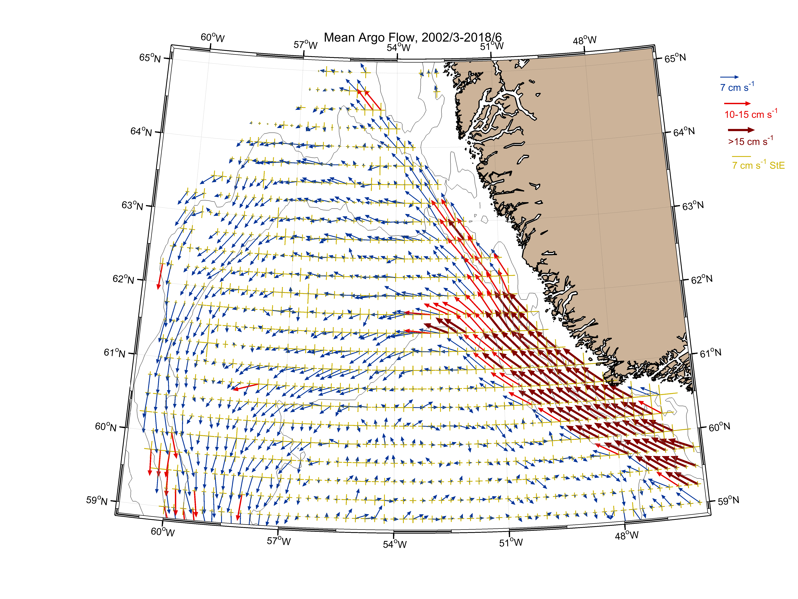

--- 
title: "Oceanographic setting influences the prokaryote community and metabolome in deep-sea sponges"
author: ["Karin Steffen"]
date: '`r format(Sys.Date(), "%B %d, %Y")`'
site: bookdown::bookdown_site
output:
  bookdown::html_document2:
    includes:
      in_header: header.html
  bookdown::gitbook:
    includes:
      in_header: header.html
documentclass: book
bibliography: ["book.bib", "packages.bib"]
biblio-style: "apalike"
link-citations: true
---
```{r setup, include=FALSE}
knitr::opts_chunk$set(echo = TRUE, tidy=TRUE, message = FALSE, warning = FALSE)
library(knitr)
```

```{r htmlTemp3, echo=FALSE, eval=F}
codejs <- readr::read_lines("js/codefolding.js")
collapsejs <- readr::read_lines("js/collapse.js")
transitionjs <- readr::read_lines("js/transition.js")
dropdownjs <- readr::read_lines("js/dropdown.js")

htmlhead <- c(
  paste('
<script>',
paste(transitionjs, collapse = "\n"),
'</script>
<script>',
paste(collapsejs, collapse = "\n"),
'</script>
<script>',
paste(codejs, collapse = "\n"),
'</script>
<script>',
paste(dropdownjs, collapse = "\n"),
'</script>
<style type="text/css">
.code-folding-btn { margin-bottom: 4px; }
.row { display: flex; }
.collapse { display: none; }
.in { display:block }
.pull-right > .dropdown-menu {
    right: 0;
    left: auto;
}
.open > .dropdown-menu {
    display: block;
}
.dropdown-menu {
    position: absolute;
    top: 100%;
    left: 0;
    z-index: 1000;
    display: none;
    float: left;
    min-width: 160px;
    padding: 5px 0;
    margin: 2px 0 0;
    font-size: 14px;
    text-align: left;
    list-style: none;
    background-color: #fff;
    -webkit-background-clip: padding-box;
    background-clip: padding-box;
    border: 1px solid #ccc;
    border: 1px solid rgba(0,0,0,.15);
    border-radius: 4px;
    -webkit-box-shadow: 0 6px 12px rgba(0,0,0,.175);
    box-shadow: 0 6px 12px rgba(0,0,0,.175);
}
</style>
<script>
$(document).ready(function () {
  window.initializeCodeFolding("show" === "show");
});
</script>
', sep = "\n"),
  paste0('
<script>
document.write(\'<div class="btn-group pull-right" style="position: absolute; top: 20%; right: 2%; z-index: 200"><button type="button" class="btn btn-default btn-xs dropdown-toggle" data-toggle="dropdown" aria-haspopup="true" aria-expanded="true" data-_extension-text-contrast=""><span>Code</span> <span class="caret"></span></button><ul class="dropdown-menu" style="min-width: 50px;"><li><a id="rmd-show-all-code" href="#">Show All Code</a></li><li><a id="rmd-hide-all-code" href="#">Hide All Code</a></li></ul></div>\')
</script>
')
)

readr::write_lines(htmlhead, path = "header.html")
```
# Content

This is a set of code and data sets to document and reproduce the computational analyses in Steffen _et al._, 2020.
In brief, it contains three parts: the metabolome, microbiota and inter-omics analyses. For the metabolome, we include detailed descriptions of the metabolomics data acquisition, data processing with xcms, and multivariate analyses with ropls. In addition, signals of known and novel compounds of interest were manually extracted and analysed. For the microbiota, we include community visualisation and ecological analyses in vegan. The inter-omics section contains mantel test and procrustes rotations, as well as the microbial interaction network annotated with the OTU's correlation with barettin, and their response to depth.

We hope to contribute to good science by providing reproducible documentation of the computational workflow. If you have questions, comments or suggestions please feel free to get in touch.

## Experimental setup 

Three demosponge species _Geodia barretti_ (n=20), _Stryphnus fortis_ (n=15), and _Weberella bursa_ (n=17) (Fig \@ref(fig:sponges)) were sampled in the Davis Strait between Canada and Greenland (61.147942-66.38245 Lat,-68.78077- -57.96573 Lon) from 244 m to 1467 m depth (Fig \@ref(fig:sample-map1), \@ref(fig:sample-map2)). Temperature and salinity _in situ_ were recorded. Sample metadata is deposited at [PANGAEA](https://doi.pangaea.de/10.1594/PANGAEA.909246). 


### Map

```{r sample-map1, fig.cap="Geographic placement of the sample site on the Northern hemisphere, between Canada and Greenland. Dots indicate individual samples."}
library(ggplot2)
library(ggmap)
library(maps)
library(mapdata)
library(marmap)
library(ggrepel)
library(sf)
library(rnaturalearth)
library(rnaturalearthdata)

sample_coords <- read.csv("data/Steffen_et_al_metadata_PANGAEA.csv", header=T, sep=";")
sample_coords <- sample_coords[,c("Species",  "unified_ID", "Latitude", "Longitude")]
sample_coords <- na.omit(sample_coords)

world <- ne_countries(scale = "medium", returnclass = "sf")
sample_map2 <- ggplot(data = world) +geom_sf() +
  coord_sf(xlim = c(-95, 0), ylim = c(45, 75), expand =T)+
  annotate("rect", xmin=-68.78077, xmax=-57.96573, ymin=61.147942 , ymax=66.38245, alpha = .2)+
  geom_point(data=sample_coords, aes(x=sample_coords$Longitude, y=sample_coords$Latitude, col=Species))+
  ggtitle("Sample map")+xlab("Longitude")+ylab("Latitude")+theme_bw()+theme(legend.position = "none")
sample_map2
#Green Sf, Blue=Wb, Red=Gb
```

```{r sample-map2, fig.cap="Detailed map of the sampling site, samples represented by dots are coloured according to sponge species."}
map_data<-getNOAA.bathy(-70,-50,58,68, resolution = 4, keep=T, antimeridian=FALSE)
sample_map_1 <- autoplot(map_data, geom=c("r", "c"))+
  scale_fill_gradient2(low="dodgerblue4", mid="gainsboro", high="darkgreen")+ 
  geom_point(aes(x=sample_coords$Longitude, y=sample_coords$Latitude, colour = factor(sample_coords$Species)), data=sample_coords)+
  ggtitle("Sample map")+xlab("Longitude")+ylab("Latitude")+labs(fill="Depth", col="Species")
sample_map_1
# with labels:
#sample_map_1+geom_label_repel(aes(x=sample_coords$Longitude, y=sample_coords$Latitude, label = sample_coords$unified_ID), box.padding = 0.35, point.padding = 0.5, data=sample_coords)
```

```{r sample-map3a, eval=F}
# 3D map
library(marmap)
library(lattice) #for wireframe

map_data_hires<-getNOAA.bathy(-70,-50,58,68, resolution = 1, keep=T, antimeridian=FALSE)
wireframe(unclass(map_data_hires), shade=T, aspect=c(1/2, 0.1),
          screen = list(z = 0, x = -50),
          par.settings = list(axis.line = list(col = "transparent")),
          par.box = c(col = rgb(0,0,0,0.1)))
```

```{r sample-map3b, fig.cap="3D representation of the threshold and slope in the Davis strait."}
knitr::include_graphics("data/map_screenshot.png")
```

### Water masses
```{r igor1, fig.cap="Currents in the North Atlantic between Greenland and Canada. Analysis and figure contributed by Igor Yashayaev."}

```

```{r igor2, fig.cap="Temperature and salinity (T-S) plot showing the different water masses in the Davis strait by depth: Shelf Water (ShW), Slope Water (SW), Irminger Current (IC), Labrador Sea Water (LSW), and Icelandic slope water (ISW). Analysis and figure contributed by Igor Yashayaev."}
knitr::include_graphics("data/water_masses_2002-2015 T-S Profiles Selected in Topo-range 300-1900 m & Colored by Depth - Labeled.png")
```

### Sponges
```{r sponges, fig.cap="__A__ _G. barretti_ and __B__ _S. fortis_ from West Shetland Channel. Image Crown Copyright ©2006, all rights reserved. Image provided by K. Howell, Plymouth University, UK. __C__ _W. bursa_, picture taken by scuba diving at 40 m in Svalbard by Peter Leopold."}
knitr::include_graphics("data/sponges.png")
```

_G. barretti_ and _S. fortis_ are high microbial abundance (HMA) sponges often found living in proximity. _W. bursa_ is likely a low microbial abundance sponges (see diversity metrics, Nicole Boury-Esnault _per.comm._). While all sponges originate from the same geographic region, _W. bursa_ typically does not occur in the same habitats as _G. barretti_ and _S. fortis_ [@murillo_sponge_2018].
It is important to note that _S. fortis_ is whiteish in colour, and the yellow shown in the picture stems from _Hexadella dedritifera_ frequently found overgrowing it.

## Sample metadata analysis

To investigate underlying data patterns, we assessed correlation of our predictor variables, i.e. the meta data of our samples (depth, latitude, longitude, sampling year, salinity and temperature).

### Correlations, visual inspection and variance inflation factors (VIF) across all samples {#index_cor_vif}
```{r mda-1}
md <- read.csv("data/Steffen_et_al_metadata_PANGAEA.csv", header=T, sep=";")
md <- md[,c("Species", "Depth", "Latitude", "Longitude", "YEAR", "MeanBotSalinity_PSU", "MeanBottomTemp_Cdeg", "unified_ID")]

a <- cor.test(md$Depth, md$Latitude, method = "spearman")
a <- paste("Rho =", round(a$estimate, digits=3)," p-value=", round(a$p.value, digits=3))
b <- cor.test(md$Depth, md$Longitude, method = "spearman")
b <- paste("Rho =", round(b$estimate, digits=3)," p-value=", round(b$p.value, digits=3))
c <- cor.test(md$Depth, md$YEAR, method = "spearman")
c <- paste("Rho =", round(c$estimate, digits=3)," p-value=", round(c$p.value, digits=3))
d <- cor.test(md$Depth, md$MeanBotSalinity_PSU, method = "spearman")
d <- paste("Rho =", round(d$estimate, digits=3)," p-value=", round(d$p.value, digits=3))
e <- cor.test(md$Depth, md$MeanBottomTemp_Cdeg, method = "spearman")
e <- paste("Rho =", round(e$estimate, digits=3)," p-value=", round(e$p.value, digits=3))
f <- cor.test(md$MeanBotSalinity_PSU, md$MeanBottomTemp_Cdeg, method = "spearman")
f <- paste("T-S plot: Rho =", round(f$estimate, digits=3)," p-value=", round(f$p.value, digits=3))

k <- ggplot(md, aes(x=Latitude, y=Depth))+geom_point()+scale_y_continuous(trans = "reverse")+
  xlab("Latitude")+ylab("Depth")+ggtitle(a)+theme(plot.title = element_text(size=10))
l <- ggplot(md, aes(x=Longitude, y=Depth))+geom_point()+scale_y_continuous(trans = "reverse")+
  xlab("Longitude")+ylab("Depth")+ggtitle(b)+theme(plot.title = element_text(size=10))
m <- ggplot(md, aes(x=YEAR, y=Depth))+geom_point()+scale_y_continuous(trans = "reverse")+
  xlab("Year")+ylab("Depth")+ggtitle(c)+theme(plot.title = element_text(size=10))
n <- ggplot(md, aes(x=MeanBotSalinity_PSU, y=Depth))+geom_point()+scale_y_continuous(trans = "reverse")+  xlab("Salinity")+ylab("Depth")+ggtitle(d)+theme(plot.title = element_text(size=10))
o <- ggplot(md, aes(x=MeanBottomTemp_Cdeg, y=Depth))+geom_point()+scale_y_continuous(trans = "reverse")+xlab("Temperature")+ylab("Depth")+ggtitle(e)+theme(plot.title = element_text(size=10))
p <- ggplot(md, aes(x=MeanBotSalinity_PSU, y=MeanBottomTemp_Cdeg, colour=md$Depth))+geom_point(size=2)+scale_colour_gradient(guide=guide_colourbar(),high="#f4c430", low= "#3b3bc4", trans = 'reverse')+xlab("Salinity in psu")+ylab("Temperature in °C")+labs(colour="Depth")+ggtitle(f)+theme(plot.title = element_text(size=10), legend.key.size=unit(0.3, "cm"))+scale_x_continuous(limits = c(34.4,35.0))
#The limits of the x-axis exclude two samples from water with comparably low salinity
```

```{r mda-2, fig.cap="Correlation of depth with other environmental parameters/predictor variables across all samples."}
library(gridExtra)
grid.arrange(k, l, m, n, o, p, nrow=3,  top = "Spearman correlation of sample associated meta data")
rm(a, b, c, d, e, f, k, l, m, n, o, p, df)
```
In the bottom right plot showing temperature versus salinity, two samples from lower salinity were excluded for visual clarity. From the plots above and their correlation tests, we find that longitude, salinity and temperature are significantly correlated with depth, and that salinity and temperature also correlate with each other. 

This is further corroborated in the variance inflation factors. A VIF > 10 indicates redundancy/collinearity.
This means that we have to be cautious and avoid including redundant constraints in ecological models.

```{r vif-1}
library(usdm)
md$Species <- NULL
md$unified_ID <- NULL
vif_all <- vif(md)

library(kableExtra)
options(kableExtra.html.bsTable = T)
kable(vif_all, 
      longtable = T, booktabs = T, 
      caption = "VIF for meta data from all samples",
      row.names = F) %>%
  kable_styling(bootstrap_options = c("striped","hover", "bordered", "condensed", "responsive"), full_width = F, latex_options = c("striped", "scale_down"))

rm(md)
```

As we will be focussing on _Geodia barretti_, we repeat the same inspection procedure for the sample subset.

### Correlations, visual inspection and variance inflation factors (VIF) across _G. barretti_ samples

```{r mda-3}
md <- read.csv("data/Steffen_et_al_metadata_PANGAEA.csv", header=T, sep=";")
md <- md[,c("Species", "Depth", "Latitude", "Longitude", "YEAR", "MeanBotSalinity_PSU", "MeanBottomTemp_Cdeg", "unified_ID")]
md <- md[md$Species=="Geodia barretti",]

a <- cor.test(md$Depth, md$Latitude, method = "spearman")
a <- paste("Rho =", round(a$estimate, digits=3)," p-value=", round(a$p.value, digits=3))
b <- cor.test(md$Depth, md$Longitude, method = "spearman")
b <- paste("Rho =", round(b$estimate, digits=3)," p-value=", round(b$p.value, digits=3))
c <- cor.test(md$Depth, md$YEAR, method = "spearman")
c <- paste("Rho =", round(c$estimate, digits=3)," p-value=", round(c$p.value, digits=3))
d <- cor.test(md$Depth, md$MeanBotSalinity_PSU, method = "spearman")
d <- paste("Rho =", round(d$estimate, digits=3)," p-value=", round(d$p.value, digits=3))
e <- cor.test(md$Depth, md$MeanBottomTemp_Cdeg, method = "spearman")
e <- paste("Rho =", round(e$estimate, digits=3)," p-value=", round(e$p.value, digits=3))
f <- cor.test(md$MeanBotSalinity_PSU, md$MeanBottomTemp_Cdeg, method = "spearman")
f <- paste("Rho =", round(f$estimate, digits=3)," p-value=", round(f$p.value, digits=3))

k <- ggplot(md, aes(x=Latitude, y=Depth))+geom_point()+scale_y_continuous(trans = "reverse")+
  xlab("Latitude")+ylab("Depth")+ggtitle(a)+theme(plot.title = element_text(size=10))
l <- ggplot(md, aes(x=Longitude, y=Depth))+geom_point()+scale_y_continuous(trans = "reverse")+
  xlab("Longitude")+ylab("Depth")+ggtitle(b)+theme(plot.title = element_text(size=10))
m <- ggplot(md, aes(x=YEAR, y=Depth))+geom_point()+scale_y_continuous(trans = "reverse")+
  xlab("Year")+ylab("Depth")+ggtitle(c)+theme(plot.title = element_text(size=10))
n <- ggplot(md, aes(x=MeanBotSalinity_PSU, y=Depth))+geom_point()+scale_y_continuous(trans = "reverse")+  xlab("Salinity")+ylab("Depth")+ggtitle(d)+theme(plot.title = element_text(size=10))
o <- ggplot(md, aes(x=MeanBottomTemp_Cdeg, y=Depth))+geom_point()+scale_y_continuous(trans = "reverse")+xlab("Temperature")+ylab("Depth")+ggtitle(e)+theme(plot.title = element_text(size=10))
p <- ggplot(md, aes(x=MeanBotSalinity_PSU, y=MeanBottomTemp_Cdeg, colour=md$Depth))+geom_point(size=2)+scale_colour_gradient(guide=guide_colourbar(),high="#f4c430", low= "#3b3bc4", trans = 'reverse')+xlab("Salinity in psu")+ylab("Temperature in °C")+labs(colour="Depth")+ggtitle(f)+theme(plot.title = element_text(size=10), legend.key.size=unit(0.3, "cm"))
```

```{r mda-4, fig.cap="Correlation of depth with other environmental parameters/predictor variables across samples of _G. barretti_."}
library(gridExtra)
grid.arrange(k, l, m, n, o, p, nrow=3,  top = "Spearman correlation of Geodia barretti associated meta data")
rm(a, b, c, d, e, f, k, l, m, n, o, p, df)
```

```{r vif-2}
library(usdm)
md$Species <- NULL
md$unified_ID <- NULL
vif1 <- vif(md)
vif1$VIF <- round(vif1$VIF, digits=2)

md$MeanBotSalinity_PSU <- NULL
md$MeanBottomTemp_Cdeg <- NULL
vif2 <- vif(md)
vif2$VIF <- round(vif2$VIF, digits=2)

library(dplyr)
vifs <- full_join(vif1, vif2, by=c("Variables"="Variables"))
colnames(vifs) <- c("Variables", "All predictors", "Subset")
vifs[c(5,6),3] <- ""

library(kableExtra)
options(kableExtra.html.bsTable = T)

cap <- paste("VIF for extensive and simplified models for", text_spec("G. barretti", italic = T))

kable(vifs, 
      longtable = T, booktabs = T, 
      caption = cap, row.names = F) %>%
  kable_styling(bootstrap_options = c("striped","hover", "bordered", "condensed", "responsive"), full_width = F, latex_options = c("striped", "scale_down"))

rm(md)

```

With this subset, the collinearity becomes even more pronounced. Salinity, temperature and depth are strongly correlated and the VIFs indicated that they should not be included in a model together. This correlation is partly due to physical properties of water. Density of water increases with increasing salinity and decreasing temperature. To a lesser extent, longitude and lattitude are collinear in our sampling. However, removing the predictor variables salinity and temperature mititgated/lowered the effect of collinearity.


<!--chapter:end:index.Rmd-->

---
title: "02 - Metabolomics experimental description and data acquisition"
output:
  bookdown::html_document2:
    includes:
      in_header: header.html
  bookdown::gitbook:
    includes:
      in_header: header.html
---
```{r setup02, include=FALSE}
knitr::opts_chunk$set(echo = TRUE, tidy=TRUE, message = FALSE, warning = FALSE)
library(knitr)
```

# Metabolomics

## Experimental methods and detailed description

__Additional sampling notes__

During the sampling on the Pâmiut cruises, the sponges remained on deck or in the laboratory for approximately 30--45 min before they were frozen to -20°C. The outside temperature usually oscillated around 4--5°C, and the sorting area was approximately 10°C. The sample consisted of both choanosome and coretx. 

__Laboratory methods and data acquisition__

Metabolites were separated in connection to downstream mass spectrometry (HRMS) analysis using two different chromatographic columns (UPLC): a hydrophilic interaction liquid chromatography (HILIC) column that retains polar compounds, and a reversed-phase (RP) column that favours retention of non-polar compounds. All samples were processed in randomized  using glass instruments during the extraction to avoid chemical contamination.

__Mass spectrometry analysis__

Dried extracts in glass vials were dissolved in 200 µL solvent (HILIC: 50 µL H~2~O and 175 µL acetonitrile AcN; RP: 140 µL H~2~O and 10 µL AcN). Upon addition of the organic solvent for HILIC chromatography, all samples separated into two immiscible layers. The vials were centrifuged for 3 min at 2000 x g to yield an even separation. Only the top layer (approximately 150 µL) was transferred to a Chromacol 03-FISV MS-vial (Thermo Scientific, Waltham, Massachusetts, USA) for MS analyses. For RP chromatography, no layers were observed, and the entire volume of the dissolved sample was used. A five µL aliquot from each individual MS-vial for HILIC and RP, respectively, was combined to produce a quality control (QC) sample.

__High resolution MS analysis system and settings__

The extracts were analyzed back-to-back in positive and negative ionization mode on an Acquity I-Class Ultra Performance Liquid Chromatography UPLC coupled to a G2S Synapt Q-TOF with an electrospray ionization (ESI) ion source (all Waters Corp., Milford, MA, USA).

Chromatographic separation in HILIC mode was performed on an Acquity UPLC BEH Amide column (1.7 µm, 2.1 mm inner diameter × 50 mm, Waters Corp.). Mobile phase A consisted of 95:5 acetonitrile/MQ water with 5 mM ammonium formate and 0.1 % formic acid (FA), and mobile phase B consisted of 40:60 acetonitrile/MQ water with 5 mM ammonium formate and 0.1 % FA. The gradient elution profile was as follows: mobile phase A was decreased non-linearly (slope factor 8, MassLynx) from 100 % A to 100 % B over 14 min, 100 % B was held for 2 min and then decreased back to 100 % A over 1 min. The column was re-equilibrated at 100 % A for 6 min for a total runtime of 23 min.

Chromatographic separation in RP was performed on an Acquity UPLC BEH C18 column (1.7 µ m, 2.1 mm inner diameter × 50 mm, Waters). Mobile phase A consisted of MQ water with 0.1 % FA, and mobile phase B was AcN with 0.1 % FA. The gradient elution profile started at 95 % A, was decreased linearly over 14 min to 5 % A, and 5 % A was held for 2 min before the column was re-equilibrated at 95 % A for 4 min. The flow rate was set to 0.4 mL/min, the column temperature was set to 40°C, the samples were kept at 8°C and the injection volume was 5 µL in all experiments.

__Data acquisition__

Data acquisition was performed using MS^E^ mode, and lock mass correction was applied using a solution of leucine enkephalin in both positive and negative mode. Ionization parameters were set as follows in positive/negative mode; the capillary voltage was 1kV/1.5 kV, the cone voltage was 30 V/25 V, the source offset was 50/60 and the source temperature was set to 120°C. Nitrogen was used as desolvation and cone gas with gas flows of 800 l/h and 50 l/h, respectively, and desolvation temperature was set to 500°C/450°C. For MS^E^ acquisition a collision energy ramp from 20--45 eV was used with argon as collision gas. The instrument was calibrated in the _m/z_ range 50--1500 using sodium formate prior to each analysis.
All study samples were analysed in both RP and HILIC, in positive and negative ionization mode, resulting in four metabolite datasets per sponge specimen. The column and sample cone was cleaned in between each analysis mode. Prior to each analysis ten QC injections were made to condition the column, and to ensure stable retention times and signal intensities. The study samples were analysed in randomized  with QC injections interspaced every 6^th^ injection.

__MS data processing__

Raw files were converted to netCDF files by Databridge (part of MassLynx, Waters Corporation, Milford, Massachusetts, USA). The netCDF files with the chromatographic spectra were sorted into folders according to species and processed with XCMS in R. Peak picking was performed using the centWave function with parameters ppm=8, peakwidth set to c(5,45) and the noise parameter set to 2000. Retention time alignment was performed with the obiwarp function and the response factor set to 10, grouping was performed with the “group” function and the “fillPeaks” function was used to impute a signal in cases where no matching pseudospectra were detected.

The data set was curated to remove features eluting in the void (retention time less than 45 s). A raw data set as well as two normalized data sets (Log~10~-transformed and median fold change normalized) were produced and filtered to only retain features with a coefficient of variation < 30% in the QC samples. After subsequent evaluation, raw data sets were used in subsequent statistics and modelling. 

An overview of the number of features and PC groups annotated by CAMERA, as well as their exclusion is given in a table at the end of this document.

## Data processing

### Peak picking with XCMS and annotation with CAMERA

We processed samples from all three sponnge species in random  with interspersed injection of a combined QC sample to monitor stability of the UPLC-HRMS run. The acquired signals/spectra were converted to netCDF format using the Program DataBridge, and thereafter sorted into four folders, three for the sponge species (Gb, Sf, Wb) and one for the QC samples (QC). Peak picking and combination of pseudospectra is performed with the R package xcms, the subsequent annotation of adducts and isotopes with the R package CAMERA.


### HILIC (Hydrophilic interaction chromatography) column with positive ESI (electron spray ionisation)

```{r HILIC_pos, eval=FALSE}
# HILIC POS
# ALWAYS CHECK DATE, CHROMATOGRAPHIC CLOUMN (HILIC, RP) AND ESI-MODE (naming, CAMERA: pos, neg)

#setwd() # work in directory containing the sorted CDF files.
#getwd()
library(xcms)
xset<-xcmsSet(method="centWave", ppm=8, peakwidth=c(5,45), noise=2000)
save(xset, file="HILIC_pos_xset_20190417.Rda")
#load(file="HILIC_pos_xset_20190417.Rda") #When resuming after a break
xset<-group(xset)
xset2<-retcor(xset, method="obiwarp", response=10, plottype="deviation")
xset2<-group(xset2)
xset3<-fillPeaks(xset2)
save(xset3, file="HILIC_pos_xset3_20190417.Rda")
reporttab<-diffreport(xset3, "Gb", "Sf", "Gb_Sf_HILIC_pos_20190417", 10)

library(CAMERA)
xsa<-xsAnnotate(xset3)
xsaF<-groupFWHM(xsa, perfwhm = 0.3)
xsaC<-groupCorr(xsaF, cor_eic_th = 0.7) 
xsaFI<-findIsotopes(xsaC)
rules <- read.csv("data/rules_jan_pos.csv", header=T, sep = ",")
xsaFA<-findAdducts(xsaFI, polarity="positive", rules=rules)
#write.csv(getPeaklist(xsaFA), file="HILIC_pos_20190417.csv")
```

The other data experiments, HILIC with negative ESI and RP with positive and negative ESI are processed accordingly.

### HILIC Chromatography with negative ESI

```{r HILIC_neg, eval=FALSE}
# HILIC NEG 20190421

#setwd() # work in directory containing the sorted CDF files.
#getwd()
library(xcms)
xset<-xcmsSet(method="centWave", ppm=8, peakwidth=c(5,45), noise=2000)
save(xset, file="HILIC_neg_xset_20190421.Rda")
#load(file="HILIC_neg_xset_20190421.Rda") #When resuming after a break
xset<-group(xset)
xset2<-retcor(xset, method="obiwarp", response=10, plottype="deviation")
xset2<-group(xset2)
xset3<-fillPeaks(xset2)
save(xset3, file="HILIC_neg_xset3_20190421.Rda")
reporttab<-diffreport(xset3, "Gb", "Sf", "Gb_Sf_HILIC_neg_20190421", 10)

library(CAMERA)
xsa<-xsAnnotate(xset3)
xsaF<-groupFWHM(xsa,perfwhm = 0.3)
xsaC<-groupCorr(xsaF,cor_eic_th = 0.7) 
xsaFI<-findIsotopes(xsaC)
rules <- read.csv("data/rules_jan_neg.csv", header=T, sep = ",")
xsaFA<-findAdducts(xsaFI, polarity="negative", rules=rules)
#write.csv(getPeaklist(xsaFA), file="HILIC_neg_20190421.csv")
```

### RP (Reversed phase) Chromatography with positive ESI

```{r RP_pos, eval=FALSE}
# RP POS 20190421

#setwd() # work in directory containing the sorted CDF files.
#getwd()
library(xcms)
xset<-xcmsSet(method="centWave", ppm=8, peakwidth=c(5,45), noise=2000)
save(xset, file="RP_pos_xset_20190421.Rda")
#load(file="RP_pos_xset_20190421.Rda") #When resuming after a break
xset<-group(xset)
xset2<-retcor(xset, method="obiwarp", response=10, plottype="deviation")
xset2<-group(xset2)
xset3<-fillPeaks(xset2)
save(xset3, file="RP_pos_xset3_20190421.Rda")
reporttab<-diffreport(xset3, "Gb", "Sf", "Gb_Sf_RP_pos_20190421", 10)

library(CAMERA)
xsa<-xsAnnotate(xset3)
xsaF<-groupFWHM(xsa,perfwhm = 0.3)
xsaC<-groupCorr(xsaF,cor_eic_th = 0.7) 
xsaFI<-findIsotopes(xsaC)
rules <- read.csv("data/rules_jan_pos.csv", header=T, sep = ",")
xsaFA<-findAdducts(xsaFI, polarity="positive", rules=rules)
#write.csv(getPeaklist(xsaFA), file="RP_pos_20190421.csv")
```

### RP Chromatography with negative ESI

```{r RP_neg, eval=FALSE}
# RP NEG 20190422

#setwd() # work in directory containing the sorted CDF files.
#getwd()
library(xcms)
xset<-xcmsSet(method="centWave", ppm=8, peakwidth=c(5,45), noise=2000)
save(xset, file="RP_neg_xset_20190422.Rda")
#load(file="RP_neg_xset_20190422.Rda") #When resuming after a break
xset<-group(xset)
xset2<-retcor(xset, method="obiwarp", response=10, plottype="deviation")
xset2<-group(xset2)
xset3<-fillPeaks(xset2)
save(xset3, file="RP_neg_xset3_20190422.Rda")
reporttab<-diffreport(xset3, "Gb", "Sf", "Gb_Sf_RP_neg_20190422", 10)

library(CAMERA)
xsa<-xsAnnotate(xset3)
xsaF<-groupFWHM(xsa,perfwhm = 0.3)
xsaC<-groupCorr(xsaF,cor_eic_th = 0.7) 
xsaFI<-findIsotopes(xsaC)
rules <- read.csv("data/rules_jan_neg.csv", header=T, sep = ",")
xsaFA<-findAdducts(xsaFI, polarity="negative", rules=rules)
#write.csv(getPeaklist(xsaFA), file="RP_neg_20190422.csv")
```

### Filtering of the raw data set

Features with following properties were removed:

- Eluting in the void (RT < 45 s)
- CV>30 % in QC samples
- Adducts as annotated by CAMERA

As the presence of the same parent feature in the the form of isotopes and adducts distorts downstream global metabolome analyses, we generated two versions of curated or selective feature tables. In both, void and unstably measured features are removed ("cleaned"). One retains only the feature with the largest signal per pc group ("cleaned_pcgroup"), the other is more stringent and only contains explicitly annotated parent ions ("cleaned_MH"), i.e. [M+H]+ for positive ESI and [M-H]- for negative ESI acquired data.


```{r cleaning}
library(dplyr)

#================================ HILIC pos ===================================
raw_peaks <- read.csv("data/HILIC_pos_20190417.csv")
hp_dim1 <- dim(raw_peaks)[1]
hp_pcg1 <- length(unique(raw_peaks$pcgroup))

# Removing features eluting in the void
raw_peaks <- raw_peaks[raw_peaks$rt>45,]
hp_dim2 <- dim(raw_peaks)[1]
hp_pcg2 <- length(unique(raw_peaks$pcgroup))

# Removing features with a CV < 30%
f <- which(colnames(raw_peaks)=="IE_20170918_02001") # first QC HILIC pos
l <- which(colnames(raw_peaks)=="IE_20170918_07601") # last QC HILIC pos
raw_peaks["SD"] <- apply(raw_peaks[,f:l], 1, sd)
raw_peaks["MEAN"] <- apply(raw_peaks[,f:l], 1, mean)
raw_peaks["CV"] <- raw_peaks$SD/raw_peaks$MEAN
raw_peaks <- raw_peaks[raw_peaks$CV<0.3,]
hp_dim3 <- dim(raw_peaks)[1]
hp_pcg3 <- length(unique(raw_peaks$pcgroup))
#write.csv(raw_peaks, "HILIC_pos_20190417_cleaned.csv")

# Keep only the feature with the greatest sum of signal per pc group
l <- dim(raw_peaks)[2]-6
raw_peaks["fss"] <- apply(raw_peaks[,13:l], 1, sum) #feature signal sum
raw_peaks <- raw_peaks[order(raw_peaks$pcgroup, -raw_peaks$fss),] 
#for every pc group, the first line has the strongest signal.
#The function distinct() [dplyr package] can be used to keep only unique/distinct rows from a data frame. If there are duplicate rows, _only the first row_ is preserved. 
selected_peaks <- distinct(raw_peaks, raw_peaks$pcgroup, .keep_all = TRUE)
hp_dim4 <- dim(selected_peaks)[1]
hp_pcg4 <- length(unique(selected_peaks$pcgroup))
#write.csv(selected_peaks, "HILIC_pos_20190417_cleaned_pcgroup.csv")
rm(selected_peaks)

# Keep only features with explicit annotations of [M+H]+
library(stringr)
raw_peaks["[M+H]+"] <- NA
pattern <- "[M+H]+"
raw_peaks["[M+H]+"] <- str_detect(raw_peaks$adduct, paste0("^\\Q",pattern, "\\E"))
selected_peaks <- raw_peaks[raw_peaks$`[M+H]+`=="TRUE",]
hp_dim5 <- dim(selected_peaks)[1]
hp_pcg5 <- length(unique(selected_peaks$pcgroup))
#write.csv(selected_peaks, "HILIC_pos_20190417_cleaned_MH.csv")

hilic_pos <- raw_peaks
rm (f, l, raw_peaks, selected_peaks)

#================================ HILIC neg ===================================
raw_peaks <- read.csv("data/HILIC_neg_20190421.csv")
hn_dim1 <- dim(raw_peaks)[1]
hn_pcg1 <- length(unique(raw_peaks$pcgroup))

# Removing features eluting in the void
raw_peaks <- raw_peaks[raw_peaks$rt>45,]
hn_dim2 <- dim(raw_peaks)[1]
hn_pcg2 <- length(unique(raw_peaks$pcgroup))

# Removing features with a CV < 30%
f <- which(colnames(raw_peaks)=="IE_20170919_01301") # first QC HILIC neg
l <- which(colnames(raw_peaks)=="IE_20170919_06901") # last QC HILIC neg
raw_peaks["SD"] <- apply(raw_peaks[,f:l], 1, sd)
raw_peaks["MEAN"] <- apply(raw_peaks[,f:l], 1, mean)
raw_peaks["CV"] <- raw_peaks$SD/raw_peaks$MEAN
raw_peaks <- raw_peaks[raw_peaks$CV<0.3,]
hn_dim3 <- dim(raw_peaks)[1]
hn_pcg3 <- length(unique(raw_peaks$pcgroup))
#write.csv(raw_peaks, "HILIC_neg_20190421_cleaned.csv")

# Keep only the feature with the greatest sum of signal per pc group
l <- dim(raw_peaks)[2]-6
raw_peaks["fss"] <- apply(raw_peaks[,13:l], 1, sum) #feature signal sum
raw_peaks <- raw_peaks[order(raw_peaks$pcgroup, -raw_peaks$fss),] 
selected_peaks <- distinct(raw_peaks, raw_peaks$pcgroup, .keep_all = TRUE)
hn_dim4 <- dim(selected_peaks)[1]
hn_pcg4 <- length(unique(selected_peaks$pcgroup))
#write.csv(selected_peaks, "HILIC_neg_20190421_cleaned_pcgroup.csv")
rm(selected_peaks)

# Keep only features with explicit annotations of [M-H]-
library(stringr)
raw_peaks["[M-H]-"] <- NA
pattern <- "[M-H]-"
raw_peaks["[M-H]-"] <- str_detect(raw_peaks$adduct, paste0("^\\Q",pattern, "\\E"))
selected_peaks <- raw_peaks[raw_peaks$`[M-H]-`=="TRUE",]
hn_dim5 <- dim(selected_peaks)[1]
hn_pcg5 <- length(unique(selected_peaks$pcgroup))
#write.csv(selected_peaks, "HILIC_neg_20190421_cleaned_MH.csv")

hilic_neg <- raw_peaks
rm (f, l, raw_peaks)

#================================== RP pos ====================================
raw_peaks <- read.csv("data/RP_pos_20190421.csv")
rp_dim1 <- dim(raw_peaks)[1]
rp_pcg1 <- length(unique(raw_peaks$pcgroup))

# Removing features eluting in the void
raw_peaks <- raw_peaks[raw_peaks$rt>45,]
rp_dim2 <- dim(raw_peaks)[1]
rp_pcg2 <- length(unique(raw_peaks$pcgroup))

# Removing features with a CV < 30%
f <- which(colnames(raw_peaks)=="IE_20171002_01401") # first QC RP neg
l <- which(colnames(raw_peaks)=="IE_20171002_07201") # last QC RP neg
raw_peaks["SD"] <- apply(raw_peaks[,f:l], 1, sd)
raw_peaks["MEAN"] <- apply(raw_peaks[,f:l], 1, mean)
raw_peaks["CV"] <- raw_peaks$SD/raw_peaks$MEAN
raw_peaks <- raw_peaks[raw_peaks$CV<0.3,]
rp_dim3 <- dim(raw_peaks)[1]
rp_pcg3 <- length(unique(raw_peaks$pcgroup))
#write.csv(raw_peaks, "RP_pos_20190421_cleaned.csv")

# Keep only the feature with the greatest sum of signal per pc group
l <- dim(raw_peaks)[2]-6
raw_peaks["fss"] <- apply(raw_peaks[,13:l], 1, sum) #feature signal sum
raw_peaks <- raw_peaks[order(raw_peaks$pcgroup, -raw_peaks$fss),] 
selected_peaks <- distinct(raw_peaks, raw_peaks$pcgroup, .keep_all = TRUE)
rp_dim4 <- dim(selected_peaks)[1]
rp_pcg4 <- length(unique(selected_peaks$pcgroup))
#write.csv(selected_peaks, "RP_pos_20190421_cleaned_pcgroup.csv")
rm(selected_peaks)

# Keep only features with explicit annotations of [M+H]+
library(stringr)
raw_peaks["[M+H]+"] <- NA
pattern <- "[M+H]+"
raw_peaks["[M+H]+"] <- str_detect(raw_peaks$adduct, paste0("^\\Q",pattern, "\\E"))
selected_peaks <- raw_peaks[raw_peaks$`[M+H]+`=="TRUE",]
rp_dim5 <- dim(selected_peaks)[1]
rp_pcg5 <- length(unique(selected_peaks$pcgroup))
#write.csv(selected_peaks, "RP_pos_20190421_cleaned_MH.csv")

rp_pos <- raw_peaks
rm (f, l, raw_peaks, selected_peaks)

#================================== RP neg ====================================
raw_peaks <- read.csv("data/RP_neg_20190422.csv")
rn_dim1 <- dim(raw_peaks)[1]
rn_pcg1 <- length(unique(raw_peaks$pcgroup))

# Removing features eluting in the void
raw_peaks <- raw_peaks[raw_peaks$rt>45,]
rn_dim2 <- dim(raw_peaks)[1]
rn_pcg2 <- length(unique(raw_peaks$pcgroup))

# Removing features with a CV < 30%
f <- which(colnames(raw_peaks)=="IE_20171003_01301") # first QC RP neg
l <- which(colnames(raw_peaks)=="IE_20171003_05701") # 3rd last QC RP neg; QC empty after this injection
raw_peaks["SD"] <- apply(raw_peaks[,f:l], 1, sd)
raw_peaks["MEAN"] <- apply(raw_peaks[,f:l], 1, mean)
raw_peaks["CV"] <- raw_peaks$SD/raw_peaks$MEAN
raw_peaks <- raw_peaks[raw_peaks$CV<0.3,]
rn_dim3 <- dim(raw_peaks)[1]
rn_pcg3 <- length(unique(raw_peaks$pcgroup))
#write.csv(raw_peaks, "RP_neg_20190422_cleaned.csv")

# Keep only the feature with the greatest sum of signal per pc group
l <- dim(raw_peaks)[2]-6
raw_peaks["fss"] <- apply(raw_peaks[,13:l], 1, sum) #feature signal sum
raw_peaks <- raw_peaks[order(raw_peaks$pcgroup, -raw_peaks$fss),] 
selected_peaks <- distinct(raw_peaks, raw_peaks$pcgroup, .keep_all = TRUE)
rn_dim4 <- dim(selected_peaks)[1]
rn_pcg4 <- length(unique(selected_peaks$pcgroup))
#write.csv(selected_peaks, "RP_neg_20190422_cleaned_pcgroup.csv")
rm(selected_peaks)

# Keep only features with explicit annotations of [M-H]-
library(stringr)
raw_peaks["[M-H]-"] <- NA
pattern <- "[M-H]-"
raw_peaks["[M-H]-"] <- str_detect(raw_peaks$adduct, paste0("^\\Q",pattern, "\\E"))
selected_peaks <- raw_peaks[raw_peaks$`[M-H]-`=="TRUE",]
rn_dim5 <- dim(selected_peaks)[1]
rn_pcg5 <- length(unique(selected_peaks$pcgroup))
#write.csv(selected_peaks, "RP_neg_20190422_cleaned_MH.csv")

hilic_neg <- raw_peaks
rm (f, l, raw_peaks, selected_peaks)
```

### Data quality control

To monitor the stability of the signal during the UPLC-HRMS run, we plot the total signal per sample by injection order.

```{r ms-run-stability, fig.cap="Cummulative signal intensity across all samples and chromatographic experiments shows only a minor effect of injection order."}
hp <- read.csv("data/HILIC_pos_20190417.csv", header=T, sep=",")
hn <- read.csv("data/HILIC_neg_20190421.csv", header=T, sep=",")
rp <- read.csv("data/RP_pos_20190421.csv", header=T, sep=",")
rn <- read.csv("data/RP_neg_20190422.csv", header=T, sep=",")

# subsetting, keep only sample data
hp <- hp[,13:(dim(hp)[2]-3)] #14
hn <- hn[,13:(dim(hn)[2]-3)]
rp <- rp[,13:(dim(rp)[2]-3)]
rn <- rn[,13:(dim(rn)[2]-3)]

# sum signal of columns, i.e. per sample 
hp[nrow(hp)+1,] <- apply(hp, 2, sum) 
hn[nrow(hn)+1,] <- apply(hn, 2, sum) 
rp[nrow(rp)+1,] <- apply(rp, 2, sum) 
rn[nrow(rn)+1,] <- apply(rn, 2, sum) 

# data frame gymnastics
hp_df <- data.frame(t((hp[dim(hp)[1],])))
hn_df <- data.frame(t((hn[dim(hn)[1],])))
rp_df <- data.frame(t((rp[dim(rp)[1],])))
rn_df <- data.frame(t((rn[dim(rn)[1],])))

colnames(hp_df) <- c("colsum_hp")
hp_df["id"] <- rownames(hp_df)
colnames(hn_df) <- c("colsum_hn")
hn_df["id"] <- rownames(hn_df)
colnames(rp_df) <- c("colsum_rp")
rp_df["id"] <- rownames(rp_df)
colnames(rn_df) <- c("colsum_rn")
rn_df["id"] <- rownames(rn_df)

library(stringr)
hp_df["hp_io"] <- as.integer(str_sub(hp_df$id, -4, -3))
hn_df["hn_io"] <- as.integer(str_sub(hn_df$id, -4, -3))
rp_df["rp_io"] <- as.integer(str_sub(rp_df$id, -4, -3))
rn_df["rn_io"] <- as.integer(str_sub(rn_df$id, -4, -3))

hp_df <- hp_df[order(hp_df$hp_io),] 
hp_df["n"] <- seq(nrow(hp_df))
hp_df["experiment"] <- "HILIC pos."

hn_df <- hn_df[order(hn_df$hn_io),] 
hn_df["n"] <- seq(nrow(hn_df))
hn_df["experiment"] <- "HILIC neg."

rp_df <- rp_df[order(rp_df$rp_io),] 
rp_df["n"] <- seq(nrow(rp_df))
rp_df["experiment"] <- "RP pos."

rn_df <- rn_df[order(rn_df$rn_io),] 
rn_df["n"] <- seq(nrow(rn_df))
rn_df["experiment"] <- "RP neg."

colnames(hp_df) <- c("colsum", "id", "io", "n", "experiment" )
colnames(hn_df) <- c("colsum", "id", "io", "n", "experiment" )
colnames(rp_df) <- c("colsum", "id", "io", "n", "experiment" )
colnames(rn_df) <- c("colsum", "id", "io", "n", "experiment" )

stability <- rbind(hp_df, hn_df, rp_df, rn_df)

library(ggplot2)
ggplot(stability, aes(x=n, y=colsum, color=experiment))+
  geom_line(size=1.5)+ ggtitle("Signal intensity during UPLC-HRMS experiments")+
  xlab("sample injection order")+ ylab("total signal intensity per sample")+
  labs(colour="Experiment")+ theme(legend.position="bottom")+
    geom_smooth(method='lm', size=0.5)+ facet_grid(experiment ~., scales = "free")

rm(hp, hp_df, hn, hn_df, rp, rp_df, rn, rn_df, stability)
```

We see that while signal intensity in all experimental data seems fairly stable, the HILIC positive data set has the highest intensity and virtually no changes at all throughout data acquisition. Therefore, we mostly rely on analyses of the HILIC pos data set.

### Summary of data processing
Below we outline the number of features removed in every step as shown in the table and corresponding figure. "CV>30%" is the data set subsequently labelled "cleaned", "repr. feat." are the PC-group data set and "ion"" are sometimes also labelled "MH".

```{r QC-filtering-table, fig.cap="Effect of different filtering steps on the resulting metabolomes in numbers of features."}

initial_f <- c(hp_dim1, hn_dim1, rp_dim1, rn_dim1)
rt_f <- c(hp_dim2, hn_dim2, rp_dim2, rn_dim2)
cv_f <- c(hp_dim3, hn_dim3, rp_dim3, rn_dim3)
representative_f <- c(hp_dim4, hn_dim4, rp_dim4, rn_dim4)
ion_f <- c(hp_dim5, hn_dim5, rp_dim5, rn_dim5)

initial_p <- c(hp_pcg1, hn_pcg1, rp_pcg1, rn_pcg1)
rt_p <- c(hp_pcg2, hn_pcg2, rp_pcg2, rn_pcg2)
cv_p <- c(hp_pcg3, hn_pcg3, rp_pcg3, rn_pcg3)
representative_p <- c(hp_pcg4, hn_pcg4, rp_pcg4, rn_pcg4)
ion_p <- c(hp_pcg5, hn_pcg5, rp_pcg5, rn_pcg5)

df <- cbind(initial_f, rt_f, cv_f, representative_f, ion_f, initial_p, rt_p, cv_p, representative_p, ion_p)
rownames(df) <- c("HILIC pos", "HILIC neg", "RP pos", "RP neg")

library(kableExtra)
options(kableExtra.html.bsTable = T)
kable(df, col.names = c("initial", "RT >45 s", "CV <30%", "repr. feat.", "ion", "initial", "RT >45 s", "CV <30%", "repr. feat.", "ion"), longtable = T, booktabs = T, caption = "Number of features and pc groups 
      remaining after each filtering step.") %>%
  add_header_above(c("","features" = 5, "pc groups" = 5)) %>%
  kable_styling(bootstrap_options = c("striped","hover", "bordered", "condensed", "responsive"), full_width = F,latex_options = c("striped", "scale_down"))

library(reshape2)
df <- melt(df)
df["filter"] <- c(rep(("initial"), 4),rep(("RT >45 s"), 4),rep(("CV <30%"), 4), rep(("rep"), 4), rep(("ion"), 4))
df$filter <- factor(df$filter, levels=c("initial", "RT >45 s", "CV <30%", "rep", "ion"))
df["category"] <- c(rep(("feature"), 20),rep(("pc group"), 20))
df$Var2 <- NULL
colnames(df) <- c("acquisition", "value", "filter", "category")
str(df)

#library(ggplot2)
#ggplot(df, aes(fill=filter, x=acquisition, y=value))+
#  geom_bar(position="dodge", stat = "identity")+
#  facet_grid(.~category)+
#  xlab("Data acquisition mode")+ylab("Count")+labs(fill="Filtering step")+
#  theme_bw()+ scale_fill_grey()+ scale_y_continuous(breaks=seq(0,6000,1000))+
#  theme(axis.text.x = element_text(angle = 45, vjust = 0.5, hjust = 0.5), legend.position="bottom")
```

After preliminary analyses of metabolomics data, a few outliers were re-identified by P. Cárdenas, and one specimen was removed from the data set as it originated from another species.

## Chromatorgrams

In _G. barretti_ barettin and 8,9-dihydrobarettin are major compounds with distinct peaks in the chromatogram. We wanted to see whether _S. fortis_ and _W. bursa_ also had major compounds and whether differences in sample depth would be directly reflected in the chromatograms.

```{r chromatorgrams-1}
gb_chrom <- read.csv("data/Gb_all_chromatograms.csv", header=T, sep=";")
# differences in RT negligible/insignificant between the different chromatograms/samples

gb_chrom[, c("Gb10_RT", "Gb12_RT","Gb13_RT", "Gb14_RT", "Gb15_RT", "Gb16_RT", "Gb17_RT", "Gb18_RT", "Gb19_RT", "Gb2_RT", "Gb20_RT", "Gb21_RT", "Gb3_RT", "Gb7_RT", "Gb8_RT", "Gb9_RT")]<- list(NULL)
colnames(gb_chrom)[colnames(gb_chrom) == "Gb1_RT"] <- "RT"
gb_chrom <- gb_chrom[gb_chrom$RT<=12,] # removing tail w/o any signal, run ended at 12 min

#ugly but works
p_gb_chrom <- ggplot(gb_chrom, aes(x=RT, y=Gb1))+geom_line()+
theme_classic()+
geom_rect(data=NULL,aes(xmin=6.3,xmax=6.5,ymin=-Inf,ymax=Inf),fill="lightgreen", alpha=0.5)+
geom_rect(data=NULL,aes(xmin=6.95,xmax=7.15,ymin=-Inf,ymax=Inf),fill="lightblue", alpha=0.5)+
geom_line(aes(x=RT, y=Gb2))+
geom_line(aes(x=RT, y=Gb3))+
geom_line(aes(x=RT, y=Gb7))+
geom_line(aes(x=RT, y=Gb8))+
geom_line(aes(x=RT, y=Gb9))+
geom_line(aes(x=RT, y=Gb10))+
geom_line(aes(x=RT, y=Gb15))+
geom_line(aes(x=RT, y=Gb16))+
geom_line(aes(x=RT, y=Gb17))+
geom_line(aes(x=RT, y=Gb19))+
geom_line(aes(x=RT, y=Gb21))+
geom_line(aes(x=RT, y=Gb12, color="red", alpha=0.5))+
geom_line(aes(x=RT, y=Gb13, color="red", alpha=0.5))+
geom_line(aes(x=RT, y=Gb14, color="red", alpha=0.5))+
geom_line(aes(x=RT, y=Gb18, color="red", alpha=0.5))+
geom_line(aes(x=RT, y=Gb20, color="red", alpha=0.5))+
xlab("RT")+ylab("Signal intensity")+ggtitle("Overlay chromatograms from G. barretti HILIC positive")+theme_classic(base_size=7)+theme(legend.position = "none")

sf_chrom <- read.csv("data/Sf_all_chromatograms.csv", header=T, sep=";")
sf_chrom[, c("Sf10_RT", "Sf11_RT","Sf12_RT","Sf13_RT","Sf14_RT","Sf15_RT","Sf2_RT","Sf3_RT","Sf4_RT","Sf5_RT","Sf6_RT","Sf7_RT")]<- list(NULL)
colnames(sf_chrom)[colnames(sf_chrom) == "Sf1_RT"] <- "RT"
sf_chrom <- sf_chrom[sf_chrom$RT<=12,]


p_sf_chrom <- ggplot(sf_chrom, aes(x=RT, y=Sf1))+geom_line()+
geom_line(aes(x=RT, y=Sf2))+
geom_line(aes(x=RT, y=Sf3))+
geom_line(aes(x=RT, y=Sf4))+
geom_line(aes(x=RT, y=Sf5))+
geom_line(aes(x=RT, y=Sf6))+
geom_line(aes(x=RT, y=Sf7))+
geom_line(aes(x=RT, y=Sf10, color="red", alpha=0.5))+
geom_line(aes(x=RT, y=Sf11, color="red", alpha=0.5))+
geom_line(aes(x=RT, y=Sf12, color="red", alpha=0.5))+
geom_line(aes(x=RT, y=Sf13, color="red", alpha=0.5))+
geom_line(aes(x=RT, y=Sf14, color="red", alpha=0.5))+
geom_line(aes(x=RT, y=Sf15, color="red", alpha=0.5))+
xlab("RT")+ylab("Signal intensity")+ggtitle("Overlay chromatograms from S. fortis HILIC positive")+
theme_classic(base_size=7)+theme(legend.position = "none")

wb_chrom <- read.csv("data/Wb_all_chromatograms.csv", header=T, sep=";")
wb_chrom[, c("Wb10_RT","Wb11_RT","Wb12_RT","Wb13_RT","Wb14_RT","Wb15_RT","Wb16_RT", "Wb17_RT","Wb2_RT","Wb3_RT","Wb4_RT","Wb5_RT","Wb6_RT","Wb7_RT","Wb8_RT")]<- list(NULL)
colnames(wb_chrom)[colnames(wb_chrom) == "Wb1_RT"] <- "RT"
wb_chrom <- wb_chrom[wb_chrom$RT<=12,]

p_wb_chrom <- ggplot(wb_chrom, aes(x=RT, y=Wb1))+geom_line()+
geom_line(aes(x=RT, y=Wb2))+
geom_line(aes(x=RT, y=Wb3))+
geom_line(aes(x=RT, y=Wb4))+
geom_line(aes(x=RT, y=Wb5))+
geom_line(aes(x=RT, y=Wb6))+
geom_line(aes(x=RT, y=Wb7))+
geom_line(aes(x=RT, y=Wb8))+
geom_line(aes(x=RT, y=Wb10))+
geom_line(aes(x=RT, y=Wb11))+
geom_line(aes(x=RT, y=Wb12))+
geom_line(aes(x=RT, y=Wb13, color="red", alpha=0.5))+
geom_line(aes(x=RT, y=Wb14, color="red", alpha=0.5))+
geom_line(aes(x=RT, y=Wb15, color="red", alpha=0.5))+
geom_line(aes(x=RT, y=Wb16, color="red", alpha=0.5))+
geom_line(aes(x=RT, y=Wb17, color="red", alpha=0.5))+
xlab("RT")+ylab("Signal intensity")+ggtitle("Overlay chromatograms from W. bursa HILIC positive")+
theme_classic(base_size=7)+theme(legend.position = "none")

library(gridExtra)
grid.arrange(p_gb_chrom, p_sf_chrom, p_wb_chrom, nrow=3)

#k <- grid.arrange(p_gb_chrom, p_sf_chrom, p_wb_chrom, nrow=3)
#ggsave("chroms_20200701.pdf", plot=k, path="data/", device = "pdf", units = "mm", width = 175, height = 90, useDingbats=FALSE)

rm(p_gb_chrom, p_sf_chrom, p_wb_chrom, gb_chrom, sf_chrom, wb_chrom)
```


## Multivariate analyses

We start by visualising all metabolomes with a PCA and a PERMANOVA to get a first impression of our data.

```{r pca1, fig.cap="PCA of the cleaned data sets. Dots are Gb samples, squares are Wb samples, traingles are Sf samples."}
library(ropls)
library(dplyr)
library(ggplot2)
library(tidyverse)
library(vegan)

# load data
hilic_pos <- read.csv("data/HILIC_pos_20190417_cleaned.csv", header=T, sep = ",")
hilic_neg <- read.csv("data/HILIC_neg_20190421_cleaned.csv", header=T, sep=",")
rp_pos <- read.csv("data/RP_pos_20190421_cleaned.csv", header=T, sep=",")
rp_neg <- read.csv("data/RP_neg_20190422_cleaned.csv", header=T, sep=",")
meta_data <- read.csv("data/Steffen_et_al_metadata_PANGAEA.csv", header=T, sep=";")

formatting <- function(metabolome, meta_data, r, my_colnames) {
  formatted <- metabolome
  formatted <- formatted[,14:(dim(formatted)[2]-r)]
  formatted <- data.frame(t(formatted))
  formatted["ID"] <- rownames(formatted)
  formatted["unified_ID"] <-meta_data$unified_ID[match(formatted$ID, meta_data[[my_colnames]])]
  formatted["filter"] <- str_sub(formatted$unified_ID,1,2)
  formatted <- formatted[!formatted$filter=="QC",]
  formatted <- na.omit(formatted)
  #formatted$filter <- NULL
  formatted$ID <- NULL
  formatted <- formatted[order(formatted$unified_ID),] 
  rownames(formatted) <- formatted$unified_ID
  return(formatted)
}

hilic_pos <- formatting(hilic_pos, meta_data, 6, "LC.MS.HILIC.positive")
hilic_neg <- formatting(hilic_neg, meta_data,6, "LC.MS.HILIC.negative")
rp_pos <- formatting(rp_pos, meta_data,6, "LC.MS.RP.positive")
rp_neg <- formatting(rp_neg, meta_data,6, "LC.MS.RP.negative")

md <- meta_data[,c("Species", "Depth", "Latitude", "Longitude", "YEAR", "MeanBottomTemp_Cdeg", "MeanBotSalinity_PSU", "unified_ID")]

# Overview PCA illustrating the metabolomes differ by sponge species

pca_wrapper <- function(metabolome, md, my_title){
  metabolome$unified_ID <- NULL
  metabolome$filter <- NULL
  metabolome <- prcomp(metabolome, scale=T)
  k <- summary(metabolome)[["importance"]]
  metabolome_df <- data.frame(metabolome$x) #scores, i.e. principal components of the sponge sample 
  metabolome_df["unified_ID"] <- as.factor(rownames(metabolome_df))
  x1 <- paste("PC1", round(k[2,1], digits=3)*100, "%")
  y1 <- paste("PC2", round(k[2,2], digits=3)*100, "%")
  metabolome_df <- left_join(metabolome_df[,c("PC1", "PC2", "PC3", "unified_ID")], md[,c("Species", "Depth", "Latitude", "Longitude", "MeanBottomTemp_Cdeg", "MeanBotSalinity_PSU", "unified_ID")])
  p <- ggplot(metabolome_df, aes(x=PC1, y=PC2))+geom_point(size=3, aes(shape=factor(Species)))+ggtitle(my_title)+xlab(x1)+ylab(y1)+theme(legend.position = "none")#+labs(shape="Species")
  return(p)  
}

hp_pca <- pca_wrapper(hilic_pos, md, "Hilic pos")
hn_pca <- pca_wrapper(hilic_neg, md, "Hilic neg")
rp_pca <- pca_wrapper(rp_pos, md, "RP pos")
rn_pca <- pca_wrapper(rp_neg, md, "RP neg")

library(gridExtra)
grid.arrange(hp_pca, hn_pca, rp_pca, rn_pca, nrow=2)
```

For a general overview of the metabolomic data, Fig. @\ref{fig:all-ropls-plot} is an OPLS model predicting variation as a function of depth versus orthogonal variation in all three sponge metabolomes combined. It is based on the HILIC positive cleaned data.

```{r all-ropls, echo=TRUE, eval=FALSE}
library(ropls)
library(dplyr)
library(ggplot2)
library(tidyverse)
library(vegan)

# load data
hilic_pos <- read.csv("data/HILIC_pos_20190417_cleaned.csv", header=T, sep = ",")
meta_data <- read.csv("data/Steffen_et_al_metadata_PANGAEA.csv", header=T, sep=";")

formatting <- function(metabolome, meta_data, r, my_colnames) {
  formatted <- metabolome
  formatted <- formatted[,14:(dim(formatted)[2]-r)]
  formatted <- data.frame(t(formatted))
  formatted["ID"] <- rownames(formatted)
  formatted["unified_ID"] <-meta_data$unified_ID[match(formatted$ID, meta_data[[my_colnames]])]
  formatted["filter"] <- str_sub(formatted$unified_ID,1,2)
  formatted <- formatted[!formatted$filter=="QC",]
  formatted <- na.omit(formatted)
  #formatted$filter <- NULL
  formatted$ID <- NULL
  formatted <- formatted[order(formatted$unified_ID),] 
  rownames(formatted) <- formatted$unified_ID
  return(formatted)
}

hilic_pos <- formatting(hilic_pos, meta_data, 6, "LC.MS.HILIC.positive")
md <- meta_data[,c("Species", "Depth", "Latitude", "Longitude", "YEAR", "MeanBottomTemp_Cdeg", "MeanBotSalinity_PSU", "unified_ID")]
md <- md[md$unified_ID %in% rownames(hilic_pos),]
md <- md[order(md$unified_ID),]   
all(rownames(hilic_pos)==md$unified_ID)
hilic_pos[, c("unified_ID", "filter")]<- list(NULL)
hilic.ropls.pca <- opls(hilic_pos, plotL=FALSE)
hilic.opls<-opls(hilic_pos, md[, "Depth"], permI=1000, orthoI=NA, scaleC="pareto", plotL=FALSE)
h.ortho.score<-getScoreMN(hilic.opls, orthoL=T)
h.pred.score<-getScoreMN(hilic.opls, orthoL=F)
h.df.3d<-data.frame(h.pred.score, h.ortho.score, md$Depth, md$unified_ID, md$Species)
#write.csv(h.df.3d, "data/metabolome_opls_3d.csv")
#hilic.opls@summaryDF
#      R2X(cum) R2Y(cum) Q2(cum) RMSEE pre ort  pR2Y   pQ2
#Total    0.534    0.987   0.662  43.7   1   4 0.001 0.001
```

```{r all-ropls-plot, fig.cap="Multivariate analysis (OPLS) of all sponge metabolomes by depth. At this point, this is purely for overview. In depth methods and evaluation are provided in the section below."}
library(plotly)
h.df.3d <- read.csv("data/metabolome_opls_3d.csv", sep = ",", header = T)
#format background and axes
axx <- list(
  backgroundcolor="rgb(211,211,211)",
  gridcolor="rgb(255,255,255)",
  title = "predicted",
  showbackground=TRUE
)

axy <- list(
  backgroundcolor="rgb(211,211,211)",
  gridcolor="rgb(255,255,255)",
  title = "orthogonal 1",
  showbackground=TRUE
)

axz <- list(
  backgroundcolor="rgb(211,211,211)",
  gridcolor="rgb(255,255,255)",
  title = "orthogonal 2",
  showbackground=TRUE
)
met3D <- plot_ly(h.df.3d, x = ~h.df.3d$p1, y = ~h.df.3d$o1, z = ~h.df.3d$o2, symbol = ~md.Species, symbols = c('diamond','x','circle'), color = ~h.df.3d$md.Depth) %>%
  add_markers() %>%
  layout(scene = list(xaxis=axx,yaxis=axy,zaxis=axz))
met3D

# for saving
#f<- basename(tempfile('OPLS_metabolome_plotly', '.', '.html'))
#on.exit(unlink(f), add = TRUE)
#html <- htmlwidgets::saveWidget(met3D, f)

```


```{r metbolome-permanova}
library(vegan)

permanova <- function(metabolome, md){
  metabolome$filter <- NULL
  md <- md[md$unified_ID %in% metabolome$unified_ID,]
  metabolome <- metabolome[order(metabolome$unified_ID),] 
  md <- md[order(md$unified_ID),] 
  metabolome$unified_ID <- NULL
  m <- adonis(metabolome ~ Species, md) 
  return(m)
}

permanova(hilic_pos, md)
permanova(hilic_neg, md)
permanova(rp_pos, md)
permanova(rp_neg, md)
```

From the PCA and the PERMANOVA (function `adonis`, Pr(>F) is the _p-value_), we gather that the metabolomes regardless of how they were acquired are significatly different in the three sponge species. Therefore, we separate the metabolomes for investigating the effect of depth on them individually.

In order to investigate whether depth has an effect on the species-specific metabolomes, we use OPLS orthogonal projections of latent structures as multivariate analysis approach. This method allows to separate variations in the data based on e.g. depth and orthogonal, i.e. unrelated variation.

```{r opls1, eval=F}
#splitting df and adapting meta data
spl_ada <- function(metabolome, md){
  metabolome_gb <- metabolome[metabolome$filter=="Gb",]
  metabolome_sf <- metabolome[metabolome$filter=="Sf",]
  metabolome_wb <- metabolome[metabolome$filter=="Wb",]
  
  md_gb <- md[md$unified_ID %in% metabolome_gb$unified_ID,]
  md_sf <- md[md$unified_ID %in% metabolome_sf$unified_ID,]
  md_wb <- md[md$unified_ID %in% metabolome_wb$unified_ID,]
  
  metabolome_gb <- metabolome_gb[order(metabolome_gb$unified_ID),] 
  metabolome_sf <- metabolome_sf[order(metabolome_sf$unified_ID),] 
  metabolome_wb <- metabolome_wb[order(metabolome_wb$unified_ID),] 
  
  metabolome_gb$filter <- NULL
  metabolome_gb$unified_ID <- NULL
  metabolome_sf$filter <- NULL
  metabolome_sf$unified_ID <- NULL
  metabolome_wb$filter <- NULL
  metabolome_wb$unified_ID <- NULL
  
  md_gb <- md_gb[order(md_gb$unified_ID),] 
  md_sf <- md_sf[order(md_sf$unified_ID),] 
  md_wb <- md_wb[order(md_wb$unified_ID),] 
  
  mva_data <- list(metabolome_gb=metabolome_gb, metabolome_sf=metabolome_sf, metabolome_wb=metabolome_wb, md_gb=md_gb, md_sf=md_sf, md_wb=md_wb)
  return(mva_data)
}

hp_opls_df <- spl_ada(hilic_pos, md)
hn_opls_df <- spl_ada(hilic_neg, md)
rp_opls_df <- spl_ada(rp_pos, md)
rn_opls_df <- spl_ada(rp_neg, md)

#P should be NA; or 1
ropls_wrapper <- function(opls_df, p1, p2, p3){
  # ropls' PCA
  gb.pca <- opls(opls_df$metabolome_gb, plotL=F, printL=F) 
  sf.pca <- opls(opls_df$metabolome_sf, plotL=F, printL=F) 
  wb.pca <- opls(opls_df$metabolome_wb, plotL=F, printL=F) 
  
  md_gb <- opls_df$md_gb
  md_sf <- opls_df$md_sf
  md_wb <- opls_df$md_wb
  
  # ropls' OPLS
  gb.opls<-opls(opls_df$metabolome_gb, md_gb[, "Depth"], permI=1000, orthoI=p1, scaleC="pareto", plotL=F) 
  sf.opls<-opls(opls_df$metabolome_sf, md_sf[, "Depth"], permI=1000, orthoI=p2, scaleC="pareto", plotL=F) 
  wb.opls<-opls(opls_df$metabolome_wb, md_wb[, "Depth"], permI=1000, orthoI=p3, scaleC="pareto", plotL=F) 
  
  # summary
  gb.opls <- gb.opls@summaryDF 
  sf.opls <- sf.opls@summaryDF
  wb.opls <- wb.opls@summaryDF
  
  opls_diagnostics <- rbind(gb.opls, sf.opls, wb.opls)
  opls_diagnostics["Species"] <- c("Geodia barretti", "Stryphnus fortis", "Weberella bursa")
  return(opls_diagnostics)
}

a <- Sys.time()
hp_cleaned_opls <- ropls_wrapper(hp_opls_df, NA, 1, NA)
hn_cleaned_opls <- ropls_wrapper(hn_opls_df, NA, 1, NA)
rp_cleaned_opls <- ropls_wrapper(rp_opls_df, NA, 1, NA)
rn_cleaned_opls <- ropls_wrapper(rn_opls_df, 1, 1, NA)
b <- Sys.time()
b-a

cleaned <- rbind(hp_cleaned_opls, hn_cleaned_opls, rp_cleaned_opls, rn_cleaned_opls)
cleaned["Experiment"] <- c(rep("HILIC pos", 3), rep("HILIC neg", 3), rep("RP pos", 3), rep("RP neg", 3))
write.csv(cleaned,"data/cleaned_opls_diagnostics.csv", row.names = F)
```

```{r ropls-figure, fig.cap="Example output for OPLS models generated with ROPLS. This is HILIC positive cleaned data set for _G. barretti_.", out.width="150%"}


# R2X:  The fraction of the variation of the X variables explained by the model.
# R2Y:  The fraction of the variation of the Y variables explained by the model.
# Q2X:  The fraction of the variation of the X variables predicted by the model.
# Q2Y:  The fraction of the variation of the Y variables predicted by the model.
```

In the same manner, we can analyse the two remaining sets produced by different filtering options.

```{r opls-2a, fig.cap="PCA of the metabolome data set filtered to retain only annotated ions. Dots are Gb samples, squares are Wb samples, traingles are Sf samples."}
# load data ION
hilic_pos <- read.csv("data/HILIC_pos_20190417_cleaned_MH.csv", header=T, sep = ",")
hilic_neg <- read.csv("data/HILIC_neg_20190421_cleaned_MH.csv", header=T, sep=",")
rp_pos <- read.csv("data/RP_pos_20190421_cleaned_MH.csv", header=T, sep=",")
rp_neg <- read.csv("data/RP_neg_20190422_cleaned_MH.csv", header=T, sep=",")
meta_data <- read.csv("data/Steffen_et_al_metadata_PANGAEA.csv", header=T, sep=";")

hilic_pos <- formatting(hilic_pos, meta_data, 8, "LC.MS.HILIC.positive")
hilic_neg <- formatting(hilic_neg, meta_data, 8, "LC.MS.HILIC.negative")
rp_pos <- formatting(rp_pos, meta_data, 8, "LC.MS.RP.positive")
rp_neg <- formatting(rp_neg, meta_data, 8, "LC.MS.RP.negative")

md <- meta_data[,c("Species", "Depth", "Latitude", "Longitude", "YEAR", "MeanBottomTemp_Cdeg", "MeanBotSalinity_PSU", "unified_ID")]

hp_pca <- pca_wrapper(hilic_pos, md, "Hilic pos")
hn_pca <- pca_wrapper(hilic_neg, md, "Hilic neg")
rp_pca <- pca_wrapper(rp_pos, md, "RP pos")
rn_pca <- pca_wrapper(rp_neg, md, "RP neg")

grid.arrange(hp_pca, hn_pca, rp_pca, rn_pca, nrow=2)

permanova(hilic_pos, md)
permanova(hilic_neg, md)
permanova(rp_pos, md)
permanova(rp_neg, md)
```

```{r opls-2b, eval=F}
hp_opls_df <- spl_ada(hilic_pos, md)
hn_opls_df <- spl_ada(hilic_neg, md)
rp_opls_df <- spl_ada(rp_pos, md)
rn_opls_df <- spl_ada(rp_neg, md)

a <- Sys.time()
hp_cleaned_opls <- ropls_wrapper(hp_opls_df, NA, 1, NA)
hn_cleaned_opls <- ropls_wrapper(hn_opls_df, NA, NA, NA)
rp_cleaned_opls <- ropls_wrapper(rp_opls_df, NA, 1, NA)
rn_cleaned_opls <- ropls_wrapper(rn_opls_df, 1, 1, NA)
b <- Sys.time()
b-a

ion <- rbind(hp_cleaned_opls, hn_cleaned_opls, rp_cleaned_opls, rn_cleaned_opls)
ion["Experiment"] <- c(rep("HILIC pos", 3), rep("HILIC neg", 3), rep("RP pos", 3), rep("RP neg", 3))
write.csv(ion,"data/cleaned_MH_opls_diagnostics.csv", row.names = F)
```

```{r opls-3a, fig.cap="PCA of the metabolome data set filtered to retain the feature with the strongest signal per PC group. Dots are Gb samples, squares are Wb samples, traingles are Sf samples."}
# load data PC_GROUP
hilic_pos <- read.csv("data/HILIC_pos_20190417_cleaned_pcgroup.csv", header=T, sep = ",")
hilic_neg <- read.csv("data/HILIC_neg_20190421_cleaned_pcgroup.csv", header=T, sep=",")
rp_pos <- read.csv("data/RP_pos_20190421_cleaned_pcgroup.csv", header=T, sep=",")
rp_neg <- read.csv("data/RP_neg_20190422_cleaned_pcgroup.csv", header=T, sep=",")
meta_data <- read.csv("data/Steffen_et_al_metadata_PANGAEA.csv", header=T, sep=";")

hilic_pos <- formatting(hilic_pos, meta_data, 8, "LC.MS.HILIC.positive")
hilic_neg <- formatting(hilic_neg, meta_data, 8, "LC.MS.HILIC.negative")
rp_pos <- formatting(rp_pos, meta_data, 8, "LC.MS.RP.positive")
rp_neg <- formatting(rp_neg, meta_data, 8, "LC.MS.RP.negative")

md <- meta_data[,c("Species", "Depth", "Latitude", "Longitude", "YEAR", "MeanBottomTemp_Cdeg", "MeanBotSalinity_PSU", "unified_ID")]

hp_pca <- pca_wrapper(hilic_pos, md, "Hilic pos")
hn_pca <- pca_wrapper(hilic_neg, md, "Hilic neg")
rp_pca <- pca_wrapper(rp_pos, md, "RP pos")
rn_pca <- pca_wrapper(rp_neg, md, "RP neg")

grid.arrange(hp_pca, hn_pca, rp_pca, rn_pca, nrow=2)

permanova(hilic_pos, md)
permanova(hilic_neg, md)
permanova(rp_pos, md)
permanova(rp_neg, md)
```

```{r opls-3b, eval=F}
hp_opls_df <- spl_ada(hilic_pos, md)
hn_opls_df <- spl_ada(hilic_neg, md)
rp_opls_df <- spl_ada(rp_pos, md)
rn_opls_df <- spl_ada(rp_neg, md)

a <- Sys.time()
hp_cleaned_opls <- ropls_wrapper(hp_opls_df, NA, NA, NA)
hn_cleaned_opls <- ropls_wrapper(hn_opls_df, NA, NA, NA)
rp_cleaned_opls <- ropls_wrapper(rp_opls_df, NA, NA, NA)
rn_cleaned_opls <- ropls_wrapper(rn_opls_df, NA, NA, NA)
b <- Sys.time()
b-a

pcg <- rbind(hp_cleaned_opls, hn_cleaned_opls, rp_cleaned_opls, rn_cleaned_opls)
pcg["Experiment"] <- c(rep("HILIC pos", 3), rep("HILIC neg", 3), rep("RP pos", 3), rep("RP neg", 3))
write.csv(pcg,"data/cleaned_PC_opls_diagnostics.csv", row.names = F)
```

In some cases, an OPLS model was not appropriate. Typically, the model chooses the number of orthogonal components by itself (`orthI=NA`) and when the first component is not significant, the model building will stop. However, one can force any number of orthogonal components and run the OPLS model anyway. You can spot those cases when the `NA` was set to `1` in the `ropls_wrapper` function

The multivariate analyses (OPLS) were quite time consuming, requiring 1.4 hours for the "cleaned" data sets, 46.3 min for the "PC-group" data stes and 4 min for the "ion" data sets on my system. Therefore, the combined model diagnostics are summarised in Tab \@ref(tab:opls4).

```{r opls4}
library(kableExtra)
cleaned <- read.csv("data/cleaned_opls_diagnostics.csv", header=T)
pcgrp <- read.csv("data/cleaned_PC_opls_diagnostics.csv", header=T)
ion <- read.csv("data/cleaned_MH_opls_diagnostics.csv", header=T)

opls_diagnostics <- rbind(cleaned, pcgrp, ion)
opls_diagnostics["filtering"] <- c(rep("cleaned", 12), rep("pc group", 12), rep("ion", 12))

options(kableExtra.html.bsTable = T)
kable(opls_diagnostics, 
      col.names = c("R2X cum", "R2Y cum", "Q2 cum", "RMSEE", "pre", "ort", "pR2Y", "pQ2", "Species", "Experiment", "data set"), 
      longtable = T, booktabs = T, 
      caption = "Model diagnostics of the metabolome variations modelled by depth", 
      row.names=FALSE) %>%
  add_header_above(c("Diagnostics" = 8, "Data set attribution" = 3)) %>%
  kable_styling(bootstrap_options = c("striped","hover", "bordered", "condensed", "responsive"), font_size = 12, full_width = F, latex_options = c("striped", "scale_down"))

#write.csv(opls_diagnostics, "data/opls_diagnostics.csv", row.names = F)
```

```{r opls-results, fig.cap="Model performance visualised. The larger R2 and Q2, the better the model fits with our data."}

opls_diagnostics$Species <- as.character(opls_diagnostics$Species)
opls_diagnostics$Species[opls_diagnostics$Species=="Geodia barretti"] <- c("G. barretti")
opls_diagnostics$Species[opls_diagnostics$Species=="Stryphnus fortis"] <- c("S. fortis")
opls_diagnostics$Species[opls_diagnostics$Species=="Weberella bursa"] <- c("W. bursa")

k <- ggplot(opls_diagnostics, aes(x=R2X.cum., y=Q2.cum.))+geom_point(aes(col=Species, shape=Experiment))+theme_bw()+theme(legend.position = "bottom")+xlab("R2")+ylab("Q2")+guides(col=guide_legend(title=""), shape=guide_legend(title=""))
library(ggExtra)
ggMarginal(k, groupColour = TRUE, groupFill = TRUE)

```

## VIPS
From the multivariate model (OPLS) you can derive a vaiable importance in projection (VIF) score for every feature in this model. This is a approximation (but not a statistics test!) of features that support the model.
A feature with a VIP score $\geq$ 1 is considered important and the higher the score, the greater the contribution to the model.

## Metabolites and correlations

A manually curated data set of signal intensities was produced for analysis of identified known and novel compounds.

```{r compounds1}
library(ggplot2)
library(ggrepel)
library(reshape)
library(tidyverse)
library(forcats)

cmp <- read.csv("data/metabolite_master_20190605.csv", header=T, sep=",")
meta_data <- read.csv("data/Steffen_et_al_metadata_PANGAEA.csv", header = T, sep = ";")   
md <- meta_data[c("Depth", "unified_ID")]

# FUN prep: remove, QC samples format depth and IDs
prep <- function(metabolites, md){
  metabolites$X <- NULL
  metabolites["spec"] <- str_sub(metabolites$unified_ID, 1,2)
  metabolites <- metabolites[!metabolites$spec=="QC",]
  metabolites <- left_join(metabolites, md)
  metabolites <- metabolites[-c(9), ] #removes Gb16 (Geodia atlantica)
  metabolites$Depth <- as.numeric(metabolites$Depth)
  metabolites <- metabolites[with(metabolites, order(metabolites$spec, metabolites$Depth)),]
  metabolites[] <- lapply(metabolites, function(x) if(is.factor(x)) factor(x) else x)
  metabolites$unified_ID <- factor(metabolites$unified_ID, levels = metabolites$unified_ID)
  return(metabolites)  
}

metabolites <- prep(cmp, md)
```

```{r compounds2, out.width='85%', fig.asp=1.25}
library(reshape2)
mets <- metabolites[,c("asb","his", "cre", "pch", "crn", "acl", "ser", "mbc", "chol_s", "bet", "choline", "ura", "unified_ID", "spec", "Depth")]
colnames(mets) <- c("arseno- betaine", "histamine", "creatine", "phospho- choline", "carnitine", "acetyl- choline", "serotonin", "2-methyl- butyroyl- carnitine", "choline sulfate", "betaine", "choline", "uranidine", "unified_ID", "spec", "Depth")

mets <- melt(mets, id.vars=c("spec", "Depth", "unified_ID"))
mets["Species"] <- NA
mets$Species[mets$spec=="Gb"] <- c("Geodia barretti")
mets$Species[mets$spec=="Sf"] <- c("Stryphnus fortis")
mets$Species[mets$spec=="Wb"] <- c("Weberella bursa")

#labeller needs formula interface
all <- ggplot(mets, aes(x=Depth, y=value))+geom_point()+facet_grid(variable~Species, labeller = labeller(variable=label_wrap_gen(10, multi_line = TRUE)), scales="free")
all <- all+ggtitle("VIPs")+ylab("signal")+xlab("Depth")+theme_bw()+theme(strip.text.x = element_text(face = "italic"), panel.background = element_rect(fill = "white", colour = "black"), panel.border = element_rect(colour = "black", fill=NA), axis.text.x = element_text(angle = 90, hjust = 1))+scale_y_continuous(labels = scales::scientific)+scale_x_continuous(breaks = scales::pretty_breaks(n = 12))
all

```

```{r vip-stats}
cmp <- read.csv("data/metabolite_master_20190605.csv", header=T, sep=",")
meta_data <- read.csv("data/Steffen_et_al_metadata_PANGAEA.csv", header = T, sep = ";")   
md <- meta_data[c("Depth", "unified_ID")]
metabolites <- prep(cmp, md)
mets <- metabolites[,c("asb","his", "cre", "pch", "crn", "acl", "ser", "mbc", "chol_s", "bet", "choline", "ura", "spec", "Depth")]

mets_gb <- mets[mets$spec=="Gb",]
mets_sf <- mets[mets$spec=="Sf",]
mets_wb <- mets[mets$spec=="Wb",]
mets_gb$spec <- NULL
mets_sf$spec <- NULL
mets_wb$spec <- NULL

mets_gb$ser <- NULL # too many NAs

metabolite_stats <- function(mets) {
  # Prepare df for collecting results
  results <- data.frame(colnames(mets)[-length(colnames(mets))])
  colnames(results) <- c("metabolite")
  results[,c("cor_rho", "cor_p.value","cor_fdr", "t.test_stat", "t.test_param", "t.test_p.val", "t.test_fdr")] <- NA

  n <- 0
  k <- dim(mets)[2]-1
  while(n<k){
    n <- n+1
    corr <- cor.test(mets[,n], mets$Depth, method = "spearman")
    results$cor_rho[n] <- corr$estimate
    results$cor_p.value[n] <- corr$p.value
    tt <- t.test(mets[,n][mets$Depth<1000], mets[,n][mets$Depth>1000], var.equal = T)
    results$t.test_stat[n] <- tt$statistic
    results$t.test_param[n] <- tt$parameter
    results$t.test_p.val[n] <- tt$p.value
  }
  cor_fdr <- c(p.adjust(results$cor_p.value, method = "fdr"))
  #colnames(cor_fdr) <- c("cor_fdr")
  results$cor_fdr <- cor_fdr
  t.test_fdr <- c(p.adjust(results$t.test_p.val, method = "fdr"))
  #colnames(t.test_fdr) <- c("t.test_fdr")
  results$t.test_fdr <- t.test_fdr
  
  return(results)
}

gb_met_stats <- metabolite_stats(mets_gb)
sf_met_stats <- metabolite_stats(mets_sf)
wb_met_stats <- metabolite_stats(mets_wb)

gb_met_stats["Species"] <- c("Gb")
sf_met_stats["Species"] <- c("Sf")
wb_met_stats["Species"] <- c("Wb")

gb_met_stats$metabolite <- c("arsenobetaine", "histamine", "creatine", "phosphocholine", "carnitine", "acetylcholine", "2-methyl-butyroyl-carnitine", "choline sulfate", "betaine", "choline", "uranidine")
sf_met_stats$metabolite <- c("arsenobetaine", "histamine", "creatine", "phosphocholine", "carnitine", "acetylcholine", "serotonin", "2-methyl-butyroyl-carnitine", "choline sulfate", "betaine", "choline", "uranidine")
wb_met_stats$metabolite <- c("arsenobetaine", "histamine", "creatine", "phosphocholine", "carnitine", "acetylcholine", "serotonin", "2-methyl-butyroyl-carnitine", "choline sulfate", "betaine", "choline", "uranidine")


results <- rbind(gb_met_stats, sf_met_stats, wb_met_stats)
kable(results, digits=4, longtable = T, booktabs = T, caption = "Depth response for VIP metabolites as approximated by different methods.") %>%
  add_header_above(c("","depth correlation" = 3, "depth groups" = 4, "")) %>%
  kable_styling(bootstrap_options = c("striped","hover", "bordered", "condensed", "responsive"), font_size = 12, full_width = F,latex_options = c("striped", "scale_down"))

```

```{r known-compounds-fig}
cmp <- read.csv("data/metabolite_master_20190605.csv", header=T, sep=",")

meta_data <- read.csv("data/Steffen_et_al_metadata_PANGAEA.csv", header = T, sep = ";")   
md <- meta_data[c("Depth", "unified_ID", "Species")]

# 6-bromo-8-hydroxy-conicamin = cp4
# cyclo Pro-Arg = solterin or soelterin

# Prepare df for Gb compounds
metabolites <- prep(cmp, md)
mets <- metabolites[,c( "bar", "dhb", "dhhb",
                "GeoA","GeoAi","GeoB", "sol",
                "brc", "cp4" , "GeoC","L6bhp",
                "barrettide_A", "barrettide_B", "unified_ID", "Depth", "Species")]
mets <- mets[mets$Species=="Geodia barretti",]
colnames(mets)<- c("barettin", "8,9-dihydrobarettin", "8,9−dihydro−8−hydroxy−barettin", "Geobarrettin A", "Geobarrettin A isomer", "Geobarrettin B", "cyclo Pro-Arg", "6-bromo-conicamin", "6-bromo-8-hydroxy-conicamin", "Geobarrettin C", "L-6-bromo- \n hypaphorine", "Barrettide A", "Barrettide B", "unified_ID", "Depth", "Species")
mets[,c("unified_ID","Species")] <- list(NULL)

mets <- reshape2::melt(mets, id.vars=c("Depth"))
ggplot(mets, aes(x=Depth, y=value))+geom_point()+facet_wrap(.~variable, scales="free")+theme_bw()

mets <- metabolites[,c("sfn", "ian", "unified_ID", "Depth", "Species")]
mets <- mets[mets$Species=="Stryphnus fortis",]
mets[,c("unified_ID","Species")] <- list(NULL)
colnames(mets) <- c("Stryphnusin", "Ianthellin", "Depth")

mets <- reshape2::melt(mets, id.vars=c("Depth"))
ggplot(mets, aes(x=Depth, y=value))+geom_point()+facet_wrap(.~variable, scales="free")+theme_bw()

```


```{r known-cmpds-stats-gb}
cmp <- read.csv("data/metabolite_master_20190605.csv", header=T, sep=",")

meta_data <- read.csv("data/Steffen_et_al_metadata_PANGAEA.csv", header = T, sep = ";")   
md <- meta_data[c("Depth", "unified_ID", "Species")]

# 6-bromo-8-hydroxy-conicamin = cp4
# cyclo Pro-Arg = solterin or soelterin

# Prepare df for Gb compounds
metabolites <- prep(cmp, md)
mets <- metabolites[,c( "bar", "dhb", "dhhb",
                "GeoA","GeoAi","GeoB", "sol",
                "brc", "cp4" , "GeoC","L6bhp",
                "barrettide_A", "barrettide_B", "unified_ID", "Depth", "Species")]
mets <- mets[mets$Species=="Geodia barretti",]
mets[,c("unified_ID","Species")] <- list(NULL)


metabolite_stats <- function(mets) {
  # Prepare df for collecting results
  results <- data.frame(colnames(mets)[-length(colnames(mets))])
  colnames(results) <- c("metabolite")
  results[,c("cor_rho", "cor_p.value","cor_fdr", "t.test_stat", "t.test_param", "t.test_p.val", "t.test_fdr")] <- NA

  n <- 0
  k <- dim(mets)[2]-1
  while(n<k){
    n <- n+1
    corr <- cor.test(mets[,n], mets$Depth, method = "spearman")
    results$cor_rho[n] <- corr$estimate
    results$cor_p.value[n] <- corr$p.value
    tt <- t.test(mets[,n][mets$Depth<1000], mets[,n][mets$Depth>1000], var.equal = T)
    results$t.test_stat[n] <- tt$statistic
    results$t.test_param[n] <- tt$parameter
    results$t.test_p.val[n] <- tt$p.value
  }
  cor_fdr <- c(p.adjust(results$cor_p.value, method = "fdr"))
  #colnames(cor_fdr) <- c("cor_fdr")
  results$cor_fdr <- cor_fdr
  t.test_fdr <- c(p.adjust(results$t.test_p.val, method = "fdr"))
  #colnames(t.test_fdr) <- c("t.test_fdr")
  results$t.test_fdr <- t.test_fdr
  
  return(results)
}

mets_stats <- metabolite_stats(mets)

# better names
Metabolites <- c("barettin", "8,9-dihydrobarettin", "8,9−dihydro−8−hydroxy−barettin", "Geobarrettin A", "Geobarrettin A isomer", "Geobarrettin B", "cyclo Pro-Arg", "6-bromo-conicamin", "6-bromo-8-hydroxy-conicamin", "Geobarrettin C", "L-6-bromohypaphorine", "Barrettide A", "Barrettide B")
mets_stats$metabolite <- Metabolites

kable(mets_stats, digits=4, longtable = T, booktabs = T, caption = "Depth response for _G. barretti_ metabolites as approximated by different methods.") %>%
  add_header_above(c("","depth correlation" = 3, "depth groups" = 4)) %>%
  kable_styling(bootstrap_options = c("striped","hover", "bordered", "condensed", "responsive"), font_size = 12, full_width = F,latex_options = c("striped", "scale_down"))

```

```{r known-cmpds-stats-sf}
cmp <- read.csv("data/metabolite_master_20190605.csv", header=T, sep=",")

meta_data <- read.csv("data/Steffen_et_al_metadata_PANGAEA.csv", header = T, sep = ";")   
md <- meta_data[c("Depth", "unified_ID", "Species")]

# Prepare df for Gb compounds
metabolites <- prep(cmp, md)
mets <- metabolites[,c("sfn", "ian", "unified_ID", "Depth", "Species")]
mets <- mets[mets$Species=="Stryphnus fortis",]
mets[,c("unified_ID","Species")] <- list(NULL)

mets_stats <- metabolite_stats(mets)

Metabolites <- c("Stryphnusin", "Ianthellin")
mets_stats$metabolite <- Metabolites

kable(mets_stats, longtable = T, booktabs = T, caption = "Depth response fro _S. fortis_ metabolites as approximated by different methods.") %>%
  add_header_above(c("","depth correlation" = 3, "depth groups" = 4)) %>%
  kable_styling(bootstrap_options = c("striped","hover", "bed", "condensed", "responsive"), font_size = 12, full_width = F,latex_options = c("striped", "scale_down"))

```


```{r system_info02, message = TRUE}
sessionInfo()
```


<!--chapter:end:02-Metabolomics_methods.Rmd-->

---
title: "03 - Microbiota"
output: html_document
---

```{r setup03, include=FALSE}
knitr::opts_chunk$set(echo = TRUE, tidy=TRUE, message = FALSE, warning = FALSE)
library(knitr)
library(tidyverse)
library(reshape2)
library(stringr)
library(ggplot2)
library(RColorBrewer)
library(forcats)

library(kableExtra)
options(kableExtra.html.bsTable = T)
library(gridExtra)
library(DT)

library(vegan)
library(phyloseq)
library(picante)
library(seqinr)
library(VennDiagram)
library(gtools)
```

```{r functions, echo=F}

# FUN SET UP: preparing meta data set
meta_data_prep <- function(meta_data){
  meta_data <- meta_data[, c("unified_ID", "Depth", "Latitude", "Longitude", "MeanBottomTemp_Cdeg", "MeanBotSalinity_PSU", "YEAR")]
  colnames(meta_data) <- c("unified_ID", "Depth", "Latitude", "Longitude", "Temperature", "Salinity", "Year")
  meta_data <- meta_data[!(str_sub(meta_data$unified_ID, 1,2)=="QC"),]
  meta_data[] <- lapply(meta_data, function(x) if(is.factor(x)) factor(x) else x)
  # Gb12, Gb20 and Gb21 are missing temperature and salinity. Imputing data from closeby samples:
  meta_data$Salinity[meta_data$unified_ID=="Gb12"] <- 34.92
  meta_data$Salinity[meta_data$unified_ID=="Gb20"] <- 34.92
  meta_data$Salinity[meta_data$unified_ID=="Gb21"] <- 34.56
  meta_data$Temperature[meta_data$unified_ID=="Gb12"] <- 3.71
  meta_data$Temperature[meta_data$unified_ID=="Gb20"] <- 3.65
  meta_data$Temperature[meta_data$unified_ID=="Gb21"] <- 2.32
  meta_data["spec"] <- str_sub(meta_data$unified_ID,1,2)
  meta_data <- meta_data[order(meta_data$unified_ID),]
  return(meta_data)  
}

# FUN SET UP: preparing OTU tables
OTU_prep_sqrt <- function(micro){
  rownames(micro) <- micro$Sample_ID
  micro$Sample_ID <- NULL
  micro <- sqrt(micro)
  
  micro_gb <- micro[(str_sub(rownames(micro), 1,2)=="Gb"),]
  micro_sf <- micro[(str_sub(rownames(micro), 1,2)=="Sf"),]
  micro_wb <- micro[(str_sub(rownames(micro), 1,2)=="Wb"),]
  
  micro_gb <- micro_gb[,colSums(micro_gb!=0)>0]
  micro_sf <- micro_sf[,colSums(micro_sf!=0)>0]
  micro_wb <- micro_wb[,colSums(micro_wb!=0)>0]
  micros <- list(gb=micro_gb, sf=micro_sf, wb=micro_wb)
  return(micros)  
}

# FUN RELATIVE ABUNDANCE: calculate relative abundance of OTU across sponge samples. For figures (OTU relative abdc heatmaps), and inc-dec correlations. Requires OTU_prep_sqrt.
rel_abdc <- function(micro){
  mic <- micro
  mic <- data.frame(t(mic))
  mic["max"] <- apply(mic, 1, max)
  
  n <- 0
  k <- dim(mic)[1] 
  while (n<k) {
    n <- n+1
    mic[n,] <- mic[n,]/(mic$max[n])
  }
  mic$max <- NULL
  return(mic)
}

# FUN correlation: increasing-decreasing and p-value, method default: Pearson's product-moment correlation
inc_dec <- function(rabdc_df, meta_data){
  
  md <- meta_data[meta_data$unified_ID %in% colnames(rabdc_df),]
  inc_dec <- data.frame(rownames(rabdc_df))
  colnames(inc_dec) <- "XOTU"
  inc_dec["inc_dec_estimate"] <- NA
  inc_dec["inc_dec_p_val"] <- NA
  
  n <- 0
  k <- dim(inc_dec)[1]
  while (n<k) {
    n <- n+1
    inc_dec$inc_dec_estimate[n] <- cor.test(as.numeric(rabdc_df[n,]), md$Depth)$estimate
    inc_dec$inc_dec_p_val[n] <- cor.test(as.numeric(rabdc_df[n,]), md$Depth)$p.value
  }
  
  inc_dec["classification"] <- NA
  inc_dec$classification[inc_dec$inc_dec_estimate<0] <- "dec.trend"
  inc_dec$classification[inc_dec$inc_dec_estimate>0] <- "inc.trend"
  inc_dec$classification[inc_dec$inc_dec_estimate<0 & inc_dec$inc_dec_p<=0.05] <- "decreasing"
  inc_dec$classification[inc_dec$inc_dec_estimate>0 & inc_dec$inc_dec_p<=0.05] <- "increasing"
  return(inc_dec)
}

# FUN occurrence
overall_rabdc <- function(micros){
  mic <- micros
  n <- 0
  k <- dim(mic)[1]
  mic["rowsum"] <- apply(mic, 1, sum)
  
  while (n<k) {
    n <- n+1
    mic[n,] <- mic[n,]/(mic$rowsum[n])
  }
  
  mic$rowsum <- NULL
  mic <- data.frame(t(mic))
  mic["avg_rel_abdc"] <- apply(mic, 1, mean)
  mic["occurrence"] <- ifelse(mic$avg>0.0025, "common", "rare")
  return(mic)
}

# FUN prepared list of data sets for taxonomy aggregation
aggregations <- function(taxonomy, occurrence){
  occurrence$gb["XOTU"] <-rownames(occurrence$gb) 
  occurrence$sf["XOTU"] <-rownames(occurrence$sf) 
  occurrence$wb["XOTU"] <-rownames(occurrence$wb)
  
  tax <- taxonomy[, c("OTU_ID", "Phylum", "Class")]
  n <- 0
  k <- dim(tax)[1]
  tax["XOTU"] <- NA
  while (n<k) {
    n <- n+1
    tax$XOTU[n] <- paste0("X",tax$OTU_ID[n])
  }
  
  tax_gb <- inner_join(tax, occurrence$gb[,c("XOTU", "avg_rel_abdc")])
  tax_sf <- inner_join(tax, occurrence$sf[,c("XOTU", "avg_rel_abdc")])
  tax_wb <- inner_join(tax, occurrence$wb[,c("XOTU", "avg_rel_abdc")])
  
  taxes <- list(gb=tax_gb, sf=tax_sf, wb=tax_wb)
  
  gb1 <- aggregate(tax_gb$Phylum, by=list(tax_gb$Phylum), FUN="length")
  gb2 <- aggregate(tax_gb$avg_rel_abdc, by=list(tax_gb$Phylum), FUN="sum")
  gb_p <- full_join(gb1, gb2, by=("Group.1"="Group.1"))
  colnames(gb_p) <- c("Phylum", "OTU_number", "avg_rel_abdc")
  
  gb1 <- aggregate(tax_gb$Class, by=list(tax_gb$Class), FUN="length")
  gb2 <- aggregate(tax_gb$avg_rel_abdc, by=list(tax_gb$Class), FUN="sum")
  gb_c <- full_join(gb1, gb2, by=("Group.1"="Group.1"))
  colnames(gb_c) <- c("Class", "OTU_number", "avg_rel_abdc")
  
  test1  <- lapply(taxes, function(x) aggregate(avg_rel_abdc ~ Phylum, data = x, FUN = "length"))
  lapply(taxes, function(x) aggregate(avg_rel_abdc ~ Phylum, data = x, FUN = "sum"))
  
  return(taxes)
}

# FUN prepared list of data sets for adonis
adonis_prep <- function(taxonomy, occurrence){
  occurrence$gb["XOTU"] <-rownames(occurrence$gb) 
  occurrence$sf["XOTU"] <-rownames(occurrence$sf) 
  occurrence$wb["XOTU"] <-rownames(occurrence$wb)
  
  tax <- taxonomy[, c("OTU_ID", "Phylum", "Class")]
  n <- 0
  k <- dim(tax)[1]
  tax["XOTU"] <- NA
  while (n<k) {
    n <- n+1
    tax$XOTU[n] <- paste0("X",tax$OTU_ID[n])
  }
  
  tax_gb <- inner_join(tax, occurrence$gb)
  tax_sf <- inner_join(tax, occurrence$sf)
  tax_wb <- inner_join(tax, occurrence$wb)
  
  taxes <- list(gb=tax_gb, sf=tax_sf, wb=tax_wb)
  return(taxes)
}
# FUN cleaning class and phylum namines
cleaning <- function(taxes) {
  gb <- taxes$gb
  sf <- taxes$sf
  wb <- taxes$wb
  #Renaming & removing whitespaces
  gb$Phylum <- as.character(str_trim(as.character(gb$Phylum)))
  sf$Phylum <- as.character(str_trim(as.character(sf$Phylum)))
  wb$Phylum <- as.character(str_trim(as.character(wb$Phylum)))
  gb$Class <- as.character(str_trim(as.character(gb$Class)))
  sf$Class <- as.character(str_trim(as.character(sf$Class)))
  wb$Class <- as.character(str_trim(as.character(wb$Class)))
  ## GB
  gb$Class[(gb$Phylum=="PAUC34f")] <- "PAUC34f_unclassified"
  gb$Class[(gb$Phylum=="")] <- "unclassified"
  gb$Phylum[(gb$Phylum=="")] <- "unclassified"
  gb$Class[(gb$Phylum=="Tectomicrobia")] <- "Tectomicrobia_unclassified"
  gb$Class[(gb$Phylum=="SBR1093")] <- "SBR1093_unclassified"
  gb$Class[(gb$Phylum=="Poribacteria")] <- "Poribacteria_unclassified"
  gb$Class[gb$Phylum=="Chloroflexi" & gb$Class==""] <- "Chloroflexi_unclassified"
  ## SF
  sf$Class[(sf$Phylum=="")] <- "unclassified"
  sf$Phylum[(sf$Phylum=="")] <- "unclassified"
  sf$Class[(sf$Phylum=="PAUC34f")] <- "PAUC34f_unclassified"
  sf$Class[(sf$Phylum=="Proteobacteria" & sf$Class=="")] <- "Proteobacteria_unclassified"
  sf$Class[(sf$Phylum=="Tectomicrobia")] <- "Tectomicrobia_unclassified"
  sf$Class[(sf$Phylum=="SBR1093")] <- "SBR1093_unclassified"
  sf$Class[(sf$Phylum=="Poribacteria")] <- "Poribacteria_unclassified"
  ## WB
  wb$Class[(wb$Phylum=="")] <- "unclassified"
  wb$Phylum[(wb$Phylum=="")] <- "unclassified"
  # merge back
  taxes <- list(gb=gb, sf=sf, wb=wb)
  return(taxes)
}

md_prep <- function(microbiomes, meta_data){
  meta_data <- meta_data[, c("unified_ID", "Depth", "Latitude",  "Longitude", "MeanBottomTemp_Cdeg", "MeanBotSalinity_PSU", "YEAR")]
  
  gb <- microbiomes$gb
  sf <- microbiomes$sf
  wb <- microbiomes$wb
  
  gb_md <- meta_data[meta_data$unified_ID %in% rownames(gb),]
  rownames(gb_md) <- gb_md$unified_ID
  gb_md <- gb_md[order(gb_md$unified_ID),]
  all(rownames(microbiomes$gb)==rownames(gb_md))
  gb_md <- gb_md[,c("Depth","Latitude","Longitude", "MeanBottomTemp_Cdeg", "MeanBotSalinity_PSU", "YEAR")]
  
  sf_md <- meta_data[meta_data$unified_ID %in% rownames(sf),]
  rownames(sf_md) <- sf_md$unified_ID
  sf_md$unified_ID <- NULL
  wb_md <- meta_data[meta_data$unified_ID %in% rownames(wb),]
  rownames(wb_md) <- wb_md$unified_ID
  wb_md$unified_ID <- NULL
  mds <- list(gb_md=gb_md, sf_md=sf_md, wb_md=wb_md)
  return(mds)
}

```

# Microbiota

## OTU table overview

Let's start by taking a look at the OTU table and get an overall impression of our data.

```{r libraries}
library(tidyverse)
library(reshape2)
library(stringr)
library(ggplot2)
library(RColorBrewer)
library(forcats)

library(kableExtra)
options(kableExtra.html.bsTable = T)
library(gridExtra)
library(DT)

library(vegan)
library(phyloseq)
library(picante)
library(seqinr)

library(gtools)
#install.packages("webshot")
#webshot::install_phantomjs()
set.seed(1984)
```

```{r filtering-pca, fig.cap="Read count overview of the OTU table before and after the normalisation applied in the data analysis for this study."}
microbiome<-read.csv("data/OTU_all_R.csv", header=T, sep=";") 
meta_data <- read.csv("data/Steffen_et_al_metadata_PANGAEA.csv", header=T, sep=";")

#meta_data <- meta_data[!str_sub(meta_data$unified_ID,1,2)=="QC",] # remove QC samples
meta_data <- meta_data[meta_data$unified_ID %in% microbiome$Sample_ID,]

microbiome <- microbiome[order(microbiome$Sample_ID),] 
meta_data <- meta_data[order(meta_data$unified_ID),] 

# dropping factors from full data:
meta_data[] <- lapply(meta_data, function(x) if(is.factor(x)) factor(x) else x) 
microbiome[] <- lapply(microbiome, function(x) if(is.factor(x)) factor(x) else x) 

#all(meta_data$unified_ID==microbiome$Sample_ID)
rownames(microbiome) <- microbiome[,1]
microbiome[,1] <- NULL

microbiome["total_OTUs"] <- apply(microbiome, 1, sum) #total_OTUs = Cummulative read count
micro_fig1 <- data.frame(microbiome[,"total_OTUs"])
micro_fig1["unified_ID"] <- rownames(microbiome)
micro_fig1["normalisation"] <- "none"

microbiome$total_OTUs <- NULL
microbiome <- sqrt(microbiome)
microbiome["total_OTUs"] <- apply(microbiome, 1, sum)

micro_fig2 <- data.frame(microbiome[,"total_OTUs"])
micro_fig2["unified_ID"] <- rownames(microbiome)
micro_fig2["normalisation"] <- "sqrt"

microbiome$total_OTUs <- NULL
microbiome <- wisconsin(microbiome)
microbiome["total_OTUs"] <- apply(microbiome, 1, sum)

micro_fig3 <- data.frame(microbiome[,"total_OTUs"])
micro_fig3["unified_ID"] <- rownames(microbiome)
micro_fig3["normalisation"] <- "sqrt wisconsin"

micro_fig <- rbind(micro_fig1, micro_fig2, micro_fig3)
colnames(micro_fig) <- c("total_OTUs","unified_ID", "normalisation")
micro_fig["Species"] <- str_sub(micro_fig$unified_ID, 1,2)

ggplot(micro_fig, aes(x=unified_ID, y=total_OTUs))+geom_bar(stat = "identity")+facet_grid(vars(normalisation), vars(Species),  scales="free")+xlab("Samples")+ylab("Number of OTUs")+ggtitle("Cummulative read count after normalisation")+theme_bw()+theme(axis.text.x = element_text(angle = 90, hjust = 1))

# see https://chrischizinski.github.io/SNR_R_Group/2016-08-10-Data-Transformations
```

Do the normalisations have affect how well we can discriminate between the microbiota?

```{r microbiome-pca, fig.cap="PCA of the data sets with and without transformation/normalisation. Circles are Gb, triangles are Sf, squares are Wb", fig.asp=0.4}

microbiome<-read.csv("data/OTU_all_R.csv", header=T, sep=";") 
meta_data <- read.csv("data/Steffen_et_al_metadata_PANGAEA.csv", header=T, sep=";")
meta_data <- meta_data[meta_data$unified_ID %in% microbiome$Sample_ID,]

rownames(microbiome) <- microbiome[,1]
microbiome[,1] <- NULL

pca_plot <- function(microbiome, meta_data, my_title){
  micro.pca <- prcomp(microbiome, scale=T)
  k <- summary(micro.pca)[["importance"]]
  micro_pca_df <- data.frame(micro.pca$x) #scores, i.e. principal components of the sponge sample 
  micro_pca_df["unified_ID"] <- as.factor(rownames(micro_pca_df))
  x1 <- paste("PC1", round(k[2,1], digits=3)*100, "%")
  y1 <- paste("PC2", round(k[2,2], digits=3)*100, "%")
  micro_pca_df <- left_join(micro_pca_df[,c("PC1", "PC2", "PC3", "unified_ID")], meta_data[,c("Species", "Depth", "Latitude", "Longitude", "MeanBottomTemp_Cdeg", "MeanBotSalinity_PSU", "unified_ID")])
  p <- ggplot(micro_pca_df, aes(x=PC1, y=PC2))+geom_point(size=3, mapping=aes(shape=factor(Species)))+ggtitle(my_title)+xlab(x1)+ylab(y1)+labs(shape="Species")+theme_bw()+theme(legend.position = "none")
  return(p)
}

untransformed <- pca_plot(microbiome, meta_data, "untransformed")
sqrt_transformed <- pca_plot(sqrt(microbiome), meta_data, "sqrt")
sqrt_wisc_transformed <- pca_plot(wisconsin(sqrt(microbiome)), meta_data, "sqrt and wisconsin")

grid.arrange(untransformed, sqrt_transformed, sqrt_wisc_transformed, nrow=1, top="PCA: Impact of normalisation on discrimination of the microbiota")
```

```{r nmds, fig.cap="NMDS of the data sets with and without transformation/normalisation. Circles are Gb, triangles are Sf, squares are Wb", fig.asp=0.5}

microbiome <-read.csv("data/OTU_all_R.csv", header=T, sep=";") 
meta_data <- read.csv("data/Steffen_et_al_metadata_PANGAEA.csv", header=T, sep=";")
meta_data <- meta_data[meta_data$unified_ID %in% microbiome$Sample_ID,]

rownames(microbiome) <- microbiome[,1]
microbiome[,1] <- NULL

nmds_plot <- function(microbiome, meta_data, my_title){
  micro.mds <- metaMDS(microbiome, k=2, trymax = 100, distance = "bray",trace=FALSE)
  nmds_points <- as.data.frame(micro.mds$points)
  samples<-data.frame(nmds_points$MDS1, nmds_points$MDS2)
  samples["unified_ID"] <- rownames(microbiome)
  meta_data <- meta_data[,c("unified_ID", "Depth", "Species")]
  samples <- left_join(samples, meta_data)
  stress <- paste("Stress=", round(micro.mds$stress, digits=3))
  p <- ggplot(samples, aes(x=nmds_points.MDS1, y=nmds_points.MDS2))+geom_point(aes(shape = Species, alpha=0.5), size=4)+ggtitle(my_title)+ labs(shape='Sponge species')+theme_bw()+theme(legend.position="none")+xlab("NMDS 1")+ylab("NMDS 2")+ annotate("text", x = 0, y = 1, label = stress)
  return(p)
}

untransformed <- nmds_plot(microbiome, meta_data, "untransformed")
sqrt_transformed <- nmds_plot(sqrt(microbiome), meta_data, "sqrt")
sqrt_wisc_transformed <- nmds_plot(wisconsin(sqrt(microbiome)), meta_data, "sqrt and wisconsin")

grid.arrange(untransformed, sqrt_transformed, sqrt_wisc_transformed, nrow=1, top="NMDS: Impact of normalisation on discrimination of the microbiota")
```

It seems that we don't lose any relevant information and the normalisations in fact increase the discriminatory power.

## Alpha diversity

The microbiota are composed of  420 OTUs in _G. barretti_, 461 OTUs in _S. fortis_ and 135 OTUs in _W. bursa_. While _G. barretti_ and _S. fortis_ share 316, respectively they each only share 2 and 8 OTUs with _W. bursa_. Only a single OTU (OTU4 or X1969004, an Archaeon) is shared among the three sponge hosts.

How does that reflect in their diversities? Below we show Shannon diversity, species richness (SR) and Faith's phylogenetic distance (PD). 

```{r a-diversities, fig.cap="Microbiota diversity indices grouped by sponge species and ordered by sample depth."}
library(vegan)
library(reshape2)
library(phyloseq)
library(picante)

microbiome<-read.csv("data/OTU_all_R.csv", header=T, sep=";") 
meta_data <- read.csv("data/Steffen_et_al_metadata_PANGAEA.csv", header=T, sep=";")
taxonomy <- read.csv("data/microbiome_taxonomy.csv", header = T, sep = ";")
tree <- read.nexus("data/infile.nex.con.X.tre")

rownames(microbiome) <- microbiome$Sample_ID
microbiome$Sample_ID <- NULL
otumat <- t(microbiome)
otumat <- wisconsin(sqrt(otumat))
colnames(otumat) <- rownames(microbiome)
rownames(taxonomy) <- paste0("X",taxonomy$OTU_ID)
taxonomy$OTU_ID <- NULL
#all(rownames(taxonomy)==rownames(otumat))

# relative abundance
otumat<-apply(otumat, 2, function(i) i/sum(i))
OTU <- otu_table(otumat, taxa_are_rows = TRUE)
# remove low abundance taxa
#OTU <- filter_taxa(OTU, function(x) mean(x) > 0.0025, TRUE)
taxmat<-as.matrix(taxonomy)
TAX <- tax_table(taxmat)
biom_data <- phyloseq(OTU, TAX)
#Merge into phyloseq object
pso <- merge_phyloseq(biom_data,tree)#merging a phyloseq and a tree file
pso <- prune_taxa(taxa_sums(pso) > 0, pso)

#Calculate Phylogenetic Distance (PD) of the dataset, ALPHA DIVERSITY
otu_table_pso <- as.data.frame(pso@otu_table)
df.pd <- pd(t(otu_table_pso), tree, include.root=F) 
df.pd["unified_ID"] <- rownames(df.pd)
#df.pd: PD = Faith's Phylogenetic diversity, SR= species richness 
div <- as.data.frame(vegan::diversity(t(otumat), index = "shannon"))
div["spec"] <- str_sub(rownames(div),1,2)
colnames(div) <- c( "Shannon_diversity","spec")
div["unified_ID"] <- rownames(div)
div_indices <- full_join(div, df.pd)
md <- meta_data[,c("unified_ID", "Depth")]
div_indices <- left_join(div_indices, md)

div_indices <- reshape2::melt(div_indices, id.vars=c("spec", "unified_ID", "Depth"))
ggplot(div_indices, aes(x=Depth, y=value))+geom_point()+facet_grid(vars(variable), vars(spec), scales="free")+ theme(axis.text.x = element_text(angle = -90, vjust = 0.5, hjust = 1), legend.position = "none")+ylab("Diversity metrics")+xlab("Sample depth")+theme_bw()
```

We see that the HMA sponges _G. barretti_ and _S. fortis_ not only have more OTUs but also a higher diversity in their prokaryotic communities then the LMA sponge _W. bursa_.

## Beta diversity

In a way, the Fig. \@ref(fig:microbiome-pca) and \@ref(fig:nmds) have already shown us the beta diversity in our samples. Looking more into the data, we found that the two dimensional representation can be misleading at times and so we provide the first three axes components for exploration below.

```{r b-divPCA, fig.cap="PCA of the met"}
library(plot3D)
library(rgl)
library(plotly)

### PCA
microbiome<-read.csv("data/OTU_all_R.csv", header=T, sep=";") 
meta_data <- read.csv("data/Steffen_et_al_metadata_PANGAEA.csv", header=T, sep=";")
meta_data <- meta_data[meta_data$unified_ID %in% microbiome$Sample_ID,]

rownames(microbiome) <- microbiome[,1]
microbiome[,1] <- NULL
microbiome <- sqrt(microbiome)
micro.pca <- prcomp(microbiome, scale=T)
k <- summary(micro.pca)[["importance"]]
micro_pca_df <- data.frame(micro.pca$x) #scores, i.e. principal components of the sponge sample 
micro_pca_df["unified_ID"] <- as.factor(rownames(micro_pca_df))
x1 <- paste("PC1", round(k[2,1], digits=3)*100, "%")
y1 <- paste("PC2", round(k[2,2], digits=3)*100, "%")
z1 <- paste("PC3", round(k[2,3], digits=3)*100, "%")
micro_pca_df <- left_join(micro_pca_df[,c("PC1", "PC2", "PC3", "unified_ID")], meta_data[,c("Species", "Depth", "Latitude", "Longitude", "MeanBottomTemp_Cdeg", "MeanBotSalinity_PSU", "unified_ID")])

## rgl/plot3D: static 3D plot
#with(micro_pca_df, text3D(PC1, PC2, PC3,
#                       colvar = micro_pca_df$Depth, theta = 60, phi = 20,
#                       xlab = x1, ylab = y1, zlab =z1,
#                       main = "3D microbiome PCA",
#                       labels = micro_pca_df$unified_ID, cex = 0.9,
#                       bty = "g", ticktype = "detailed", d = 2,
#                       clab = c("Depth [m]"), adj = 0.5, font = 2))

## plotly
axx <- list(
  backgroundcolor="rgb(211,211,211)",
  gridcolor="rgb(255,255,255)",
  title = x1,
  showbackground=TRUE
)

axy <- list(
  backgroundcolor="rgb(211,211,211)",
  gridcolor="rgb(255,255,255)",
  title = y1,
  showbackground=TRUE
)

axz <- list(
  backgroundcolor="rgb(211,211,211)",
  gridcolor="rgb(255,255,255)",
  title = z1,
  showbackground=TRUE
)

mic_i <- plot_ly(micro_pca_df, x = ~micro_pca_df$PC1, y = ~micro_pca_df$PC2, z = ~micro_pca_df$PC3, symbol = ~Species, symbols = c('diamond','x','circle'), color = ~micro_pca_df$Depth) %>%
  add_markers() %>%
  layout(scene = list(xaxis=axx,yaxis=axy,zaxis=axz))
mic_i

#for saving locally
#f<- basename(tempfile('PCA_microbiome_plotly', '.', '.html'))
#on.exit(unlink(f), add = TRUE)
#html <- htmlwidgets::saveWidget(mic_i, f)

rm(mic_i, f, html, k, x1, y1, z1, micro.pca, axx, axy, axz, micro_pca_df)
```


```{r b-divNMDS, fig.cap="NMDS based on Bray-Curtis dissimilarity."}
library(plot3D)
library(rgl)
library(plotly)

### NMDS
microbiome<-read.csv("data/OTU_all_R.csv", header=T, sep=";") 
meta_data <- read.csv("data/Steffen_et_al_metadata_PANGAEA.csv", header=T, sep=";")
meta_data <- meta_data[meta_data$unified_ID %in% microbiome$Sample_ID,]

rownames(microbiome) <- microbiome[,1]
microbiome[,1] <- NULL
#microbiome <- sqrt(microbiome)

micro.mds <- metaMDS(microbiome, k=3, trymax = 100, distance = "bray",trace=FALSE)
nmds_points <- as.data.frame(micro.mds$points)
samples<-data.frame(nmds_points$MDS1, nmds_points$MDS2, nmds_points$MDS3)
samples["unified_ID"] <- rownames(microbiome)
meta_data <- meta_data[,c("unified_ID", "Depth", "Species")]
samples <- left_join(samples, meta_data)
colnames(samples) <- c("PC1", "PC2", "PC3", "unified_ID","Depth","Species")
stress <- paste("Stress=", round(micro.mds$stress, digits=6))
x1 <- c("MDS1")
y1 <- c("MDS2")
z1 <- c("MDS3")

# rgl/plot3D
#with(samples, text3D(PC1, PC2, PC3,
#                       colvar = samples$Depth, theta = 60, phi = 20,
#                       xlab = x1, ylab = y1, zlab =z1,
#                       main = "3D microbiome NMDS",
#                       labels = samples$unified_ID, cex = 0.9,
#                       bty = "g", ticktype = "detailed", d = 2,
#                       clab = c("Depth [m]"), adj = 0.5, font = 2))

## plotly
axx <- list(
  backgroundcolor="rgb(211,211,211)",
  gridcolor="rgb(255,255,255)",
  title = x1,
  showbackground=TRUE
)

axy <- list(
  backgroundcolor="rgb(211,211,211)",
  gridcolor="rgb(255,255,255)",
  title = y1,
  showbackground=TRUE
)

axz <- list(
  backgroundcolor="rgb(211,211,211)",
  gridcolor="rgb(255,255,255)",
  title = z1,
  showbackground=TRUE
)

mic_i <- plot_ly(samples, x = ~samples$PC1, y = ~samples$PC2, z = ~samples$PC3, symbol = ~Species, symbols = c('diamond','x','circle'), color = samples$Depth) %>%
  add_markers() %>%
  layout(scene = list(xaxis=axx,yaxis=axy,zaxis=axz))
mic_i

#for saving locally
#f<- basename(tempfile('NMDS_microbiome_plotly', '.', '.html'))
#on.exit(unlink(f), add = TRUE)
#html <- htmlwidgets::saveWidget(mic_i, f)

rm(mic_i, f, html, k, x1, y1, z1, micro.mds, axx, axy, axz, samples, nmds_points)
```
NMDS `r stress`.

```{r b-divOPLS, fig.cap="OPLS based on Bray-Curtis dissimilarity.", echo=F, eval=F}
library(plot3D)
library(rgl)
library(plotly)
library(ropls)

### OPLS
microbiome<-read.csv("data/OTU_all_R.csv", header=T, sep=";") 
meta_data <- read.csv("data/Steffen_et_al_metadata_PANGAEA.csv", header=T, sep=";")
meta_data <- meta_data[meta_data$unified_ID %in% microbiome$Sample_ID,]

rownames(microbiome) <- microbiome[,1]
microbiome[,1] <- NULL
microbiome <- sqrt(microbiome)

micro.ropls.pca <- opls(microbiome)
micro.opls<-opls(microbiome, meta_data[, "Depth"], permI=1000, orthoI=2, scaleC="pareto") #orthoI=NA THIS IS NOT A GOOD MODEL
m.ortho.score<-getScoreMN(micro.opls, orthoL=T)
m.pred.score<-getScoreMN(micro.opls, orthoL=F)
m.df.3d<-data.frame(m.pred.score, m.ortho.score, meta_data$Depth, meta_data$unified_ID, meta_data$Species)
x1 <- c("predicted")
y1 <- c("orthogonal 1")
z1 <- c("orthogonal 2")

# rgl/plot3D
with(m.df.3d, text3D(p1, o1, o2,
                       colvar = m.df.3d$meta_data.Depth, theta = 60, phi = 20,
                       xlab = x1, ylab = y1, zlab =z1,
                       main = "3D microbiome OPLS",
                       labels = m.df.3d$meta_data.unified_ID, cex = 0.9,
                       bty = "g", ticktype = "detailed", d = 2,
                       clab = c("Depth [m]"), adj = 0.5, font = 2))


## plotly
axx <- list(
  backgroundcolor="rgb(211,211,211)",
  gridcolor="rgb(255,255,255)",
  title = x1,
  showbackground=TRUE
)

axy <- list(
  backgroundcolor="rgb(211,211,211)",
  gridcolor="rgb(255,255,255)",
  title = y1,
  showbackground=TRUE
)

axz <- list(
  backgroundcolor="rgb(211,211,211)",
  gridcolor="rgb(255,255,255)",
  title = z1,
  showbackground=TRUE
)

mic_i <- plot_ly(m.df.3d, x = ~m.df.3d$p1, y = ~m.df.3d$o1, z = ~m.df.3d$o2, symbol = ~m.df.3d$meta_data.Species, symbols = c('diamond','x','circle'), color = ~m.df.3d$meta_data.Depth) %>%
  add_markers() %>%
  layout(scene = list(xaxis=axx,yaxis=axy,zaxis=axz))
mic_i

# for saving locally
#f<- basename(tempfile('OPLS_microbiome_plotly', '.', '.html'))
#on.exit(unlink(f), add = TRUE)
#html <- htmlwidgets::saveWidget(mic_i, f)

rm(mic_i, f, html, k, x1, y1, z1 , axx, axy, axz, micro.ropls.pca, micro.opls, m.ortho.score, m.pred.score, m.df.3d)
```


In some of the downstream analyses, we distinguish between common/abundant OTUs and rare OTUs. We use a cutoff of 0.25% average relative abundance per OTU for the classification. That implies drastically modifying the original numbers of OTUs per sponge as outlined below.

```{r filtering-low-abdc-1}
micro <- read.csv("data/OTU_all_R.csv", header = T, sep = ";")
emp <- read.csv("data/SpongeEMP.csv", header=T, sep=";")

emp["XOTU_id"] <- str_replace(emp$OTU_ID,"OTU","X196900")
# The full data set had the entries listed by sponge host, so there are 62 duplicates in the OTU list
#length(emp$XOTU_id) # 207
#length(unique(emp$XOTU_id)) # 145
emp["num"] <- as.numeric(str_replace(emp$OTU_ID,"OTU",""))
emp <- emp[order(emp$num),]
emp["dup"] <- duplicated(emp$num)
#dim(emp[emp$dup=="TRUE",]) #62
emp <- emp[emp$dup=="FALSE",]
emp[, c("sponge", "num", "dup")] <- list(NULL)

OTU_prep_sqrt <- function(micro){
  rownames(micro) <- micro$Sample_ID
  micro$Sample_ID <- NULL
  #micro <- sqrt(micro)
  
  micro_gb <- micro[(str_sub(rownames(micro), 1,2)=="Gb"),]
  micro_sf <- micro[(str_sub(rownames(micro), 1,2)=="Sf"),]
  micro_wb <- micro[(str_sub(rownames(micro), 1,2)=="Wb"),]
  
  micro_gb <- micro_gb[,colSums(micro_gb!=0)>0] #removes columns that only contain 0
  micro_sf <- micro_sf[,colSums(micro_sf!=0)>0]
  micro_wb <- micro_wb[,colSums(micro_wb!=0)>0]
  micros <- list(gb=micro_gb, sf=micro_sf, wb=micro_wb)
  return(micros)  
}

micro_ds <- OTU_prep_sqrt(micro)

overall_rabdc <- function(micro){
  mic <- micro
  n <- 0
  k <- dim(mic)[1]
  mic["rowsum"] <- apply(mic, 1, sum)
  
  while (n<k) {
    n <- n+1
    mic[n,] <- mic[n,]/(mic$rowsum[n])
  }
  
  mic$rowsum <- NULL
  mic <- data.frame(t(mic))
  mic["avg_rel_abdc"] <- apply(mic, 1, mean)
  mic["occurrence"] <- ifelse(mic$avg>0.0025, "common", "rare")
  return(mic)
}

gb_occurrence <- overall_rabdc(micro_ds$gb)
sf_occurrence <- overall_rabdc(micro_ds$sf)
wb_occurrence <- overall_rabdc(micro_ds$wb)

gb_occurrence <- gb_occurrence[,c("avg_rel_abdc", "occurrence")]
gb_occurrence["XOTU_id"] <- rownames(gb_occurrence)
gb_occ_emp <- left_join(gb_occurrence, emp)

sf_occurrence <- sf_occurrence[,c("avg_rel_abdc", "occurrence")]
sf_occurrence["XOTU_id"] <- rownames(sf_occurrence)
sf_occ_emp <- left_join(sf_occurrence, emp)

wb_occurrence <- wb_occurrence[,c("avg_rel_abdc", "occurrence")]
wb_occurrence["XOTU_id"] <- rownames(wb_occurrence)
wb_occ_emp <- left_join(wb_occurrence, emp)

gb_aggr <- aggregate(gb_occ_emp$avg_rel_abdc, by=list(gb_occ_emp$occurrence), FUN="length") 
sf_aggr <- aggregate(sf_occ_emp$avg_rel_abdc, by=list(sf_occ_emp$occurrence), FUN="length")
wb_aggr <- aggregate(wb_occ_emp$avg_rel_abdc, by=list(wb_occ_emp$occurrence), FUN="length")

aggr <- cbind(gb_aggr, sf_aggr$x, wb_aggr$x)
colnames(aggr) <- c("OTU classification", "count Gb", "count Sf", "count Wb")

options(kableExtra.html.bsTable = T)
kable(aggr, col.names = c("OTU classification", "count (Gb)", "count (Sf)", "count (Wb)" ), booktabs = T, 
    caption = "Number of OTUs being excluded and retained in the three sponges' microbiota when filtering for average relative abundance > 0.25%.", 
    row.names = FALSE) %>%
    kable_styling(bootstrap_options = c("hover", "bordered", "condensed", 
        "responsive"), full_width = F, latex_options = c("scale_down"))
write.csv(gb_occurrence, "data/gb_occurrence.csv", row.names = F)
```

That means, for _G. barretti_ we exclude `r round(aggr[2,2]/420, digits=3)*100` % of OTUs, for _S. fortis_ `r round(aggr[2,3]/461, digits=3)*100` % and for _W. bursa_ `r round(aggr[2,4]/135, digits=3)*100`%.

```{r filtering-low-abdc-2}
gb_common <- gb_occ_emp[gb_occ_emp$occurrence=="common",]
sf_common <- sf_occ_emp[sf_occ_emp$occurrence=="common",]
wb_common <- wb_occ_emp[wb_occ_emp$occurrence=="common",]

gb_aggr <- aggregate(gb_common$avg_rel_abdc, by=list(gb_common$spongeEMP_enriched), FUN="length")
sf_aggr <- aggregate(sf_common$avg_rel_abdc, by=list(sf_common$spongeEMP_enriched), FUN="length")
wb_aggr <- aggregate(wb_common$avg_rel_abdc, by=list(wb_common$spongeEMP_enriched), FUN="length")

aggr <- cbind(gb_aggr, sf_aggr$x)
aggr <- left_join(aggr, wb_aggr, by="Group.1")
colnames(aggr) <- c("EMP OTU count", "Gb", "Sf", "Wb")

options(kableExtra.html.bsTable = T)
kable(aggr, col.names = c("OTU classification", "count (Gb)", "count (Sf)", "count (Wb)" ), booktabs = T, 
    caption = "Number of common/abundant OTUs found in the SpongeEMP data base", 
    row.names = FALSE) %>%
    kable_styling(bootstrap_options = c("hover", "bordered", "condensed", 
        "responsive"), full_width = F, latex_options = c("scale_down"))
```

## Environmental modelling {#EnvMod}

In order to investigate whether and which of the environmental parameter might "explain"/correlate with variation the the microbiota, we apply [constrained](#constrained) and [unconstrained](#unconstrained) ecological data analysis methods.

### Constrained modelling approach Automatic stepwise model building {#constrained}

We use canonical correspondence analysis as method for ordination. According to the manual for the R package vegan, "a good dissimilarity index for multidimensional scaling should have a high rank-order similarity with gradient separation" [@R-vegan]. Thus interpreting the results of Tab \@ref(tab:rankindex), we find that square root transformation and Wisconsin standardisation increase the rank correlation between the microbial community dissimilarity matrix and the environmental gradient separation in all three sponge microbiota for a number of ecological dissimilarity indices. 

```{r rankindex}
library(vegan)

microbiome<-read.csv("data/OTU_all_R.csv", header=T, sep=";") 
meta_data <- read.csv("data/Steffen_et_al_metadata_PANGAEA.csv", header=T, sep=";")
meta_data <- meta_data[meta_data$unified_ID %in% microbiome$Sample_ID,]

# Gb12 has no salinity and temperature: impute from Gb11 & Gb13: Salinity:34.92; Temp:3.59
row <- which(meta_data$unified_ID=="Gb12")
temp <- which(colnames(meta_data)=="MeanBottomTemp_Cdeg")
sal <- which(colnames(meta_data)=="MeanBotSalinity_PSU")
meta_data[row, temp] <- 3.59
meta_data[row, sal] <- 34.92
rm(row, temp, sal)

OTU_prep_sqrt <- function(micro){
  rownames(micro) <- micro$Sample_ID
  micro$Sample_ID <- NULL
  micro <- sqrt(micro)
  
  micro_gb <- micro[(str_sub(rownames(micro), 1,2)=="Gb"),]
  micro_sf <- micro[(str_sub(rownames(micro), 1,2)=="Sf"),]
  micro_wb <- micro[(str_sub(rownames(micro), 1,2)=="Wb"),]
  
  micro_gb <- micro_gb[,colSums(micro_gb!=0)>0]
  micro_sf <- micro_sf[,colSums(micro_sf!=0)>0]
  micro_wb <- micro_wb[,colSums(micro_wb!=0)>0]
  micros <- list(gb=micro_gb, sf=micro_sf, wb=micro_wb)
  return(micros)  
}

microbiomes <- OTU_prep_sqrt(microbiome)

md_prep <- function(microbiomes, meta_data){
  meta_data <- meta_data[, c("unified_ID", "Depth", "Latitude",  "Longitude", "MeanBottomTemp_Cdeg", "MeanBotSalinity_PSU", "YEAR")]
  
  gb <- microbiomes$gb
  sf <- microbiomes$sf
  wb <- microbiomes$wb
  
  gb_md <- meta_data[meta_data$unified_ID %in% rownames(gb),]
  rownames(gb_md) <- gb_md$unified_ID
  gb_md <- gb_md[order(gb_md$unified_ID),]
  all(rownames(microbiomes$gb)==rownames(gb_md))
  gb_md <- gb_md[,c("Depth","Latitude","Longitude", "MeanBottomTemp_Cdeg", "MeanBotSalinity_PSU", "YEAR")]
  
  sf_md <- meta_data[meta_data$unified_ID %in% rownames(sf),]
  rownames(sf_md) <- sf_md$unified_ID
  sf_md <- sf_md[order(sf_md$unified_ID),]
  sf_md$unified_ID <- NULL
  wb_md <- meta_data[meta_data$unified_ID %in% rownames(wb),]
  rownames(wb_md) <- wb_md$unified_ID
  wb_md <- wb_md[order(wb_md$unified_ID),]
  wb_md$unified_ID <- NULL
  
  mds <- list(gb_md=gb_md, sf_md=sf_md, wb_md=wb_md)
  return(mds)
}

mds <- md_prep(microbiomes, meta_data) 

#Standardization
#If there is a large difference between smallest non-zero abundance and largest abundance, we want to reduce this difference. Usually square root transformation is sufficient to balance the data. Wisconsin double standardization often improves the gradient detection ability of dissimilarity indices.

# Which dissimilarity index is best?
gb_ri1 <- rankindex(scale(mds$gb_md), (microbiomes$gb)^2, c("euc","man","bray","jac","kul")) #unstandardized
gb_ri2 <- rankindex(scale(mds$gb_md), microbiomes$gb, c("euc","man","bray","jac","kul")) #sqrt
gb_ri3 <- rankindex(scale(mds$gb_md), wisconsin(microbiomes$gb), c("euc","man","bray","jac","kul")) #sqrt and wisconsin

sf_ri1 <- rankindex(scale(mds$sf_md), (microbiomes$sf)^2, c("euc","man","bray","jac","kul"))
sf_ri2 <- rankindex(scale(mds$sf_md), microbiomes$sf, c("euc","man","bray","jac","kul"))
sf_ri3 <- rankindex(scale(mds$sf_md), wisconsin(microbiomes$sf), c("euc","man","bray","jac","kul"))

wb_ri1 <- rankindex(scale(mds$wb_md), (microbiomes$wb)^2, c("euc","man","bray","jac","kul"))
wb_ri2 <- rankindex(scale(mds$wb_md), microbiomes$wb, c("euc","man","bray","jac","kul"))
wb_ri3 <- rankindex(scale(mds$wb_md), wisconsin(microbiomes$wb), c("euc","man","bray","jac","kul"))

rankindices <- rbind(gb_ri1, gb_ri2, gb_ri3, sf_ri1, sf_ri2, sf_ri3, wb_ri1, wb_ri2, wb_ri3)
rankindices <- as.data.frame(rankindices)
rankindices["Sponge species"] <- c(rep("G. barretti", 3), rep("S. fortis", 3), rep("W. bursa", 3))
rankindices["Normalisation"] <- c(rep(c("none", "sqrt", "sqrt & wisconsin"), 3))

options(kableExtra.html.bsTable = T)
kable(rankindices, col.names = c("Euclidean", "Manhattan", "Bray–Curtis", "Jaccard", "Kulczynski", "Sponge species", "Normalisation"), booktabs = T, 
    caption = "Rank correlation between dissimilarity indices and gradient separation. The higher the number the stronger the correlation, i.e. the better the fit.", 
    row.names = FALSE) %>% 
    kable_styling(bootstrap_options = c("striped", "hover", "bordered", "condensed", 
        "responsive"), full_width = F, latex_options = c("striped", 
        "scale_down"))
```

We adapt the microbial data sets accordingly applying square root transformation and Wisconsin standardisation of the microbiota in all subsequent ecological analyses. Then, we build a model (null model) without any environmental parameters, and one (full model) with the maximum number of environmental parameters (terms) possible so that none of them have a VIF > 10. Finally, we use the stepwise model building function `ordistep` to determine, which of the environmental parameters is a significant constraint for the microbiomes. The function compares the null model and adds and removes terms from the full model to find (combinations of) significant constraints. The significance of the parameters is then tested in an ANOVA.

**_G. barretti_**: first the VIFs of all terms included in the full model, second the result of the stepwise model building, third the ANOVA of the suggested model.

```{r cca-ordistep-1}
# mod0 has no terms, intercept only
# mod1 includes all terms possible with a VIF < 10. Available: "Depth", "Latitude", "Longitude", "MeanBottomTemp_Cdeg", "MeanBotSalinity_PSU", "YEAR" 

## Gb
mod0 <- cca(wisconsin(microbiomes$gb) ~ 1, mds$gb_md)
mod1 <- cca(wisconsin(microbiomes$gb) ~ Depth + Latitude + MeanBottomTemp_Cdeg + YEAR, mds$gb_md)
vif.cca(mod1)
mod <- ordistep(mod0, scope = formula(mod1), trace=F) #0
mod$anova
anova(mod)
```

**_S. fortis_**: first the VIFs of all terms included in the full model, second the result of the stepwise model building, third the ANOVA of the suggested model.
```{r cca-ordistep-2}
## Sf
mod0 <- cca(wisconsin(microbiomes$sf) ~ 1, mds$sf_md)
mod1 <- cca(wisconsin(microbiomes$sf) ~ Depth + Latitude + YEAR + MeanBotSalinity_PSU + Longitude, mds$sf_md)
vif.cca(mod1)
mod <- ordistep(mod0, scope = formula(mod1), trace=F)
mod$anova
anova(mod)
```

**_W. bursa_**: first the VIFs of all terms included in the full model, second the result of the stepwise model building, third the ANOVA of the suggested model.
```{r cca-ordistep-3}
## Wb
mod0 <- cca(wisconsin(microbiomes$wb) ~ 1, mds$wb_md)
mod1 <- cca(wisconsin(microbiomes$wb) ~ Depth + Latitude + MeanBottomTemp_Cdeg + YEAR, mds$wb_md)
vif.cca(mod1)
mod <- ordistep(mod0, scope = formula(mod1), trace=F)
mod$anova
anova(mod)
```

For all _G. barretti_ and _S. fortis_ depth is a significant constraint of the microbial community. For _W. bursa_ we find temperature to be a significant constraint.

### Unconstrained modelling approach {#unconstrained}

In an alternative approach, we fit environmental vectors onto an ordination of the microbiota. This method allows to include all environmental parameters (regardless of collinearity). Length of the arrow indicates strength of the predictor (environmental parameter).

```{r envfit-1, cache=TRUE, fig.cap="Fitting significant (p<0.05) environmental vectors onto ordination of _G. barretti_ microbiome."}
microbiome<-read.csv("data/OTU_all_R.csv", header=T, sep=";") 
meta_data <- read.csv("data/Steffen_et_al_metadata_PANGAEA.csv", header=T, sep=";")

meta_data <- meta_data[meta_data$unified_ID %in% microbiome$Sample_ID,]
row <- which(meta_data$unified_ID=="Gb12")
temp <- which(colnames(meta_data)=="MeanBottomTemp_Cdeg")
sal <- which(colnames(meta_data)=="MeanBotSalinity_PSU")
meta_data[row, temp] <- 3.59
meta_data[row, sal] <- 34.92
rm(row, temp, sal)

microbiomes <- OTU_prep_sqrt(microbiome)
mds <- md_prep(microbiomes, meta_data) 

colnames(mds$gb_md) <- c("Depth","Lat","Lon","Temp", "Sal", "Year")  
colnames(mds$sf_md) <- c("Depth","Lat","Lon","Temp", "Sal", "Year")  
colnames(mds$wb_md) <- c("Depth","Lat","Lon","Temp", "Sal", "Year")  

# Gb
dist_micro <- vegdist(wisconsin(microbiomes$gb)) #distance matrix
ordi_micro <- metaMDS(dist_micro, trace = F)# ordination
ef <- envfit(ordi_micro, mds$gb_md, permutations = 999) # fitting arrows; STRATA?
ef
# r Goodness of fit statistic: Squared correlation coefficient
# I will report r^2 i.e. goodness of fit rather than correlaiton because correlation with a distance matrix is not meaningful for understanding

#pdf(file = "data/Gb_NMDS.pdf", width = 5, height = 5)
plot(ordi_micro, display="sites") #plot
plot(ef, p.max = 0.05) #arrows
#dev.off()
```

```{r envfit-2, cache=TRUE, fig.cap="Fitting significant (p<0.05) environmental vectors onto ordination of _S. fortis_ microbiome."}
dist_micro <- vegdist(wisconsin(microbiomes$sf)) # distance matrix
ordi_micro <- metaMDS(dist_micro, trace=F) # ordination
ef <- envfit(ordi_micro, mds$sf_md, permutations = 999) # fitting arrows
ef
#pdf(file = "data/Sf_NMDS.pdf", width = 5, height = 5)
plot(ordi_micro, display="sites") # plot
plot(ef, p.max = 0.05) # arrows
#dev.off()
```

```{r envfit-3, cache=TRUE, fig.cap="Fitting significant (p<0.05) environmental vectors onto ordination of _W. bursa_ microbiome."}
dist_micro <- vegdist(wisconsin(microbiomes$wb)) # distance matrix
ordi_micro <- metaMDS(dist_micro, trace = F) # ordination
ef <- envfit(ordi_micro, mds$wb_md, permutations = 999) # fitting arrows
ef
#pdf(file = "data/Wb_NMDS.pdf", width = 5, height = 5)
plot(ordi_micro, display="sites") # plot
plot(ef, p.max = 0.05) # arrows
#dev.off()
```

### Hierarchical clustering {#Hclust} 

So far, we've treated depth as a linear variable. With these clustering method, we're asking whether there are particular groups standing out.

```{r hclust, fig.cap="Hclust"}
## Clustering
par(mfrow=c(1,3))
dist_micro <- vegdist(wisconsin(microbiomes$gb)) #distance matrix
clua <- hclust(dist_micro, "average") #average= UPGMA
plot(clua, sub="Gb", xlab="UPGMA")
rect.hclust(clua, 2)
grp1 <- cutree(clua, 2)

dist_micro <- vegdist(wisconsin(microbiomes$sf)) #distance matrix
clua <- hclust(dist_micro, "average") #average= UPGMA
plot(clua, sub="Sf", xlab="UPGMA")
grp2 <- cutree(clua, 2)

dist_micro <- vegdist(wisconsin(microbiomes$wb)) #distance matrix
clua <- hclust(dist_micro, "average") #average= UPGMA
plot(clua, sub="Wb", xlab="UPGMA")
grp3 <- cutree(clua, 2)
par(mfrow=c(1,1))

#ord <- cca(wisconsin(microbiomes$gb))
#plot(ord, display = "sites")
#ordihull(ord, grp1, lty = 2, col = "red")

#ord <- cca(wisconsin(microbiomes$sf))
#plot(ord, display = "sites")
#ordihull(ord, grp2, lty = 2, col = "red")

#ord <- cca(wisconsin(microbiomes$wb))
#plot(ord, display = "sites")
#ordihull(ord, grp3, lty = 2, col = "red")
```

```{r heatmaps-dist}
library(pheatmap)
library(RColorBrewer)
library(viridis)

microbiome<-read.csv("data/OTU_all_R.csv", header=T, sep=";") 
meta_data <- read.csv("data/Steffen_et_al_metadata_PANGAEA.csv", header=T, sep=";")
meta_data <- meta_data[meta_data$unified_ID %in% microbiome$Sample_ID,]

micro_ds <- OTU_prep_sqrt(microbiome)
mds <- md_prep(microbiomes, meta_data) 
gb_md <- mds$gb_md
sf_md <- mds$sf_md
wb_md <- mds$wb_md

gb_md["depth_category"] <- ifelse(gb_md$Depth<1000, "shallow", "deep")
sf_md["depth_category"] <- ifelse(sf_md$Depth<1000, "shallow", "deep")
wb_md["depth_category"] <- ifelse(wb_md$Depth<1000, "shallow", "deep")


k <- vegdist(wisconsin(micro_ds$gb))
mat_col <- data.frame(group = gb_md$depth_category)
rownames(mat_col) <- rownames(micro_ds$gb)
col_groups <- gb_md$depth_category
mat_colors <- list(group = c("gold", "dodgerblue"))
names(mat_colors$group) <- unique(col_groups)

pheatmap(k,
  color             = magma(10),
  border_color      = NA,
  show_colnames     = FALSE,
  show_rownames     = FALSE,
  annotation_col    = mat_col,
  annotation_colors = mat_colors,
  drop_levels       = TRUE,
  fontsize          = 10,
  main              = "G. barretti heatmap")

k <- vegdist(wisconsin(micro_ds$sf))
mat_col <- data.frame(group = sf_md$depth_category)
rownames(mat_col) <- rownames(micro_ds$sf)
col_groups <- sf_md$depth_category
mat_colors <- list(group = c("gold", "dodgerblue"))
names(mat_colors$group) <- unique(col_groups)

pheatmap(k,
  color             = magma(10),
  border_color      = NA,
  show_colnames     = FALSE,
  show_rownames     = FALSE,
  annotation_col    = mat_col,
  annotation_colors = mat_colors,
  drop_levels       = TRUE,
  fontsize          = 10,
  main              = "S. fortis heatmap")
  
k <- vegdist(wisconsin(micro_ds$wb))
mat_col <- data.frame(group = wb_md$depth_category)
rownames(mat_col) <- rownames(micro_ds$wb)
col_groups <- wb_md$depth_category
mat_colors <- list(group = c("gold", "dodgerblue"))
names(mat_colors$group) <- unique(col_groups)

pheatmap(k,
  color             = magma(10),
  border_color      = NA,
  show_colnames     = TRUE,
  show_rownames     = TRUE,
  annotation_col    = mat_col,
  annotation_colors = mat_colors,
  drop_levels       = TRUE,
  fontsize          = 10,
  main              = "W. bursa heatmap")

#library(dendsort)
#sort_hclust <- function(...) as.hclust(dendsort(as.dendrogram(...)))
#mat_cluster_rows <- sort_hclust(hclust(dist(k)))
#mat_cluster_cols <- hclust(dist(t(k)))
#mat_cluster_cols <- sort_hclust(mat_cluster_cols)
#mat_breaks <- seq(min(k), max(k), length.out = 10)

#pheatmap(
#  mat               = k,
#  color             = inferno(length(mat_breaks) - 1),
#  breaks            = mat_breaks,
#  border_color      = NA,
#  cluster_cols      = mat_cluster_cols,
#  cluster_rows      = mat_cluster_rows,
#  show_colnames     = TRUE,
#  show_rownames     = TRUE,
#  annotation_col    = mat_col,
#  annotation_colors = mat_colors,
#  drop_levels       = TRUE,
#  fontsize          = 14,
#  main              = "Sorted heatmap"
#)

```

```{r bioenv, eval=F, echo=F}
### Environmental/explanatory variables with maximum (Rank) correlation with community dissimilarities
# I deem this redundant to the other methods and will skip it.

library(vegan)
microbiome<-read.csv("data/OTU_all_R.csv", header=T, sep=";") 
meta_data <- read.csv("data/Steffen_et_al_metadata_PANGAEA.csv", header=T, sep=";")
meta_data <- meta_data[meta_data$unified_ID %in% microbiome$Sample_ID,]

# Gb12 has no salinity and temperature: impute from Gb11 & Gb13: Salinity:34.92; Temp:3.59
row <- which(meta_data$unified_ID=="Gb12")
temp <- which(colnames(meta_data)=="MeanBottomTemp_Cdeg")
sal <- which(colnames(meta_data)=="MeanBotSalinity_PSU")
meta_data[row, temp] <- 3.59
meta_data[row, sal] <- 34.92
rm(row, temp, sal)

OTU_prep_sqrt <- function(micro){
  rownames(micro) <- micro$Sample_ID
  micro$Sample_ID <- NULL
  micro <- sqrt(micro)
  
  micro_gb <- micro[(str_sub(rownames(micro), 1,2)=="Gb"),]
  micro_sf <- micro[(str_sub(rownames(micro), 1,2)=="Sf"),]
  micro_wb <- micro[(str_sub(rownames(micro), 1,2)=="Wb"),]
  
  micro_gb <- micro_gb[,colSums(micro_gb!=0)>0]
  micro_sf <- micro_sf[,colSums(micro_sf!=0)>0]
  micro_wb <- micro_wb[,colSums(micro_wb!=0)>0]
  micros <- list(gb=micro_gb, sf=micro_sf, wb=micro_wb)
  return(micros)  
}

microbiomes <- OTU_prep_sqrt(microbiome)

md_prep <- function(microbiomes, meta_data){
  meta_data <- meta_data[, c("unified_ID", "Depth", "Latitude",  "Longitude", "MeanBottomTemp_Cdeg", "MeanBotSalinity_PSU", "YEAR")]
  
  gb <- microbiomes$gb
  sf <- microbiomes$sf
  wb <- microbiomes$wb
  
  gb_md <- meta_data[meta_data$unified_ID %in% rownames(gb),]
  rownames(gb_md) <- gb_md$unified_ID
  gb_md <- gb_md[order(gb_md$unified_ID),]
  all(rownames(microbiomes$gb)==rownames(gb_md))
  gb_md <- gb_md[,c("Depth","Latitude","Longitude", "MeanBottomTemp_Cdeg", "MeanBotSalinity_PSU", "YEAR")]
  
  sf_md <- meta_data[meta_data$unified_ID %in% rownames(sf),]
  rownames(sf_md) <- sf_md$unified_ID
  sf_md$unified_ID <- NULL
  wb_md <- meta_data[meta_data$unified_ID %in% rownames(wb),]
  rownames(wb_md) <- wb_md$unified_ID
  wb_md$unified_ID <- NULL
  mds <- list(gb_md=gb_md, sf_md=sf_md, wb_md=wb_md)
  return(mds)
}

mds <- md_prep(microbiomes, meta_data) 

bioenv(wisconsin(microbiomes$gb)~ Depth + Latitude + Longitude + MeanBottomTemp_Cdeg + MeanBotSalinity_PSU + YEAR, mds$gb_md)
bioenv(wisconsin(microbiomes$sf)~ Depth + Latitude + Longitude + MeanBottomTemp_Cdeg + MeanBotSalinity_PSU + YEAR, mds$sf_md)
bioenv(wisconsin(microbiomes$wb)~ Depth + Latitude + Longitude + MeanBottomTemp_Cdeg + MeanBotSalinity_PSU + YEAR, mds$wb_md)

# Significante of the correlation shoud be tested with Mantel, see help for vegan::bioenv
# vegdist(mod$x, "euclid") #same as: vegdist(scale(mds$gb_md), "euclid")
```

### Oceanographic setting: water masses {#watermasses} 

Finally, we test whether there are statistic differences in the prokaryotic community compositions between above and below 1000 m depth.

```{r betadisper, echo=F, eval=F}
#  We perform an ANOVA test on the group dispersion. If the ANOVA's p-value is not significant, that means that group dispersions are homogenous (Null hypothesis of no difference in dispersion between groups)

microbiome<-read.csv("data/OTU_all_R.csv", header=T, sep=";") 
meta_data <- read.csv("data/Steffen_et_al_metadata_PANGAEA.csv", header=T, sep=";")
meta_data <- meta_data[meta_data$unified_ID %in% microbiome$Sample_ID,]

micro_ds <- OTU_prep_sqrt(microbiome)
mds <- md_prep(microbiomes, meta_data) 

gb_md <- mds$gb_md
sf_md <- mds$sf_md
wb_md <- mds$wb_md

gb_md["depth_category"] <- ifelse(gb_md$Depth<1000, "shallow", "deep")
sf_md["depth_category"] <- ifelse(sf_md$Depth<1000, "shallow", "deep")
wb_md["depth_category"] <- ifelse(wb_md$Depth<1000, "shallow", "deep")

par(mfrow=c(1,3))
k <- vegdist(wisconsin(micro_ds$gb))
# Calculate multivariate dispersions
mod <- betadisper(k, gb_md$depth_category, bias.adjust = T)
# Perform test
anova(mod)
# Permutation test for F
permutest(mod, pairwise = TRUE, permutations = 999)
# Tukey's Honest Significant Differences
(mod.HSD <- TukeyHSD(mod))
# Plot the groups and distances to centroids on the first two PCoA axes with data ellipses
#plot(mod, ellipse = TRUE, hull = FALSE) # 1 sd data ellipse
plot(mod, ellipse = TRUE, hull = FALSE, conf = 0.90, main="G. barretii") # 90% data ellipse

k <- vegdist(wisconsin(micro_ds$sf))
# Calculate multivariate dispersions
mod <- betadisper(k, sf_md$depth_category, bias.adjust = T)
# Perform test
anova(mod)
# Permutation test for F
permutest(mod, pairwise = TRUE, permutations = 999)
# Tukey's Honest Significant Differences
(mod.HSD <- TukeyHSD(mod))
# Plot the groups and distances to centroids on the first two PCoA axes with data ellipses
#plot(mod, ellipse = TRUE, hull = FALSE) # 1 sd data ellipse
plot(mod, ellipse = TRUE, hull = FALSE, conf = 0.90, main="S. fortis") # 90% data ellipse

k <- vegdist(wisconsin(micro_ds$wb))
# Calculate multivariate dispersions
mod <- betadisper(k, wb_md$depth_category, bias.adjust = T)
# Perform test
anova(mod)
# Permutation test for F
permutest(mod, pairwise = TRUE, permutations = 999)
# Tukey's Honest Significant Differences
(mod.HSD <- TukeyHSD(mod))
# Plot the groups and distances to centroids on the first two PCoA axes with data ellipses
#plot(mod, ellipse = TRUE, hull = FALSE) # 1 sd data ellipse
plot(mod, ellipse = TRUE, hull = FALSE, conf = 0.90, main="W. bursa") # 90% data ellipse
par(mfrow=c(1,1))
```

```{r watermass-stats}
#========== Testing differences of microbiome in different water masses ===========
microbiome<-read.csv("data/OTU_all_R.csv", header=T, sep=";") 
meta_data <- read.csv("data/Steffen_et_al_metadata_PANGAEA.csv", header=T, sep=";")
meta_data <- meta_data[meta_data$unified_ID %in% microbiome$Sample_ID,]

# No data transformation/normalisation, as Vegantutor (Oksanen, 2013) p. 32 doesn't do it either.
# betadiver (x, ...); x = community data matrix

OTU_prep <- function(micro){
  rownames(micro) <- micro$Sample_ID
  micro$Sample_ID <- NULL
  #micro <- sqrt(micro)
  
  micro_gb <- micro[(str_sub(rownames(micro), 1,2)=="Gb"),]
  micro_sf <- micro[(str_sub(rownames(micro), 1,2)=="Sf"),]
  micro_wb <- micro[(str_sub(rownames(micro), 1,2)=="Wb"),]
  
  micro_gb <- micro_gb[,colSums(micro_gb!=0)>0]
  micro_sf <- micro_sf[,colSums(micro_sf!=0)>0]
  micro_wb <- micro_wb[,colSums(micro_wb!=0)>0]
  micros <- list(gb=micro_gb, sf=micro_sf, wb=micro_wb)
  return(micros)  
}

micro_ds <- OTU_prep(microbiome)
meta_data <- meta_data_prep(meta_data)

# Gb
gb_md <- meta_data[meta_data$unified_ID %in% rownames(micro_ds$gb),]
gb_md["depth_category"] <- ifelse(gb_md$Depth<1000, "shallow", "deep")
#all(rownames(micro_ds$gb)==gb_md$unified_ID)
bd <- betadiver(micro_ds$gb, "z")
adonis(bd ~gb_md$depth_category)

# Sf
sf_md <- meta_data[meta_data$unified_ID %in% rownames(micro_ds$sf),]
sf_md["depth_category"] <- ifelse(sf_md$Depth<1000, "shallow", "deep")
#all(rownames(micro_ds$sf)==sf_md$unified_ID)
bd <- betadiver(micro_ds$sf, "z")
adonis(bd ~sf_md$depth_category)

# Wb
wb_md <- meta_data[meta_data$unified_ID %in% rownames(micro_ds$wb),]
wb_md["depth_category"] <- ifelse(wb_md$Depth<1000, "shallow", "deep")
#all(rownames(micro_ds$wb)==wb_md$unified_ID)
bd <- betadiver(micro_ds$wb, "z")
adonis(bd ~wb_md$depth_category)

```

To summarise, in this section on [environmental modelling](#EnvMod), we've shown that the prokaryotic communities in _G. barretti_ and _S. fortis_ seem to be influenced by depth both in [contrained](#constrained) and [unconstrained](#unconstrained) methods. For _W. bursa_ we get mixed results. Hence at this point, the picture of a depth effect on LMA sponge prokaryotic communities remains ambiguous.     
Our intention with the [hierarchical clustering](##Hclust) was to see if we could group the variation in the community composition in order to see if we can take hints from that about which aspect of the (a)biotic environment most likely causes/links to the changes. For _G. barretti_, we see the two main clusters representing the "shallow" (Gb1-Gb10: 407-801 m) versus the "deep" (Gb11-Gb14: 1213-1427 m) specimens. These two groups match the two water masses detected in this part of the North Atlantic. The clustering also yiels a distinct clade/group of deep specimens in _S. fortis_ (Sf9-Sf15: 1036-1476 m). Again, this highlights the distinctiveness of the prokatyotic commmunity of the deep specimens, potentially linked to the differences in the surrounding water masses. In _W. bursa_ the specimens originating from depths greater than 1000 m (Wb13-Wb16) cluster with shallow samples and thus, we cannot deduce any stratifying effect of depth or water masses on its microbiome.

This section has given us a general impression that depth affects (mainly HMA) sponge prokarytoic community compositions. But can we be more specific and identify which OTUs are behind those patterns?

## Relative abundances

### Bar plots

Enough of the anonymous modelling and data fitting, let's take a look at the taxonomy of the OTUs to see who is there.

```{r rel-abdc-plot, fig.cap="Relative abundance of prokaryotic phyla per sponge sample."}

micro <- read.csv("data/OTU_all_R.csv", header = T, sep = ";")
meta_data <- read.csv("data/PANGAEA_Final.csv", header = T, sep = ";")
taxonomy <- read.csv("data/microbiome_taxonomy.csv", header = T, sep = ";")

OTU_prep_sqrt <- function(micro){
  rownames(micro) <- micro$Sample_ID
  micro$Sample_ID <- NULL
  #micro <- sqrt(micro) # can be toggled on/off
  
  micro_gb <- micro[(str_sub(rownames(micro), 1,2)=="Gb"),]
  micro_sf <- micro[(str_sub(rownames(micro), 1,2)=="Sf"),]
  micro_wb <- micro[(str_sub(rownames(micro), 1,2)=="Wb"),]
  
  micro_gb <- micro_gb[,colSums(micro_gb!=0)>0]
  micro_sf <- micro_sf[,colSums(micro_sf!=0)>0]
  micro_wb <- micro_wb[,colSums(micro_wb!=0)>0]
  micros <- list(gb=micro_gb, sf=micro_sf, wb=micro_wb)
  return(micros)  
}

micro_ds <- OTU_prep_sqrt(micro)

overall_rabdc <- function(micros){
  mic <- micros
  n <- 0
  k <- dim(mic)[1]
  mic["rowsum"] <- apply(mic, 1, sum)
  
  while (n<k) {
    n <- n+1
    mic[n,] <- mic[n,]/(mic$rowsum[n])
  }
  
  mic$rowsum <- NULL
  mic <- data.frame(t(mic))
  mic["avg_rel_abdc"] <- apply(mic, 1, mean)
  mic["occurrence"] <- ifelse(mic$avg>0.0025, "common", "rare")
  return(mic)
}

occurrence <- lapply(micro_ds, overall_rabdc)

# PHYLUM
adonis_prep <- function(taxonomy, occurrence){
  occurrence$gb["XOTU"] <-rownames(occurrence$gb) 
  occurrence$sf["XOTU"] <-rownames(occurrence$sf) 
  occurrence$wb["XOTU"] <-rownames(occurrence$wb)
  
  tax <- taxonomy[, c("OTU_ID", "Phylum", "Class")]
  n <- 0
  k <- dim(tax)[1]
  tax["XOTU"] <- NA
  while (n<k) {
    n <- n+1
    tax$XOTU[n] <- paste0("X",tax$OTU_ID[n])
  }
  
  tax_gb <- inner_join(tax, occurrence$gb)
  tax_sf <- inner_join(tax, occurrence$sf)
  tax_wb <- inner_join(tax, occurrence$wb)
  
  taxes <- list(gb=tax_gb, sf=tax_sf, wb=tax_wb)
  return(taxes)
}

taxes <- adonis_prep(taxonomy, occurrence)

cleaning <- function(taxes) {
  gb <- taxes$gb
  sf <- taxes$sf
  wb <- taxes$wb
  #Renaming & removing whitespaces
  gb$Phylum <- as.character(str_trim(as.character(gb$Phylum)))
  sf$Phylum <- as.character(str_trim(as.character(sf$Phylum)))
  wb$Phylum <- as.character(str_trim(as.character(wb$Phylum)))
  gb$Class <- as.character(str_trim(as.character(gb$Class)))
  sf$Class <- as.character(str_trim(as.character(sf$Class)))
  wb$Class <- as.character(str_trim(as.character(wb$Class)))
  ## GB
  gb$Class[(gb$Phylum=="PAUC34f")] <- "PAUC34f_unclassified"
  gb$Class[(gb$Phylum=="")] <- "unclassified"
  gb$Phylum[(gb$Phylum=="")] <- "unclassified"
  gb$Class[(gb$Phylum=="Tectomicrobia")] <- "Tectomicrobia_unclassified"
  gb$Class[(gb$Phylum=="SBR1093")] <- "SBR1093_unclassified"
  gb$Class[(gb$Phylum=="Poribacteria")] <- "Poribacteria_unclassified"
  gb$Class[gb$Phylum=="Chloroflexi" & gb$Class==""] <- "Chloroflexi_unclassified"
  ## SF
  sf$Class[(sf$Phylum=="")] <- "unclassified"
  sf$Phylum[(sf$Phylum=="")] <- "unclassified"
  sf$Class[(sf$Phylum=="PAUC34f")] <- "PAUC34f_unclassified"
  sf$Class[(sf$Phylum=="Proteobacteria" & sf$Class=="")] <- "Proteobacteria_unclassified"
  sf$Class[(sf$Phylum=="Tectomicrobia")] <- "Tectomicrobia_unclassified"
  sf$Class[(sf$Phylum=="SBR1093")] <- "SBR1093_unclassified"
  sf$Class[(sf$Phylum=="Poribacteria")] <- "Poribacteria_unclassified"
  ## WB
  wb$Class[(wb$Phylum=="")] <- "unclassified"
  wb$Phylum[(wb$Phylum=="")] <- "unclassified"
  # merge back
  taxes <- list(gb=gb, sf=sf, wb=wb)
  return(taxes)
}

taxes <- cleaning(taxes)

taxes <- lapply(taxes, function(x) {rownames(x) <- x$XOTU;x})
taxes <- lapply(taxes, function(x) {x[c("avg_rel_abdc", "occurrence", "OTU_ID", "XOTU")] <- NULL; x})
taxes <- lapply(taxes, function(x) {x["Class"] <- NULL; x})


# aggregate sum of relative abundance per phylum in each sponge sample
gb <- aggregate(taxes$gb[,2:dim(taxes$gb)[2]], list(taxes$gb[,"Phylum"]), sum) #works
sf <- aggregate(taxes$sf[,2:dim(taxes$sf)[2]], list(taxes$sf[,"Phylum"]), sum) #works
wb <- aggregate(taxes$wb[,2:dim(taxes$wb)[2]], list(taxes$wb[,"Phylum"]), sum) #works

taxes_phy <- full_join(gb, sf)
taxes_phy <- full_join(taxes_phy, wb)
taxes_phy[is.na(taxes_phy)] <- 0

# check there are no weird names
#aggregate(.~ Group.1, data=taxes_phy, sum)

rownames(taxes_phy) <- taxes_phy$Group.1
taxes_phy$Group.1 <- NULL
df_phylum <- data.frame(t(taxes_phy)) #taxes_phy_t <- df_phylum
df_phylum["Sample_ID"] <- rownames(df_phylum)
df_phylum <- melt(df_phylum, id.vars=c("Sample_ID"))
colnames(df_phylum) <- c("Sample_ID", "Phylum", "variable")

ggplot(df_phylum, aes(x=Sample_ID, y=variable, fill=Phylum))+geom_bar(stat="identity")+
  theme_classic()+theme(axis.text.x = element_text(angle = 90, hjust = 1), legend.position = "bottom")+xlab("Samples ordered by depth")+ylab("Relative abundance")+
  scale_x_discrete(limits=c("Gb1","Gb2","Gb3", "Gb4", "Gb5", "Gb6", "Gb7", "Gb8", "Gb9", "Gb10", "Gb11", "Gb12", "Gb13", "Gb14", "Sf1", "Sf2", "Sf3", "Sf4", "Sf5", "Sf6", "Sf7", "Sf8", "Sf9", "Sf10", "Sf11", "Sf12", "Sf13", "Sf14", "Sf15", "Wb1", "Wb2", "Wb3", "Wb4", "Wb5", "Wb6", "Wb7", "Wb8", "Wb9", "Wb10", "Wb11", "Wb12", "Wb13", "Wb14", "Wb15", "Wb16"))+ 
  scale_fill_manual("",
                  breaks = c("Acidobacteria", "Actinobacteria", "Bacteroidetes", "Chlamydiae", "Chloroflexi", "Cyanobacteria", "Deferribacteres", "Deinococcus.Thermus", "Firmicutes", "Gemmatimonadetes", "Nitrospinae", "Nitrospirae", 
"PAUC34f", "Planctomycetes", "Poribacteria", "Proteobacteria", "SBR1093", "Spirochaetae", "Tectomicrobia", "Thaumarchaeota", 
"unclassified", "Verrucomicrobia"),
                  values = c("#b8c4f6", "#ffaaaf", "#3d1349", "#B6B2A9", "#01559d", "#CACAC8", "#E1DED7", "#CEC7C1", "#9A9B9D", "#019c51", "#b10060", "#49ca00", "#dd8e00", "#f282ff", "#AFA79D", "#ff633f", "#ec0040", "#010b92", "#cf00aa", "#aba900", "#ffffff", "#fce300"),
                  labels = c("Acidobacteria", "Actinobacteria", "Bacteroidetes", "Chlamydiae", "Chloroflexi", "Cyanobacteria", "Deferribacteres", "Deinococcus Thermus", "Firmicutes", "Gemmatimonadetes", "Nitrospinae", "Nitrospirae", "PAUC34f", "Planctomycetes", "Poribacteria", "Proteobacteria", "SBR1093", "Spirochaetae", "Tectomicrobia", "Thaumarchaeota", "unclassified", "Verrucomicrobia")
                  )#+guides(fill = guide_legend(ncol = 6)) #for print
  

#ggsave("rel_abdc.pdf", plot=last_plot(), path="data/", device = "pdf", units = "mm", width = 175, height = 120, , useDingbats=FALSE)

# facet  
#df_phylum["spec"] <- str_sub(df_phylum$Sample_ID,1,2)
#md <- meta_data[,c("unified_ID", "Depth")]
#colnames(md) <- c("Sample_ID", "Depth")
#df_phylum <- left_join(df_phylum, md)

#ggplot(df_phylum, aes(x=as.factor(Depth), y=variable, fill=Phylum))+geom_bar(stat="identity")+facet_wrap(.~spec, scales="free")+theme_classic()+theme(axis.text.x = element_text(angle = 90, hjust = 1),legend.position = "bottom")+xlab("Samples ordered by depth")+ylab("Relative abundance")+scale_fill_manual("",
#  breaks = c("Acidobacteria", "Actinobacteria", "Bacteroidetes", "Chlamydiae", "Chloroflexi", "Cyanobacteria", "Deferribacteres", "Deinococcus.Thermus", "Firmicutes", "Gemmatimonadetes", "Nitrospinae", "Nitrospirae", "PAUC34f", "Planctomycetes", "Poribacteria", "Proteobacteria", "SBR1093", "Spirochaetae", "Tectomicrobia", "Thaumarchaeota", "unclassified", "Verrucomicrobia"),
#  values = c("#b8c4f6","#ffaaaf","#3d1349","#ffffff","#01559d","#ffffff","#ffffff","#ffffff","#ffffff","#019c51","#b10060","#49ca00","#dd8e00","#f282ff","#ffffff","#ff633f","#ec0040","#010b92","#cf00aa","#aba900","#ffffff","#fce300"),
#  labels = c("Acidobacteria", "Actinobacteria", "Bacteroidetes", "Chlamydiae", "Chloroflexi", "Cyanobacteria", "Deferribacteres", "Deinococcus.Thermus", "Firmicutes", "Gemmatimonadetes", "Nitrospinae", "Nitrospirae", "PAUC34f", "Planctomycetes", "Poribacteria", "Proteobacteria", "SBR1093", "Spirochaetae", "Tectomicrobia", "Thaumarchaeota", "unclassified", "Verrucomicrobia")      )
```


We see in this bar plot that the relative abundance of phyla remains fairly stable across the different depths. Generally, the prokaryotic community of sponges is described as somewhat species specific and stable across virtually any measured gradient. At this taxonomic resolution, these findings hold true. The composition of the prokaryotic communities in the HMA sponges _G. barretti_ and _S. fortis_ is similar across all samples, while the composition in the LMA sponge _W. bursa_ differs in composition but also displaying only minor variations in phyla proportions. 
The phyla left white/blank are present at very low abundance and we thought the figure might be visually easier without too many colours.

The phyla Chloroflexi, Actinobacteria, Acidobacteria, PAUC34f, and Gemmatimonadetes were described as HMA indicator phyla [@moitinho-silva_2017] and are present in the HMA sponges _G. barretti_ and _S. fortis_ (although Actinobacteria are also present in _W. bursa_).The phyla Proteobacteria, Bacteroidetes, Planctomycetes, and Firmicutes were disgnated LMA indicator phyla and are found in _W. bursa_ (although Proteobacteria are also present in the HMA sponges).

```{r rel-abdc-phyloseq, fig.cap="Rel ABDC Phylum", echo=F, eval=F}
library(vegan)
library(reshape2)
library(phyloseq)
library(picante)

microbiome<-read.csv("data/OTU_all_R.csv", header=T, sep=";") 
meta_data <- read.csv("data/Steffen_et_al_metadata_PANGAEA.csv", header=T, sep=";")
taxonomy <- read.csv("data/microbiome_taxonomy.csv", header = T, sep = ";")
tree <- read.nexus("data/infile.nex.con.X.tre")

rownames(microbiome) <- microbiome$Sample_ID
microbiome$Sample_ID <- NULL
otumat <- t(microbiome)
otumat <- wisconsin(sqrt(otumat))
colnames(otumat) <- rownames(microbiome)
rownames(taxonomy) <- paste0("X",taxonomy$OTU_ID)
taxonomy$OTU_ID <- NULL
#all(rownames(taxonomy)==rownames(otumat))

# relative abundance
otumat<-apply(otumat, 2, function(i) i/sum(i))
OTU <- otu_table(otumat, taxa_are_rows = TRUE)
# remove low abundance taxa
#OTU <- filter_taxa(OTU, function(x) mean(x) > 0.0025, TRUE)
taxmat<-as.matrix(taxonomy)
TAX <- tax_table(taxmat)
biom_data <- phyloseq(OTU, TAX)

plot_bar(biom_data, fill = "Phylum")

#plot_bar(biom_data, fill="Phylum")+scale_fill_brewer(palette = "Set1")
#plot_bar(biom_data, fill="Class")
```

### Tabular overview

If you prefer numbers, this is what it breaks down to. You can sort the tables.

```{r class-phylum-stats}

microbiome<-read.csv("data/OTU_all_R.csv", header=T, sep=";") 

OTU_prep_sqrt <- function(micro){
  rownames(micro) <- micro$Sample_ID
  micro$Sample_ID <- NULL
  micro <- sqrt(micro)
  
  micro_gb <- micro[(str_sub(rownames(micro), 1,2)=="Gb"),]
  micro_sf <- micro[(str_sub(rownames(micro), 1,2)=="Sf"),]
  micro_wb <- micro[(str_sub(rownames(micro), 1,2)=="Wb"),]
  
  micro_gb <- micro_gb[,colSums(micro_gb!=0)>0]
  micro_sf <- micro_sf[,colSums(micro_sf!=0)>0]
  micro_wb <- micro_wb[,colSums(micro_wb!=0)>0]
  micros <- list(gb=micro_gb, sf=micro_sf, wb=micro_wb)
  return(micros)  
}

micro_ds <- OTU_prep_sqrt(microbiome)

# calculate relative abundance of OTU across sponge samples

overall_rabdc <- function(micros){
  mic <- micros
  n <- 0
  k <- dim(mic)[1]
  mic["rowsum"] <- apply(mic, 1, sum)
  
  while (n<k) {
    n <- n+1
    mic[n,] <- mic[n,]/(mic$rowsum[n])
  }
  
  mic$rowsum <- NULL
  mic <- data.frame(t(mic))
  mic["avg_rel_abdc"] <- apply(mic, 1, mean)
  mic["occurrence"] <- ifelse(mic$avg>0.0025, "common", "rare")
  return(mic)
}

#gb_occurrence <- overall_rabdc(micro_ds$gb)
#sf_occurrence <- overall_rabdc(micro_ds$sf)
#wb_occurrence <- overall_rabdc(micro_ds$wb)
#occurrence <- list(gb=gb_occurrence, sf=sf_occurrence, wb=wb_occurrence)

occurrence <- lapply(micro_ds, overall_rabdc)

aggregations <- function(taxonomy, occurrence){
  occurrence$gb["XOTU"] <-rownames(occurrence$gb) 
  occurrence$sf["XOTU"] <-rownames(occurrence$sf) 
  occurrence$wb["XOTU"] <-rownames(occurrence$wb)
  
  tax <- taxonomy[, c("OTU_ID", "Phylum", "Class")]
  n <- 0
  k <- dim(tax)[1]
  tax["XOTU"] <- NA
  while (n<k) {
    n <- n+1
    tax$XOTU[n] <- paste0("X",tax$OTU_ID[n])
  }
  
  tax_gb <- inner_join(tax, occurrence$gb[,c("XOTU", "avg_rel_abdc")])
  tax_sf <- inner_join(tax, occurrence$sf[,c("XOTU", "avg_rel_abdc")])
  tax_wb <- inner_join(tax, occurrence$wb[,c("XOTU", "avg_rel_abdc")])
  
  taxes <- list(gb=tax_gb, sf=tax_sf, wb=tax_wb)
  
  gb1 <- aggregate(tax_gb$Phylum, by=list(tax_gb$Phylum), FUN="length")
  gb2 <- aggregate(tax_gb$avg_rel_abdc, by=list(tax_gb$Phylum), FUN="sum")
  gb_p <- full_join(gb1, gb2, by=("Group.1"="Group.1"))
  colnames(gb_p) <- c("Phylum", "OTU_number", "avg_rel_abdc")
  
  gb1 <- aggregate(tax_gb$Class, by=list(tax_gb$Class), FUN="length")
  gb2 <- aggregate(tax_gb$avg_rel_abdc, by=list(tax_gb$Class), FUN="sum")
  gb_c <- full_join(gb1, gb2, by=("Group.1"="Group.1"))
  colnames(gb_c) <- c("Class", "OTU_number", "avg_rel_abdc")
  
  test1  <- lapply(taxes, function(x) aggregate(avg_rel_abdc ~ Phylum, data = x, FUN = "length"))
  lapply(taxes, function(x) aggregate(avg_rel_abdc ~ Phylum, data = x, FUN = "sum"))
  
  return(taxes)
}

taxes <- aggregations(taxonomy, occurrence)

cleaning <- function(taxes) {
  gb <- taxes$gb
  sf <- taxes$sf
  wb <- taxes$wb
  #Renaming & removing whitespaces
  gb$Phylum <- as.character(str_trim(as.character(gb$Phylum)))
  sf$Phylum <- as.character(str_trim(as.character(sf$Phylum)))
  wb$Phylum <- as.character(str_trim(as.character(wb$Phylum)))
  gb$Class <- as.character(str_trim(as.character(gb$Class)))
  sf$Class <- as.character(str_trim(as.character(sf$Class)))
  wb$Class <- as.character(str_trim(as.character(wb$Class)))
  ## GB
  gb$Class[(gb$Phylum=="PAUC34f")] <- "PAUC34f_unclassified"
  gb$Class[(gb$Phylum=="")] <- "unclassified"
  gb$Phylum[(gb$Phylum=="")] <- "unclassified"
  gb$Class[(gb$Phylum=="Tectomicrobia")] <- "Tectomicrobia_unclassified"
  gb$Class[(gb$Phylum=="SBR1093")] <- "SBR1093_unclassified"
  gb$Class[(gb$Phylum=="Poribacteria")] <- "Poribacteria_unclassified"
  gb$Class[gb$Phylum=="Chloroflexi" & gb$Class==""] <- "Chloroflexi_unclassified"
  ## SF
  sf$Class[(sf$Phylum=="")] <- "unclassified"
  sf$Phylum[(sf$Phylum=="")] <- "unclassified"
  sf$Class[(sf$Phylum=="PAUC34f")] <- "PAUC34f_unclassified"
  sf$Class[(sf$Phylum=="Proteobacteria" & sf$Class=="")] <- "Proteobacteria_unclassified"
  sf$Class[(sf$Phylum=="Tectomicrobia")] <- "Tectomicrobia_unclassified"
  sf$Class[(sf$Phylum=="SBR1093")] <- "SBR1093_unclassified"
  sf$Class[(sf$Phylum=="Poribacteria")] <- "Poribacteria_unclassified"
  ## WB
  wb$Class[(wb$Phylum=="")] <- "unclassified"
  wb$Phylum[(wb$Phylum=="")] <- "unclassified"
  # merge back
  taxes <- list(gb=gb, sf=sf, wb=wb)
  return(taxes)
}

taxes <- cleaning(taxes)

phy_OTU <- lapply(taxes, function(x) aggregate(avg_rel_abdc ~ Phylum, data = x, FUN = "length")) #OTU count
phy_rabdc <- lapply(taxes, function(x) aggregate(avg_rel_abdc ~ Phylum, data = x, FUN = "sum")) #sums relative abundance

class_OTU <- lapply(taxes, function(x) aggregate(avg_rel_abdc ~ Class, data = x, FUN = "length"))
class_rabdc <- lapply(taxes, function(x) aggregate(avg_rel_abdc ~ Class, data = x, FUN = "sum"))
```

#### _G. barretti_: Phyla and classes present
```{r gb-tab-pc}
#https://rstudio.github.io/DT/
gb_P <- cbind(phy_OTU$gb, phy_rabdc$gb[,("avg_rel_abdc")])
colnames(gb_P) <- c("Phylum", "OTU count", "cum. avg. abundance")
#gb_P$`cummulative average abundance` <- round(c(gb_P$`cummulative average abundance`, 6))
DT::datatable(gb_P, rownames = FALSE)

gb_C <- cbind(class_OTU$gb, class_rabdc$gb[,("avg_rel_abdc")])
colnames(gb_C) <- c("Class", "OTU count", "cummulative average abundance")
#gb_C$`cummulative average abundance` <- round(c(gb_C$`cummulative average abundance`, digits = 6))
DT::datatable(gb_C, rownames = FALSE)
```

#### _S. fortis_: Phyla and classes present
```{r sf-tab-pc}
sf_P <- cbind(phy_OTU$sf, phy_rabdc$sf[,("avg_rel_abdc")])
colnames(sf_P) <- c("Phylum", "OTU count", "cum. avg. abundance")
#sf_P$`cummulative average abundance` <- round(c(sf_P$`cummulative average abundance`, digits = 6))
DT::datatable(sf_P, rownames = FALSE)

sf_C <- cbind(class_OTU$sf, class_rabdc$sf[,("avg_rel_abdc")])
colnames(sf_C) <- c("Class", "OTU count", "cummulative average abundance")
#sf_C$`cummulative average abundance` <- round(c(sf_C$`cummulative average abundance`, digits = 6))
DT::datatable(sf_C, rownames = FALSE)
```

#### _W. bursa_: Phyla and classes present
```{r wb-tab-pc}
wb_P <- cbind(phy_OTU$wb, phy_rabdc$wb[,("avg_rel_abdc")])
colnames(wb_P) <- c("Phylum", "OTU count", "cummulative average abundance")
#wb_P$`cummulative average abundance` <- round(c(wb_P$`cummulative average abundance`, digits = 6))
DT::datatable(wb_P, rownames = FALSE)
wb_C <- cbind(class_OTU$wb, class_rabdc$wb[,("avg_rel_abdc")])
colnames(wb_C) <- c("Class", "OTU count", "cummulative average abundance")
#wb_C$`cummulative average abundance` <- round(c(wb_C$`cummulative average abundance`, digits = 6))
DT::datatable(wb_C, rownames = FALSE)

rm(gb_P, sf_P, wb_P, gb_C, sf_C, wb_C)
```

```{r paired-kable-tables, echo=F, eval=FALSE}
# old#
gb_P <- cbind(phy_OTU$gb, phy_rabdc$gb[,("avg_rel_abdc")])
colnames(gb_P) <- c("Phylum", "OTU count", "cum. avg. abundance")
options(kableExtra.html.bsTable = T)
kable(gb_P, col.names = c("Phylum", "OTU count", "cum. avg. abundance"), longtable = T, booktabs = T, 
    caption = "Phylum level composition of the G. barretti prokaryotic community", 
    row.names = FALSE) %>% 
    kable_styling(bootstrap_options = c("striped", "hover", "bordered", "condensed", 
        "responsive"), font_size = 12, full_width = F, latex_options = c("striped", 
        "scale_down"), position = "float_left")
gb_C <- cbind(class_OTU$gb, class_rabdc$gb[,("avg_rel_abdc")])
colnames(gb_C) <- c("Class", "OTU count", "cummulative average abundance")
options(kableExtra.html.bsTable = T)
kable(gb_C, col.names = c("Class", "OTU count", "cum. avg. abundance"), longtable = T, booktabs = T, 
    caption = "Class level composition of the G. barretti prokaryotic community", 
    row.names = FALSE) %>% 
    kable_styling(bootstrap_options = c("striped", "hover", "bordered", "condensed", 
        "responsive"), font_size = 12, full_width = F, latex_options = c("striped", 
        "scale_down"), position = "left")

sf_P <- cbind(phy_OTU$sf, phy_rabdc$sf[,("avg_rel_abdc")])
colnames(sf_P) <- c("Phylum", "OTU count", "cum. avg. abundance")
kable(sf_P, col.names = c("Phylum", "OTU count", "cum. avg. abundance"), longtable = T, booktabs = T, 
    caption = "Phylum level composition of the S. fortis prokaryotic community", 
    row.names = FALSE) %>% 
    kable_styling(bootstrap_options = c("striped", "hover", "bordered", "condensed", 
        "responsive"), font_size = 12, full_width = F, latex_options = c("striped", 
        "scale_down"), position = "float_left")
sf_C <- cbind(class_OTU$sf, class_rabdc$sf[,("avg_rel_abdc")])
colnames(sf_C) <- c("Class", "OTU count", "cummulative average abundance")
kable(sf_C, col.names = c("Class", "OTU count", "cum. avg. abundance"), longtable = T, booktabs = T, 
    caption = "Class level composition of the S. fortis prokaryotic community", 
    row.names = FALSE) %>% 
    kable_styling(bootstrap_options = c("striped", "hover", "bordered", "condensed", 
        "responsive"), font_size = 12, full_width = F, latex_options = c("striped", 
        "scale_down"), position = "left")

wb_P <- cbind(phy_OTU$wb, phy_rabdc$wb[,("avg_rel_abdc")])
colnames(wb_P) <- c("Phylum", "OTU count", "cummulative average abundance")
kable(wb_P, col.names = c("Phylum", "OTU count", "cum. avg. abundance"), longtable = T, booktabs = T, 
    caption = "Phylum level composition of the W. bursa prokaryotic community", 
    row.names = FALSE) %>% 
    kable_styling(bootstrap_options = c("striped", "hover", "bordered", "condensed", 
        "responsive"), font_size = 12, full_width = F, latex_options = c("striped", 
        "scale_down"), position = "float_left")
wb_C <- cbind(class_OTU$wb, class_rabdc$wb[,("avg_rel_abdc")])
colnames(wb_C) <- c("Class", "OTU count", "cummulative average abundance")
kable(wb_C, col.names = c("Class", "OTU count", "cum. avg. abundance"), longtable = T, booktabs = T, 
    caption = "Class level composition of the W. bursa prokaryotic community", 
    row.names = FALSE) %>% 
    kable_styling(bootstrap_options = c("striped", "hover", "bordered", "condensed", 
        "responsive"), font_size = 12, full_width = F, latex_options = c("striped", 
        "scale_down"), position = "left")

#rm(gb_P, sf_P, wb_P, gb_C, sf_C, wb_C)
```

### Statistical comparison at phylum and class level

```{r class-phylum-stats-2, echo=F, eval=F}
# PHYLUM
phylum <- full_join(phy_rabdc$gb, phy_rabdc$sf, by = c("Phylum"))
phylum <- full_join(phylum, phy_rabdc$wb, by = c("Phylum"))
colnames(phylum) <- c("Phylum", "gb_avg", "sf_avg", "wb_avg")

phylum$gb_avg[is.na(phylum$gb_avg)] <- 0
phylum$sf_avg[is.na(phylum$sf_avg)] <- 0
phylum$wb_avg[is.na(phylum$wb_avg)] <- 0

#head(phylum)
kp <- kruskal.test(phylum[,c(2:4)]) #p-value = 0.2915 # all three
wp <- wilcox.test(phylum$gb_avg, phylum$sf_avg) #Gb & Sf

# CLASS
class <- full_join(class_rabdc$gb, class_rabdc$sf, by = c("Class"))
class <- full_join(class, class_rabdc$wb, by = c("Class"))
colnames(class) <- c("Class", "gb_avg", "sf_avg", "wb_avg")

class$gb_avg[is.na(class$gb_avg)] <- 0
class$sf_avg[is.na(class$sf_avg)] <- 0
class$wb_avg[is.na(class$wb_avg)] <- 0

#head(class)
kc <- kruskal.test(class[,c(2:4)]) #p-value = 3.364e-05 # all three
wc <- wilcox.test(class$gb_avg, class$sf_avg) #Gb & Sf

# Comparing the average relative abundance of prokaryotic phyla and classes in the three sponges shows that the difference among the three sponges is not statistically detectable at phylum level (kp: krusal-wallis test p>0.05). But it is at class level (kc: Kruskal-Wallis chi-squared = 20.6, df = 2, p-value = 3.364e-05). However, the first test result is a bit surprising, given that you'd tell apart W. bursa microbiome without problem.
# Comparing Gb and Fs microbiota shows no siginifcant difference, as seems so by eye.
```

```{r class-phylum-stats-3, echo=F, eval=F}
# Is this valid???
#======================= Testing differences at phylum and class level ===========
micro_ds <- OTU_prep_sqrt(micro)
occurrence <- lapply(micro_ds, overall_rabdc)

# PHYLUM
taxes <- adonis_prep(taxonomy, occurrence)
taxes <- cleaning(taxes)

taxes <- lapply(taxes, function(x) {rownames(x) <- x$XOTU;x})
taxes <- lapply(taxes, function(x) {x[c("avg_rel_abdc", "occurrence", "OTU_ID", "XOTU")] <- NULL; x})
taxes <- lapply(taxes, function(x) {x["Class"] <- NULL; x})

gb <- aggregate(taxes$gb[,2:dim(taxes$gb)[2]], list(taxes$gb[,"Phylum"]), sum) #works
sf <- aggregate(taxes$sf[,2:dim(taxes$sf)[2]], list(taxes$sf[,"Phylum"]), sum) #works
wb <- aggregate(taxes$wb[,2:dim(taxes$wb)[2]], list(taxes$wb[,"Phylum"]), sum) #works

taxes_phy <- full_join(gb, sf)
taxes_phy <- full_join(taxes_phy, wb)
taxes_phy[is.na(taxes_phy)] <- 0

#aggregate(.~ Group.1, data=taxes_phy, sum) # check there are no weird names
rownames(taxes_phy) <- taxes_phy$Group.1
taxes_phy$Group.1 <- NULL

taxes_phy_t <- data.frame(t(taxes_phy))
specs <- data.frame(rownames(taxes_phy_t))
colnames(specs) <- c("Sample_ID")
specs["species"] <- str_sub(specs$Sample_ID, 1,2)

#Permutational ANOVA
#head(taxes_phy_t)
#head(specs$species)
adonis(taxes_phy_t~specs$species) #all three species //significant
adonis(taxes_phy_t[c(1:29),]~specs[c(1:29), 2]) #only Gb and Sf //significant

# Compare variation of relative abundance of each phylum/class among/within the two/three groups
# ANOVA (three groups)
apply(taxes_phy_t, 2, function(x) {summary(aov(x ~specs$species))})
# of course they're all different, this includes Weberella.

# Mann-Whittney U aka Wilcoxon rank sum test(two groups, gb vs sf)
gbsf_phy <- taxes_phy_t[c(1:29),]
gbsf_spec <- specs[c(1:29),]
apply(gbsf_phy, 2, function(x) {wilcox.test(x~gbsf_spec$species)})
apply(gbsf_phy, 2, function(x) {(wilcox.test(x~gbsf_spec$species))["p.value"]}) #This is really the result we want

# CLASS
micro_ds <- OTU_prep_sqrt(micro)
occurrence <- lapply(micro_ds, overall_rabdc)

taxes <- adonis_prep(taxonomy, occurrence)
taxes <- cleaning(taxes)
taxes <- lapply(taxes, function(x) {rownames(x) <- x$XOTU;x})
taxes <- lapply(taxes, function(x) {x[c("avg_rel_abdc", "occurrence", "OTU_ID", "XOTU")] <- NULL; x})

```

## Depth response: OTU perspective

Summarising the OTU diversity by phylum or class only shows what was previously known. The composition of the sponges' prokaryotic community is stable. However, summarising doesn't do the data justice. We therefore correlate the average relative abundance of every OTU with depth. The Otus yielding a significant correlation with depth are shown by their respecive relative abundance across the depths.

```{r increade-decrease, fig.asp=1.5, fig.cap="OTUs significantly increasing and decreasing with depth in the three sponge species."}
#====================== INC-DEC CORRELATION ==================
# Categorises the OTUs by their response to depth. 

micro <- read.csv("data/OTU_all_R.csv", header = T, sep = ";")
meta_data <- read.csv("data/Steffen_et_al_metadata_PANGAEA.csv", header=T, sep=";")

meta_data_prep <- function(meta_data){
  meta_data <- meta_data[, c("unified_ID", "Depth", "Latitude", "Longitude", "MeanBottomTemp_Cdeg", "MeanBotSalinity_PSU", "YEAR")]
  colnames(meta_data) <- c("unified_ID", "Depth", "Latitude", "Longitude", "Temperature", "Salinity", "Year")
  meta_data <- meta_data[!(str_sub(meta_data$unified_ID, 1,2)=="QC"),]
  meta_data[] <- lapply(meta_data, function(x) if(is.factor(x)) factor(x) else x)
  # Gb12, Gb20 and Gb21 are missing temperature and salinity. Imputing data from closeby samples:
  meta_data$Salinity[meta_data$unified_ID=="Gb12"] <- 34.92
  meta_data$Salinity[meta_data$unified_ID=="Gb20"] <- 34.92
  meta_data$Salinity[meta_data$unified_ID=="Gb21"] <- 34.56
  meta_data$Temperature[meta_data$unified_ID=="Gb12"] <- 3.71
  meta_data$Temperature[meta_data$unified_ID=="Gb20"] <- 3.65
  meta_data$Temperature[meta_data$unified_ID=="Gb21"] <- 2.32
  meta_data["spec"] <- str_sub(meta_data$unified_ID,1,2)
  meta_data <- meta_data[order(meta_data$unified_ID),]
  return(meta_data)  
}

meta_data <- meta_data_prep(meta_data)

OTU_prep_sqrt <- function(micro){
  rownames(micro) <- micro$Sample_ID
  micro$Sample_ID <- NULL
  micro <- sqrt(micro) #sqrt could be toggled on/off here
  
  micro_gb <- micro[(str_sub(rownames(micro), 1,2)=="Gb"),]
  micro_sf <- micro[(str_sub(rownames(micro), 1,2)=="Sf"),]
  micro_wb <- micro[(str_sub(rownames(micro), 1,2)=="Wb"),]
  
  micro_gb <- micro_gb[,colSums(micro_gb!=0)>0]
  micro_sf <- micro_sf[,colSums(micro_sf!=0)>0]
  micro_wb <- micro_wb[,colSums(micro_wb!=0)>0]
  micros <- list(gb=micro_gb, sf=micro_sf, wb=micro_wb)
  return(micros)  
}

micro_ds <- OTU_prep_sqrt(micro) 

###
overall_rabdc <- function(micros){
  mic <- micros
  n <- 0
  k <- dim(mic)[1]
  mic["rowsum"] <- apply(mic, 1, sum)
  
  while (n<k) {
    n <- n+1
    mic[n,] <- mic[n,]/(mic$rowsum[n])
  }
  
  mic$rowsum <- NULL
  mic <- data.frame(t(mic))
#  mic["avg_rel_abdc"] <- apply(mic, 1, mean)
#  mic["occurrence"] <- ifelse(mic$avg>0.0025, "common", "rare")
  return(mic)
}

rabdc <- lapply(micro_ds, overall_rabdc)

# CORRELATION

inc_dec <- function(rabdc_df, meta_data){
  
  md <- meta_data[meta_data$unified_ID %in% colnames(rabdc_df),]
  inc_dec <- data.frame(rownames(rabdc_df))
  colnames(inc_dec) <- "XOTU"
  inc_dec["inc_dec_estimate"] <- NA
  inc_dec["inc_dec_p_val"] <- NA
  inc_dec["fdr"] <- NA
  
  n <- 0
  k <- dim(inc_dec)[1]
  while (n<k) {
    n <- n+1
    inc_dec$inc_dec_estimate[n] <- cor.test(as.numeric(rabdc_df[n,]), md$Depth)$estimate
    inc_dec$inc_dec_p_val[n] <- cor.test(as.numeric(rabdc_df[n,]), md$Depth)$p.value
  }
  
  inc_dec["classification"] <- NA
  inc_dec$classification[inc_dec$inc_dec_estimate<0] <- "dec.trend"
  inc_dec$classification[inc_dec$inc_dec_estimate>0] <- "inc.trend"
  inc_dec$classification[inc_dec$inc_dec_estimate<0 & inc_dec$inc_dec_p<=0.05] <- "decreasing"
  inc_dec$classification[inc_dec$inc_dec_estimate>0 & inc_dec$inc_dec_p<=0.05] <- "increasing"
  inc_dec$fdr <- p.adjust(inc_dec$inc_dec_p_val, method="fdr")
  return(inc_dec)
}

response <- lapply(rabdc, inc_dec, meta_data=meta_data)

scale_viz <- function(micro){
  mic <- micro
  mic["max"] <- apply(mic, 1, max)
  
  n <- 0
  k <- dim(mic)[1] 
  while (n<k) {
    n <- n+1
    mic[n,] <- mic[n,]/(mic$max[n])
  }
  mic$max <- NULL
  return(mic)
}

rabdc <- lapply(rabdc, scale_viz) #to scale between {0,1} for visualisation

rabdc_gb <- rabdc$gb
rabdc_sf <- rabdc$sf
rabdc_wb <- rabdc$wb

gb_response <- response$gb
sf_response <- response$sf
wb_response <- response$wb

#gb

rabdc_gb["XOTU"] <- rownames(rabdc_gb)
gb_heatmap <- full_join(rabdc_gb, gb_response)
gb_heatmap <- melt(gb_heatmap, id.vars=c("XOTU", "inc_dec_estimate", "inc_dec_p_val",  "fdr", "classification"))
md <- meta_data[,c("unified_ID", "Depth")]
colnames(md) <- c("variable", "Depth")
gb_heatmap <- left_join(gb_heatmap, md)
gb_heatmap["name"] <- str_sub(gb_heatmap$XOTU, -3)
gb_heatmap_i <- gb_heatmap[gb_heatmap$classification=="increasing",]
gb_heatmap_d <- gb_heatmap[gb_heatmap$classification=="decreasing",]

#gb_i <- ggplot(gb_heatmap_i, aes(x=as.factor(gb_heatmap_i$Depth), y=gb_heatmap_i$name, fill=gb_heatmap_i$value))+geom_tile()+ theme(axis.text.x = element_text(angle = 90, hjust = 1))+xlab("Depth")+ylab("OTUs")+ggtitle("GB OTUs increasing")+scale_fill_viridis_c(option = "plasma")+coord_equal()+theme(plot.background=element_blank(), panel.border=element_blank(), legend.title=element_blank(),legend.position="bottom")
#gb_d <- ggplot(gb_heatmap_d, aes(x=as.factor(gb_heatmap_d$Depth), y=gb_heatmap_d$name, fill=gb_heatmap_d$value))+geom_tile()+ theme(axis.text.x = element_text(angle = 90, hjust = 1))+xlab("Depth")+ylab("OTUs")+ggtitle("GB OTUs decreasing")+scale_fill_viridis_c(option = "plasma")+coord_equal()+theme(plot.background=element_blank(), panel.border=element_blank(), legend.title=element_blank(),legend.position="bottom")

#sf
rabdc_sf["XOTU"] <- rownames(rabdc_sf)
sf_heatmap <- full_join(rabdc_sf, sf_response)
sf_heatmap <- melt(sf_heatmap, id.vars=c("XOTU", "inc_dec_estimate", "inc_dec_p_val",  "fdr", "classification"))
md <- meta_data[,c("unified_ID", "Depth")]
colnames(md) <- c("variable", "Depth")
sf_heatmap <- left_join(sf_heatmap, md)
sf_heatmap["name"] <- str_sub(sf_heatmap$XOTU, -3)
sf_heatmap_i <- sf_heatmap[sf_heatmap$classification=="increasing",]
sf_heatmap_d <- sf_heatmap[sf_heatmap$classification=="decreasing",]

#sf_i <- ggplot(sf_heatmap_i, aes(x=as.factor(sf_heatmap_i$Depth), y=sf_heatmap_i$name, fill=sf_heatmap_i$value))+geom_tile()+ theme(axis.text.x = element_text(angle = 90, hjust = 1))+xlab("Depth")+ylab("OTUs")+ggtitle("SF OTUs increasing")+scale_fill_viridis_c(option = "plasma")+coord_equal()+theme(plot.background=element_blank(), panel.border=element_blank(), legend.title=element_blank(),legend.position="bottom")
#sf_d <- ggplot(sf_heatmap_d, aes(x=as.factor(sf_heatmap_d$Depth), y=sf_heatmap_d$name, fill=sf_heatmap_d$value))+geom_tile()+ theme(axis.text.x = element_text(angle = 90, hjust = 1))+xlab("Depth")+ylab("OTUs")+ggtitle("SF OTUs decreasing")+scale_fill_viridis_c(option = "plasma")+coord_equal()+theme(plot.background=element_blank(), panel.border=element_blank(), legend.title=element_blank(),legend.position="bottom")

#wb
rabdc_wb["XOTU"] <- rownames(rabdc_wb)
wb_heatmap <- full_join(rabdc_wb, wb_response)
wb_heatmap <- melt(wb_heatmap, id.vars=c("XOTU", "inc_dec_estimate", "inc_dec_p_val",  "fdr", "classification"))
md <- meta_data[,c("unified_ID", "Depth")]
colnames(md) <- c("variable", "Depth")
wb_heatmap <- left_join(wb_heatmap, md)
wb_heatmap["name"] <- str_sub(wb_heatmap$XOTU, -3)
wb_heatmap_i <- wb_heatmap[wb_heatmap$classification=="increasing",]
wb_heatmap_d <- wb_heatmap[wb_heatmap$classification=="decreasing",]

#wb_i <- ggplot(wb_heatmap_i, aes(x=as.factor(wb_heatmap_i$Depth), y=wb_heatmap_i$name, fill=wb_heatmap_i$value))+geom_tile()+ theme(axis.text.x = element_text(angle = 90, hjust = 1))+xlab("Depth")+ylab("OTUs")+ggtitle("WB OTUs increasing")+scale_fill_viridis_c(option = "plasma")+coord_equal()+theme(plot.background=element_blank(), panel.border=element_blank(), legend.title=element_blank(),legend.position="bottom")
#wb_d <- ggplot(wb_heatmap_d, aes(x=as.factor(wb_heatmap_d$Depth), y=wb_heatmap_d$name, fill=wb_heatmap_d$value))+geom_tile()+ theme(axis.text.x = element_text(angle = 90, hjust = 1))+xlab("Depth")+ylab("OTUs")+ggtitle("WB OTUs decreasing")+scale_fill_viridis_c(option = "plasma")+coord_equal()+theme(plot.background=element_blank(), panel.border=element_blank(), legend.title=element_blank(),legend.position="bottom")

#Facetting for the figure in the publication
gb_heatmap_i["spec"] <-c("Geodia barretti")
sf_heatmap_i["spec"] <-c("Stryphnus fortis")
wb_heatmap_i["spec"] <-c("Weberella bursa")
increase <- rbind(gb_heatmap_i, sf_heatmap_i, wb_heatmap_i)
inc <- ggplot(increase, aes(x=as.factor(Depth), y=name, fill=value))+xlab("Depth")+ylab("OTUs")+ggtitle("OTUs increasing")+theme_classic(base_size=7)+
  theme(panel.border = element_rect(fill=NA, colour = "black", size = 1), strip.background = element_blank(),strip.placement = "inside", legend.position="none", axis.text.x= element_text(angle = 90, hjust = 1), strip.text.x = element_text(face = "italic"))+
  geom_tile()+facet_grid(.~spec, space = "free", scales="free", drop=T)+scale_fill_viridis_c(option = "plasma")

gb_heatmap_d["spec"] <-c("Geodia barretti")
sf_heatmap_d["spec"] <-c("Stryphnus fortis")
wb_heatmap_d["spec"] <-c("Weberella bursa")
decrease <- rbind(gb_heatmap_d, sf_heatmap_d, wb_heatmap_d)
dec <- ggplot(decrease, aes(x=as.factor(Depth), y=name, fill=value))+xlab("Depth")+ylab("OTUs")+ggtitle("OTUs decreasing")+theme_classic(base_size=7)+
  theme(panel.border = element_rect(fill=NA, colour = "black", size = 1), strip.background = element_blank(),strip.placement = "inside",legend.position="bottom", legend.title=element_blank(),axis.text.x = element_text(angle = 90, hjust = 1), strip.text.x = element_text(face = "italic"))+
  geom_tile()+facet_grid(.~spec, space = "free", scales="free", drop=T)+scale_fill_viridis_c(option = "plasma")

library(gridExtra)
grid.arrange(inc, dec, nrow=1)

#k <- grid.arrange(inc, dec, nrow=1)
#ggsave("inc_dec_20200630.pdf", plot=k, path="~/Documents/Metabolomics/Depth_Gradient_study/Writing/2020_finalisation/Figures/", device = "pdf", units = "mm", width = 175, height = 245, useDingbats=FALSE)


gb_nums <- c(length(unique(gb_heatmap$name)), length(unique(gb_heatmap_i$name)), length(unique(gb_heatmap_d$name)))
sf_nums <- c(length(unique(sf_heatmap$name)), length(unique(sf_heatmap_i$name)), length(unique(sf_heatmap_d$name)))
wb_nums <- c(length(unique(wb_heatmap$name)), length(unique(wb_heatmap_i$name)), length(unique(wb_heatmap_d$name)))

overview <- rbind(gb_nums, sf_nums, wb_nums)
colnames(overview) <- c("Total", "increasing", "decreasing")
rownames(overview) <- c("G. barretti microbiota", "S. fortis microbiota", "W. bursa microbiota")
overview <- data.frame(overview)
overview["unaffected"] <- overview$Total-(overview$increasing + overview$decreasing)

kable(overview, 
      col.names = c("Total", "N OTUs increasing", "N OTUs decreasing", "N OTUs unaffected"), 
      escape = F, align = "c", booktabs = T, caption = "Microbiota response to depth", "html") %>%
  kable_styling(bootstrap_options = c("hover", "condensed", "responsive", latex_options = "striped", full_width = F))

write.csv(gb_response, "data/gb_response.csv")    
write.csv(sf_response, "data/sf_response.csv")    
write.csv(wb_response, "data/wb_response.csv")   
```

We've shown that thre is a substantial fraction of OTUs changing with depth in the three sponges. How much do these OTUs contribute the the respecive samples' microbiota? (Are these just rare OTU?)

```{r relative-abdc-fraction}
micro <- read.csv("data/OTU_all_R.csv", header = T, sep = ";")
meta_data <- read.csv("data/Steffen_et_al_metadata_PANGAEA.csv", header=T, sep=";")

meta_data <- meta_data_prep(meta_data)
micro_ds <- OTU_prep_sqrt(micro) 
rabdc <- lapply(micro_ds, overall_rabdc)
response <- lapply(rabdc, inc_dec, meta_data=meta_data)
# until here same as in previous chunk (increade-decrease)

# How much  in terms of relative abundance do OTUs increasing/decreasing contribute?
resp_subset <- response$gb
resp_subset <- resp_subset[resp_subset$classification=="increasing" |resp_subset$classification=="decreasing" ,]
rabdc$gb["XOTU"] <- rownames(rabdc$gb)
changes <- left_join(resp_subset, rabdc$gb)
apply(changes[,6:19], 2, sum)
q <- apply(changes[,6:19], 2, sum)

resp_subset <- response$sf
resp_subset <- resp_subset[resp_subset$classification=="increasing" |resp_subset$classification=="decreasing" ,]
rabdc$sf["XOTU"] <- rownames(rabdc$sf)
changes <- left_join(resp_subset, rabdc$sf)
apply(changes[,6:20], 2, sum)
w <- apply(changes[,6:20], 2, sum)

resp_subset <- response$wb
resp_subset <- resp_subset[resp_subset$classification=="increasing" |resp_subset$classification=="decreasing" ,]
rabdc$wb["XOTU"] <- rownames(rabdc$wb)
changes <- left_join(resp_subset, rabdc$wb)
apply(changes[,6:21], 2, sum)
e <- apply(changes[,6:21], 2, sum)

```

It turns out they contribute substantially: in _G. barretti_ mean `r round(mean(q), digits=3)` (`r round(sd(q), digits=3)` SD),  in _S. fortis_ mean `r round(mean(w), digits=3)` (`r round(sd(w), digits=3)` SD),  in _W. bursa_ mean `r round(mean(e), digits=3)` (`r round(sd(e), digits=3)` SD). 

```{r EMP-inc-dec, echo=F,eval=F}
### Additional segment to figure out which of the increasing/decreasing OTUs are SpongeEMP enriched. These are manually coloured in the corresponding figure.
emp <- read.csv("data/SpongeEMP.csv", header=T, sep=";")
emp["name"] <- str_replace(emp$OTU_ID,"OTU","")
emp[, c("sponge", "OTU_ID")] <- list(NULL)

increase <- left_join(increase, emp)
increase[] <- lapply(increase, function(x) if(is.factor(x)) factor(x) else x)
yes_inc <- increase %>%
  na.omit() %>%
  filter(spongeEMP_enriched=="yes")
unique(yes_inc$name) # To annotate manually in the figure "148" "164" "138" "156" "337" "242" "246" "236" "354" "339" "465" "454" "308" "229"
length(unique(yes_inc$name)) # 14

decrease <- left_join(decrease, emp)
decrease[] <- lapply(decrease, function(x) if(is.factor(x)) factor(x) else x)
yes_dec <- decrease %>%
  na.omit() %>%
  filter(spongeEMP_enriched=="yes")
unique(yes_dec$name) # To annotate manually in the figure: "215" "235" "176" "180" "209" "289" "192" "182" "183" "335" "146" "196" "211" "161" "260" "277" "320" "144" "213" "331" "310" "336" "589" "588" "178" "189" "137"
length(unique(yes_dec$name)) #27

rm(dec, decrease, gb_heatmap, gb_heatmap_d, gb_heatmap_i, gb_nums, gb_response, inc, increase, md, meta_data, micro, micro_ds, overview, rabdc_gb, rabdc_sf, rabdc_wb, sf_heatmap, sf_heatmap_d,sf_heatmap_i,sf_nums,sf_response, wb_heatmap, wb_heatmap_d,wb_heatmap_i,wb_nums,wb_response, emp, yes_dec, yes_inc)

```

```{r OTU-depth-groups, echo=FALSE, eval=FALSE}
#Works, but need to figure out how to plot only a fraction at a time

micro <- read.csv("data/OTU_all_R.csv", header = T, sep = ";")
meta_data <- read.csv("data/Steffen_et_al_metadata_PANGAEA.csv", header=T, sep=";")

meta_data <- meta_data_prep(meta_data)

OTU_prep <- function(micro){
  rownames(micro) <- micro$Sample_ID
  micro$Sample_ID <- NULL
  #micro <- sqrt(micro)
  
  micro_gb <- micro[(str_sub(rownames(micro), 1,2)=="Gb"),]
  micro_sf <- micro[(str_sub(rownames(micro), 1,2)=="Sf"),]
  micro_wb <- micro[(str_sub(rownames(micro), 1,2)=="Wb"),]
  
  micro_gb <- micro_gb[,colSums(micro_gb!=0)>0]
  micro_sf <- micro_sf[,colSums(micro_sf!=0)>0]
  micro_wb <- micro_wb[,colSums(micro_wb!=0)>0]
  micros <- list(gb=micro_gb, sf=micro_sf, wb=micro_wb)
  return(micros)  
}

### Additional segment for ginormous plot of individual OTU depth response
#micro_ds <- OTU_prep(micro)
#rabdc <- lapply(micro_ds, rel_abdc)
#rabdc$gb["XOTU"] <- rownames(rabdc$gb)
#gb_resp <- reshape2::melt(rabdc$gb, idvars=c("XOTU"))
#md <- meta_data[,c("Depth", "unified_ID")]
#gb_resp <- left_join(gb_resp, md, by=c("variable"="unified_ID"))
#gb_resp$Depth <- as.numeric(gb_resp$Depth)
#gb_resp["lab"] <- str_replace(gb_resp$XOTU,"X196900", "OTU")
#gb_resp$lab <- as.factor(gb_resp$lab)
#ggplot(gb_resp, aes(x=Depth, y=value))+geom_point()+theme_bw()+theme(axis.text.x = element_text(angle = 90, hjust = 1))+facet_wrap("lab")

### Additional segment to produce a relative abundace table
#micro <- read.csv("data/OTU_all_R.csv", header = T, sep = ";")
#meta_data <- read.csv("data/Steffen_et_al_metadata_PANGAEA.csv", header=T, sep=";")
#meta_data <- meta_data_prep(meta_data)
micro_ds <- OTU_prep(micro)

rabdc <- lapply(micro_ds, overall_rabdc)
rabdc$gb[,c("avg_rel_abdc", "occurrence" )] <- list(NULL)
rabdc$sf[,c("avg_rel_abdc", "occurrence" )] <- list(NULL)
rabdc$wb[,c("avg_rel_abdc", "occurrence" )] <- list(NULL)

##
##
response <- lapply(rabdc, inc_dec, meta_data=meta_data)
rabdc$gb <- rabdc$gb[,c(1, 7, 8, 9, 10, 11, 12, 13, 14, 2, 3, 4, 5, 6)] # sort
rabdc$sf <- rabdc$sf[,c(1, 8, 9, 10, 11, 12, 13, 14, 15, 2, 3, 4, 5, 6, 7)]
rabdc$wb <- rabdc$wb[,c(1, 9, 10, 11, 12, 13, 14, 15, 16, 2, 3, 4, 5, 6, 7, 8)]

# use this to check with samples are shallow and deep
meta_data[meta_data$spec=="Wb",] %>%
  arrange(Depth)

#rabdc$gb # Gb 1:14; 1:10 vs 11:14
shallow_gb <- data.frame(apply(rabdc$gb[,c(1:10)], 1, mean))
deep_gb <- data.frame(apply(rabdc$gb[,c(11:14)], 1, mean))

#rabdc$sf # Sf 1:15; 1:8 vs 9:15
shallow_sf <- data.frame(apply(rabdc$sf[,c(1:8)], 1, mean))
deep_sf <- data.frame(apply(rabdc$sf[,c(9:15)], 1, mean))

#rabdc$wb # Wb 1:16; 1:12 vs 13:16
shallow_wb <- data.frame(apply(rabdc$wb[,c(1:12)], 1, mean))
deep_wb <- data.frame(apply(rabdc$wb[,c(13:16)], 1, mean))

ttest_gb <- data.frame(apply(rabdc$gb, 1, function(x) {t.test(x[1:10], x[11:14], paired = F, alternative = "two.sided", var.equal = TRUE)$p.v }))
ttest_sf <- data.frame(apply(rabdc$sf, 1, function(x) {t.test(x[1:8], x[9:15], paired = F, alternative = "two.sided", var.equal = TRUE)$p.v }))
ttest_wb <- data.frame(apply(rabdc$wb, 1, function(x) {t.test(x[1:12], x[13:16], paired = F, alternative = "two.sided", var.equal = TRUE)$p.v }))

fdr_gb <- data.frame(p.adjust(ttest_gb[,1], method = "fdr")) # aka Benjamini & Hochberg
fdr_sf <- data.frame(p.adjust(ttest_sf[,1], method = "fdr")) 
fdr_wb <- data.frame(p.adjust(ttest_wb[,1], method = "fdr")) 

averages_gb <- cbind(shallow_gb, deep_gb, ttest_gb, fdr_gb)
averages_sf <- cbind(shallow_sf, deep_sf, ttest_sf, fdr_sf)
averages_wb <- cbind(shallow_wb, deep_wb, ttest_wb, fdr_wb)

colnames(averages_gb) <- c("shallow_mean", "deep_mean", "ttest_pval", "ttest_fdr")
colnames(averages_sf) <- c("shallow_mean", "deep_mean", "ttest_pval", "ttest_fdr")
colnames(averages_wb) <- c("shallow_mean", "deep_mean", "ttest_pval", "ttest_fdr")

all((rownames(rabdc$gb)==rownames(averages_gb)))
all((rownames(rabdc$gb)==(response$gb["XOTU"])))
gb_OTUs <- cbind(rabdc$gb, averages_gb, response$gb)

all((rownames(rabdc$sf)==rownames(averages_sf)))
all((rownames(rabdc$sf)==(response$sf["XOTU"])))
sf_OTUs <- cbind(rabdc$sf, averages_sf, response$sf)

all((rownames(rabdc$wb)==rownames(averages_wb)))
all((rownames(rabdc$wb)==(response$wb["XOTU"])))
wb_OTUs <- cbind(rabdc$wb, averages_wb, response$wb)

write.csv(gb_OTUs, "data/gb_OTUs_overall_rabdc_annotated.csv", row.names =F)
write.csv(sf_OTUs, "data/sf_OTUs_overall_rabdc_annotated.csv", row.names =F)
write.csv(wb_OTUs, "data/wb_OTUs_overall_rabdc_annotated.csv", row.names =F)

#continue with chunk 'paco-sister-viz-stats'
```


In Fig.\@ref(fig:increade-decrease) as well as in Tab. \@ref(tab:increade-decrease), we see that at the OTU level, we observe shifts. While sometimes more gradual, there seem to OTUs exclusively present in the "shallow" or the "deep" samples in all three sponges. In fact, in _G. barretti_ and _S. fortis_, the number of OTUs increasing with depth ("deep water mass microbiome") is greater than the number of OTUs decreasing. This leads us to believe that the deep water mass contains microbes yet to discover. The OTUs increasing and decreasing also represent substantial parts of the three sponge microbiota.


## Sequence similarity

```{r produce-fastas, echo=T, eval=F}
library(seqinr)
library(tidyverse)

# fasta files generation
micro <- read.csv("data/OTU_all_R.csv", header = T, sep = ";")
fastas <- read.fasta("data/all_otus_artic_691.fasta")

split_fastas <- function(micro, fastas){
  rownames(micro) <- micro$Sample_ID
  micro$Sample_ID <- NULL
  
  micro_gb <- micro[(str_sub(rownames(micro), 1,2)=="Gb"),]
  micro_sf <- micro[(str_sub(rownames(micro), 1,2)=="Sf"),]
  micro_wb <- micro[(str_sub(rownames(micro), 1,2)=="Wb"),]
  
  micro_gb <- micro_gb[,colSums(micro_gb!=0)>0]
  micro_sf <- micro_sf[,colSums(micro_sf!=0)>0]
  micro_wb <- micro_wb[,colSums(micro_wb!=0)>0]
  
  micro_gb <- as.data.frame(colnames(micro_gb))
  micro_sf <- as.data.frame(colnames(micro_sf))
  micro_wb <- as.data.frame(colnames(micro_wb))
  
  colnames(micro_gb) <- c("XOTU")
  colnames(micro_sf) <- c("XOTU")
  colnames(micro_wb) <- c("XOTU")
  
  micro_gb["OTU"] <- str_sub(micro_gb$XOTU, 2, 13)
  micro_sf["OTU"] <- str_sub(micro_sf$XOTU, 2, 13)
  micro_wb["OTU"] <- str_sub(micro_wb$XOTU, 2, 13)
  
  gb_fastas <- fastas[names(fastas) %in% micro_gb$OTU]
  sf_fastas <- fastas[names(fastas) %in% micro_sf$OTU]
  wb_fastas <- fastas[names(fastas) %in% micro_wb$OTU]
  
  fasta_sets <- list(gb=gb_fastas, sf=sf_fastas, wb=wb_fastas)
  return(fasta_sets)  
}

fasta_sets <- split_fastas(micro, fastas)

write.fasta(sequences = fasta_sets$gb, names = names(fasta_sets$gb), file.out ="data/gb_OTU_seqs.fasta")
write.fasta(sequences = fasta_sets$sf, names = names(fasta_sets$sf), file.out ="data/sf_OTU_seqs.fasta")
write.fasta(sequences = fasta_sets$wb, names = names(fasta_sets$wb), file.out ="data/wb_OTU_seqs.fasta")

rm(fatsta_sets, micro, fastas)
```

We produced fasta files, i.e. files containing the DNA sequences of the OTUs in the three sponges. The fasta sequences were aligned with [MAFFT](https://mafft.cbrc.jp/alignment/server/). From the aligned seqeunces, we calculated the sequence similarity comparing all versus all, and retain in a file all comparisons yielding a sequence similarity $\geq$ 97%.

```{r sequence-similarity, eval=F}
#Load one set of files at a time
ali <- read.alignment("data/gb_reads_for_phylogeny_MAFFT.fasta", "fasta")
anno <- read.csv("data/gb_OTUs_overall_rabdc_annotated.csv", header=T, sep=",")

#ali <- read.alignment("data/sf_reads_for_phylogeny_MAFFT.fasta", "fasta")
#anno <- read.csv("data/sf_OTUs_overall_rabdc_annotated.csv", header=T, sep=",")

#ali <- read.alignment("data/wb_reads_for_phylogeny_MAFFT.fasta", "fasta")
#anno <- read.csv("data/wb_OTUs_overall_rabdc_annotated.csv", header=T, sep=",")


# FUN calculate pairwise distance, melt, keeps only entries with >97% and <1 similarity with significant opposing trends in both partners.
pw_dist <- function(ali, anno){
  dist <- as.matrix(dist.alignment(ali, matrix = "similarity" ))  #https://www.researchgate.net/post/Homology_similarity_and_identity-can_anyone_help_with_these_terms
  # dist.alignment: matrix contains the squared root of the pairwise distances. For example, if identity between 2 sequences is 80 the squared root of (1.0 - 0.8) i.e. 0.4472136.
  dist <- dist**2
  dist <- 1-dist
  #dist is now "%" identity, 1=100 % 
  dist <- melt(dist)
  # Remove irrelevant entries, i.e. self-comparison and similarities below the threshold, this step now speeds up later steps, but not mandatory
  dist <- dist[dist$value>=0.97,]
  dist <- dist[!dist$value==1,]
  
  # This removes AB - BA duplicates
  cols <- c("Var1", "Var2")
  newdf <- dist [,cols]
  for (i in 1:nrow(newdf)){
    newdf[i, ] = sort(newdf[i,cols])
  }
  newdf <- newdf[!duplicated(newdf),]
  
  # add back similarity values to the remaining comparisons/pairs
  dist <- left_join(newdf, dist, by=c("Var1"="Var1", "Var2"="Var2"))
  
  # annotate OTUs
  anno["OTU_num"] <- str_replace(anno$XOTU, "X", "")
  anno <- anno[,c("OTU_num", "shallow_mean", "deep_mean", "ttest_pval", "ttest_fdr")]
  anno["cat"] <- c("none")
  anno$cat[anno$ttest_fdr<0.05 & anno$shallow_mean>anno$deep_mean] <- c("shallow") # can be set to "ttest_pval" instead
  anno$cat[anno$ttest_fdr<0.05 & anno$shallow_mean<anno$deep_mean] <- c("deep") # can be set to "ttest_pval" instead
  anno <- anno[,c("OTU_num", "cat")]
  anno$OTU_num <- as.numeric(anno$OTU_num)
  colnames(anno) <- c("Var1", "Var1_cat")
  dist <- left_join(dist, anno)
  colnames(anno) <- c("Var2", "Var2_cat")
  dist <- left_join(dist, anno)
  
  # remove not significant comparisons
  dist <- dist[!dist$Var1_cat=="none" & !dist$Var2_cat=="none" & !dist$Var1_cat==dist$Var2_cat,] 
  # order
  dist <- dist[order(dist$Var1_cat, dist$Var2_cat),]
  return(dist)
}

dist <- pw_dist(ali, anno)

# create csv file
#write.csv(dist, "data/gb_similarity.csv", row.names = F) # GB
#write.csv(dist, "data/sf_similarity.csv", row.names = F) # SF
# In W. bursa, none of the OTUs are different  (ttest_fdr < 0.05) comparing shallow and deep specimens
rm(ali, anno, dist)
```

```{r ecotypes-cortest, eval=F}
### ====================cor test fdr instead of ttest fdr ==========================

ali <- read.alignment("data/gb_reads_for_phylogeny_MAFFT.fasta", "fasta")
anno <- read.csv("data/gb_OTUs_overall_rabdc_annotated.csv", header=T, sep=",")

#ali <- read.alignment("data/sf_reads_for_phylogeny_MAFFT.fasta", "fasta")
#anno <- read.csv("data/sf_OTUs_overall_rabdc_annotated.csv", header=T, sep=",")

#head(anno)
#head(ali)

pw_dist2 <- function(ali, anno){
  dist <- as.matrix(dist.alignment(ali, matrix = "similarity" ))  #https://www.researchgate.net/post/Homology_similarity_and_identity-can_anyone_help_with_these_terms
  # dist.alignment: matrix contains the squared root of the pairwise distances. For example, if identity between 2 sequences is 80 the squared root of (1.0 - 0.8) i.e. 0.4472136.
  dist <- dist**2
  dist <- 1-dist
  #dist is now "%" identity, 1=100 % 
  dist <- melt(dist)
  # Remove irrelevant entries, i.e. self-comparison and similarities below the threshold, this step now speeds up later steps, but not mandatory
  dist <- dist[dist$value>=0.97,]
  dist <- dist[!dist$value==1,]
  colnames(dist) <- c("Var1", "Var2", "value")
  
  # This removes AB - BA duplicates
  cols <- c("Var1", "Var2")
  newdf <- dist [,cols]
  for (i in 1:nrow(newdf)){
    newdf[i, ] = sort(newdf[i,cols])
  }
  newdf <- newdf[!duplicated(newdf),]
  
  # add back similarity values to the remaining comparisons/pairs
  dist <- left_join(newdf, dist, by=c("Var1"="Var1", "Var2"="Var2"))
  dist
  # annotate OTUs
  anno["OTU_num"] <- str_replace(anno$XOTU, "X", "")
  anno <- anno[,c("OTU_num", "shallow_mean", "deep_mean", "classification", "inc_dec_p_val", "fdr")]
  anno["cat"] <- c("none")
  anno$cat[anno$inc_dec_p_val<0.05 & anno$classification=="decreasing"] <- c("decreasing") # can be set to "inc_dec_p_val" instead for less stringency/ "frd" for increased stringency
  anno$cat[anno$inc_dec_p_val<0.05 & anno$classification=="increasing"] <- c("increasing") # can be set to "inc_dec_p_val" instead for less stringency/ "frd" for increased stringency
  anno <- anno[,c("OTU_num", "cat")]
  anno$OTU_num <- as.numeric(anno$OTU_num)
  colnames(anno) <- c("Var1", "Var1_cat")
  dist <- left_join(dist, anno)
  colnames(anno) <- c("Var2", "Var2_cat")
  dist <- left_join(dist, anno)
  
  # remove not significant comparisons
  dist <- dist[!dist$Var1_cat=="none" & !dist$Var2_cat=="none" & !dist$Var1_cat==dist$Var2_cat,] 
  # order
  dist <- dist[order(dist$Var1_cat, dist$Var2_cat),]
  return(dist)
}

dist <- pw_dist2(ali, anno)

# create csv file
#write.csv(dist, "data/gb_similarity_cor.csv", row.names = F) # GB
#write.csv(dist, "data/sf_similarity_cor.csv", row.names = F) # SF
# In W. bursa, none of the OTUs are different  (ttest_fdr < 0.05) comparing shallow and deep specimens
rm(ali, anno, dist)

#dist <- data.frame(unique(c(dist$Var1, dist$Var2)))
#colnames(dist) <- c("OTU_ID")
#OTU_dist_taxonomy <- left_join(dist, taxonomy)

# For less stringent sister OTU annotation:
dist$Var1 <- str_replace(dist$Var1, "196900", "")
dist$Var2 <- str_replace(dist$Var2, "196900", "")
dist <- dist[,c("Var1", "Var2")]
```

```{r sequence-similarity-2, echo=T, eval=T}
# Sister OTUs / Ecotypes
dist_gb <- read.csv("data/gb_similarity.csv")
dist_gb$Var1 <- str_replace(dist_gb$Var1,"X196900", "")
dist_gb$Var2 <- str_replace(dist_gb$Var2,"X196900", "")
colnames(dist_gb) <- c("OTU1", "OTU2", "sequence similarity", "category OTU1", "category OTU2")
dist_gb
dist_sf <- read.csv("data/sf_similarity.csv")
dist_sf$Var1 <- str_replace(dist_sf$Var1,"X196900", "")
dist_sf$Var2 <- str_replace(dist_sf$Var2,"X196900", "")
colnames(dist_sf) <- c("OTU1", "OTU2", "sequence similarity", "category OTU1", "category OTU2")
dist_sf
```

In the _G. barretti_ prokaryotic community, there are `r dim(dist_gb)[1]` pairs of OTUs with a sequence similarity $\geq$ 97% and difference in abundance above/below 1000 m (_p_ ~FDR~ $\leq$ 0.05). In the _S. fortis_ prokaryotic community, there are `r dim(dist_sf)[1]` pairs of OTUs with a sequence similarity $\geq$ 97% and difference in abundance above/below 1000 m (_p_ ~FDR~ $\leq$ 0.05). In the _W. bursa_ prokaryotic community, none of the members have a significant different abundance in the two water masses.
We interpret these instances as ecotypes, that is, sister OTUs (closely related OTUs) adapted/affiliated to the two different water masses.

```{r sisterOTU-viz, echo=T, eval=T, fig.asp=1.5, fig.cap="Relative abundance of all sister OTUs shown for _G. barretti_ and _S.fortis_. "}

### For Ecotype/ sister OTU discussion
gb_OTUs <- read.csv("data/gb_OTUs_overall_rabdc_annotated.csv", header=T, sep=",")
sf_OTUs <- read.csv("data/sf_OTUs_overall_rabdc_annotated.csv", header=T, sep=",")

rownames(gb_OTUs) <- gb_OTUs$XOTU
gb_OTUs["OTU_num"] <- str_replace(gb_OTUs$XOTU,"X196900", "")

rownames(sf_OTUs) <- sf_OTUs$XOTU
sf_OTUs["OTU_num"] <- str_replace(sf_OTUs$XOTU,"X196900", "")

#gb_sis <- read.csv("data/gb_similarity.csv", header = T, sep=",")
#sf_sis <- read.csv("data/sf_similarity.csv", header = T, sep=",")
#unique(c(gb_sis$Var1, gb_sis$Var2)) %>%
#  str_replace("196900","")  # 31 OTUs: "323" "236" "280" "231" "589" "192" "144" "253" "208" "418" "196" "180" "284" "363" "213" "161" "307" "331" "310" "367" #"596" "527" "578" "337" "445" "546" "658" "384" "242" "537" "528"
#unique(c(sf_sis$Var1, sf_sis$Var2)) %>%
#  str_replace("196900","") # 3 OTUs: "137" "337" "498"

gb_sis <- read.csv("data/gb_similarity.csv", header = T, sep=",")
gb_sis$Var1 <- c(str_replace(gb_sis$Var1, "196900", ""))
gb_sis$Var2 <- c(str_replace(gb_sis$Var2, "196900", ""))
OTU_num_gb <- data.frame(unique(c(gb_sis$Var1, gb_sis$Var2)))
colnames(OTU_num_gb) <- c("sis")
OTU_num_gb["sis_gb"] <- c("gb")
gb_sis$X <- NULL

sf_sis <- read.csv("data/sf_similarity.csv", header = T, sep=",")
sf_sis$Var1 <- c(str_replace(sf_sis$Var1, "196900", ""))
sf_sis$Var2 <- c(str_replace(sf_sis$Var2, "196900", ""))
OTU_num_sf <- data.frame(unique(c(sf_sis$Var1, sf_sis$Var2)))
colnames(OTU_num_sf) <- c("sis")
OTU_num_sf["sis_sf"] <- c("sf")
sf_sis$X <- NULL

sisters <- full_join(OTU_num_gb, OTU_num_sf)
sisters["combined"] <- c("both")
sisters$combined[is.na(sisters$sis_sf)] <- c("gb")
sisters$combined[is.na(sisters$sis_gb)] <- c("sf")

gb_sis <- left_join(sisters, gb_OTUs, by=c("sis"="OTU_num"))
gb_sis_m <- gb_sis %>% #instead of reshape2::melt
  pivot_longer(
    col=starts_with("Gb")
  )

gb_sis_m["order"] <- as.numeric(str_replace(gb_sis_m$name, "Gb", ""))
ggplot(gb_sis_m, aes(x=order, y=value, col=combined))+geom_point()+facet_wrap(~sis, scales = "free", ncol=4)+ggtitle("Gb sister OTUs")+geom_vline(xintercept = 10.5)+theme(legend.position = "bottom")


sf_sis <- left_join(sisters, sf_OTUs, by=c("sis"="OTU_num"))
sf_sis_m <- sf_sis %>% #instead of reshape2::melt
  pivot_longer(
    col=starts_with("Sf")
  )

sf_sis_m["order"] <- as.numeric(str_replace(sf_sis_m$name, "Sf", ""))
ggplot(sf_sis_m, aes(x=order, y=value, col=combined))+geom_point()+facet_wrap(~sis, scales = "free", ncol=4)+ggtitle("Sf sister OTUs")+geom_vline(xintercept = 8.5)+theme(legend.position = "bottom")
```

It is important to note that only the category "both" and the respective sponge host (gb or sf) are relevant for each plot. The OTUs classified as sister OTUs in the other sponge are added for comparison only. This is meant to allow comparison as an OTU might be increasing in one sponge and decreasing in the other as it occurrs e.g. in OTU192 and potentially also OTU208. It also illustrates the difficulties of adequately assigning and testing for ecotypes.
Which of these OTUs make up the pairs of correspnding ecotypes is displayed in the tables below for _G. barretti_ and _S. fortis_ respectively.

```{r sis-tax}
###====================== Taxonomy table ================================ 
taxonomy <- read.csv("data/microbiome_taxonomy.csv", header = T, sep = ";")
taxonomy["OTU_num"] <- as.numeric(str_replace(taxonomy$OTU_ID,"196900",""))
taxonomy <- taxonomy[,c("OTU_num", "Kingdom","Phylum","Class")]

OTU_num_gb$sis_gb <- NULL 
colnames(OTU_num_gb) <- c("OTU_num")
OTU_num_gb$OTU_num <- as.numeric(as.character(OTU_num_gb$OTU_num))
gb_sis_tax <- left_join(OTU_num_gb, taxonomy)
gb_sis_tax

OTU_num_sf$sis_sf <- NULL 
colnames(OTU_num_sf) <- c("OTU_num")
OTU_num_sf$OTU_num <- as.numeric(as.character(OTU_num_sf$OTU_num))
sf_sis_tax <- left_join(OTU_num_sf, taxonomy)
sf_sis_tax
```

## Annotated phylogeny

To combinethe different categories and classifications with the OTUs, we annotated a maximum likelihood phylogeny with the depth response, SpongeEMP enrichment and barettin correlation. The tree can also be accessed at [iTol](https://itol.embl.de/shared_projects.cgi) under iTOL login karin_steffen.

```{r phylogeny-annotation, echo=T, eval=F}
# $ grep ">" gb_420_mafft.fasta | cut -d ' ' -f 1 | sed 's/>//g' > gb_420_mafft_OTU.csv
leaves <- read.csv("data/gb_420_mafft_OTU.csv", header=F, sep=",")
#leaves$V1[leaves$V1==4] <- c("004")
#leaves$V1[leaves$V1==97] <- c("097")
leaves["labels"] <- paste0("OTU", leaves$V1)
#Labels
#write.csv(leaves, "data/leave_labels.csv", row.names = F) # Then open in text editor and select the apropriate separator, i.e. 'SEPARATOR COMMA' followed by 'DATA'

# Color range

taxonomy <- read.csv("data/microbiome_taxonomy.csv", header = T, sep = ";")
taxonomy[] <- lapply(taxonomy, str_trim)
taxonomy["labels"] <- str_replace(taxonomy$OTU_ID, "196900", "OTU")
taxonomy$Phylum[taxonomy$Phylum==""] <- c("unclassified")
leaves <- left_join(leaves, taxonomy)
unique(leaves$Phylum)
phyla_cols <- read.csv("data/phyla-hex-colour.csv", header=T, sep=";")
phyla_cols[] <- lapply(phyla_cols, str_trim)
leaves <- left_join(leaves, phyla_cols)
leaves <- leaves[,c("V1", "hex")]
leaves["label"] <- c("label")
leaves <- leaves[,c(1,3,2)]
head(leaves)
#Label color
#write.csv(leaves, "data/leave_label-color.csv", row.names = F) # Then open in text editor and select the apropriate separator, i.e. 'SEPARATOR COMMA' followed by 'DATA'

# Lines for sister OTUs/ecotypes
gb_sis <- read.csv("data/gb_similarity.csv", header = T, sep=",")
gb_sis$Var1 <- c(str_replace(gb_sis$Var1, "196900", ""))
gb_sis$Var2 <- c(str_replace(gb_sis$Var2, "196900", ""))

# For binary

# depth
gb_bin <- read.csv("data/gb_OTUs_overall_rabdc_annotated.csv", header=T, sep=",")
head(gb_bin)
colnames(gb_bin)

gb_bin["ttest.fdr"] <- c(-1)
gb_bin$ttest.fdr[gb_bin$ttest_fdr<0.05 & gb_bin$shallow_mean>gb_bin$deep_mean] <- c(1) # shallow
gb_bin$ttest.fdr[gb_bin$ttest_fdr<0.05 & gb_bin$shallow_mean<gb_bin$deep_mean] <- c(0) # deep

gb_bin["cortest.p"] <- c(-1)
gb_bin$cortest.p[gb_bin$classification=="decreasing"] <- c(1) # shallow
gb_bin$cortest.p[gb_bin$classification=="increasing"] <- c(0) # deep

gb_bin <- gb_bin[,c("XOTU","ttest.fdr", "cortest.p")]
gb_bin["OTU"] <- str_replace(gb_bin$XOTU, "X196900", "")

# emp
emp <- read.csv("data/SpongeEMP.csv", header=T, sep=";")
emp["OTU"] <- str_replace(emp$OTU_ID, "OTU", "")
emp["emp"] <- -1
emp$emp[emp$spongeEMP_enriched=="yes"] <- 1
emp$emp[emp$spongeEMP_enriched=="no"] <- 0
emp <- emp[emp$sponge=="Gb",]
emp[, c("OTU_ID", "spongeEMP_enriched", "sponge")] <- list(NULL)

str(emp)
str(gb_bin)
dim(emp)
dim(gb_bin)

gb_bin <- left_join(gb_bin, emp)
emp$OTU
gb_bin$XOTU <- NULL
gb_bin <- gb_bin[,c(3,1,2,4)]

# barettin correlation
bar_cor <- read.csv("data/GB_OTU_barettin_correlation.csv", head=T, sep=",")
# negative, and not significant correlations need to be removed
# Summary
# Pearson pmcc > 0 &
#    p < 0.05   56
#    fdr < 0.05 22
# Spearman rho > 0 &
#    p < 0.05   42
#    fdr < 0.05  1

#bar_cor %>%
#  filter(barettin_estimate_P>0) %>%
#  filter(barettin_p_val_P<0.05)

bar_cor["OTU"] <- str_replace(bar_cor$XOTU, "X196900", "")
bar_cor["bar_cat"] <- -1
bar_cor$bar_cat[bar_cor$barettin_estimate_P<0] <- 0
bar_cor$bar_cat[bar_cor$barettin_estimate_P>0 & bar_cor$barettin_p_val_P>0.05] <- 0
bar_cor$bar_cat[bar_cor$barettin_estimate_P>0 & bar_cor$barettin_p_val_P<0.05] <- 1
bar_cor <- bar_cor[,c("OTU", "bar_cat")]

gb_bin <- left_join(gb_bin, bar_cor)
head(gb_bin)


#write.csv(gb_bin, "data/leaf_bin.csv", row.names = F)
```

```{r tree, fig.cap="Annotated ML phylogeny."}
knitr::include_graphics("data/annotated_tree.png")
```


<!--chapter:end:03-Microbiota.Rmd-->

---
title: "04 - Inter-omics data analyses"
output:
  bookdown::html_document2:
    includes:
      in_header: header.html
  bookdown::gitbook:
    includes:
      in_header: header.html
---
```{r setup04, include=FALSE}
knitr::opts_chunk$set(echo = TRUE, tidy=TRUE, message = FALSE, warning = FALSE)
library(knitr)
```

```{r io1-functions}
library(tidyverse)
library(vegan)
library(kableExtra)

#############
# FUNCTIONS #
#############

# Prepare dataframes aka "data gymnastics". The output is a list with the three data set per experiment for the three different species gb, sf, wb
gymnastics <- function(df, my_colnames) {
  df[, c("df.1","df","mz","mzmin","mzmadf","rt","rtmin","rtmadf","npeaks","Gb","QC","Sf","Wb")]<- list(NULL)
  df[, c("isotopes","adduct","pcgroup","SD","MEAN","CV","fss","df.M.H..", "raw_peaks.pcgroup")]<- list(NULL)
  df <- data.frame(t(df))
  df["ID"] <- rownames(df)
  df["unified_ID"] <-masslynx$unified_ID[match(df$ID, masslynx[[my_colnames]])] 
  df <- na.omit(df)
  df <- df[order(df$unified_ID),] 
  rownames(df) <- df$unified_ID
  df["spec"] <- str_sub(df$unified_ID, 1,2)
  df <- df[!df$spec=="QC",]
  df[, c("ID","unified_ID")]<- list(NULL)
  df_gb <- df[df$spec=="Gb",]
  df_sf <- df[df$spec=="Sf",]
  df_wb <- df[df$spec=="Wb",]
  df_gb$spec <- NULL
  df_sf$spec <- NULL
  df_wb$spec <- NULL
  # ready for mantel
  metabolome <- list(gb=df_gb, sf=df_sf, wb=df_wb)
  return(metabolome)
}

# Prepares the microbiome data sets to match the metabolomes. The output is a list with all microbiomes and metabolomes
congruency <- function(metabolomes){
  metabolome_gb <- metabolomes$gb
  metabolome_sf <- metabolomes$sf
  metabolome_wb <- metabolomes$wb
  
  micro_gb <- micro[micro$spec=="Gb",]
  micro_sf <- micro[micro$spec=="Sf",]
  micro_wb <- micro[micro$spec=="Wb",]
  
  micro_gb[, c("spec","unified_ID")]<- list(NULL)
  micro_sf[, c("spec","unified_ID")]<- list(NULL)
  micro_wb[, c("spec","unified_ID")]<- list(NULL)
  
  micro_gb <- micro_gb[, colSums(micro_gb != 0) > 0]
  micro_sf <- micro_sf[, colSums(micro_sf != 0) > 0]
  micro_wb <- micro_wb[, colSums(micro_wb != 0) > 0]
  
  micro_gb <- sqrt(micro_gb)
  micro_sf <- sqrt(micro_sf)
  micro_wb <- sqrt(micro_wb)
  
  micro_gb <- wisconsin(micro_gb)
  micro_sf <- wisconsin(micro_sf)
  micro_wb <- wisconsin(micro_wb)
  
  micro_gb <- micro_gb[rownames(micro_gb) %in% rownames(metabolome_gb),]
  metabolome_gb <- metabolome_gb[rownames(metabolome_gb) %in% rownames(micro_gb),]
  all(rownames(micro_gb)==rownames(metabolome_gb))
  
  micro_sf <- micro_sf[rownames(micro_sf) %in% rownames(metabolome_sf),]
  metabolome_sf <- metabolome_sf[rownames(metabolome_sf) %in% rownames(micro_sf),]
  all(rownames(micro_sf)==rownames(metabolome_sf))
  
  micro_wb <- micro_wb[rownames(micro_wb) %in% rownames(metabolome_wb),]
  metabolome_wb <- metabolome_wb[rownames(metabolome_wb) %in% rownames(micro_wb),]
  all(rownames(micro_wb)==rownames(metabolome_wb))
  
  congruent_dfs <- list(micro_gb=micro_gb, micro_sf=micro_sf, micro_wb=micro_wb, metabolome_gb=metabolome_gb, metabolome_sf=metabolome_sf, metabolome_wb=metabolome_wb)
  return(congruent_dfs)
}

# MANTEL TEST Generates distance matrices "Bray-Curtis" for microbiome, scaled "euclidean" for metabolomes, runs a Mantel test with Spearman correlation, and saves the parameters to a data frame.
cloak <- function(congruent_dfs, experiment, filtering){
  gb_meta_dist <- vegdist(scale(congruent_dfs$metabolome_gb), "euclid")
  micro_gb_dist <- vegdist(congruent_dfs$micro_gb, method="bray")
  
  sf_meta_dist <- vegdist(scale(congruent_dfs$metabolome_sf), "euclid")
  micro_sf_dist <- vegdist(congruent_dfs$micro_sf, method="bray")
  
  wb_meta_dist <- vegdist(scale(congruent_dfs$metabolome_wb), "euclid")
  micro_wb_dist <- vegdist(congruent_dfs$micro_wb, method="bray")
  
  m_gb <- mantel(micro_gb_dist, gb_meta_dist, method="spearman")
  m_sf <- mantel(micro_sf_dist, sf_meta_dist, method="spearman")
  m_wb <- mantel(micro_wb_dist, wb_meta_dist, method="spearman")
  
  micro_dim <- as.data.frame(t(dim(congruent_dfs$micro_gb)))
  micro_dim <-rbind(micro_dim, as.data.frame(t(dim(congruent_dfs$micro_sf))))
  micro_dim <-rbind(micro_dim, as.data.frame(t(dim(congruent_dfs$micro_wb))))
  colnames(micro_dim) <- c("micro_samples","micro_OTUs")
  
  meta_dim <- as.data.frame(t(dim(congruent_dfs$metabolome_gb)))
  meta_dim <-rbind(meta_dim, as.data.frame(t(dim(congruent_dfs$metabolome_sf))))
  meta_dim <-rbind(meta_dim, as.data.frame(t(dim(congruent_dfs$metabolome_wb)))) 
  colnames(meta_dim) <- c("meta_samples","meta_features")
  
  stats <- data.frame(m_gb$statistic)
  stats <- rbind(stats, m_sf$statistic)
  stats <- rbind(stats, m_wb$statistic)
  
  signif <- data.frame(m_gb$signif)
  signif <- rbind(signif, m_sf$signif)
  signif <- rbind(signif, m_wb$signif)
  
  colnames(stats) <- c("statistic")
  stats["signif"] <- signif
  stats["Sponge species"] <- c("Geodia barretti", "Stryphnus fortis", "Weberella bursa")
  
  stats <- bind_cols(stats, micro_dim)
  stats <- bind_cols(stats, meta_dim)
  stats["data set"] <- filtering
  stats["Experiment"] <- experiment
  return(stats)
}

# PROTEST NMDS ordination and protest
ordination <- function(congruent_dfs, experiment, filtering){
  # If you do not have community data, you should probably set autotransform = FALSE. k: number of dimensions
  gb_meta_mds <- metaMDS(congruent_dfs$metabolome_gb, trymax = 100, distance =  "euclid", autotransforme=F) 
  micro_gb_mds <- metaMDS(congruent_dfs$micro_gb, trymax = 100, distance ="bray")
  
  sf_meta_mds <- metaMDS(congruent_dfs$metabolome_sf, trymax = 100, distance = "euclid", autotransforme=F) 
  micro_sf_mds <- metaMDS(congruent_dfs$micro_sf, trymax = 100, distance ="bray")
  
  wb_meta_mds <- metaMDS(congruent_dfs$metabolome_wb, trymax = 100, distance = "euclid", autotransforme=F) 
  micro_wb_mds <- metaMDS(congruent_dfs$micro_wb, trymax = 100, distance ="bray")
  
  gb_proc <- procrustes(micro_gb_mds, gb_meta_mds, scores = "sites")
  gb_prot <- protest(micro_gb_mds, gb_meta_mds, scores = "sites")
  
  sf_proc <- procrustes(micro_sf_mds, sf_meta_mds, scores = "sites")
  sf_prot <- protest(micro_sf_mds, sf_meta_mds, scores = "sites")
  
  wb_proc <- procrustes(micro_wb_mds, wb_meta_mds, scores = "sites")
  wb_prot <- protest(micro_wb_mds, wb_meta_mds, scores = "sites")
  
  micro_dim <- as.data.frame(t(dim(congruent_dfs$micro_gb)))
  micro_dim <-rbind(micro_dim, as.data.frame(t(dim(congruent_dfs$micro_sf))))
  micro_dim <-rbind(micro_dim, as.data.frame(t(dim(congruent_dfs$micro_wb))))
  colnames(micro_dim) <- c("micro_samples","micro_OTUs")
  
  meta_dim <- as.data.frame(t(dim(congruent_dfs$metabolome_gb)))
  meta_dim <-rbind(meta_dim, as.data.frame(t(dim(congruent_dfs$metabolome_sf))))
  meta_dim <-rbind(meta_dim, as.data.frame(t(dim(congruent_dfs$metabolome_wb))))
  colnames(meta_dim) <- c("meta_samples","meta_features")
  
  pss <- data.frame(gb_prot$ss)
  pss <- rbind(pss, sf_prot$ss)
  pss <- rbind(pss, wb_prot$ss)
  colnames(pss) <- c("Procrustes SS")
  
  cor <- data.frame(gb_prot$scale)
  cor <- rbind(cor, sf_prot$scale)
  cor <- rbind(cor, wb_prot$scale)
  colnames(cor) <- c("correlation in sym. rotation")
  
  signif <- data.frame(gb_prot$signif)
  signif <- rbind(signif, sf_prot$signif)
  signif <- rbind(signif, wb_prot$signif)
  colnames(signif) <- c("signif")
  
  stats <- bind_cols(pss, cor, signif, micro_dim, meta_dim)
  stats["data set"] <- filtering
  stats["Experiment"] <- experiment
  stats["Sponge species"] <- c("Geodia barretti", "Stryphnus fortis", "Weberella bursa")
  return(stats)
}

```

# Inter-omics

The inter-omics analyses are comprised of three parts. In the first part, we evaluate congruency of the prokaryotic and metabolomic data set as a whole using numerical methods (Mantel test) and ordination (Procrustes rotation and Protest). The second part consists of generating a microbial interaction network and annotating it with depth response of the OTUs and correlation with the barettin signal. In the third part, we rank OTUs based on properties hypothesised to be true for the producer of barettin.

## Mantel test and procrustes rotations

### Libraries and functions

### Data sets

```{r io2-data_mp, eval=FALSE}
# LOAD DATA 
micro <- read.csv("data/OTU_all_R.csv", header = T, sep = ";")
colnames(micro)[colnames(micro) == "Sample_ID"] <- "unified_ID"
micro <- micro[order(micro$unified_ID),] 
rownames(micro) <- micro$unified_ID
micro["spec"] <- str_sub(micro$unified_ID, 1, 2)

meta_data <- read.csv("data/PANGAEA_Final.csv", header = T, sep = ";")  
masslynx <- meta_data
masslynx <- masslynx[c("unified_ID", "LC.MS.HILIC.positive", "LC.MS.HILIC.negative", "LC.MS.RP.positive",  "LC.MS.RP.negative")]
colnames(masslynx) <- c("unified_ID", "H_p","H_n","R_p","R_n")
masslynx <- na.omit(masslynx)
masslynx["HILIC_pos"] <- str_sub(masslynx$H_p, 1,-3)
masslynx["HILIC_neg"] <- str_sub(masslynx$H_n, 1,-3)
masslynx["RP_pos"] <- str_sub(masslynx$R_p, 1,-3)
masslynx["RP_neg"] <- str_sub(masslynx$R_n, 1,-3)

# load one set of experiments at a time, i.e. CLEANED, ION or PC_GROUPS

### CLEANED
hilic_pos <- read.csv("data/HILIC_pos_20190417_cleaned.csv", header=T, sep=",")
hilic_neg <- read.csv("data/HILIC_neg_20190421_cleaned.csv", header=T, sep=",") 
rp_pos <- read.csv("data/RP_pos_20190421_cleaned.csv", header=T, sep=",")
rp_neg <- read.csv("data/RP_neg_20190422_cleaned.csv", header=T, sep=",")

### ION
hilic_pos <- read.csv("data/HILIC_pos_20190417_cleaned_MH.csv", header=T, sep = ",")
hilic_neg <- read.csv("data/HILIC_neg_20190421_cleaned_MH.csv", header=T, sep=",")
rp_pos <- read.csv("data/RP_pos_20190421_cleaned_MH.csv", header=T, sep=",")
rp_neg <- read.csv("data/RP_neg_20190422_cleaned_MH.csv", header=T, sep=",")

### PC_GROUPS
hilic_pos <- read.csv("data/HILIC_pos_20190417_cleaned_pcgroup.csv", header=T, sep = ",")
hilic_neg <- read.csv("data/HILIC_neg_20190421_cleaned_pcgroup.csv", header=T, sep=",")
rp_pos <- read.csv("data/RP_pos_20190421_cleaned_pcgroup.csv", header=T, sep=",")
rp_neg <- read.csv("data/RP_neg_20190422_cleaned_pcgroup.csv", header=T, sep=",")

```

### Mantel test code and tabular output

```{r io3-mantel-test, eval=F}
###=============================== MANTEL TEST=================================

#run one of this at a time
metabolomes <- gymnastics(hilic_pos, "H_p")
metabolomes <- gymnastics(hilic_neg, "H_n")
metabolomes <- gymnastics(rp_pos, "R_p")
metabolomes <- gymnastics(rp_neg, "R_n")

# run this
congruent_dfs <- congruency(metabolomes)

# run one of these: MANTEL TEST
diagnostics_hp_cleaned  <- cloak(congruent_dfs=congruent_dfs, experiment="HILIC pos", filtering="cleaned")
diagnostics_hn_cleaned  <- cloak(congruent_dfs=congruent_dfs, experiment="HILIC neg", filtering="cleaned")
diagnostics_rp_cleaned  <- cloak(congruent_dfs=congruent_dfs, experiment="RP pos", filtering="cleaned")
diagnostics_rn_cleaned  <- cloak(congruent_dfs=congruent_dfs, experiment="RP neg", filtering="cleaned")

diagnostics_hp_ion  <- cloak(congruent_dfs=congruent_dfs, experiment="HILIC pos", filtering="ion")
diagnostics_hn_ion  <- cloak(congruent_dfs=congruent_dfs, experiment="HILIC neg", filtering="ion")
diagnostics_rp_ion  <- cloak(congruent_dfs=congruent_dfs, experiment="RP pos", filtering="ion")
diagnostics_rn_ion  <- cloak(congruent_dfs=congruent_dfs, experiment="RP neg", filtering="ion")

diagnostics_hp_pc_group  <- cloak(congruent_dfs=congruent_dfs, experiment="HILIC pos", filtering="pc_group")
diagnostics_hn_pc_group  <- cloak(congruent_dfs=congruent_dfs, experiment="HILIC neg", filtering="pc_group")
diagnostics_rp_pc_group  <- cloak(congruent_dfs=congruent_dfs, experiment="RP pos", filtering="pc_group")
diagnostics_rn_pc_group  <- cloak(congruent_dfs=congruent_dfs, experiment="RP neg", filtering="pc_group")


### Combine all test results into one file

diagnostics <- diagnostics_hp_cleaned
diagnostics <- rbind(diagnostics, diagnostics_hn_cleaned, diagnostics_rp_cleaned, diagnostics_rn_cleaned,   diagnostics_hp_pc_group, diagnostics_hn_pc_group, diagnostics_rp_pc_group, diagnostics_rn_pc_group,
                     diagnostics_hp_ion, diagnostics_hn_ion, diagnostics_rp_ion, diagnostics_rn_ion)
diagnostics
write.csv(diagnostics, "mantel_stats_FUN.csv")
```

```{r io4-mantel-results}
diagnostics <- read.csv("data/mantel_stats_FUN.csv")
diagnostics$X <- NULL
diagnostics <- diagnostics[,c("statistic", "signif", "micro_samples","micro_OTUs","meta_samples","meta_features","Sponge.species", "Experiment",  "data.set")]

options(kableExtra.html.bsTable = T)
kable(diagnostics, 
      col.names = c("Mantel statistic r", "significance", "N microbiome samples", "N OTUs", "N metabolome samples", "N features", "Sponge species", "Experiment", "data set"), 
      longtable = T, booktabs = T, 
      caption = "Mantel test diagnostics diagnositcs comparing the microbiome and metabolome of the same sponge specimens", 
      row.names=FALSE) %>%
  add_header_above(c("Diagnostics" = 6, "Data set attribution" = 3)) %>%
  kable_styling(bootstrap_options = c("striped","hover", "bordered", "condensed", "responsive"), font_size = 12, full_width = F,latex_options = c("striped", "scale_down"))

dig <- diagnostics[diagnostics$signif<=0.05,]
a <- aggregate(dig, by=list(dig$Sponge.species, dig$Experiment, dig$data.set), FUN="length")
summary(a$Group.1)
summary(a$Group.2)
summary(a$Group.3)

rm(diagnostics_hp_cleaned, diagnostics_hn_cleaned, diagnostics_rp_cleaned, diagnostics_rn_cleaned, diagnostics_hp_ion, diagnostics_hn_ion, diagnostics_rp_ion, diagnostics_rn_ion, diagnostics_hp_pc_group, diagnostics_hn_pc_group, diagnostics_rp_pc_group, diagnostics_rn_pc_group)
rm(hilic_pos, hilic_neg, rp_pos, rp_neg)
```

As we can see from the table, in `r dim(dig)[1]` cases, the Mantel test returns a significant correlation between the two matrices. Above you can see the the significant tests broken down by sponge species, HPCL-experiment and filtering approach.

### Procrustes rotation and protest code and tabular output

```{r io5-prt, eval=F}
###=============================== PROTEST ====================================

#run one of this at a time
metabolomes <- gymnastics(hilic_pos, "H_p")
metabolomes <- gymnastics(hilic_neg, "H_n")
metabolomes <- gymnastics(rp_pos, "R_p")
metabolomes <- gymnastics(rp_neg, "R_n")

# run this
congruent_dfs <- congruency(metabolomes)

# run one of these: PROTEST TEST
diagnostics_hp_cleaned  <- ordination(congruent_dfs=congruent_dfs, experiment="HILIC pos", filtering="cleaned")
diagnostics_hn_cleaned  <- ordination(congruent_dfs=congruent_dfs, experiment="HILIC neg", filtering="cleaned")
diagnostics_rp_cleaned  <- ordination(congruent_dfs=congruent_dfs, experiment="RP pos", filtering="cleaned")
diagnostics_rn_cleaned  <- ordination(congruent_dfs=congruent_dfs, experiment="RP neg", filtering="cleaned")

diagnostics_hp_ion  <- ordination(congruent_dfs=congruent_dfs, experiment="HILIC pos", filtering="ion")
diagnostics_hn_ion  <- ordination(congruent_dfs=congruent_dfs, experiment="HILIC neg", filtering="ion")
diagnostics_rp_ion  <- ordination(congruent_dfs=congruent_dfs, experiment="RP pos", filtering="ion")
diagnostics_rn_ion  <- ordination(congruent_dfs=congruent_dfs, experiment="RP neg", filtering="ion")

diagnostics_hp_pc_group  <- ordination(congruent_dfs=congruent_dfs, experiment="HILIC pos", filtering="pc_group")
diagnostics_hn_pc_group  <- ordination(congruent_dfs=congruent_dfs, experiment="HILIC neg", filtering="pc_group")
diagnostics_rp_pc_group  <- ordination(congruent_dfs=congruent_dfs, experiment="RP pos", filtering="pc_group")
diagnostics_rn_pc_group  <- ordination(congruent_dfs=congruent_dfs, experiment="RP neg", filtering="pc_group")


### Combine all test results into one file

diagnostics <- diagnostics_hp_cleaned
diagnostics <- rbind(diagnostics, diagnostics_hn_cleaned, diagnostics_rp_cleaned, diagnostics_rn_cleaned, 
                     diagnostics_hp_pc_group, diagnostics_hn_pc_group, diagnostics_rp_pc_group, diagnostics_rn_pc_group, 
                     diagnostics_hp_ion, diagnostics_hn_ion, diagnostics_rp_ion, diagnostics_rn_ion)
diagnostics

write.csv(diagnostics, "protest_stats_FUN.csv")

rm(diagnostics_hp_cleaned, diagnostics_hn_cleaned, diagnostics_rp_cleaned, diagnostics_rn_cleaned, diagnostics_hp_ion, diagnostics_hn_ion, diagnostics_rp_ion, diagnostics_rn_ion, diagnostics_hp_pc_group, diagnostics_hn_pc_group, diagnostics_rp_pc_group, diagnostics_rn_pc_group, diagnostics)
rm(hilic_pos, hilic_neg, rp_pos, rp_neg)
```

```{r io6-prt}
diagnostics <- read.csv("data/protest_stats_FUN.csv")
diagnostics$X <- NULL
diagnostics <- diagnostics[,c("Procrustes.SS","correlation.in.sym..rotation", "signif", "micro_samples","micro_OTUs","meta_samples","meta_features","Sponge.species", "Experiment",  "data.set")]

options(kableExtra.html.bsTable = T)
kable(diagnostics, 
      col.names = c("Procrustes sum of squares", "correlation in symmetric rotation", "significance", "N microbiome samples", "N OTUs", "N metabolome samples", "N features", "Sponge species", "Experiment", "data set"), 
      longtable = T, booktabs = T, 
      caption = "Protest diagnostics comparing the microbiome and metabolome of the same sponge specimens", 
      row.names=FALSE) %>%
  add_header_above(c("Diagnostics" = 7, "Data set attribution" = 3)) %>%
  kable_styling(bootstrap_options = c("striped","hover", "bordered", "condensed", "responsive"), font_size = 12, full_width = F, latex_options = c("striped", "scale_down"))

dig <- diagnostics[diagnostics$signif<=0.05,]
a <- aggregate(dig, by=list(dig$Sponge.species, dig$Experiment, dig$data.set), FUN="length")
summary(a$Group.1)
summary(a$Group.2)
summary(a$Group.3)

```
Out of the `r dim(diagnostics)[1]` tests performed, `r dim(diagnostics[diagnostics$signif<=0.05,])[1]` are significant (_p_ $\leq$ 0.05). Immediately above you can see the the significant tests broken down by sponge species, HPCL-experiment and filtering approach.

## Correlating specialised metabolites and prokaryotic relative abundance

```{r barettin-correlation, echo=TRUE, eval=TRUE, fig.asp=0.4}
cmp <- read.csv("data/metabolite_master_20190605.csv", header=T, sep=",")
cmp$X <- NULL
meta_data <- read.csv("data/Steffen_et_al_metadata_PANGAEA.csv", header = T, sep = ";")   
micro <- read.csv("data/OTU_all_R.csv", header = T, sep = ";")

# preparing meta data
meta_data_prep <- function(meta_data){
  meta_data <- meta_data[, c("unified_ID", "Depth", "Latitude", "Longitude", "MeanBottomTemp_Cdeg", "MeanBotSalinity_PSU", "YEAR")]
  colnames(meta_data) <- c("unified_ID", "Depth", "Latitude", "Longitude", "Temperature", "Salinity", "Year")
  meta_data <- meta_data[!(str_sub(meta_data$unified_ID, 1,2)=="QC"),]
  meta_data[] <- lapply(meta_data, function(x) if(is.factor(x)) factor(x) else x)
  # Gb12, Gb20 and Gb21 are missing temperature and salinity. Imputing data from closeby samples:
  meta_data$Salinity[meta_data$unified_ID=="Gb12"] <- 34.92
  meta_data$Salinity[meta_data$unified_ID=="Gb20"] <- 34.92
  meta_data$Salinity[meta_data$unified_ID=="Gb21"] <- 34.56
  meta_data$Temperature[meta_data$unified_ID=="Gb12"] <- 3.71
  meta_data$Temperature[meta_data$unified_ID=="Gb20"] <- 3.65
  meta_data$Temperature[meta_data$unified_ID=="Gb21"] <- 2.32
  meta_data["spec"] <- str_sub(meta_data$unified_ID,1,2)
  meta_data <- meta_data[order(meta_data$unified_ID),]
  return(meta_data)  
}

meta_data <- meta_data_prep(meta_data)

# separating OTU tables by sponge
OTU_prep_sqrt <- function(micro){
  rownames(micro) <- micro$Sample_ID
  micro$Sample_ID <- NULL
  #micro <- sqrt(micro) #sqrt could be toggled on/off here
  
  micro_gb <- micro[(str_sub(rownames(micro), 1,2)=="Gb"),]
  micro_sf <- micro[(str_sub(rownames(micro), 1,2)=="Sf"),]
  micro_wb <- micro[(str_sub(rownames(micro), 1,2)=="Wb"),]
  
  micro_gb <- micro_gb[,colSums(micro_gb!=0)>0]
  micro_sf <- micro_sf[,colSums(micro_sf!=0)>0]
  micro_wb <- micro_wb[,colSums(micro_wb!=0)>0]
  micros <- list(gb=micro_gb, sf=micro_sf, wb=micro_wb)
  return(micros)  
}

micro_ds <- OTU_prep_sqrt(micro) 

# calculating overall relative abundance of each OTU per sample
overall_rabdc <- function(micros){
  mic <- micros
  n <- 0
  k <- dim(mic)[1]
  mic["rowsum"] <- apply(mic, 1, sum)
  
  while (n<k) {
    n <- n+1
    mic[n,] <- mic[n,]/(mic$rowsum[n])
  }
  
  mic$rowsum <- NULL
  mic <- data.frame(t(mic))
#  mic["avg_rel_abdc"] <- apply(mic, 1, mean)
#  mic["occurrence"] <- ifelse(mic$avg>0.0025, "common", "rare")
  return(mic)
}

rabdc <- lapply(micro_ds, overall_rabdc)

# preparing congruent data sets
common_samples <- intersect(colnames(rabdc$gb), cmp$unified_ID)
rabdc <- rabdc$gb[,colnames(rabdc$gb) %in% common_samples]
rabdc <- data.frame(t(rabdc))

cmp <- cmp[cmp$unified_ID %in% common_samples,]
cmp[] <- lapply(cmp, function(x) if(is.factor(x)) factor(x) else x)
cmp <- cmp[order((cmp$unified_ID)),]

#all(rownames(rabdc)==cmp$unified_ID)

# CORRELATION for Gb and Sf; set cmp[,i] to cmp$<specific_metabolite> if interested

colnames(cmp)
rownames(cmp) <- cmp$unified_ID
cmp <- cmp[,c("bar", "dhb", "dhhb", "GeoA","GeoAi","GeoB", "sol", "brc", "GeoC","L6bhp","barrettide_A", "barrettide_B")]
colnames(cmp)<- c("barettin", "8,9-dihydrobarettin", "8,9−dihydro−8−hydroxy−barettin", "Geobarrettin A", "Geobarrettin A isomer", "Geobarrettin B", "6-bromo-conicamin", "6-bromo-8-hydroxy-conicamin", "Geobarrettin C", "L-6-bromo-hypaphorine", "Barrettide A", "Barrettide B")

met_cor <- function(rabdc_df, cmp){
  metabolite <- data.frame(colnames(rabdc_df))
  colnames(metabolite) <- "XOTU"
  metabolite["metabolite_estimate_P"] <- NA
  metabolite["metabolite_p_val_P"] <- NA
  metabolite["metabolite_estimate_S"] <- NA
  metabolite["metabolite_p_val_S"] <- NA
  
  n <- 0
  k <- dim(metabolite)[1]
  while (n<k) {
    n <- n+1
    metabolite$metabolite_estimate_P[n] <- cor.test(as.numeric(rabdc_df[,n]), cmp[,i], method="pearson")$estimate
    metabolite$metabolite_p_val_P[n] <- cor.test(as.numeric(rabdc_df[,n]), cmp[,i], method="pearson")$p.value
    metabolite$metabolite_estimate_S[n] <- cor.test(as.numeric(rabdc_df[,n]), cmp[,i], method="spearman")$estimate
    metabolite$metabolite_p_val_S[n] <- cor.test(as.numeric(rabdc_df[,n]), cmp[,i], method="spearman")$p.value
  }
  
  metabolite["metabolite_fdr_P"] <- NA
  metabolite["metabolite_fdr_S"] <- NA
  metabolite$metabolite_fdr_P <- p.adjust(metabolite$metabolite_p_val_P, method="fdr")
  metabolite$metabolite_fdr_S <- p.adjust(metabolite$metabolite_p_val_S, method="fdr")
  return(metabolite)
}

#metabolite_cor <- met_cor(rabdc, cmp)
#write.csv(metabolite_cor, "data/GB_OTU_barettin_correlation.csv", row.names = F)

### Revision extension: correlation of all specialised metabolites
for (i in seq(1:dim(cmp)[2])){
  metabolite_cor <- met_cor(rabdc, cmp)
  k <- colnames(cmp)[i]
#  write.csv(metabolite_cor, paste0("data/GB_ASVs_", k,"_correlation_2021.csv"), row.names=F)
} 
###
barettin_cor <- read.csv("data/GB_OTU_barettin_correlation.csv", header=T)
par(mfrow=c(1,3))
hist(barettin_cor$barettin_estimate_P, main="Pearson's pmcc: \n OTU rel abdc ~ barettin signal", xlab="Product moment \n correlation coefficient")
hist(barettin_cor$barettin_p_val_P, breaks=20, main="Pearson's pmcc p-value", xlab="p-value")
hist(barettin_cor$barettin_fdr_P, breaks=20, main="Pearson's pmcc \n fdr corrected p-value", xlab="FDR corrected p-value")
par(mfrow=c(1,1))

par(mfrow=c(1,3))
hist(barettin_cor$barettin_estimate_S, main="Spearman's rho: \n OTU rel abdc ~ barettin signal", xlab="Rho")
hist(barettin_cor$barettin_p_val_S, breaks=20, main="Spearman's rho p-value", xlab="p-value")
hist(barettin_cor$barettin_fdr_S, breaks=20, main="Spearman's rho \n fdr corrected p-value", xlab="FDR corrected p-value")
par(mfrow=c(1,1))

# For Sf, for shortlist
cmp <- read.csv("data/metabolite_master_20190605.csv", header=T, sep=",")
cmp$X <- NULL
rabdc <- lapply(micro_ds, overall_rabdc)
common_samples <- intersect(colnames(rabdc$sf), cmp$unified_ID)
rabdc <- rabdc$sf[,colnames(rabdc$sf) %in% common_samples]
rabdc <- data.frame(t(rabdc))

cmp <- cmp[cmp$unified_ID %in% common_samples,]
cmp[] <- lapply(cmp, function(x) if(is.factor(x)) factor(x) else x)
cmp <- cmp[order((cmp$unified_ID)),]
all(rownames(rabdc)==cmp$unified_ID)
barettin_cor <- met_cor(rabdc, cmp)
#write.csv(barettin_cor, "data/SF_OTU_barettin_correlation.csv", row.names = F)
```

```{r revisons-addition-2}
# DKP: barrettides + cycloPro-Arg
bar <- read.csv("data/GB_ASVs_barettin_correlation_2021.csv", header=T, sep=",")
dhb <- read.csv("data/GB_ASVs_8,9-dihydrobarettin_correlation_2021.csv", header=T, sep=",")
dhhb <- read.csv("data/GB_ASVs_8,9−dihydro−8−hydroxy−barettin_correlation_2021.csv", header=T, sep=",")
geoA <- read.csv("data/GB_ASVs_Geobarrettin A_correlation_2021.csv", header=T, sep=",")
geoB <- read.csv("data/GB_ASVs_Geobarrettin B_correlation_2021.csv", header=T, sep=",")
cPA <- read.csv("data/GB_ASVs_cyclo Pro-Arg_correlation_2021.csv", header=T, sep=",")

# Order decreasing by 
# metabolite_estimate_S := [,4]
# metabolite_estimate_P := [,2]
bar <- bar[order(-bar[,4]),]
dhb <- dhb[order(-dhb[,4]),]
dhhb <- dhhb[order(-dhhb[,4]),]
geoA <- geoA[order(-geoA[,4]),]
geoB <- geoB[order(-geoB[,4]),]
cPA <- cPA[order(-cPA[,4]),]

# Combine top 10 strongest correlations
comb_dkp <- rbind(bar[1:10,],dhb[1:10,], dhhb[1:10,], geoA[1:10,], geoB[1:10,], cPA[1:10,])
comb_dkp["data_set"] <- c(rep("barettin", 10), rep("8,9-dihydrobarettin", 10), rep("8,9−dihydro−8−hydroxy−barettin", 10), rep("Geobarrettin A", 10), rep("Geobarrettin B", 10), rep("cyclo Pro-Arg", 10))
head(comb_dkp)
comb_dkp <- comb_dkp[order(comb_dkp$XOTU),] # ordered and retaining info on compounds

dkp <- aggregate(comb_dkp$XOTU, by=list(comb_dkp$XOTU), "length")
colnames(dkp) <- c("XOTU", "count")
dkp <- dkp[order(-dkp$count),]

# Tryptophane derivatives
bcn <- read.csv("data/GB_ASVs_6-bromo-conicamin_correlation_2021.csv", header=T, sep=",")
bhc <- read.csv("data/GB_ASVs_6-bromo-8-hydroxy-conicamin_correlation_2021.csv", header=T, sep=",")
geoC <- read.csv("data/GB_ASVs_Geobarrettin C_correlation_2021.csv", header=T, sep=",")
l6bh <- read.csv("data/GB_ASVs_L-6-bromo-hypaphorine_correlation_2021.csv", header=T, sep=",")

# Order decreasing by 
# metabolite_estimate_S := [,4]
# metabolite_estimate_P := [,2]
bcn <- bcn[order(-bcn[,4]),]
bhc <- bhc[order(-bhc[,4]),]
geoC <- geoC[order(-geoC[,4]),]
l6bh <- l6bh[order(-l6bh[,4]),]

# Combine top 10 strongest correlations
comb_w <- rbind(bcn[1:10,],bhc[1:10,], geoC[1:10,], l6bh[1:10,])
comb_w["data_set"] <- c(rep("6-bromo-conicamin", 10), rep("6-bromo-8-hydroxy-conicamin", 10), rep("Geobarrettin C", 10), rep("L-6-bromo-hypaphorine", 10))
head(comb_w)
comb_w <- comb_w[order(comb_w$XOTU),] # ordered and retaining info on compounds

trp <- aggregate(comb_w$XOTU, by=list(comb_w$XOTU), "length")
colnames(trp) <- c("XOTU", "count")
trp <- trp[order(-trp$count),]

trp[trp$count>=3,]
dkp[dkp$count>=3,]

#=== Spearman
##  X196900144     3
#  X196900171     3
# X196900264     3
## X196900284     3

##  X196900144     3
# X196900283     3
## X196900284     3
# X196900307     3
# X196900320     3
# X196900350     3

#=== Pearson
#  X196900171     3
##  X196900264     3
##  X196900284     3
# X196900631     3

#  X196900144     4
## X196900264     4
# X196900350     4
# X196900391     4
## X196900284     3
# X196900307     3

#taxonomy <- read.csv("~/Documents/Metabolomics/Depth_Gradient_study/R_depth_study/GITHUB_BOOKDOWN/data/microbiome_taxonomy.csv", header = T, sep = ";")
#taxonomy["XOTU"] <- str_c("X", taxonomy$OTU_ID, sep="")
#taxonomy[taxonomy$OTU_ID==196900144,] # Bacteria  Acidobacteria  Subgroup_9
#taxonomy[taxonomy$OTU_ID==196900284,] # Bacteria  Acidobacteria  Subgroup_26

#taxonomy[taxonomy$OTU_ID==196900171,] # Bacteria  Actinobacteria  Acidimicrobiia  Acidimicrobiales  Sva0996_marine_group
#taxonomy[taxonomy$OTU_ID==196900264,] # Bacteria  Acidobacteria  Subgroup_6
#taxonomy[taxonomy$OTU_ID==196900283,] # Bacteria  Acidobacteria  Subgroup_6
#taxonomy[taxonomy$OTU_ID==196900307,] # NA
#taxonomy[taxonomy$OTU_ID==196900320,] # Bacteria  Proteobacteria  Gammaproteobacteria  Xanthomonadales
#taxonomy[taxonomy$OTU_ID==196900350,] # Bacteria  Chloroflexi  SAR202_clade
```


```{r investigating-all-metabolite-correlations}
### categroy: barettins
bar <- read.csv("data/GB_ASVs_barettin_correlation_2021.csv", header = T)
dhb <- read.csv("data/GB_ASVs_8,9-dihydrobarettin_correlation_2021.csv", header = T)
dhhb <- read.csv("data/GB_ASVs_8,9−dihydro−8−hydroxy−barettin_correlation_2021.csv", header = T)
geoA <- read.csv("data/GB_ASVs_Geobarrettin A_correlation_2021.csv", header = T)
geoB <- read.csv("data/GB_ASVs_Geobarrettin B_correlation_2021.csv", header = T)
#cProArg<- read.csv("data/GB_ASVs_cyclo Pro-Arg_correlation_2021.csv", header = T)

#P for pearson; S for Spearman. Spearman should be better: Rank-order correlation
#bar[with(bar, order(-metabolite_estimate_S, metabolite_fdr_S)), ]
#bar[with(bar, order(metabolite_p_val_S)), ]

# When I use pFDR, almost no results are left
subset(bar, metabolite_fdr_S <= 0.05 & metabolite_estimate_S > 0)
subset(dhb, metabolite_fdr_S <= 0.05 & metabolite_estimate_S > 0)
subset(dhhb, metabolite_fdr_S <= 0.05 & metabolite_estimate_S > 0)
subset(geoA, metabolite_fdr_S <= 0.05 & metabolite_estimate_S > 0)
subset(geoB, metabolite_fdr_S <= 0.05 & metabolite_estimate_S > 0)
#subset(cProArg, metabolite_fdr_S <= 0.05 & metabolite_estimate_S > 0)

# p-val for greater permissiveness
bar.s <- subset(bar, metabolite_p_val_S <= 0.05 & metabolite_estimate_S > 0)     # 42
dhb.s <- subset(dhb, metabolite_p_val_S <= 0.05 & metabolite_estimate_S > 0)     # 9
dhhb.s <- subset(dhhb, metabolite_p_val_S <= 0.05 & metabolite_estimate_S > 0)   # 42
geoa.s <- subset(geoA, metabolite_p_val_S <= 0.05 & metabolite_estimate_S > 0)   # 41
geob.s <- subset(geoB, metabolite_p_val_S <= 0.05 & metabolite_estimate_S > 0)   # 29
#cpa.s <- subset(cProArg, metabolite_p_val_S <= 0.05 & metabolite_estimate_S > 0) # 41

length(intersect(bar.s$XOTU, dhb.s$XOTU))  # 1
length(intersect(bar.s$XOTU, dhhb.s$XOTU)) # 31
length(intersect(bar.s$XOTU, geoa.s$XOTU)) # 12
length(intersect(bar.s$XOTU, geob.s$XOTU)) # 14
#length(intersect(bar.s$XOTU, cpa.s$XOTU))  # 23

taxonomy <- read.csv("data/microbiome_taxonomy.csv", header = T, sep = ";")
taxonomy["XOTU"] <- str_c("X", taxonomy$OTU_ID, sep="")
barettins.tax <- taxonomy[taxonomy$XOTU %in% bar.s$XOTU,]# whether they're uique to Gb

#Excursion to get an overview of the similarities on ASVs
library(VennDiagram)
display_venn <- function(x, ...){
  library(VennDiagram)
  grid.newpage()
  venn_object <- venn.diagram(x, filename = NULL, ...)
  grid.draw(venn_object)
}

#max 5 m(
venn_df_barettins <- list(
  barettin=bar.s$XOTU, 
  dihydrobarettin=dhb.s$XOTU, 
  dihydrohydroxybarettin=dhhb.s$XOTU,
  geobarrettinA=geoa.s$XOTU,
  geobarrettinB=geob.s$XOTU
  #cycloProArg=cpa.s$XOTU
  )
display_venn(venn_df_barettins)
# enf of excursion

XOTUs_combined <- bind_rows(bar.s, dhb.s, dhhb.s, geoa.s, geob.s)
#XOTUs <- unique(XOTUs_combined$XOTU)
#XOTUs <- data.frame(XOTUs)
#XOTUs$XOTUs <- as.character(XOTUs$XOTUs) 
k <- aggregate(XOTUs_combined, by=list(XOTUs_combined$XOTU), FUN="length") #frequency of each OTU appearing in the 
k <- k[,c(1,2)]
colnames(k) <- c("XOTU", "frequency")
k <- left_join(k, taxonomy[,c("Kingdom", "Phylum", "Class", "Order", "XOTU")])

rel.abdc <- read.csv("data/gb_occurrence.csv", header = T)
colnames(rel.abdc) <- c("avg_rel_abdc", "occurrence","XOTU")
k <- left_join(k, rel.abdc[,c("avg_rel_abdc","XOTU")]) # added info on ASV average relative abundance

shared <- read.csv("data/Gb_Sf_shared_XOTUs.csv", header=T) # added info on whether ASV is shared with Sf ("shared"), or not (NA)
k <- left_join(k, shared)
k <- k[with(k, order(-frequency)), ]
#write.csv(k, "data/barettins_microbes_correlation_2021.csv", row.names = F)


### categroy: bromotyrosin derivatives

bcn <- read.csv("data/GB_ASVs_6-bromo-conicamin_correlation_2021.csv", header = T)
bhc<- read.csv("data/GB_ASVs_6-bromo-8-hydroxy-conicamin_correlation_2021.csv", header = T)
l6bh<- read.csv("data/GB_ASVs_L-6-bromo-hypaphorine_correlation_2021.csv", header = T)
geoC<- read.csv("data/GB_ASVs_Geobarrettin C_correlation_2021.csv", header = T)

bcn[with(bcn, order(-metabolite_estimate_S, metabolite_fdr_S)), ]
bcn[with(bcn, order(metabolite_p_val_S)), ]

# When I use pFDR, almost no results are left
subset(bcn, metabolite_fdr_S <= 0.05 & metabolite_estimate_S > 0)
subset(bhc, metabolite_fdr_S <= 0.05 & metabolite_estimate_S > 0)
subset(l6bh, metabolite_fdr_S <= 0.05 & metabolite_estimate_S > 0)
subset(geoC, metabolite_fdr_S <= 0.05 & metabolite_estimate_S > 0)

```

## Microbial interaction network

### Generating network based on different algorithms

The overall goal of the subsequent seqctions of code is to produce a microbial interation network for _Geodia barretti_. Nodes will be OTUs/ASVs from _Geodia barretti_ samples and edges represent an interaction between those OTUs/ASVs. In this first part, we will employ different algorithms for network building. Network building algorithms are mannifold and their results not uncontroversial, thus the recommended strategy is to use different methods and merge the resulting networks to one consensus representation (Weiss _et al_., 2016), which we will do in the second part.

The original data set from 14 specimens of _Geodia barretti_ contained 420 OTUs/ASVs. To reduce sparsity, we removed OTUs/ASVs with two or less non-zero values resulting in a data set containing 289 OTUs/ASVs. This data set was used for network inference with the following methods:

1. MENA Pipeline
2. fastLSA
3. SparCC
4. Maximal information coefficient MIC

#### Molecular Ecological Network Analysis (MENA) Pipeline
The implementation of MENA (Deng _et al_., 2012; Zhou, Deng _et al_., 2010; Zhou, Deng _et al_.,2011) can be accessed at http://ieg4.rccc.ou.edu/mena. The data set was saved as tab separated values and all zeros were converted to blanks.
No further filtering for non-zero values was done (more than two non-zero values). For data preparation, default settings were applied, i.e.  missing data was only filled with 0.01 in blanks with paired valid values, logarithm was taken, Pearson correlation coefficient was selected. Likewise, Random matrix theory settings were kept at defaults, decreasing the cutoff from the top using Regress Poisson distribution only. The cutoff of 0.800 was chosen for the similarity matrix to construct the network, corresponding to a Chi-square test on Poisson distribution of 99.191 and a p-value of 0.001. This resulted in a network with 241 nodes and 3582 edges.

A second analysis was produced with the same settings except building the similarity matrix based on Spearman's Rho. The cutoff of 0.820 was chosen for the similarity matrix to construct the network, corresponding to a Chi-square test on Poisson distribution of 98.417 and a p-value of 0.001. This resulted in a network with 252 nodes and 2216 edges.

Network properties and parameters are summarized in MENA_network_parameters_Feb2019.xlsx.

#### Local Similarity Analysis: fastLSA
The command line program for calcularing local similarity (Durno _et al_., 2013) was downloaded from http://hallam.microbiology.ubc.ca/fastLSA/install/index.html and run specifying the input file, no time lag (-d 0) and significance level alpha (-a 0.05). All other paramters were kept at their default values. The input data set was a tab delimited text file stripped of OTU labels or sample IDs.

```{bash fastLSA1, eval=F}
$ ./fastLSA -i ../gb_289_feb2019.txt -d 0 -a 0.05 -o ../gb_289_feb2019.out
```

The output file, as specified on the website, containes five columns. 'index1' and 'index2' represent the significant paired indices ranging from 0 to n-1 (OTUs/ASVs). LSA denotes the LSA statistic of each pair, lag was set to 0 with the -d flag and the p-valueBound column provides the p-value's upper boundary for the significantly paired p-value.

To produce comparable data sets, we replaced the indices with their OTU IDs and removed superfluous columns.
```{r fastLSA2, echo=T, eval=T}
fastLSA <- read.csv("data/gb_289_feb2019.out", header = T, sep = "")
key <- read.csv("data/fastLSA_index_otu_CORRECTEDfeb2019.csv", header=T, sep=";")

fastLSA$index1_otu <- key$fastLSA_OTU[match(fastLSA$index1, key$fastLSA_index)]
fastLSA$index2_otu <- key$fastLSA_OTU[match(fastLSA$index2, key$fastLSA_index)]

fastLSA$index1 <- NULL
fastLSA$index2 <- NULL
fastLSA$lag <- NULL
fastLSA$X <- NULL
fastLSA <- fastLSA[,c(3, 4, 1, 2)]
fastLSA <- fastLSA[order(fastLSA$p.valueBound),]

#write.csv(fastLSA, "fastLSA_for_networks.csv")
rm(key)
```

LSA scores range from -1 for strong negatively correlations to 1, for strong positive correlations. There were no negative correlations in this data setand we refrained from scaleding the LSA score furhter.
The resulting network contrained `r length(unique(c(fastLSA$index1_otu, fastLSA$index2_otu)))` nodes and `r (dim(fastLSA)[1])-1` edges.

#### SparCC
SparCC (Friedman and Alm, 2012) is a network building algorithm for compositional data and can be found at https://bitbucket.org/yonatanf/sparcc.

Prior to running it I had to get help as there was a minor issue during compilation. SparCC needed specific versions of numpy, panda and python to run properly, which is easiest accomodated in a specific environment. The OTU table needs to be windows formatted text. The embedded code is an example, for the analysis, 500 iterations were combined.

```{bash sparcc1, eval=FALSE, tidy=TRUE}
$ cd to working directory with SparCC and the data set gb_289.csv
$ source activate sparcc
python SparCC.py ../gb_sparcc.txt -c ../gb_sparcc_cor_file.txt -v 
../gb_sparcc_coverage_file.txt -i 5
$ deactivate
```

Create a results directory and redirect all the output there. Pseudo p-value Calculation, generates -n shuffled data sets:

```{bash sparcc2, eval=FALSE, tidy=TRUE}
$ mkdir results #creates output directory
$ python MakeBootstraps.py ../gb_sparcc.txt -n 5 -t permutation_#.txt -p ../results/ 
```

And run SparCC.py on all the re-shuffled data sets: 

```{bash sparcc3, eval=FALSE, tidy=TRUE}
$ python SparCC.py ../results/permutation_0.txt -i 5 --cor_file=../results/perm_cor_0.txt
$ python SparCC.py ../results/permutation_1.txt -i 5 --cor_file=../results/perm_cor_1.txt
$ python SparCC.py ../results/permutation_2.txt -i 5 --cor_file=../results/perm_cor_2.txt
$ python SparCC.py ../results/permutation_3.txt -i 5 --cor_file=../results/perm_cor_3.txt
$ python SparCC.py ../results/permutation_4.txt -i 5 --cor_file=../results/perm_cor_4.txt
```

Generate p-values: 

```{bash sparcc4, eval=FALSE, tidy=TRUE}
$ python PseudoPvals.py ../results/gb_sparcc_cor_file.txt ../results/perm_cor_#.txt 5 
-o ../results/pvals.two_sided.txt -t two_sided
```

Formatting the resulting data set like so:

```{r sparcc5, eval=F}
library(reshape2)
cor_file <- read.csv("data/gb_sparcc_cor_file_289.csv",  header=T, sep=";")
p_vals <- read.csv("data/gb_289_pvals.two_sided.csv",  header=T, sep=";")

# make OTU ID the rowname
rownames(cor_file) <- cor_file[,1]
cor_file[,1] <- NULL
rownames(p_vals) <- p_vals[,1]
p_vals[,1] <- NULL
# check ds congruency
all(colnames(cor_file)==rownames(cor_file))
all(colnames(p_vals)==rownames(p_vals))

# melt into long format, all vs all comparison: 289^2=83521 rows
cor_file_m <- melt(as.matrix(cor_file))
p_vals_m <- melt(as.matrix(p_vals))

all(cor_file_m$Var1==p_vals_m$Var1) 
all(cor_file_m$Var2==p_vals_m$Var2) 

#complete data set with p_vals and "correlation coeff"
cor_file_m["p_vals"] <- p_vals_m$value

# This removes AB - BA duplicates but still contains self comprisons, AA, BB,CC etc.
cols <- c("Var1", "Var2")
newdf <- cor_file_m[,cols] #generate new data set with just those two
#a <- Sys.time()
for (i in 1:nrow(cor_file_m)){
  newdf[i, ] = sort(cor_file_m[i,cols])
}
#b <- Sys.time()
#b-a

cor_file_shortened<- cor_file_m[!duplicated(newdf),] #and can be removed with duplicate
cor_file_shortened <- cor_file_shortened[which(cor_file_shortened$Var1 != cor_file_shortened$Var2),] # removing self comparison
colnames(cor_file_shortened) <- c("Var1_SparCC", "Var2_SparCC", "SparCC", "pSparCC") #41616
write.csv(cor_file_shortened, "data/SparCC_for_networks.csv")
rm(cor_file_m, newdf, p_vals_m, i, cols)
```

#### Maximal information coefficient MIC 

MIC for pairwise interaction was calculated with the R package minearva. The MIC is part of a statistic called Maximal Information-Based Nonparametric Exploration (MINE).

```{r MIC1, tidy=TRUE}
library(minerva)

OTU <- read.csv("data/gb_289.csv", header=T, sep=";")
rownames(OTU) <- OTU[,1]
OTU[,1] <- NULL
OTU <- as.data.frame(t(OTU))

# Calculate MIC of original data set. 
MINE <- mine(OTU)
MIC <- MINE$MIC #dim(MIC): 289 289
```

Obtaining p-values for this statistic can be achieved by permutation of the original OTU table as below or empirically, by selecting the thousand strongest interactions.

```{r MIC2, eval=F}
# 10 needs to be replaced with 1000 for final version, three times!!!
# reshuffling the OTU table, saving the MIC to a list, a total of 1000 times
n <- 0
results <- list()

#For reproducibility, one could e.g.:
#set.seed(1984)

#c <- Sys.time()
while (n<1000){
  n <- n+1
  mock <- apply(OTU,MARGIN = 2,sample)
  mock_mine <- mine(mock)
  results[[n]] <- mock_mine$MIC
}
#d <- Sys.time()
#d-c

#for every element of the true matrix, go through all the same elements in the 1000 generated mock matrix MIC indices and count how many of those are greater.
MIC <- MINE$MIC

e_values <- matrix(nrow = nrow(MIC), ncol = ncol(MIC), data = 0)
for(i in 1:nrow(MIC)){
  for (j in 1:ncol(MIC)){
    n <- 0
    while (n<1000){
      n <- n+1
      if(results[[n]][i,j]>= MIC[i,j]){
        e_values[i, j] <- e_values[i, j]+1
      }
    }
  }
}

e_values <- e_values/1000
#write.csv(e_values, "data/MIC_e_values.csv")
```

For n=1000, the first part takes about 8 mins on one core, the second part about 2 min. The relevant output is saved in the initial calculations of the MIC and the corresponding e-values are in e_values. These are symmetric matrices that will be reduced to a long table with unique OTUs/ASVs pairs, their MIC and the e-value. For clarity, all other files are removed.

```{r MIC3, eval=F}
rm(MINE, mock, mock_mine, results)

# transforming symmetric matrix to unique-pair long format
cor_file <- data.frame(MIC)
p_vals <- data.frame(e_values)

# inspect the files, adapt them and test congruency
rownames(p_vals) <- rownames(cor_file)
colnames(p_vals) <- colnames(cor_file)
all(colnames(cor_file)==rownames(cor_file))

# melt into long format, all vs all comparison: 289*289=83521 rows
cor_file_m <- melt(as.matrix(cor_file))
all(colnames(p_vals)==rownames(p_vals))
p_vals_m <- melt(as.matrix(p_vals))

#complete data set with p_vals
cor_file_m["p_vals"] <- p_vals_m$value

# This removes AB - BA duplicates but still contains self comprisons, AA, BB, etc.
cols <- c("Var1", "Var2")
newdf <- cor_file_m[,cols] #generate new data set with just those two

for (i in 1:nrow(cor_file_m)){
  newdf[i, ] <-  sort(cor_file_m[i,cols])
}

cor_file_shortened<- cor_file_m[!duplicated(newdf),] #and can be removed with duplicate
cor_file_shortened <- cor_file_shortened[which(cor_file_shortened$Var1 != cor_file_shortened$Var2),]# removing self comparison
rm(cor_file_m, newdf, p_vals_m, i, cols)

#write.csv(cor_file_shortened, "data/MIC_for_networks.csv")
```

### Consolidation of the different networks

#### MIC

MIC allows to detect a variety of interactions. According to the manual of the R wrapper minerva, the resulting MIC score "is related to the relationship strenght and it can be interpreted as a correlation measure. It is symmetric and it ranges in [0,1], where it tends to 0 for statistically independent data and it approaches 1 in probability for noiseless functional relationships". Thus, it also contains strong negative relationship up to mutual exclusivity, which we want to filter out.

```{r MIC4}
mic <- read.csv("data/MIC_for_networks.csv", header=T, sep=",")
mic$X <- NULL
colnames(mic) <- c("node1_mic", "node2_mic", "MIC", "pMIC")
```

Initially, the MIC network generated by the R wrapper minerva contained MIC values for all possible edges (i.e. `r nrow(mic)`). Of those, `r sum(mic$pMIC<=0.05)` edges/interactions had a p-value $\leq$ 0.05. As we will only include those edges in the final network, we select those and calculate the linear regression coefficient and p-value for the regression, to test whether we are able to distinguish negative from positive interaction.

```{r MIC5}
# Original OTU table for regressions
OTU <- read.csv("data/gb_289.csv", header=T, sep=";")
rownames(OTU) <- OTU[,1]
OTU[,1] <- NULL
OTU["ID"] <- row.names(OTU)
```

```{r MIC6, eval=F}
# goal: in mic data frame, set to 'NA' MIC and pMIC of edges with a significant p-value for MIC that have a significant negative regression

mic["regression"] <- NA
mic["p_regression"] <- NA

for (i in 1:nrow(mic)){
  bac1 <- factor(mic[i,1])
  bac2 <- factor(mic[i,2])
  temp_ds <- data.frame(t(rbind(OTU[OTU$ID==bac1,], OTU[OTU$ID==bac2,])))
  temp_ds<- temp_ds[-c(15),]
  temp_ds[] <- lapply(temp_ds, function(x) if(is.factor(x)) factor(x) else x) # removes factors, not sure if necessary
  mic$regression[i] <-  summary(lm(c(temp_ds[,1])~ c(temp_ds[,2])))$coefficients[2,1] #slope
  mic$p_regression[i] <-  summary(lm(c(temp_ds[,1])~ c(temp_ds[,2])))$coefficients[2,4] #p-val
}

before <- sum(mic$pMIC<=0.05) #4370
mic$MIC <- ifelse((mic$pMIC<=0.05 & mic$regression<0 & mic$p_regression<=0.05), NA, mic$MIC)
mic$pMIC <- ifelse((mic$pMIC<=0.05 & mic$regression<0 & mic$p_regression<=0.05), NA, mic$pMIC)
after <- sum(mic$pMIC<=0.05, na.rm=T) #3522

write.csv(mic, "data/MIC.csv")
rm(temp_ds, bac1, bac2, i, mic)
```

The MIC data set initially contained 41616 edges, 4370 of which were significant prior to the removal of negative correlations and leaving 3522 edges with a p-value  $\leq$ 0.05.

#### SparCC

The next network data set is based on the SparCC algorithm for computing correlations in compositional data.

```{r SparCC}
sparcc <- read.csv("data/SparCC_for_networks.csv", header=T, sep=",")
sparcc$X <- NULL
colnames(sparcc) <- c("node1_sparcc", "node2_sparcc", "SparCC", "pSparCC")
#hist(sparcc$SparCC)
#hist(sparcc$pSparCC)
sparcc$pSparCC <- ifelse((sparcc$SparCC<0), NA, sparcc$pSparCC) #setting the p-values of negative interactions to NA
sparcc$SparCC <- ifelse((sparcc$SparCC<0), NA, sparcc$SparCC) #setting negative interactions to NA
```

The network based on the SparCC algorithm contained `r nrow(sparcc)` edges of which `r sum(is.na(sparcc$SparCC))` negative interactions that were removed. `r sum(sparcc$pSparCC<=0, na.rm=T)` significant positive edges remain.

#### MENA

The next two network data sets are generated by MENA based on random matrix theory.

```{r MENA1}
mena_pcc <- read.csv("data/MENA_0.800_PCC_edge_attribute.txt", header=F, sep=" ")
# "np" in V2 and -1 in V5 mean negative interaction, these should be removed.
dim(mena_pcc)[1]-dim(mena_pcc[mena_pcc$V5==-1,])[1] # Number of pos interactions
mena_pcc["pMENA_PCC"] <- ifelse((mena_pcc$V5<0), NA, 0.001)
mena_pcc$V2 <- NULL
mena_pcc$V4 <- NULL
mena_pcc$V5 <- NULL
colnames(mena_pcc) <- c("node1_mena", "node2_mena", "pMENA_PCC")

mena_scc <- read.csv("data/MENA_0.820_SCC_edge_attribute.txt", header=F, sep=" ")
dim(mena_scc)[1]-dim(mena_scc[mena_scc$V5==-1,])[1] # Number of pos interactions
mena_scc["pMENA_SCC"] <- ifelse((mena_scc$V5<0), NA, 0.001)
mena_scc$V2 <- NULL
mena_scc$V4 <- NULL
mena_scc$V5 <- NULL
colnames(mena_scc) <- c("node1_mena", "node2_mena", "pMENA_SCC")
```

MENA network with Pearson correlation contained `r nrow(mena_pcc)` edges of which `r sum(is.na(mena_pcc$pMENA_PCC))` negative interactions were removed. For Spearman correlations, the network contained `r nrow(mena_scc)` edges of which `r sum(is.na(mena_scc$pMENA_SCC))` negative interactions were removed.

#### LSA

The next network data set is based on local similarity. It does not contain any negative values for LSA, so we do not exclude any edges.

```{r LSA}
lsa <- read.csv("data/fastLSA_for_networks.csv", header=T, sep=",")
lsa$X <- NULL
colnames(lsa) <- c("node1_lsa", "node2_lsa", "LSA", "pLSA") 
dim(lsa)[1] # Number of edges
```

#### Integration of the networks

Now we combine all five networks into one data set.

```{r integration1, eval=FALSE}
mic <- read.csv("data/MIC.csv", header=T)
mic$X <- NULL
mic$regression <- NULL
mic$p_regression <- NULL
master_summary <- mic

library(dplyr)
master_summary <- full_join(master_summary,lsa, by=c("node1_mic"="node2_lsa","node2_mic"="node1_lsa")) 
#sum(!is.na(master_summary$pLSA))==nrow(lsa) #TRUE
master_summary <- full_join(master_summary,sparcc, by=c("node1_mic"="node1_sparcc","node2_mic"="node2_sparcc")) 
#sum(!is.na(master_summary$pSparCC))==sum(!is.na(sparcc$pSparCC)) #TRUE
master_summary <- full_join(master_summary,mena_pcc, by=c("node1_mic"="node2_mena","node2_mic"="node1_mena")) 
#sum(!is.na(master_summary$pMENA_PCC))==sum(!is.na(mena_pcc$pMENA_PCC)) #TRUE
master_summary <- full_join(master_summary,mena_scc, by=c("node1_mic"="node2_mena","node2_mic"="node1_mena")) 
#sum(!is.na(master_summary$pMENA_SCC))==sum(!is.na(mena_scc$pMENA_SCC)) #TRUE
master_summary <- master_summary[,c(1, 2, 4, 6, 8, 9, 10, 3, 5, 7)] #reorder columns
head(master_summary)
#write.csv(master_summary, "data/master_summary_networks_1.csv", row.names = FALSE)
```


```{r integration2, out.width='80%', eval=T}
# For p-value merging: metap::sumlog, or EmpiricalBrownsMethod::EBM
library(metap)

ms <- read.csv("data/master_summary_networks_1.csv", header=T)

par(mfrow=c(2,3))
hist(ms$pMIC)
hist(ms$pLSA) #xlim = range(0,1)
hist(ms$pSparCC)
plot(ms$pMENA_PCC)
plot(ms$pMENA_SCC)
par(mfrow=c(1,1))

#metap::sumlog doesn't think 0 is a valid p-value, replace all zeros with small non-zero values, e.g. half-minimum
ms$pSparCC[ms$pSparCC==0.0] <- 0.005
ms$pMIC[ms$pMIC==0.0] <- 0.0005

ms["NA_count"] <- NA
ms["signif_0.05"] <- NA
ms["signif_0.001"] <- NA
ms["sumlog"] <- NA

n <- 0
k <- dim(ms)[1]
while (n<k) {
  n <- n+1
  ms$NA_count[n] <-  sum(is.na(ms[n,3:7]))
  ms$signif_0.05[n] <-  sum(ms[n,3:7]<=0.05, na.rm=T)
  ms$signif_0.001[n] <-  sum(ms[n,3:7]<=0.001, na.rm=T)
  ifelse((ms$NA_count[n]<=3), (ms$sumlog[n] <- sumlog(ms[n,3:7][!is.na(ms[n,3:7])])$p), NA)
}
rm(k,n)

ms["p.adjust_Bonferroni"] <- p.adjust(ms$sumlog, method = "bonferroni")
ms["p.adjust_FDR"] <- p.adjust(ms$sumlog, method = "fdr") #aka Benjamini & Hochberg

par(mfrow=c(1,3))
hist(ms$signif_0.05, main="p-values <= 0.05", xlab="Counts per edge ", breaks = c(0,1,2,3,4,5), labels = TRUE) 
hist(ms$signif_0.001, main="p-values <= 0.001", xlab="Counts per edge ", breaks = c(0,1,2,3,4,5), labels = TRUE)
hist(ms$NA_count, main="NAs", xlab="Counts per edge ", breaks = c(0,1,2,3,4,5), labels = TRUE)
par(mfrow=c(1,1))

ds <- split(ms, ms$signif_0.05)
raw_nodes <- rbind(ds$`4`, ds$`5`) # Selection/inclusion criterion
rm(ds)

edges <- raw_nodes[,1:2]
nodes <- union(raw_nodes$node1_mic, raw_nodes$node2_mic)

#write.csv(edges, "data/master_summary_networks_2.csv", row.names = F)

```

We selected all edges with at least 4 p-values $\leq$ 0.05 to visualise in the network. This consensus network has `r dim(edges)[1]` edges and `r length(nodes)` nodes. Below are two versions of the network. In the first version, all OTUs correlating with barettin are colour-coded by class. In the second version, all OTUs increasing/decreasing woth depth are highlighted by colour.

```{r igraph, fig.cap="Microbial interaction networks highlighting OTUs correlating with barettin and OTUs correlating with depth."}
#THANK YOU: https://kateto.net/networks-r-igraph

edges <- read.csv("data/master_summary_networks_2.csv", header = T, sep = ",")
#nodes <- data.frame(union(raw_nodes$node1_mic, raw_nodes$node2_mic))
nodes <- data.frame(union(edges$node1_mic, edges$node2_mic))

# annotation data required: inc-dec/depth response, taxonomy, barettin corelation
# hex color code
depth <- read.csv("data/gb_OTUs_overall_rabdc_annotated.csv", header=T, sep=",")
taxonomy <- read.csv("data/microbiome_taxonomy.csv", header = T, sep = ";")
barettin <- read.csv("data/GB_OTU_barettin_correlation.csv", header = T, sep = ",")

# matching IDs
colnames(nodes) <- c("OTU_long")
nodes["OTU"] <- str_replace(nodes$OTU_long, "OTU196900", "")
depth["OTU"] <- str_replace(depth$XOTU, "X196900", "")
taxonomy["OTU"] <- str_replace(taxonomy$OTU_ID, "196900", "")
barettin["OTU"] <- str_replace(barettin$XOTU, "X196900", "")

# downsizing to relevant columns
#nodes$OTU_long <- NULL
depth <- depth[,c("ttest_pval", "ttest_fdr", "inc_dec_estimate", "inc_dec_p_val", "fdr", "classification", "OTU")]
colnames(depth) <- c("ttest_pval", "ttest_fdr", "inc_dec_estimate", "inc_dec_p_val", "inc_dec_fdr", "inc_dec_classification", "OTU")
barettin$XOTU <- NULL
taxonomy <- taxonomy[,c("Kingdom", "Phylum", "Class", "OTU")]
taxonomy[] <- lapply(taxonomy, str_trim)

nodes <- left_join(nodes, depth)
nodes <- left_join(nodes, barettin)
nodes <- left_join(nodes, taxonomy)

# Adding categorical information
#nodes["barettin_c"] <- ifelse(nodes$barettin_estimate_P>0 & nodes$barettin_p_val_P<0.05, 1, 0) # for scaling node size
nodes["barettin_c"] <- ifelse(nodes$barettin_p_val_P<0.05, 1, 0) # for scaling node size; both significant pos and neg this time
nodes["barettin_resp"] <- 0 # new: classifier for pos or neg barettin interaction
nodes$barettin_resp[nodes$barettin_c==1 & nodes$barettin_estimate_P>0] <- 1
nodes$barettin_resp[nodes$barettin_c==1 & nodes$barettin_estimate_P<0] <- 2
length(unique(nodes$Class[nodes$barettin_c==1])) #coloring by class impossible with 21different categories
unique(nodes$Phylum[nodes$barettin_c==1]) # use colors from rel abdc plot 
nodes["OTU_lab"] <- c("")
nodes$OTU_lab[nodes$barettin_c==1] <- nodes$OTU
nodes["inc_dec_c"] <- 0
nodes$inc_dec_c[nodes$inc_dec_p_val<0.05] <- 1 # for scaling node size
nodes["inc_dec_c_group"] <- NA
nodes$inc_dec_c_group[nodes$inc_dec_c==1 & nodes$inc_dec_estimate>0]  <- c("deep") # for colouring shallow vs. deep
nodes$inc_dec_c_group[nodes$inc_dec_c==1 & nodes$inc_dec_estimate<0]  <- c("shallow") # for colouring shallow vs. deep
# Pearson pmcc > 0 &
#    p < 0.05   56
#    fdr < 0.05 22
# Spearman rho > 0 &
#    p < 0.05   42
#    fdr < 0.05  1

nodes[] <- lapply(nodes, function(x) if(is.factor(x)) factor(x) else x)

library(igraph)
net <- graph_from_data_frame(d=edges, vertices=nodes, directed=F) 
l <- layout_with_kk(net)

# 11 colourblind-friendly colours from https://medialab.github.io/iwanthue/

#Taxonomy coloring & barettin: Class
#ecol <- rep("gray80", ecount(net))
#vcol <- rep("grey40", vcount(net))
#vcol[V(net)$Class=="Subgroup_26"] <- "#628ed6"
#vcol[V(net)$Class=="Subgroup_15"] <- "#957d34"
#vcol[V(net)$Class=="Subgroup_6"] <- "#45c097"
#vcol[V(net)$Class=="Anaerolineae"] <- "#ba4758"
#vcol[V(net)$Class=="JG30-KF-CM66"] <- "#b2467e"
#vcol[V(net)$Class=="SAR202_clade"] <- "#5b3687"
#vcol[V(net)$Class=="TK10"] <- "#ba5437"
#vcol[V(net)$Class=="BD2-11_terrestrial_group"] <- "#69ab54"
#vcol[V(net)$Class=="Alphaproteobacteria"] <- "#c777cb"
#vcol[V(net)$Class=="JTB23"] <- "#c3a63e"
#vcol[V(net)$Class=="Acidimicrobiia"] <- "#6a70d7"
#colrs <-c("#628ed6","#957d34","#45c097","#ba4758","#b2467e","#5b3687","#ba5437","#69ab54","#c777cb","#c3a63e","#6a70d7")
#V(net)$color <- colrs[V(net)$Class]

#Taxonomy coloring & barettin: Phylum
ecol <- rep("gray80", ecount(net))
vcol <- rep("grey40", vcount(net))
vcol[V(net)$Phylum=="Acidobacteria"] <- "#b8c4f6"
vcol[V(net)$Phylum=="Thaumarchaeota"] <- "#aba900"
vcol[V(net)$Phylum=="Proteobacteria"] <- "#ff633f"
vcol[V(net)$Phylum=="Chloroflexi"] <- "#01559d"
vcol[V(net)$Phylum=="Gemmatimonadetes"] <- "#019c51"
vcol[V(net)$Phylum=="Nitrospirae"] <- "#49ca00"
vcol[V(net)$Phylum=="Actinobacteria"] <- "#ffaaaf"
vcol[V(net)$Phylum==""] <- "#ffffff"
colrs <-c("#b8c4f6","#aba900","#ff633f","#01559d","#019c51","#49ca00","#ffaaaf","#ffffff")
V(net)$color <- colrs[V(net)$Phylum]


#V(net)$shape <- c( "none","circle","csquare")[V(net)$barettin_resp+1]

# set vertex.label=V(net)$OTU for OTU numbers
plot(net, vertex.color=vcol, edge.color=ecol, vertex.label=V(net)$OTU, layout=l) 
legend(x=1, y=0.5, c("Acidobacteria","Thaumarchaeota","Proteobacteria", "Chloroflexi","Gemmatimonadetes", "Nitrospirae", "Actinobacteria", "unclasified"), pt.bg=colrs, pch=21,col="#777777", pt.cex=1.5, cex=.7, bty="n", ncol=1)

#legend(x=1, y=0.5, c("Subgroup_26 (Acidobacteria)","Subgroup_15 (Acidobacteria)", "Subgroup_6 (Acidobacteria)", "Anaerolineae (Chloroflexi)", "JG30-KF-CM66 (Chloroflexi)", "SAR202_clade (Chloroflexi)", "TK10 (Chloroflexi)", "BD2-11_terrestrial_group (Gemmatimonadetes)", "Alphaproteobacteria (Proteobacteria)", "JTB23 (Proteobacteria)", "Acidimicrobiia (Actinobacteria)"), pt.bg=colrs, pch=21,col="#777777", pt.cex=1.5, cex=.7, bty="n", ncol=1)

# circles are positive correlations with barettin, squares are negative


# Depth by correlation
ecol <- rep("gray80", ecount(net))
vcol <- rep("grey40", vcount(net))
vcol[V(net)$inc_dec_c_group=="shallow"] <- "gold"
vcol[V(net)$inc_dec_c_group=="deep"] <- "blue"

V(net)$color <- colrs[V(net)$inc_dec_c_group]
colrs <-c("gold", "blue")

plot(net, vertex.color=vcol, edge.color=ecol, vertex.size=V(net)$inc_dec_c*10, vertex.label=NA, layout=l) 
legend(x=1, y=0.5, c("decreasing", "incerasing"), pt.bg=colrs, pch=21,col="#777777", pt.cex=1.5, cex=.7, bty="n", ncol=1)
```

### Leftover plot
I think it's good practice to show what amount of data you're not showing. _G barretti_ has 420 ASVs, 289 were given to the different tools to produce the network but ultimately, only 113 nodes are represented in the network. Hence, 307 ASVs are not shown. 
```{r}
taxonomy <- read.csv("~/Documents/Metabolomics/Depth_Gradient_study/R_depth_study/GITHUB_BOOKDOWN/data/microbiome_taxonomy.csv", header = T, sep = ";")
edges <- read.csv("~/Documents/Metabolomics/Depth_Gradient_study/R_depth_study/GITHUB_BOOKDOWN/data/master_summary_networks_2.csv", header = T, sep = ",")
nodes <- data.frame(union(edges$node1_mic, edges$node2_mic))
colnames(nodes) <- c("OTU_long")
nodes["OTU"] <- str_replace(nodes$OTU_long, "OTU196900", "")
nw_nodes <- nodes$OTU
gb_occurrence <- read.csv("~/Documents/Metabolomics/Depth_Gradient_study/R_depth_study/GITHUB_BOOKDOWN/data/gb_occurrence.csv", header=T, sep=",")
gb_occurrence$XOTU_id <- as.character(gb_occurrence$XOTU_id)
gb_occurrence["OTU"] <- str_replace(gb_occurrence$XOTU_id, "X196900", "")
#gb_occurrence$OTU

length(nw_nodes) #113
#length(gb_occurrence$OTU) #420

#length(intersect(nw_nodes, gb_occurrence$OTU)) #113, ok
#length(setdiff(gb_occurrence$OTU, nw_nodes)) #307, oke
excluded <- setdiff(gb_occurrence$OTU, nw_nodes)
excluded <- data.frame(excluded)


taxonomy["excluded"] <- str_replace(taxonomy$OTU_ID, "196900", "")
excluded <- left_join(excluded, taxonomy[,c("excluded", "Phylum")])
excluded <- excluded[order(excluded$Phylum),]

excluded["y"] <- c(rep(seq(1:17), 18), 1)
excluded["x"] <- c(sort(rep(seq(1:18), 17)), 19)

excluded$Phylum <- str_trim(excluded$Phylum)
excluded$Phylum[excluded$Phylum==""] <- c("unclassified")
aggregate(excluded$Phylum, by=list(excluded$Phylum), "length")

cols <- c("Acidobacteria"="#b8c4f6", 
          "Actinobacteria"="#ffaaaf", 
          "Bacteroidetes"="#3d1349",
          "Chloroflexi"="#01559d",
          "Deinococcus-Thermus"="#CEC7C1",
          "Gemmatimonadetes"="#019c51",
          "Nitrospinae"="#b10060",
          "Nitrospirae"="#49ca00",
          "PAUC34f"="#dd8e00",
          "Poribacteria"="#AFA79D",
          "Proteobacteria"="#ff633f",
          "Spirochaetae"="#010b92",
          "Tectomicrobia"="#cf00aa",
          "Thaumarchaeota"="#aba900",
          "unclassified"="#ffffff",
          "Verrucomicrobia"="#fce300")
library(ggrepel)
ggplot(excluded, aes(x=x, y=y))+geom_point(aes(col=factor(Phylum)), size=8)+theme_classic()+scale_color_manual(values=cols)+geom_text(aes(label=excluded), size=rel(3), hjust=0, vjust=0)

```


```{r shortlist, echo=F, eval=F}
## Shortlist
#We believe the producer of barettin (and related compounds) to have the following properties:

# - common (average relative abundance > 0.25%)
# - specific to _G. barretti_
# - positively correlated with barettin

#the OTUs below fulfill these criteria:

#most annotation from NW
micro <- read.csv("data/OTU_all_R.csv", header = T, sep = ";")

OTU_prep_sqrt <- function(micro){
  rownames(micro) <- micro$Sample_ID
  micro$Sample_ID <- NULL
  #micro <- sqrt(micro)
  
  micro_gb <- micro[(str_sub(rownames(micro), 1,2)=="Gb"),]
  micro_sf <- micro[(str_sub(rownames(micro), 1,2)=="Sf"),]
  micro_wb <- micro[(str_sub(rownames(micro), 1,2)=="Wb"),]
  
  micro_gb <- micro_gb[,colSums(micro_gb!=0)>0] #removes columns that only contain 0
  micro_sf <- micro_sf[,colSums(micro_sf!=0)>0]
  micro_wb <- micro_wb[,colSums(micro_wb!=0)>0]
  micros <- list(gb=micro_gb, sf=micro_sf, wb=micro_wb)
  return(micros)  
}

micro_ds <- OTU_prep_sqrt(micro)

overall_rabdc <- function(micro){
  mic <- micro
  n <- 0
  k <- dim(mic)[1]
  mic["rowsum"] <- apply(mic, 1, sum)
  
  while (n<k) {
    n <- n+1
    mic[n,] <- mic[n,]/(mic$rowsum[n])
  }
  
  mic$rowsum <- NULL
  mic <- data.frame(t(mic))
  mic["avg_rel_abdc"] <- apply(mic, 1, mean)
  mic["occurrence"] <- ifelse(mic$avg>0.0025, "common", "rare")
  return(mic)
}

occurrence <- lapply(micro_ds, overall_rabdc)

depth <- read.csv("data/gb_OTUs_overall_rabdc_annotated.csv", header=T, sep=",")
taxonomy <- read.csv("data/microbiome_taxonomy.csv", header = T, sep = ";")
barettin <- read.csv("data/GB_OTU_barettin_correlation.csv", header = T, sep = ",")

# matching IDs
nodes["OTU"] <- str_replace(nodes$OTU_long, "OTU196900", "")
depth["OTU"] <- str_replace(depth$XOTU, "X196900", "")
taxonomy["OTU"] <- str_replace(taxonomy$OTU_ID, "196900", "")
barettin["OTU"] <- str_replace(barettin$XOTU, "X196900", "")
occurrence$gb["OTU"] <- str_replace(rownames(occurrence$gb), "X196900", "")

# downsizing to relevant columns
#nodes$OTU_long <- NULL
depth <- depth[,c("ttest_pval", "ttest_fdr", "inc_dec_estimate", "inc_dec_p_val", "fdr", "classification", "OTU")]
colnames(depth) <- c("ttest_pval", "ttest_fdr", "inc_dec_estimate", "inc_dec_p_val", "inc_dec_fdr", "inc_dec_classification", "OTU")
barettin$XOTU <- NULL
taxonomy[] <- lapply(taxonomy, str_trim)

# combining dfs
shortlist_gb <- left_join(occurrence$gb, depth)
shortlist_gb <- left_join(shortlist_gb, barettin)
shortlist_gb <- left_join(shortlist_gb, taxonomy)

# Exclude Sf OTUs
#intersect(colnames(micro_ds$gb), colnames(micro_ds$sf)) # shared OTUs
#l <- data.frame(intersect(colnames(micro_ds$gb), colnames(micro_ds$sf))) # shared OTUs
#colnames(l) <- c("XOTU")
#l["shared"] <- c("shared")
#write.csv(l, "data/Gb_Sf_shared_XOTUs.csv", row.names = F)
#length(intersect(colnames(micro_ds$gb), colnames(micro_ds$sf))) # 316

#setdiff(colnames(micro_ds$gb), colnames(micro_ds$sf)) # Setdiff finds rows that appear in first table but not in second
#length(setdiff(colnames(micro_ds$gb), colnames(micro_ds$sf))) # 104:ok!
gb_unique <- data.frame(setdiff(colnames(micro_ds$gb), colnames(micro_ds$sf)))
colnames(gb_unique) <- c("XOTU")
gb_unique["OTU"] <- str_replace(gb_unique$XOTU, "X196900", "")

gb_unique <- left_join(gb_unique, shortlist_gb)

gb_unique <- gb_unique %>%
  filter(occurrence=="common")%>%
  filter(barettin_estimate_P>0 & barettin_p_val_P<0.05)

# Recovery of those OTUs that also correlate with barettin in S. fortis
sf_shared <- data.frame(intersect(colnames(micro_ds$gb), colnames(micro_ds$sf)))
colnames(sf_shared) <- c("XOTU")
sf_barretin <- read.csv("data/SF_OTU_barettin_correlation.csv", header=T, sep=",")

sf_shared <- left_join(sf_shared, sf_barretin)

# Sf
# Pearson
#  p<0.05     24
#  pFDR>0.05   8
# Spearman
#  p<0.05     14
#  pFDR>0.05   0

sf_shared <- sf_shared %>%
  filter(barettin_estimate_P>0)  %>%
  filter(barettin_p_val_P<0.05)  

sf_shared["OTU"] <- str_replace(sf_shared$XOTU,"X196900", "")
shared_recovered <- shortlist_gb[shortlist_gb$OTU %in% sf_shared$OTU,]

# check again for the criteria in the new df
shared_recovered <- shared_recovered  %>%
  filter(occurrence=="common")%>%
  filter(barettin_estimate_P>0 & barettin_p_val_P<0.05)

# combine the two data sets: gb_unique and shared_recovered

gb_unique["group"] <- c("gb_unique")
shared_recovered["group"] <- c("sf_shared")

gb_unique <- gb_unique[,c("OTU", "group", "Kingdom", "Phylum", "Class")]
shared_recovered <- shared_recovered[,c("OTU", "group", "Kingdom", "Phylum", "Class")]

shortlist <- rbind(gb_unique, shared_recovered)

options(kableExtra.html.bsTable = T)
kable(shortlist, 
      col.names = c("OTU","group", "Kingdom", "Phylum", "Class"), 
      longtable = T, booktabs = T, 
      caption = "Shortlist of OTUs that were deemed candidate producers of barettin.", 
      row.names=FALSE) %>%
  add_header_above(c(" " = 2, "Taxonomy" = 3)) %>%
  kable_styling(bootstrap_options = c("striped","hover", "bordered", "condensed", "responsive"), full_width = F,latex_options = c("striped", "scale_down"))

```

```{r shortlisted-OTU-bar}
micro <- read.csv("data/OTU_all_R.csv", header = T, sep = ";")
meta_data <- read.csv("data/Steffen_et_al_metadata_PANGAEA.csv", header=T, sep=";")
cmp <- read.csv("data/metabolite_master_20190605.csv", header=T, sep=",")

meta_data <- meta_data_prep(meta_data)

OTU_prep <- function(micro){
  rownames(micro) <- micro$Sample_ID
  micro$Sample_ID <- NULL
  #micro <- sqrt(micro)
  
  micro_gb <- micro[(str_sub(rownames(micro), 1,2)=="Gb"),]
  micro_sf <- micro[(str_sub(rownames(micro), 1,2)=="Sf"),]
  micro_wb <- micro[(str_sub(rownames(micro), 1,2)=="Wb"),]
  
  micro_gb <- micro_gb[,colSums(micro_gb!=0)>0]
  micro_sf <- micro_sf[,colSums(micro_sf!=0)>0]
  micro_wb <- micro_wb[,colSums(micro_wb!=0)>0]
  micros <- list(gb=micro_gb, sf=micro_sf, wb=micro_wb)
  return(micros)  
}

micro_ds <- OTU_prep(micro)

overall_rabdc <- function(micros){
  mic <- micros
  n <- 0
  k <- dim(mic)[1]
  mic["rowsum"] <- apply(mic, 1, sum)
  
  while (n<k) {
    n <- n+1
    mic[n,] <- mic[n,]/(mic$rowsum[n])
  }
  
  mic$rowsum <- NULL
  mic <- data.frame(t(mic))
#  mic["avg_rel_abdc"] <- apply(mic, 1, mean)
#  mic["occurrence"] <- ifelse(mic$avg>0.0025, "common", "rare")
  return(mic)
}

rabdc <- lapply(micro_ds, overall_rabdc)

rabdc$gb[,c("avg_rel_abdc", "occurrence" )] <- list(NULL)

#Shortlist OTUs
sl <- rabdc$gb[c("X196900144", "X196900180", "X196900213", "X196900310", "X196900588", "X196900589"),]
sl <- data.frame(t(sl))
sl["unified_ID"] <- rownames(sl)
sl <- left_join(sl, meta_data[,c("unified_ID", "Depth")])
sl <- left_join(sl, cmp[,c("unified_ID", "bar")])
summary(lm(X196900144~bar, sl))
summary(lm(X196900180~bar, sl))
summary(lm(X196900213~bar, sl))
summary(lm(X196900310~bar, sl))
summary(lm(X196900588~bar, sl))
summary(lm(X196900589~bar, sl))
library(reshape2)
sl <- melt(sl, id.vars = c("unified_ID", "Depth", "bar"))
ggplot(sl, aes(x=Depth, y=value))+geom_point()+facet_wrap(.~variable, scales="free")+theme_bw()+scale_y_continuous(labels = scales::scientific)+scale_x_continuous(labels =scales::scientific)+ ggtitle("Shortlisted OTUs and depth")

ggplot(sl, aes(x=bar, y=value))+geom_point()+geom_smooth(method='lm', formula= y~x)+facet_wrap(.~variable, scales="free")+theme_bw()+theme(axis.text.x = element_text(angle = 90, vjust = 0.5, hjust=1))+xlab("Barettin signal")+ylab("OTU relative abundance")+scale_y_continuous(labels = scales::scientific)+scale_x_continuous(labels =scales::scientific)+ ggtitle("Shortlisted OTUs and barettin")

```

```{r sess04}
sessionInfo()
```

<!--chapter:end:04-Inter-omics.Rmd-->


<!--chapter:end:04-Inter-omics.Rmd-->

# Funding disclaimer
This study was financially supported by the SponGES project from the European Union’s Horizon 2020 research and innovation programme under grant agreement No 679849. This document reflects only the authors’ view and the Executive Agency for Small and Medium-sized Enterprises (EASME) is not responsible for any use that may be made of the information it contains.    
For more information, please visit the [SponGES](www.deepseasponges.org) website.

```{r packages-bib}
# automatically create a bib database for R packages
knitr::write_bib(c(
  .packages(), 'bookdown', 'knitr', 'rmarkdown', 'kableExtra', 'ggplot2', 'ggmap', 'maps', 'mapdata', 'marmap', 'ggrepel', 'lattice', 'sf', 'rnaturalearth', 'rnaturalearthdata', 'vegan', 'xcms','camera', 'ropls', 'tidyverse', 'stringr', 'usdm', 'reshape2', 'gridExtra', 'dplyr', 'plotly', 'phyloseq', 'seqinr', 'igraph'
), 'packages.bib')
```

Maps were made with the pacakges marmap [@marmap2013], ggmap [@ggmap2013], maps [@R-maps], mapdata [@R-mapdata], sf [@sf2018], rnaturalearth [@R-rnaturalearth], rnaturalearthdata [@R-rnaturalearthdata], lattice [@lattice2008].
Analyses used the functionalities from R [@R-base] as well as the packages usdm [@usdm2014], tidyverse [@tidyverse2019], plotly [@R-plotly], dplyr [@R-dplyr], stringr [@R-stringr], kableExtra [@R-kableExtra], GridExtra [@R-gridExtra], ggrepel [@R-ggrepel], reshape2 [@R-reshape2], knitr [@knitr2015], Rmarkadown [@rmarkdown2018] and bookdown [@R-bookdown]. Specifically, metabolomics relied on XCMS [@xcms2006], [@xcms2008], [@xcms2010] with CAMERA [@camera2012] ROPLS [@ropls2015], and the microbiome analyses on vegan [@R-vegan], phyloseq [@phyloseq2013], seqinr [@R-seqinr], and igraph [@igraph2006].


`r if (knitr::is_html_output()) '
# References {-}
'`

<!--chapter:end:99-references.Rmd-->

