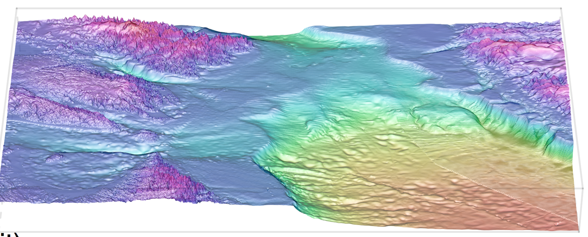
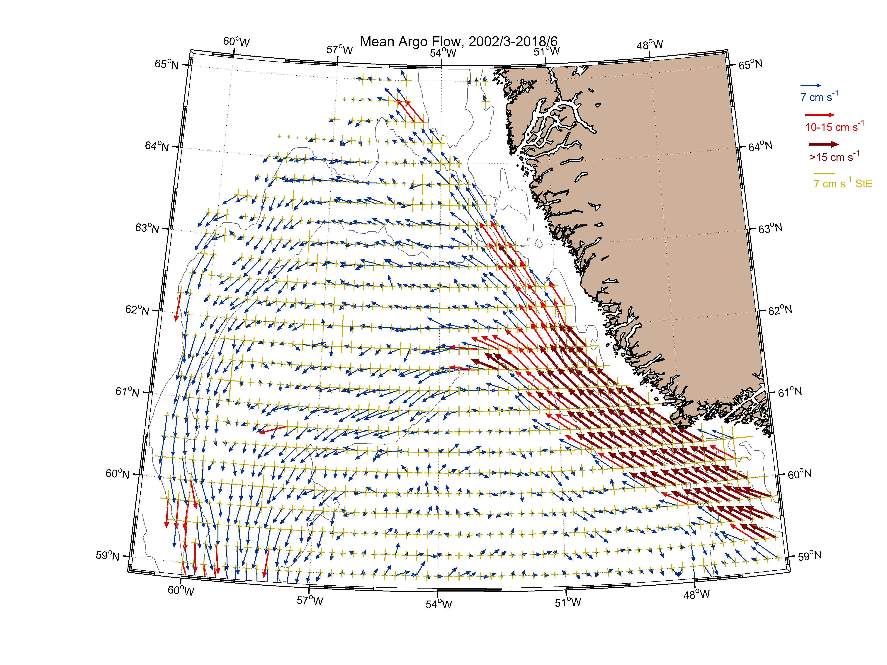
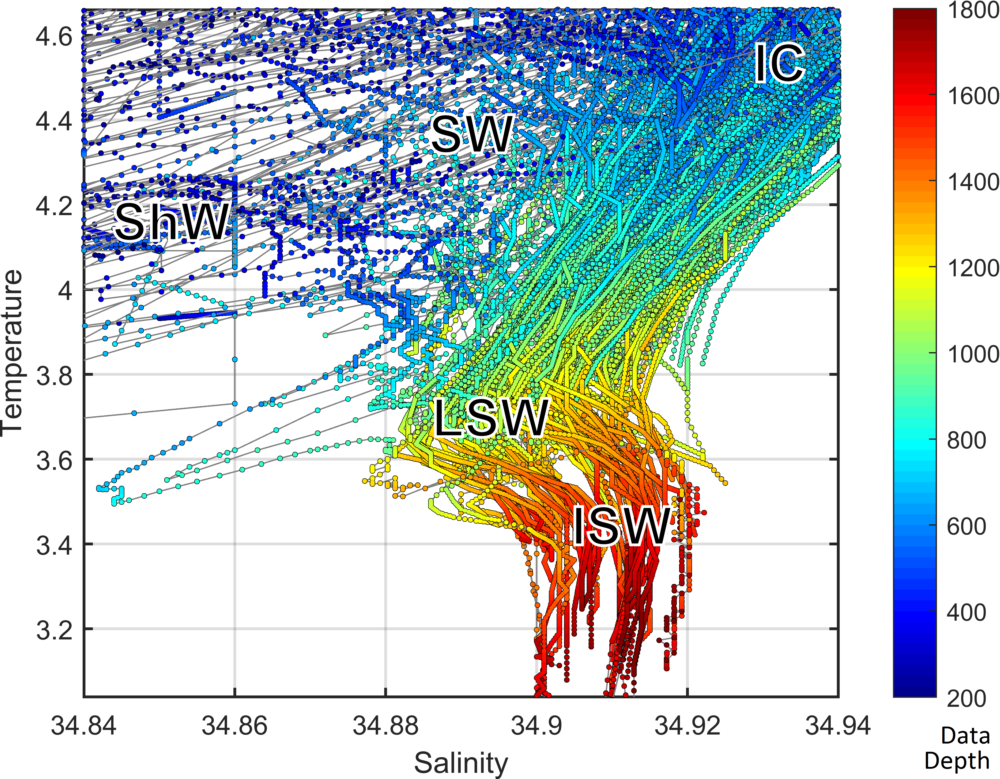
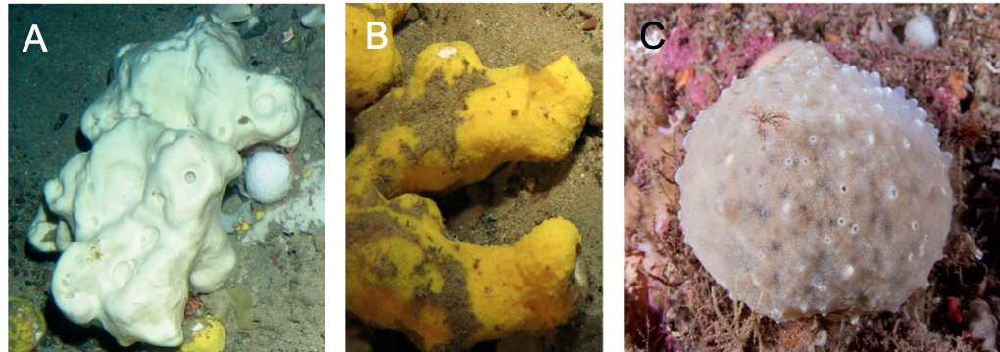

--- 
title: "Oceanographic setting influences the prokaryote community and metabolome in deep-sea sponges"
author: ["Karin Steffen"]
date: '`r format(Sys.Date(), "%B %d, %Y")`'
site: bookdown::bookdown_site
output:
  bookdown::html_document2:
    includes:
      in_header: header.html
  bookdown::gitbook:
    includes:
      in_header: header.html
documentclass: book
bibliography: ["book.bib", "packages.bib"]
biblio-style: "apalike"
link-citations: true
---
```{r setup, include=FALSE}
knitr::opts_chunk$set(echo = TRUE, tidy=TRUE, message = FALSE, warning = FALSE)
library(knitr)
```

```{r htmlTemp3, echo=FALSE, eval=F}
codejs <- readr::read_lines("js/codefolding.js")
collapsejs <- readr::read_lines("js/collapse.js")
transitionjs <- readr::read_lines("js/transition.js")
dropdownjs <- readr::read_lines("js/dropdown.js")

htmlhead <- c(
  paste('
<script>',
paste(transitionjs, collapse = "\n"),
'</script>
<script>',
paste(collapsejs, collapse = "\n"),
'</script>
<script>',
paste(codejs, collapse = "\n"),
'</script>
<script>',
paste(dropdownjs, collapse = "\n"),
'</script>
<style type="text/css">
.code-folding-btn { margin-bottom: 4px; }
.row { display: flex; }
.collapse { display: none; }
.in { display:block }
.pull-right > .dropdown-menu {
    right: 0;
    left: auto;
}
.open > .dropdown-menu {
    display: block;
}
.dropdown-menu {
    position: absolute;
    top: 100%;
    left: 0;
    z-index: 1000;
    display: none;
    float: left;
    min-width: 160px;
    padding: 5px 0;
    margin: 2px 0 0;
    font-size: 14px;
    text-align: left;
    list-style: none;
    background-color: #fff;
    -webkit-background-clip: padding-box;
    background-clip: padding-box;
    border: 1px solid #ccc;
    border: 1px solid rgba(0,0,0,.15);
    border-radius: 4px;
    -webkit-box-shadow: 0 6px 12px rgba(0,0,0,.175);
    box-shadow: 0 6px 12px rgba(0,0,0,.175);
}
</style>
<script>
$(document).ready(function () {
  window.initializeCodeFolding("show" === "show");
});
</script>
', sep = "\n"),
  paste0('
<script>
document.write(\'<div class="btn-group pull-right" style="position: absolute; top: 20%; right: 2%; z-index: 200"><button type="button" class="btn btn-default btn-xs dropdown-toggle" data-toggle="dropdown" aria-haspopup="true" aria-expanded="true" data-_extension-text-contrast=""><span>Code</span> <span class="caret"></span></button><ul class="dropdown-menu" style="min-width: 50px;"><li><a id="rmd-show-all-code" href="#">Show All Code</a></li><li><a id="rmd-hide-all-code" href="#">Hide All Code</a></li></ul></div>\')
</script>
')
)

readr::write_lines(htmlhead, path = "header.html")
```
# Content

This is a set of code and data sets to document and reproduce the computational analyses in Steffen _et al._, 2020.
In brief, it contains three parts: the metabolome, microbiota and inter-omics analyses. For the metabolome, we include detailed descriptions of the metabolomics data acquisition, data processing with xcms, and multivariate analyses with ropls. In addition, signals of known and novel compounds of interest were manually extracted and analysed. For the microbiota, we include community visualisation and ecological analyses in vegan. The inter-omics section contains mantel test and procrustes rotations, as well as the microbial interaction network annotated with the OTU's correlation with barettin, and their response to depth.

We hope to contribute to good science by providing reproducible documentation of the computational workflow. If you have questions, comments or suggestions please feel free to get in touch.

## Experimental setup 

Three demosponge species _Geodia barretti_ (n=20), _Stryphnus fortis_ (n=15), and _Weberella bursa_ (n=17) (Fig \@ref(fig:sponges)) were sampled in the Davis Strait between Canada and Greenland (61.147942-66.38245 Lat,-68.78077- -57.96573 Lon) from 244 m to 1467 m depth (Fig \@ref(fig:sample-map1), \@ref(fig:sample-map2)). Temperature and salinity _in situ_ were recorded. Sample metadata is deposited at [PANGAEA](https://doi.pangaea.de/10.1594/PANGAEA.909246). 


### Map

```{r sample-map1, fig.cap="Geographic placement of the sample site on the Northern hemisphere, between Canada and Greenland. Dots indicate individual samples."}
library(ggplot2)
library(ggmap)
library(maps)
library(mapdata)
library(marmap)
library(ggrepel)
library(sf)
library(rnaturalearth)
library(rnaturalearthdata)

sample_coords <- read.csv("data/Steffen_et_al_metadata_PANGAEA.csv", header=T, sep=";")
sample_coords <- sample_coords[,c("Species",  "unified_ID", "Latitude", "Longitude")]
sample_coords <- na.omit(sample_coords)

world <- ne_countries(scale = "medium", returnclass = "sf")
sample_map2 <- ggplot(data = world) +geom_sf() +
  coord_sf(xlim = c(-95, 0), ylim = c(45, 75), expand =T)+
  annotate("rect", xmin=-68.78077, xmax=-57.96573, ymin=61.147942 , ymax=66.38245, alpha = .2)+
  geom_point(data=sample_coords, aes(x=sample_coords$Longitude, y=sample_coords$Latitude, col=Species))+
  ggtitle("Sample map")+xlab("Longitude")+ylab("Latitude")+theme_bw()+theme(legend.position = "none")
sample_map2
#Green Sf, Blue=Wb, Red=Gb
```

```{r sample-map2, fig.cap="Detailed map of the sampling site, samples represented by dots are coloured according to sponge species."}
map_data<-getNOAA.bathy(-70,-50,58,68, resolution = 4, keep=T, antimeridian=FALSE)
sample_map_1 <- autoplot(map_data, geom=c("r", "c"))+
  scale_fill_gradient2(low="dodgerblue4", mid="gainsboro", high="darkgreen")+ 
  geom_point(aes(x=sample_coords$Longitude, y=sample_coords$Latitude, colour = factor(sample_coords$Species)), data=sample_coords)+
  ggtitle("Sample map")+xlab("Longitude")+ylab("Latitude")+labs(fill="Depth", col="Species")
sample_map_1
# with labels:
#sample_map_1+geom_label_repel(aes(x=sample_coords$Longitude, y=sample_coords$Latitude, label = sample_coords$unified_ID), box.padding = 0.35, point.padding = 0.5, data=sample_coords)
```

```{r sample-map3a, eval=F}
# 3D map
library(marmap)
library(lattice) #for wireframe

map_data_hires<-getNOAA.bathy(-70,-50,58,68, resolution = 1, keep=T, antimeridian=FALSE)
wireframe(unclass(map_data_hires), shade=T, aspect=c(1/2, 0.1),
          screen = list(z = 0, x = -50),
          par.settings = list(axis.line = list(col = "transparent")),
          par.box = c(col = rgb(0,0,0,0.1)))
```

```{r sample-map3b, fig.cap="3D representation of the threshold and slope in the Davis strait."}

```

### Water masses
```{r igor1, fig.cap="Currents in the North Atlantic between Greenland and Canada. Analysis and figure contributed by Igor Yashayaev."}

```

```{r igor2, fig.cap="Temperature and salinity (T-S) plot showing the different water masses in the Davis strait by depth: Shelf Water (ShW), Slope Water (SW), Irminger Current (IC), Labrador Sea Water (LSW), and Icelandic slope water (ISW). Analysis and figure contributed by Igor Yashayaev."}

```

### Sponges
```{r sponges, fig.cap="__A__ _G. barretti_ and __B__ _S. fortis_ from West Shetland Channel. Image Crown Copyright ©2006, all rights reserved. Image provided by K. Howell, Plymouth University, UK. __C__ _W. bursa_, picture taken by scuba diving at 40 m in Svalbard by Peter Leopold."}

```

_G. barretti_ and _S. fortis_ are high microbial abundance (HMA) sponges often found living in proximity. _W. bursa_ is likely a low microbial abundance sponges (see diversity metrics, Nicole Boury-Esnault _per.comm._). While all sponges originate from the same geographic region, _W. bursa_ typically does not occur in the same habitats as _G. barretti_ and _S. fortis_ [@murillo_sponge_2018].
It is important to note that _S. fortis_ is whiteish in colour, and the yellow shown in the picture stems from _Hexadella dedritifera_ frequently found overgrowing it.

## Sample metadata analysis

To investigate underlying data patterns, we assessed correlation of our predictor variables, i.e. the meta data of our samples (depth, latitude, longitude, sampling year, salinity and temperature).

### Correlations, visual inspection and variance inflation factors (VIF) across all samples {#index_cor_vif}
```{r mda-1}
md <- read.csv("data/Steffen_et_al_metadata_PANGAEA.csv", header=T, sep=";")
md <- md[,c("Species", "Depth", "Latitude", "Longitude", "YEAR", "MeanBotSalinity_PSU", "MeanBottomTemp_Cdeg", "unified_ID")]

a <- cor.test(md$Depth, md$Latitude, method = "spearman")
a <- paste("Rho =", round(a$estimate, digits=3)," p-value=", round(a$p.value, digits=3))
b <- cor.test(md$Depth, md$Longitude, method = "spearman")
b <- paste("Rho =", round(b$estimate, digits=3)," p-value=", round(b$p.value, digits=3))
c <- cor.test(md$Depth, md$YEAR, method = "spearman")
c <- paste("Rho =", round(c$estimate, digits=3)," p-value=", round(c$p.value, digits=3))
d <- cor.test(md$Depth, md$MeanBotSalinity_PSU, method = "spearman")
d <- paste("Rho =", round(d$estimate, digits=3)," p-value=", round(d$p.value, digits=3))
e <- cor.test(md$Depth, md$MeanBottomTemp_Cdeg, method = "spearman")
e <- paste("Rho =", round(e$estimate, digits=3)," p-value=", round(e$p.value, digits=3))
f <- cor.test(md$MeanBotSalinity_PSU, md$MeanBottomTemp_Cdeg, method = "spearman")
f <- paste("T-S plot: Rho =", round(f$estimate, digits=3)," p-value=", round(f$p.value, digits=3))

k <- ggplot(md, aes(x=Latitude, y=Depth))+geom_point()+scale_y_continuous(trans = "reverse")+
  xlab("Latitude")+ylab("Depth")+ggtitle(a)+theme(plot.title = element_text(size=10))
l <- ggplot(md, aes(x=Longitude, y=Depth))+geom_point()+scale_y_continuous(trans = "reverse")+
  xlab("Longitude")+ylab("Depth")+ggtitle(b)+theme(plot.title = element_text(size=10))
m <- ggplot(md, aes(x=YEAR, y=Depth))+geom_point()+scale_y_continuous(trans = "reverse")+
  xlab("Year")+ylab("Depth")+ggtitle(c)+theme(plot.title = element_text(size=10))
n <- ggplot(md, aes(x=MeanBotSalinity_PSU, y=Depth))+geom_point()+scale_y_continuous(trans = "reverse")+  xlab("Salinity")+ylab("Depth")+ggtitle(d)+theme(plot.title = element_text(size=10))
o <- ggplot(md, aes(x=MeanBottomTemp_Cdeg, y=Depth))+geom_point()+scale_y_continuous(trans = "reverse")+xlab("Temperature")+ylab("Depth")+ggtitle(e)+theme(plot.title = element_text(size=10))
p <- ggplot(md, aes(x=MeanBotSalinity_PSU, y=MeanBottomTemp_Cdeg, colour=md$Depth))+geom_point(size=2)+scale_colour_gradient(guide=guide_colourbar(),high="#f4c430", low= "#3b3bc4", trans = 'reverse')+xlab("Salinity in psu")+ylab("Temperature in °C")+labs(colour="Depth")+ggtitle(f)+theme(plot.title = element_text(size=10), legend.key.size=unit(0.3, "cm"))+scale_x_continuous(limits = c(34.4,35.0))
#The limits of the x-axis exclude two samples from water with comparably low salinity
```

```{r mda-2, fig.cap="Correlation of depth with other environmental parameters/predictor variables across all samples."}
library(gridExtra)
grid.arrange(k, l, m, n, o, p, nrow=3,  top = "Spearman correlation of sample associated meta data")
rm(a, b, c, d, e, f, k, l, m, n, o, p, df)
```
In the bottom right plot showing temperature versus salinity, two samples from lower salinity were excluded for visual clarity. From the plots above and their correlation tests, we find that longitude, salinity and temperature are significantly correlated with depth, and that salinity and temperature also correlate with each other. 

This is further corroborated in the variance inflation factors. A VIF > 10 indicates redundancy/collinearity.
This means that we have to be cautious and avoid including redundant constraints in ecological models.

```{r vif-1}
library(usdm)
md$Species <- NULL
md$unified_ID <- NULL
vif_all <- vif(md)

library(kableExtra)
options(kableExtra.html.bsTable = T)
kable(vif_all, 
      longtable = T, booktabs = T, 
      caption = "VIF for meta data from all samples",
      row.names = F) %>%
  kable_styling(bootstrap_options = c("striped","hover", "bordered", "condensed", "responsive"), full_width = F, latex_options = c("striped", "scale_down"))

rm(md)
```

As we will be focussing on _Geodia barretti_, we repeat the same inspection procedure for the sample subset.

### Correlations, visual inspection and variance inflation factors (VIF) across _G. barretti_ samples

```{r mda-3}
md <- read.csv("data/Steffen_et_al_metadata_PANGAEA.csv", header=T, sep=";")
md <- md[,c("Species", "Depth", "Latitude", "Longitude", "YEAR", "MeanBotSalinity_PSU", "MeanBottomTemp_Cdeg", "unified_ID")]
md <- md[md$Species=="Geodia barretti",]

a <- cor.test(md$Depth, md$Latitude, method = "spearman")
a <- paste("Rho =", round(a$estimate, digits=3)," p-value=", round(a$p.value, digits=3))
b <- cor.test(md$Depth, md$Longitude, method = "spearman")
b <- paste("Rho =", round(b$estimate, digits=3)," p-value=", round(b$p.value, digits=3))
c <- cor.test(md$Depth, md$YEAR, method = "spearman")
c <- paste("Rho =", round(c$estimate, digits=3)," p-value=", round(c$p.value, digits=3))
d <- cor.test(md$Depth, md$MeanBotSalinity_PSU, method = "spearman")
d <- paste("Rho =", round(d$estimate, digits=3)," p-value=", round(d$p.value, digits=3))
e <- cor.test(md$Depth, md$MeanBottomTemp_Cdeg, method = "spearman")
e <- paste("Rho =", round(e$estimate, digits=3)," p-value=", round(e$p.value, digits=3))
f <- cor.test(md$MeanBotSalinity_PSU, md$MeanBottomTemp_Cdeg, method = "spearman")
f <- paste("Rho =", round(f$estimate, digits=3)," p-value=", round(f$p.value, digits=3))

k <- ggplot(md, aes(x=Latitude, y=Depth))+geom_point()+scale_y_continuous(trans = "reverse")+
  xlab("Latitude")+ylab("Depth")+ggtitle(a)+theme(plot.title = element_text(size=10))
l <- ggplot(md, aes(x=Longitude, y=Depth))+geom_point()+scale_y_continuous(trans = "reverse")+
  xlab("Longitude")+ylab("Depth")+ggtitle(b)+theme(plot.title = element_text(size=10))
m <- ggplot(md, aes(x=YEAR, y=Depth))+geom_point()+scale_y_continuous(trans = "reverse")+
  xlab("Year")+ylab("Depth")+ggtitle(c)+theme(plot.title = element_text(size=10))
n <- ggplot(md, aes(x=MeanBotSalinity_PSU, y=Depth))+geom_point()+scale_y_continuous(trans = "reverse")+  xlab("Salinity")+ylab("Depth")+ggtitle(d)+theme(plot.title = element_text(size=10))
o <- ggplot(md, aes(x=MeanBottomTemp_Cdeg, y=Depth))+geom_point()+scale_y_continuous(trans = "reverse")+xlab("Temperature")+ylab("Depth")+ggtitle(e)+theme(plot.title = element_text(size=10))
p <- ggplot(md, aes(x=MeanBotSalinity_PSU, y=MeanBottomTemp_Cdeg, colour=md$Depth))+geom_point(size=2)+scale_colour_gradient(guide=guide_colourbar(),high="#f4c430", low= "#3b3bc4", trans = 'reverse')+xlab("Salinity in psu")+ylab("Temperature in °C")+labs(colour="Depth")+ggtitle(f)+theme(plot.title = element_text(size=10), legend.key.size=unit(0.3, "cm"))
```

```{r mda-4, fig.cap="Correlation of depth with other environmental parameters/predictor variables across samples of _G. barretti_."}
library(gridExtra)
grid.arrange(k, l, m, n, o, p, nrow=3,  top = "Spearman correlation of Geodia barretti associated meta data")
rm(a, b, c, d, e, f, k, l, m, n, o, p, df)
```

```{r vif-2}
library(usdm)
md$Species <- NULL
md$unified_ID <- NULL
vif1 <- vif(md)
vif1$VIF <- round(vif1$VIF, digits=2)

md$MeanBotSalinity_PSU <- NULL
md$MeanBottomTemp_Cdeg <- NULL
vif2 <- vif(md)
vif2$VIF <- round(vif2$VIF, digits=2)

library(dplyr)
vifs <- full_join(vif1, vif2, by=c("Variables"="Variables"))
colnames(vifs) <- c("Variables", "All predictors", "Subset")
vifs[c(5,6),3] <- ""

library(kableExtra)
options(kableExtra.html.bsTable = T)

cap <- paste("VIF for extensive and simplified models for", text_spec("G. barretti", italic = T))

kable(vifs, 
      longtable = T, booktabs = T, 
      caption = cap, row.names = F) %>%
  kable_styling(bootstrap_options = c("striped","hover", "bordered", "condensed", "responsive"), full_width = F, latex_options = c("striped", "scale_down"))

rm(md)

```

With this subset, the collinearity becomes even more pronounced. Salinity, temperature and depth are strongly correlated and the VIFs indicated that they should not be included in a model together. This correlation is partly due to physical properties of water. Density of water increases with increasing salinity and decreasing temperature. To a lesser extent, longitude and lattitude are collinear in our sampling. However, removing the predictor variables salinity and temperature mititgated/lowered the effect of collinearity.

